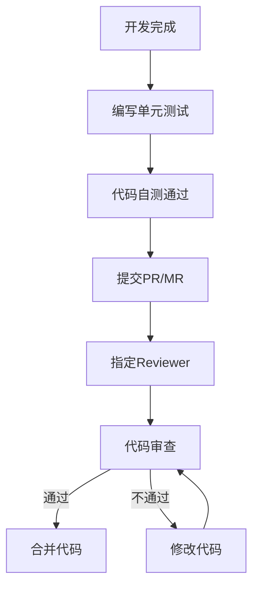

# 代码审查规范

## 一、审查流程

### 1.1 代码提交流程



### 1.2 审查角色

| 角色 | 职责 |
|------|------|
| **Author** | 提交PR，响应审查意见 |
| **Reviewer** | 审查代码，提出改进建议 |
| **Maintainer** | 最终合并代码 |

### 1.3 审查时间要求

| 场景 | 响应时间 |
|------|----------|
| 普通PR | 24小时内 |
| 紧急修复 | 4小时内 |
| 重大变更 | 48小时内 |

## 二、审查清单

### 2.1 代码质量检查

| 检查项 | 说明 | 优先级 |
|--------|------|--------|
| 代码规范 | 是否符合项目编码规范 | 高 |
| 代码复杂度 | 方法行数、圈复杂度 | 高 |
| 命名规范 | 变量、方法、类命名是否清晰 | 高 |
| 注释完整性 | 关键逻辑是否有注释 | 中 |
| 重复代码 | 是否存在可复用的重复代码 | 中 |

### 2.2 功能正确性检查

| 检查项 | 说明 | 优先级 |
|--------|------|--------|
| 需求匹配 | 是否实现了需求文档中的功能 | 高 |
| 边界处理 | 边界条件是否正确处理 | 高 |
| 错误处理 | 异常情况是否有合理处理 | 高 |
| 数据一致性 | 数据操作是否保证一致性 | 高 |

### 2.3 安全性检查

| 检查项 | 说明 | 优先级 |
|--------|------|--------|
| SQL注入 | 是否存在SQL拼接 | 高 |
| XSS攻击 | 是否有输入输出验证 | 高 |
| 敏感信息 | 是否泄露敏感数据 | 高 |
| 权限控制 | 是否有正确的权限检查 | 高 |

### 2.4 性能检查

| 检查项 | 说明 | 优先级 |
|--------|------|--------|
| 数据库查询 | 是否有不必要的查询 | 高 |
| 索引使用 | 查询是否使用了索引 | 高 |
| 缓存策略 | 是否正确使用缓存 | 中 |
| 并发处理 | 是否有并发问题 | 中 |

### 2.5 测试覆盖检查

| 检查项 | 说明 | 优先级 |
|--------|------|--------|
| 单元测试 | 是否有对应的单元测试 | 高 |
| 测试覆盖率 | 是否达到85%以上 | 高 |
| 测试质量 | 测试用例是否覆盖关键场景 | 高 |

## 三、审查标准

### 3.1 代码规范评分

| 等级 | 标准 | 处理方式 |
|------|------|----------|
| **P0** | 严重问题（安全漏洞、逻辑错误） | 必须修复 |
| **P1** | 重要问题（性能问题、可维护性） | 建议修复 |
| **P2** | 一般问题（格式、命名） | 可接受或后续改进 |
| **P3** | 优化建议（代码风格） | 可选改进 |

### 3.2 PR合并条件

- 至少1位Reviewer批准
- 所有P0问题已修复
- 测试覆盖率达标（≥85%）
- CI构建通过
- 无冲突

## 四、审查模板

### 4.1 PR描述模板

```markdown
## 功能描述
- 实现了XXX功能
- 修复了XXX问题

## 修改内容
- 修改文件1：描述修改内容
- 修改文件2：描述修改内容

## 测试情况
- 单元测试：通过 ✓
- 集成测试：通过 ✓
- 手动测试：通过 ✓

## 相关文档
- 需求文档：docs/requirements/XXX.md
- 设计文档：docs/design/XXX.md
```

### 4.2 审查意见模板

```markdown
## 审查结果

### 🔴 P0 - 必须修复
1. [问题描述] - [文件路径]
2. [问题描述] - [文件路径]

### 🟠 P1 - 建议修复
1. [问题描述] - [文件路径]
2. [问题描述] - [文件路径]

### 🟡 P2 - 一般问题
1. [问题描述] - [文件路径]

### 🟢 审查结论
- [ ] 批准合并
- [ ] 需要修改后重新审查
```

## 五、审查工具

### 5.1 自动化工具

| 工具 | 用途 | 集成方式 |
|------|------|----------|
| SonarQube | 代码质量分析 | CI集成 |
| ESLint | JavaScript代码检查 | IDE/CI |
| Checkstyle | Java代码检查 | IDE/CI |
| JaCoCo | 测试覆盖率 | CI集成 |
| Dependabot | 依赖安全检查 | CI集成 |

### 5.2 IDE插件

| 插件 | 用途 |
|------|------|
| SonarLint | 实时代码质量检查 |
| CodeStream | 代码审查协作 |
| GitLens | 代码历史追踪 |

## 六、审查实践

### 6.1 代码审查技巧

1. **先看整体架构**：了解PR的整体设计和改动范围
2. **关注核心逻辑**：重点审查业务逻辑和复杂算法
3. **检查边界条件**：考虑异常情况和边界输入
4. **验证测试覆盖**：确保关键路径有测试覆盖
5. **保持客观公正**：基于事实和规范提出意见

### 6.2 沟通规范

| 场景 | 沟通方式 |
|------|----------|
| 提出问题 | 描述问题 + 建议改进方案 |
| 讨论方案 | 使用代码片段说明观点 |
| 批准通过 | 明确说明批准理由 |
| 请求修改 | 清晰列出修改项 |

### 6.3 审查反馈示例

```markdown
### 问题
`UserService.getUserById()` 方法没有处理 `null` 参数的情况。

### 建议
在方法开头添加参数校验：
```java
public UserDTO getUserById(Long id) {
    if (id == null) {
        throw new IllegalArgumentException("用户ID不能为空");
    }
    // ...
}
```

### 原因
避免后续代码出现 NullPointerException，提高代码健壮性。
```

## 七、审查记录

### 7.1 审查记录模板

| 日期 | PR编号 | 审查人 | 状态 | 问题数 |
|------|--------|--------|------|--------|
| 2024-01-01 | #123 | 张三 | 通过 | 0 |
| 2024-01-02 | #124 | 李四 | 修改中 | 2 |

### 7.2 审查统计

| 指标 | 说明 | 目标值 |
|------|------|--------|
| 审查通过率 | 通过审查的PR比例 | ≥95% |
| 平均审查时间 | PR提交到合并的平均时间 | ≤24小时 |
| 平均问题数 | 每个PR发现的问题数 | ≤3 |
| 测试覆盖率 | 代码测试覆盖率 | ≥85% |

## 八、反模式

### 8.1 避免的审查行为

| 行为 | 说明 |
|------|------|
| **过度挑剔** | 关注代码风格超过功能正确性 |
| **沉默批准** | 不认真审查就批准 |
| **拖延审查** | 长时间不响应PR |
| **个人偏好** | 将个人编码风格强加于人 |
| **不解释理由** | 只说"有问题"不说明原因 |

### 8.2 优秀审查的特点

| 特点 | 说明 |
|------|------|
| **有建设性** | 提出问题的同时提供解决方案 |
| **有针对性** | 聚焦于关键问题而非细枝末节 |
| **有耐心** | 愿意解释和讨论技术问题 |
| **有原则** | 坚持质量标准但不失灵活 |