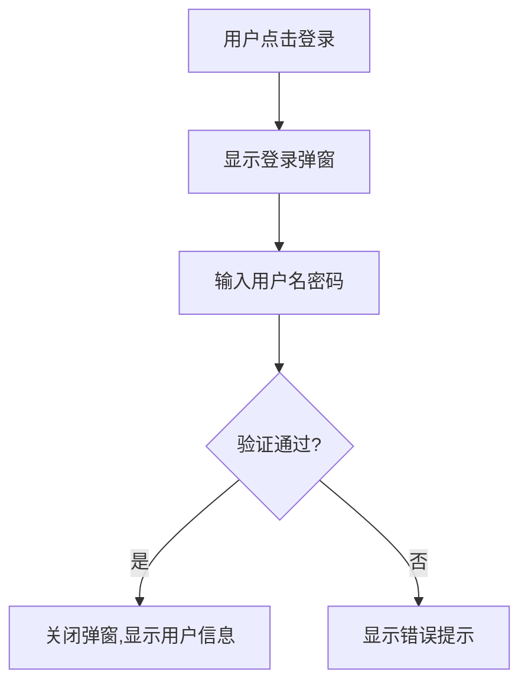

# 交互规范文档

## 一、文档结构

```
docs/features/{功能}/
└── {功能}-交互文档-{日期}.md
```

## 二、内容模板

### 1. 页面结构
- **页面位置**：导航菜单、页面层级
- **布局方式**：卡片式、列表式、表单式

### 2. 交互流程



### 3. 组件交互

| 组件 | 交互行为 | 反馈方式 |
|------|----------|----------|
| 登录按钮 | 点击提交 | 加载状态、成功/失败提示 |
| 输入框 | 失焦验证 | 实时错误提示 |
| 模态框 | 点击遮罩关闭 | 平滑关闭动画 |

### 4. 视觉规范
- **颜色**：主色 #667eea、成功 #52c41a、错误 #ff4d4f
- **间距**：标准间距 16px、卡片间距 24px
- **字体**：标题 18px、正文 14px、提示 12px

### 5. 异常处理
- 网络超时：显示重试按钮
- 权限不足：提示登录或跳转登录页

## 三、命名规范

| 类型 | 格式 | 示例 |
|------|------|------|
| 文件 | `docs/features/{功能}/{功能}-交互文档-{日期}.md` | `docs/features/login/登录-交互文档-2026-05-12.md` |