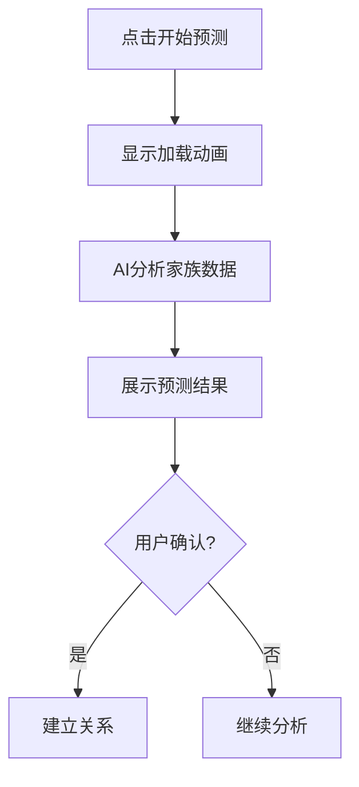
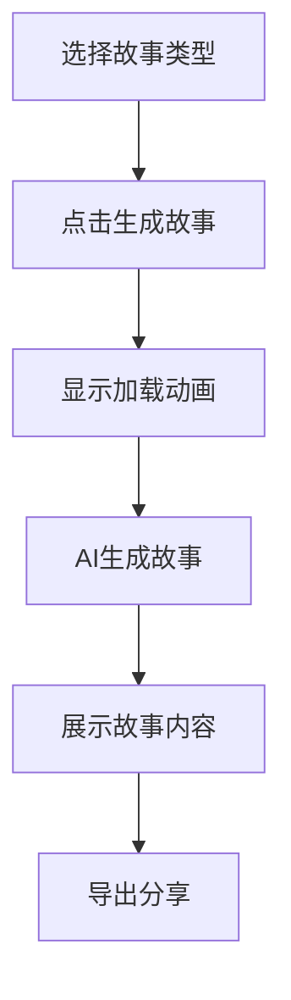

# AI功能交互设计文档

## 更新记录

| 版本 | 日期 | 修改人 | 修改内容 |
|------|------|--------|----------|
| V1.0.0 | 2026-05-13 | 系统 | 初始版本 |

## 一、页面结构

### 1.1 AI功能页面布局

```
┌─────────────────────────────────────────────────────────────┐
│                    页面标题区域                              │
│                        AI功能                               │
├─────────────────────────────────────────────────────────────┤
│                    关系预测模块                              │
│  ┌─────────────────────────────────────────────────────┐   │
│  │ [开始预测]                                        │   │
│  └─────────────────────────────────────────────────────┘   │
│  ┌─────────────────────────────────────────────────────┐   │
│  │           预测结果展示区域                         │   │
│  │ 成员1 ◀─── 关系类型 ───▶ 成员2                    │   │
│  │ 置信度：92%                                       │   │
│  │ 推理依据：xxx                                     │   │
│  └─────────────────────────────────────────────────────┘   │
├─────────────────────────────────────────────────────────────┤
│                    故事生成模块                              │
│  ┌─────────────────────────────────────────────────────┐   │
│  │ [故事类型选择]     [生成故事]                     │   │
│  └─────────────────────────────────────────────────────┘   │
│  ┌─────────────────────────────────────────────────────┐   │
│  │              故事内容展示区域                      │   │
│  │ 标题：xxx                                         │   │
│  │ 内容：xxx                                         │   │
│  └─────────────────────────────────────────────────────┘   │
└─────────────────────────────────────────────────────────────┘
```

### 1.2 组件划分

| 组件 | 说明 | 状态 |
|------|------|------|
| PredictionButton | 关系预测触发按钮 | 可点击 |
| PredictionResult | 预测结果卡片 | 展示 |
| StorySelector | 故事类型选择器 | 可选择 |
| StoryResult | 故事内容展示 | 展示 |

## 二、交互流程

### 2.1 关系预测流程



### 2.2 故事生成流程



## 三、界面原型

### 3.1 关系预测结果

**布局：**
- 卡片式展示
- 圆角8px
- 渐变背景

**元素样式：**
| 元素 | 样式 |
|------|------|
| 成员名称 | 16px，粗体 |
| 关系类型 | 背景色标签 |
| 置信度 | 绿色高亮 |
| 推理依据 | 灰色小字 |

### 3.2 故事生成结果

**布局：**
- 卡片式展示
- 白色背景
- 文字居中

**元素样式：**
| 元素 | 样式 |
|------|------|
| 标题 | 20px，粗体 |
| 内容 | 16px，行高1.8 |
| AI点评 | 背景色块 |

## 四、状态说明

| 状态 | 描述 | 界面表现 |
|------|------|----------|
| 初始状态 | 页面加载完成 | 显示触发按钮 |
| 加载中 | AI分析中 | 显示加载动画 |
| 完成状态 | 分析完成 | 显示结果 |
| 空状态 | 无数据 | 提示添加数据 |

## 五、交互细节

### 5.1 加载动画
- 旋转动画
- 进度提示

### 5.2 结果展示
- 渐入动画
- 悬停效果

### 5.3 导出功能
- 支持复制到剪贴板
- 支持导出为文本