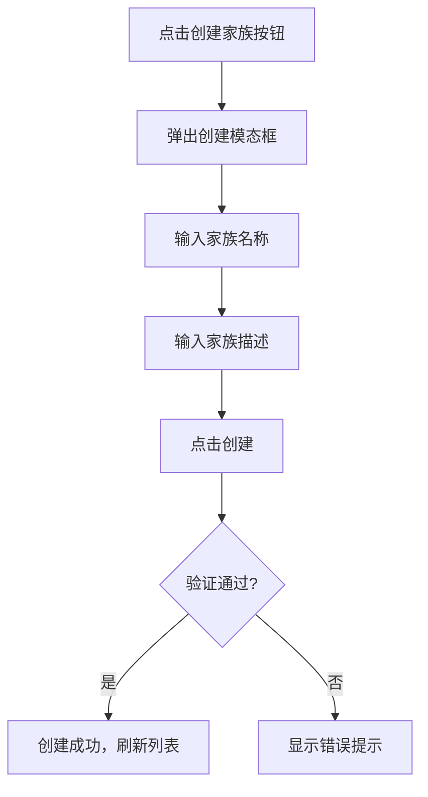
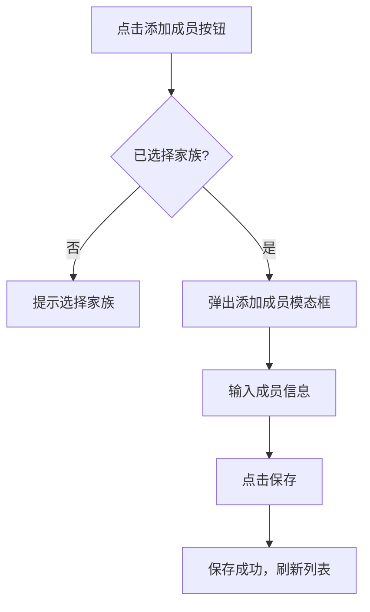
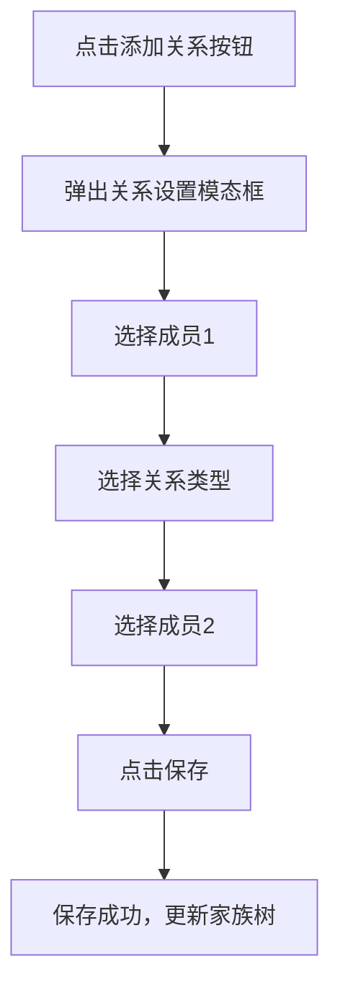

# 家族管理功能交互设计文档

## 更新记录

| 版本 | 日期 | 修改人 | 修改内容 |
|------|------|--------|----------|
| V1.0.0 | 2026-05-13 | 系统 | 初始版本 |

## 一、页面结构

### 1.1 家族管理页面布局

```
┌─────────────────────────────────────────────────────────────┐
│                    页面标题区域                              │
│           [家族管理]              [创建家族]                  │
├─────────────────────────────────────────────────────────────┤
│                    家族选择器                                │
│           ┌─────────────────────────────┐                  │
│           │    选择家族 ▼                │                  │
│           └─────────────────────────────┘                  │
├─────────────────────────────────────────────────────────────┤
│                    家族信息卡片                              │
│  ┌─────────────────────────────────────────────────────┐   │
│  │ 家族名称            [编辑] [删除]                  │   │
│  │ 描述：xxx                                          │   │
│  │ 创建时间：xxx        成员数量：xxx                   │   │
│  └─────────────────────────────────────────────────────┘   │
├─────────────────────────────────────────────────────────────┤
│                    成员管理区域                              │
│  ┌─────────────────────────────────────────────────────┐   │
│  │ [添加成员]  [搜索框]                              │   │
│  ├─────────────────────────────────────────────────────┤   │
│  │              成员列表表格                           │   │
│  │ 姓名 | 性别 | 出生日期 | 操作                      │   │
│  └─────────────────────────────────────────────────────┘   │
├─────────────────────────────────────────────────────────────┤
│                    关系管理区域                              │
│  ┌─────────────────────────────────────────────────────┐   │
│  │ [添加关系]                                        │   │
│  ├─────────────────────────────────────────────────────┤   │
│  │              关系列表表格                           │   │
│  │ 成员1 | 关系类型 | 成员2 | 操作                    │   │
│  └─────────────────────────────────────────────────────┘   │
└─────────────────────────────────────────────────────────────┘
```

### 1.2 组件划分

| 组件 | 说明 | 状态 |
|------|------|------|
| FamilySelector | 家族选择下拉框 | 可选择 |
| FamilyCard | 家族信息卡片 | 可编辑/删除 |
| MemberTable | 成员列表表格 | 可操作 |
| RelationshipTable | 关系列表表格 | 可操作 |

## 二、交互流程

### 2.1 创建家族流程



### 2.2 添加成员流程



### 2.3 添加关系流程



## 三、界面原型

### 3.1 家族信息卡片

**布局：**
- 白色背景卡片
- 圆角8px
- 阴影效果

**元素样式：**
| 元素 | 样式 |
|------|------|
| 标题 | 18px，粗体 |
| 描述 | 14px，灰色 |
| 操作按钮 | 右侧对齐 |

### 3.2 成员列表

**表格结构：**
| 列 | 内容 |
|----|------|
| 姓名 | 成员姓名 |
| 性别 | 男/女 |
| 出生日期 | 日期格式 |
| 操作 | 编辑、删除按钮 |

### 3.3 关系列表

**表格结构：**
| 列 | 内容 |
|----|------|
| 成员1 | 成员姓名 |
| 关系类型 | 父母-子女/夫妻/兄弟姐妹等 |
| 成员2 | 成员姓名 |
| 操作 | 删除按钮 |

## 四、状态说明

### 4.1 家族管理状态

| 状态 | 描述 | 界面表现 |
|------|------|----------|
| 初始状态 | 页面加载完成 | 显示默认选中的家族 |
| 选择家族 | 用户切换家族 | 更新成员和关系列表 |
| 创建中 | 正在创建家族 | 按钮显示加载动画 |
| 删除确认 | 用户点击删除 | 弹出确认对话框 |

### 4.2 成员管理状态

| 状态 | 描述 | 界面表现 |
|------|------|----------|
| 列表状态 | 显示成员列表 | 表格展示 |
| 添加状态 | 弹出添加表单 | 模态框 |
| 编辑状态 | 弹出编辑表单 | 模态框 |
| 删除确认 | 用户点击删除 | 确认对话框 |

### 4.3 关系类型选项

| 关系类型 | 说明 |
|----------|------|
| PARENT_CHILD | 父母-子女 |
| SPOUSE | 夫妻 |
| SIBLING | 兄弟姐妹 |
| GRANDPARENT_GRANDCHILD | 祖孙 |
| UNCLE_NEPHEW | 叔侄 |
| AUNT_NIECE | 姑侄 |

## 五、响应式设计

### 5.1 移动端适配

- 表格变为卡片列表
- 操作按钮改为底部浮动按钮
- 模态框全屏显示

### 5.2 桌面端适配

- 保持表格布局
- 操作按钮行内显示

## 六、交互细节

### 6.1 键盘操作

- Enter键提交表单
- Esc键关闭模态框

### 6.2 加载状态

- 所有操作按钮在请求期间显示加载动画
- 表格在加载时显示骨架屏

### 6.3 错误提示

- 表单验证失败时显示红色边框和错误文字
- 操作失败时显示Toast提示