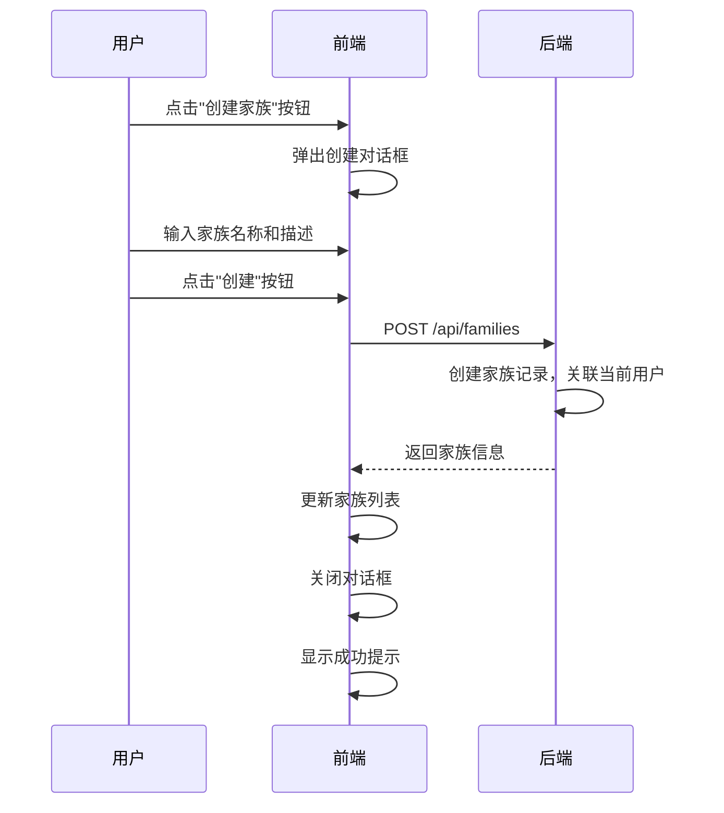
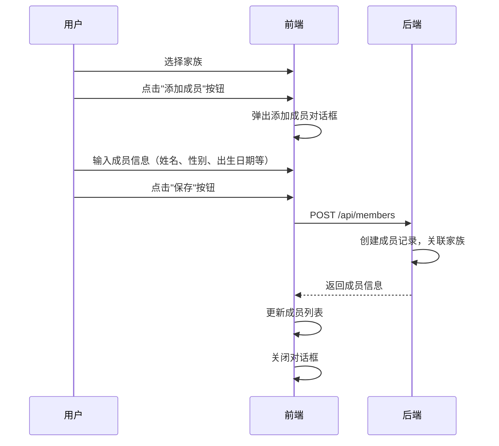
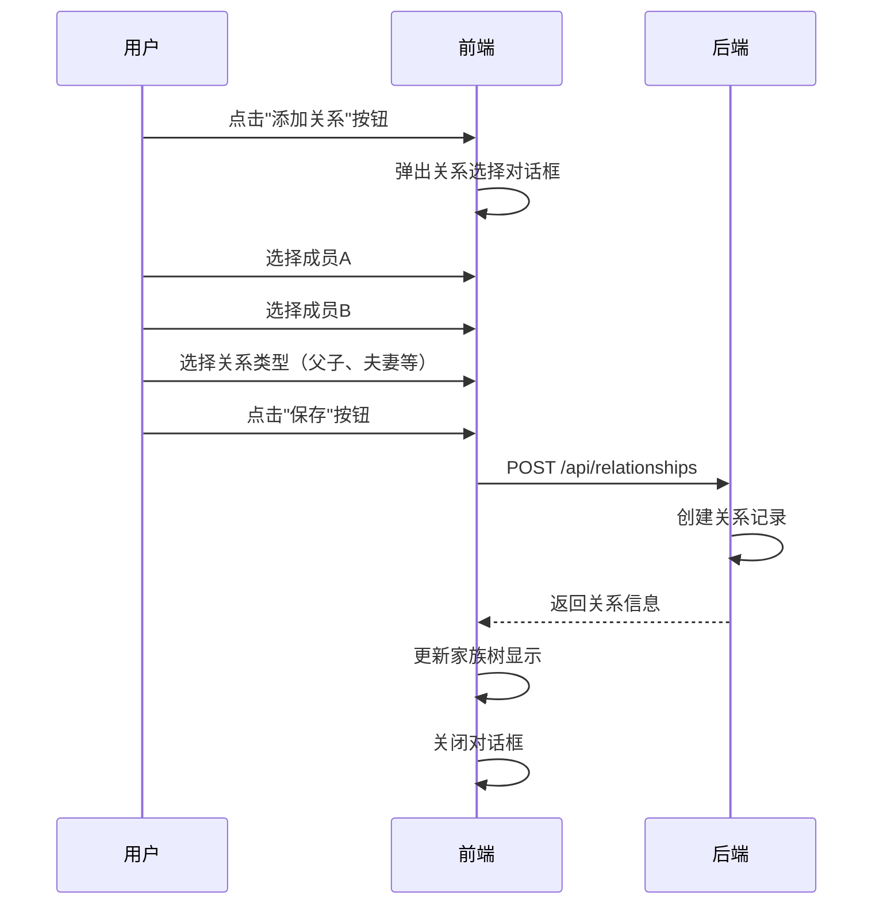
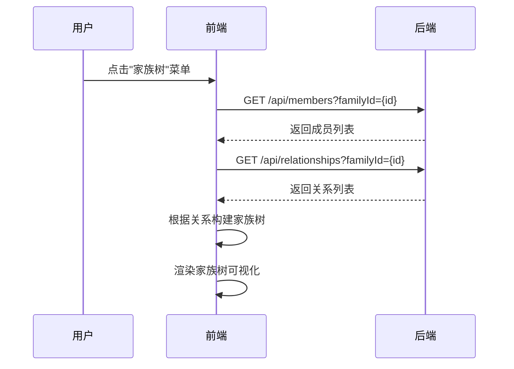
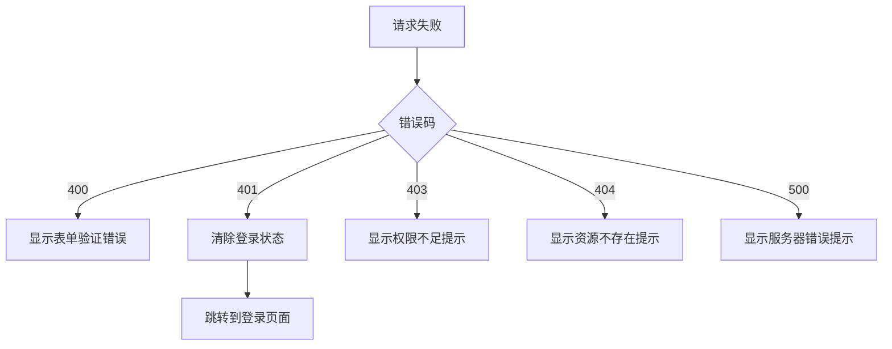

# 家族管理功能需求文档

## 更新记录

| 版本 | 日期 | 修改人 | 修改内容 |
|------|------|--------|----------|
| V1.0.0 | 2026-05-12 | 系统 | 初始版本 |
| V1.1.0 | 2026-05-13 | 系统 | 添加需求拆分、交互流程、测试用例 |

---

## 一、需求概述

### 1.1 需求来源
- 产品需求：用户需要创建和管理多个家族
- 用户反馈：需要支持家族成员管理和关系维护

### 1.2 功能描述
实现家族的创建、编辑、删除、查看功能，以及家族成员的管理和关系维护，提供完整的家族管理体验。

### 1.3 业务价值
- 支持用户管理多个家族
- 提供完整的家族成员管理功能
- 可视化展示家族关系结构
- 促进家族文化传承

### 1.4 竞对分析

| 竞品 | 优势 | 劣势 | 借鉴点 |
|------|------|------|--------|
| 传统家谱软件 | 功能完整 | 界面老旧 | 完善的成员管理 |
| 在线家谱平台 | 云端存储 | 隐私担忧 | 多人协作 |
| 社交平台家族功能 | 用户基数大 | 功能简单 | 关系图谱 |

### 1.5 竞争力分析

**核心优势：**
- 现代化的UI设计
- 支持多家族管理
- 可视化家族树展示
- 完善的成员关系管理

---

## 二、需求拆分

### 2.1 功能需求拆分

| 需求编号 | 需求点 | 描述 | 优先级 | 依赖 |
|----------|--------|------|--------|------|
| REQ_FAMILY_001 | 创建家族 | 用户创建新家族，输入名称和描述 | 高 | - |
| REQ_FAMILY_002 | 编辑家族 | 修改家族名称和描述 | 高 | REQ_FAMILY_001 |
| REQ_FAMILY_003 | 删除家族 | 删除已有家族（需确认） | 高 | REQ_FAMILY_001 |
| REQ_FAMILY_004 | 查看家族列表 | 查看用户所有家族 | 高 | - |
| REQ_FAMILY_005 | 查看家族详情 | 查看家族详细信息 | 高 | REQ_FAMILY_001 |
| REQ_FAMILY_006 | 添加成员 | 在家族中添加新成员 | 高 | REQ_FAMILY_001 |
| REQ_FAMILY_007 | 编辑成员 | 修改成员信息 | 高 | REQ_FAMILY_006 |
| REQ_FAMILY_008 | 删除成员 | 从家族中删除成员 | 高 | REQ_FAMILY_006 |
| REQ_FAMILY_009 | 查看成员列表 | 查看家族所有成员 | 高 | REQ_FAMILY_001 |
| REQ_FAMILY_010 | 添加关系 | 建立成员之间的关系 | 高 | REQ_FAMILY_006 |
| REQ_FAMILY_011 | 删除关系 | 删除成员之间的关系 | 高 | REQ_FAMILY_010 |
| REQ_FAMILY_012 | 家族树展示 | 可视化展示家族关系 | 高 | REQ_FAMILY_010 |
| REQ_FAMILY_013 | 成员搜索 | 根据姓名搜索成员 | 中 | REQ_FAMILY_006 |

### 2.2 非功能需求

#### 2.2.1 性能要求
| 需求编号 | 描述 | 目标值 |
|----------|------|--------|
| NFR_FAMILY_001 | 家族列表加载时间 | ≤ 200ms |
| NFR_FAMILY_002 | 成员列表加载时间 | ≤ 300ms |
| NFR_FAMILY_003 | 家族树渲染时间 | ≤ 500ms |

#### 2.2.2 安全要求
| 需求编号 | 描述 | 状态 |
|----------|------|------|
| NFR_FAMILY_004 | 只有家族创建者可以删除家族 | ✅ |
| NFR_FAMILY_005 | 数据加密存储 | ✅ |
| NFR_FAMILY_006 | 权限验证 | ✅ |

#### 2.2.3 兼容性要求
| 需求编号 | 描述 |
|----------|------|
| NFR_FAMILY_007 | 支持主流浏览器 |
| NFR_FAMILY_008 | 支持移动端访问 |

---

## 三、交互流程

### 3.1 创建家族流程



### 3.2 添加成员流程



### 3.3 添加关系流程



### 3.4 查看家族树流程



---

## 四、数据流向

```
用户操作 → 前端验证 → API请求 → 后端处理 → 返回响应 → 更新UI
```

### 4.1 创建家族数据流
1. 用户点击创建家族按钮
2. 弹出创建对话框
3. 输入家族名称和描述
4. 点击创建
5. 调用POST /api/families
6. 后端创建家族记录，关联当前用户
7. 返回家族信息
8. 更新家族列表

### 4.2 添加成员数据流
1. 用户选择家族
2. 点击添加成员按钮
3. 弹出添加成员对话框
4. 输入成员信息
5. 点击保存
6. 调用POST /api/members
7. 后端创建成员记录，关联家族
8. 返回成员信息
9. 更新成员列表

### 4.3 添加关系数据流
1. 用户点击添加关系按钮
2. 弹出关系选择对话框
3. 选择两个成员和关系类型
4. 点击保存
5. 调用POST /api/relationships
6. 后端创建关系记录
7. 返回关系信息
8. 更新家族树

---

## 五、验收标准

### 5.1 家族管理功能
| 验收项 | 验收条件 | 测试方法 |
|--------|----------|----------|
| 创建家族 | 输入名称后成功创建 | 点击创建按钮 |
| 编辑家族 | 修改名称和描述后保存成功 | 点击编辑按钮 |
| 删除家族 | 确认后成功删除 | 点击删除按钮 |
| 查看家族列表 | 显示用户所有家族 | 进入家族页面 |
| 家族列表排序 | 按创建时间倒序排列 | 检查列表顺序 |

### 5.2 成员管理功能
| 验收项 | 验收条件 | 测试方法 |
|--------|----------|----------|
| 添加成员 | 输入信息后成功添加 | 点击添加成员按钮 |
| 编辑成员 | 修改信息后保存成功 | 点击编辑按钮 |
| 删除成员 | 确认后成功删除 | 点击删除按钮 |
| 查看成员列表 | 显示家族所有成员 | 进入成员页面 |
| 成员搜索 | 输入关键词后显示匹配结果 | 使用搜索框 |

### 5.3 关系管理功能
| 验收项 | 验收条件 | 测试方法 |
|--------|----------|----------|
| 添加关系 | 选择成员和类型后成功添加 | 点击添加关系按钮 |
| 删除关系 | 确认后成功删除 | 点击删除按钮 |
| 家族树展示 | 正确显示成员关系 | 进入家族树页面 |
| 家族树布局 | 父子关系层级清晰 | 检查布局结构 |

---

## 六、接口定义

### 6.1 创建家族

**POST /api/families**

请求体：
```json
{
  "name": "string (必填，家族名称)",
  "description": "string (可选，家族描述)"
}
```

成功响应（200）：
```json
{
  "code": 200,
  "message": "success",
  "data": {
    "id": "number (家族ID)",
    "name": "string (家族名称)",
    "description": "string (家族描述)",
    "creatorId": "number (创建者ID)",
    "createdAt": "string (创建时间)"
  }
}
```

### 6.2 获取家族列表

**GET /api/families/user**

成功响应（200）：
```json
{
  "code": 200,
  "message": "success",
  "data": [
    {
      "id": "number",
      "name": "string",
      "description": "string",
      "memberCount": "number",
      "createdAt": "string"
    }
  ]
}
```

### 6.3 添加成员

**POST /api/members**

请求体：
```json
{
  "name": "string (必填，成员姓名)",
  "gender": "string (可选，性别 MALE/FEMALE)",
  "birthDate": "string (可选，出生日期)",
  "deathDate": "string (可选，去世日期)",
  "occupation": "string (可选，职业)",
  "education": "string (可选，学历)",
  "phone": "string (可选，电话)",
  "email": "string (可选，邮箱)",
  "familyId": "number (必填，家族ID)"
}
```

成功响应（200）：
```json
{
  "code": 200,
  "message": "success",
  "data": {
    "id": "number",
    "name": "string",
    "gender": "string",
    "birthDate": "string",
    "familyId": "number"
  }
}
```

### 6.4 添加关系

**POST /api/relationships**

请求体：
```json
{
  "member1Id": "number (必填，成员1ID)",
  "member2Id": "number (必填，成员2ID)",
  "relationshipType": "string (必填，关系类型)",
  "familyId": "number (必填，家族ID)"
}
```

成功响应（200）：
```json
{
  "code": 200,
  "message": "success",
  "data": {
    "id": "number",
    "member1Id": "number",
    "member2Id": "number",
    "relationshipType": "string"
  }
}
```

---

## 七、测试用例

### 7.1 后端单元测试用例

| 测试用例ID | 测试名称 | 测试步骤 | 预期结果 |
|------------|----------|----------|----------|
| UT-FAMILY-001 | 创建家族 | 1.调用POST /api/families<br>2.传入家族名称 | 返回200，返回家族信息 |
| UT-FAMILY-002 | 创建家族无名称 | 1.调用POST /api/families<br>2.不传名称 | 返回400错误 |
| UT-FAMILY-003 | 获取用户家族列表 | 1.调用GET /api/families/user | 返回用户所有家族 |
| UT-FAMILY-004 | 获取单个家族 | 1.调用GET /api/families/{id} | 返回家族详情 |
| UT-FAMILY-005 | 更新家族信息 | 1.调用PUT /api/families/{id}<br>2.传入新名称 | 更新成功 |
| UT-FAMILY-006 | 删除家族 | 1.调用DELETE /api/families/{id} | 删除成功 |
| UT-FAMILY-007 | 删除不存在家族 | 1.调用DELETE /api/families/999 | 返回404错误 |
| UT-FAMILY-008 | 添加成员 | 1.调用POST /api/members<br>2.传入成员信息 | 创建成功 |
| UT-FAMILY-009 | 添加成员无姓名 | 1.调用POST /api/members<br>2.不传姓名 | 返回400错误 |
| UT-FAMILY-010 | 获取家族成员列表 | 1.调用GET /api/members?familyId={id} | 返回成员列表 |
| UT-FAMILY-011 | 更新成员信息 | 1.调用PUT /api/members/{id} | 更新成功 |
| UT-FAMILY-012 | 删除成员 | 1.调用DELETE /api/members/{id} | 删除成功 |
| UT-FAMILY-013 | 添加关系 | 1.调用POST /api/relationships | 创建成功 |
| UT-FAMILY-014 | 添加关系缺少参数 | 1.调用POST /api/relationships<br>2.缺少member1Id | 返回400错误 |
| UT-FAMILY-015 | 获取家族关系 | 1.调用GET /api/relationships?familyId={id} | 返回关系列表 |
| UT-FAMILY-016 | 删除关系 | 1.调用DELETE /api/relationships/{id} | 删除成功 |

### 7.2 前端UI测试用例

| 测试用例ID | 测试名称 | 测试步骤 | 预期结果 |
|------------|----------|----------|----------|
| UI-FAMILY-001 | 家族页面显示正确 | 1.登录后进入家族页面 | 显示标题和创建按钮 |
| UI-FAMILY-002 | 创建家族 | 1.点击创建按钮<br>2.输入名称<br>3.点击创建 | 家族列表更新 |
| UI-FAMILY-003 | 编辑家族 | 1.点击Edit按钮<br>2.修改名称<br>3.点击保存 | 家族名称更新 |
| UI-FAMILY-004 | 删除家族 | 1.点击Delete按钮<br>2.点击确定 | 家族被删除 |
| UI-FAMILY-005 | 成员页面显示正确 | 1.进入成员管理页面 | 显示成员列表 |
| UI-FAMILY-006 | 添加成员 | 1.点击添加按钮<br>2.输入信息<br>3.点击保存 | 成员列表更新 |
| UI-FAMILY-007 | 编辑成员 | 1.点击Edit按钮<br>2.修改信息<br>3.点击保存 | 成员信息更新 |
| UI-FAMILY-008 | 删除成员 | 1.点击Delete按钮<br>2.点击确定 | 成员被删除 |
| UI-FAMILY-009 | 搜索成员 | 1.输入关键词<br>2.点击搜索 | 显示匹配结果 |
| UI-FAMILY-010 | 家族树页面显示 | 1.进入家族树页面 | 显示家族树 |
| UI-FAMILY-011 | 添加关系 | 1.点击添加关系<br>2.选择成员和类型<br>3.保存 | 家族树更新 |

---

## 八、错误处理

### 8.1 错误类型

| 错误码 | 错误信息 | 处理方式 |
|--------|----------|----------|
| 400 | 请求参数错误 | 显示表单验证提示 |
| 401 | 未授权 | 跳转到登录页面 |
| 403 | 无权限 | 显示权限不足提示 |
| 404 | 资源不存在 | 显示资源不存在提示 |
| 500 | 服务器错误 | 显示通用错误提示 |

### 8.2 错误处理流程


