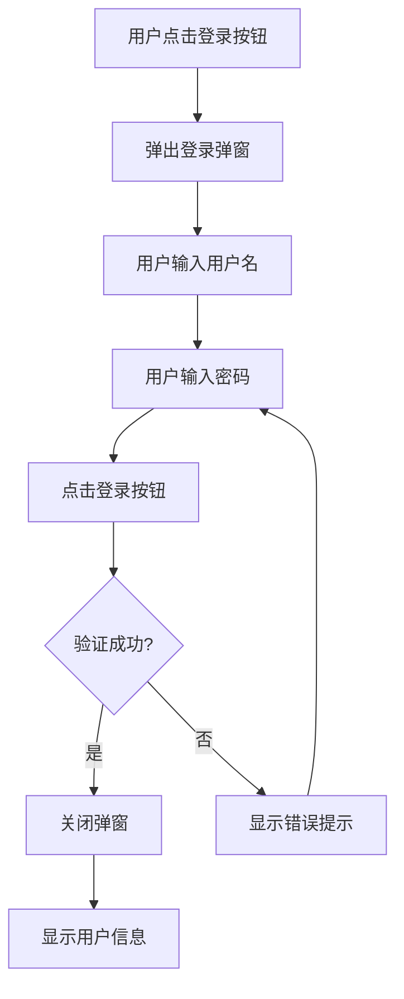

# 登录-交互文档

## 1. 交互流程

### 1.1 登录流程



### 1.2 切换注册流程

```mermaid
flowchart TD
    A[用户在登录弹窗] --> B[点击"立即注册"链接]
    B --> C[关闭登录弹窗]
    C --> D[打开注册弹窗]
```

---

## 2. 测试用例

### 2.1 功能测试用例

| 测试编号 | 测试场景 | 测试步骤 | 预期结果 | 优先级 |
|----------|----------|----------|----------|--------|
| TC-LGN-001 | 打开登录弹窗 | 点击页面"登录"按钮 | 登录弹窗显示 | 高 |
| TC-LGN-002 | 登录成功 | 输入正确用户名密码，点击登录 | 弹窗关闭，显示用户信息 | 高 |
| TC-LGN-003 | 登录失败 | 输入错误密码，点击登录 | 显示"用户名或密码错误"提示 | 高 |
| TC-LGN-004 | 切换注册 | 点击"立即注册"链接 | 登录弹窗关闭，注册弹窗打开 | 高 |
| TC-LGN-005 | 空白用户名 | 不输入用户名，点击登录 | 显示"请输入用户名"提示 | 中 |
| TC-LGN-006 | 空白密码 | 不输入密码，点击登录 | 显示"请输入密码"提示 | 中 |

### 2.2 API测试用例

| 测试编号 | 接口路径 | 方法 | 请求数据 | 预期结果 | 优先级 |
|----------|----------|------|----------|----------|--------|
| TC-API-LGN-001 | /api/users/login | POST | {"username":"admin","password":"admin123"} | 返回用户信息，状态码200 | 高 |
| TC-API-LGN-002 | /api/users/login | POST | {"username":"admin","password":"wrong"} | 返回错误信息，状态码401 | 高 |
| TC-API-LGN-003 | /api/users/login | POST | {"username":"","password":""} | 返回错误信息，状态码400 | 中 |

---

## 3. 界面设计

### 3.1 登录弹窗

| 元素 | 描述 | 位置 |
|------|------|------|
| 标题 | "用户登录" | 弹窗顶部 |
| 用户名输入框 | 文本输入，placeholder:"请输入用户名" | 标题下方 |
| 密码输入框 | 密码输入，placeholder:"请输入密码" | 用户名输入框下方 |
| 登录按钮 | 蓝色主按钮，文字:"登录" | 密码输入框下方 |
| 注册链接 | 文字:"没有账号？立即注册"，可点击 | 登录按钮下方 |

### 3.2 登录成功状态

| 元素 | 描述 | 位置 |
|------|------|------|
| 用户信息 | 显示当前登录用户名 | 页面右上角 |
| 退出按钮 | 可点击退出登录 | 用户信息旁边 |