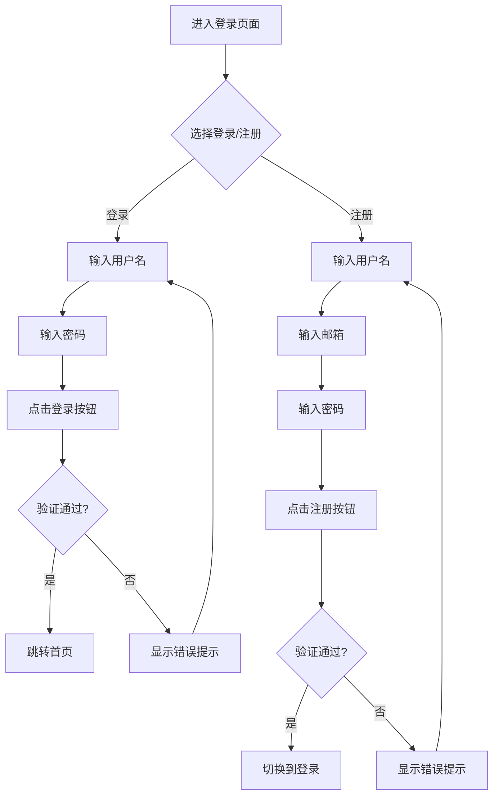
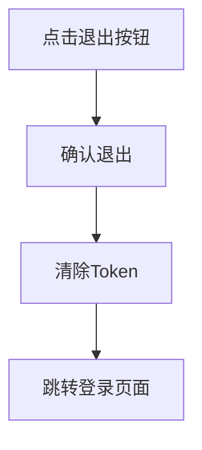

# 登录功能交互设计文档

## 更新记录

| 版本 | 日期 | 修改人 | 修改内容 |
|------|------|--------|----------|
| V1.0.0 | 2026-05-13 | 系统 | 初始版本 |

## 一、页面结构

### 1.1 登录页面布局

```
┌─────────────────────────────────┐
│           页面标题区域           │
│   家庭族谱管理系统              │
│   记录家族历史，传承家族文化      │
├─────────────────────────────────┤
│           标签切换区域           │
│     [登录]        [注册]         │
├─────────────────────────────────┤
│           表单输入区域           │
│   ┌──────────────────────┐     │
│   │   用户名输入框       │     │
│   └──────────────────────┘     │
│   ┌──────────────────────┐     │
│   │   密码输入框         │     │
│   └──────────────────────┘     │
│   ┌──────────────────────┐     │
│   │      提交按钮        │     │
│   └──────────────────────┘     │
└─────────────────────────────────┘
```

### 1.2 组件划分

| 组件 | 说明 | 状态 |
|------|------|------|
| LoginCard | 登录卡片容器 | 固定 |
| TabSwitch | 登录/注册切换标签 | 可切换 |
| FormInput | 表单输入框 | 可输入 |
| SubmitButton | 提交按钮 | 可点击 |

## 二、交互流程

### 2.1 登录流程



### 2.2 退出流程



## 三、界面原型

### 3.1 登录页面

**布局：**
- 居中显示登录卡片
- 卡片宽度：400px
- 圆角：16px
- 背景渐变：紫蓝色渐变

**元素样式：**
| 元素 | 样式 |
|------|------|
| 标题 | 28px，粗体，深灰色 |
| 副标题 | 14px，灰色 |
| 输入框 | 大型，圆角 |
| 按钮 | 主色，全宽，44px高度 |

### 3.2 标签切换

**交互：**
- 点击标签切换登录/注册表单
- 激活态显示下划线和高亮文字
- 非激活态显示灰色文字

### 3.3 表单验证

**实时验证：**
- 失焦时验证字段格式
- 错误时显示红色边框和错误提示
- 正确时显示绿色边框

## 四、状态说明

### 4.1 登录状态

| 状态 | 描述 | 界面表现 |
|------|------|----------|
| 初始状态 | 页面加载完成 | 表单为空，按钮可点击 |
| 输入中 | 用户正在输入 | 输入框有内容 |
| 加载中 | 正在提交请求 | 按钮显示加载动画 |
| 成功 | 验证通过 | 跳转到首页 |
| 失败 | 验证失败 | 显示红色错误提示 |

### 4.2 注册状态

| 状态 | 描述 | 界面表现 |
|------|------|----------|
| 初始状态 | 页面加载完成 | 表单为空 |
| 输入中 | 用户正在输入 | 输入框有内容 |
| 加载中 | 正在提交请求 | 按钮显示加载动画 |
| 成功 | 注册成功 | 切换到登录标签 |
| 失败 | 验证失败 | 显示红色错误提示 |

### 4.3 错误提示类型

| 错误类型 | 提示内容 | 触发条件 |
|----------|----------|----------|
| 用户名不存在 | 用户不存在 | 登录时用户不存在 |
| 密码错误 | 密码错误 | 登录时密码不匹配 |
| 用户名已存在 | 用户名已存在 | 注册时用户名重复 |
| 邮箱已存在 | 邮箱已被注册 | 注册时邮箱重复 |
| 格式错误 | 请输入正确格式 | 输入格式不符合要求 |

## 五、响应式设计

### 5.1 移动端适配

- 卡片宽度：90%
- 输入框高度：48px
- 按钮高度：48px
- 字体适当缩小

### 5.2 桌面端适配

- 卡片宽度：400px
- 保持固定大小
- 居中显示

## 六、交互细节

### 6.1 键盘操作

- Enter键提交表单
- Tab键切换输入框

### 6.2 自动填充

- 支持浏览器自动填充
- 保存密码提示

### 6.3 加载状态

- 请求期间禁用按钮
- 显示加载动画
- 防止重复提交