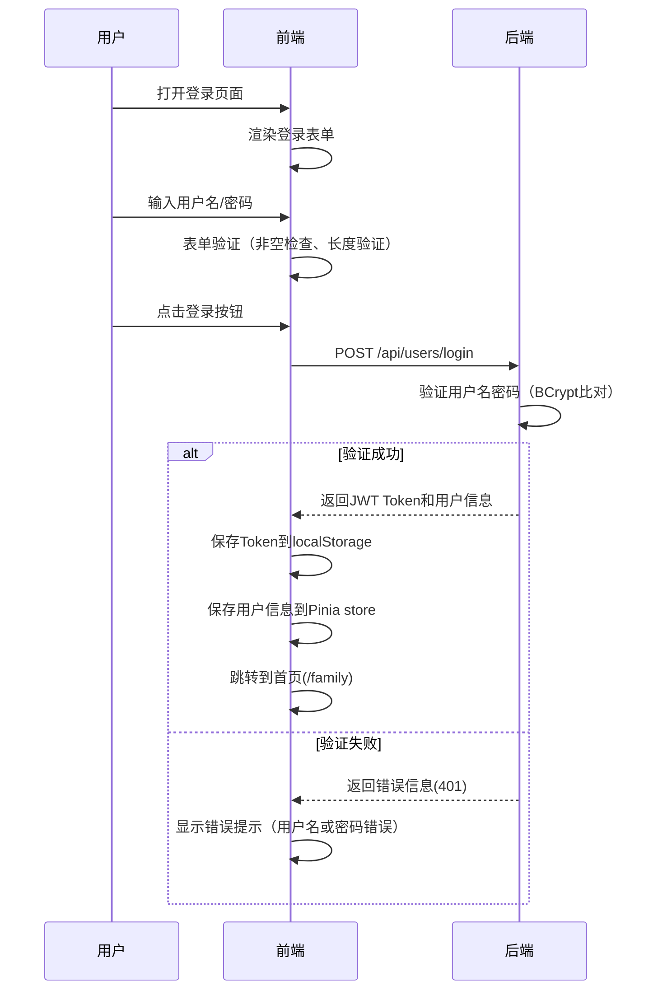
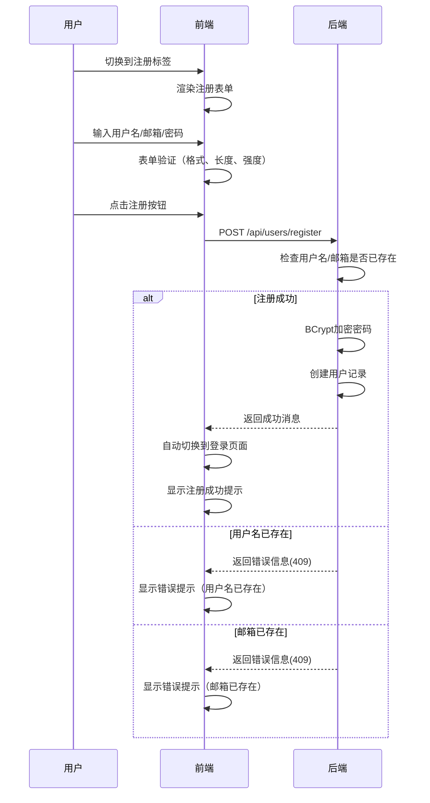
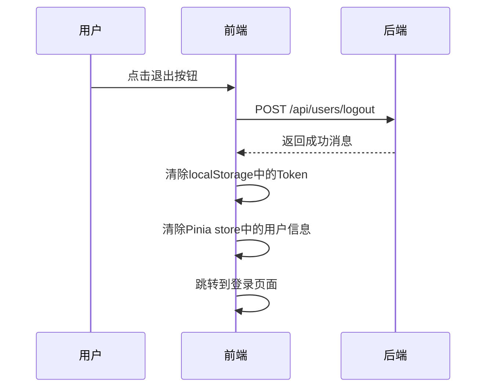
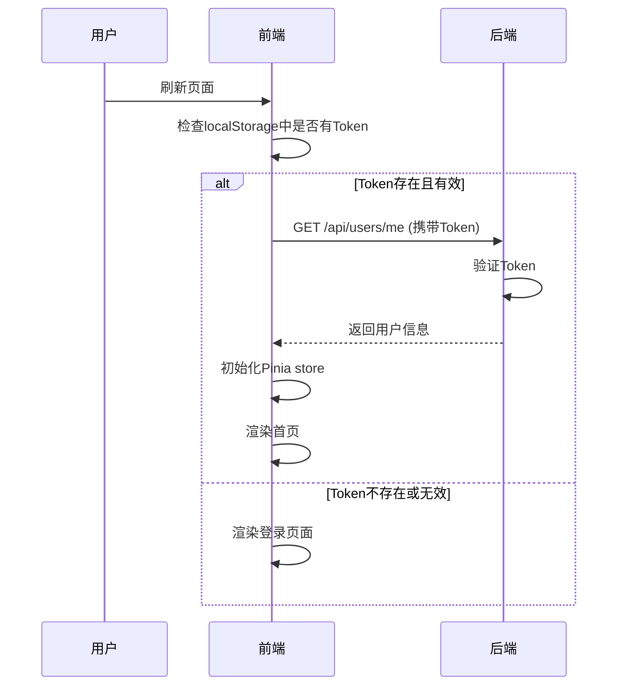
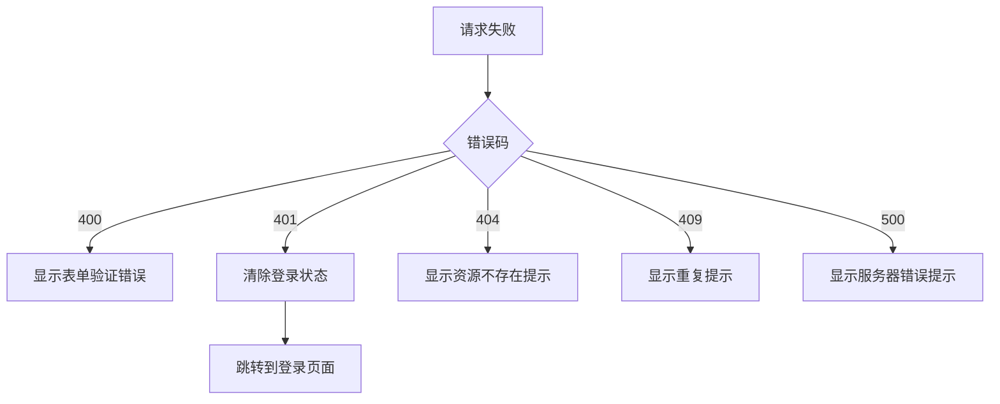

# 登录功能需求文档

## 更新记录

| 版本 | 日期 | 修改人 | 修改内容 |
|------|------|--------|----------|
| V1.0.0 | 2026-05-12 | 系统 | 初始版本 |
| V1.1.0 | 2026-05-13 | 系统 | 添加需求拆分、竞对分析、交互流程 |

---

## 一、需求概述

### 1.1 需求来源
- 产品需求：用户需要安全的登录机制
- 用户反馈：需要支持注册功能

### 1.2 功能描述
实现用户登录和注册功能，支持用户名/密码认证方式，提供安全、流畅的用户体验。

### 1.3 业务价值
- 保障系统安全性
- 实现用户身份识别
- 支持用户数据隔离
- 提供良好的用户体验

### 1.4 竞对分析

| 竞品 | 优势 | 劣势 | 借鉴点 |
|------|------|------|--------|
| 微信登录 | 一键登录，体验好 | 依赖第三方 | 简化登录流程 |
| 支付宝登录 | 安全级别高 | 流程繁琐 | 安全验证机制 |
| 传统账号密码 | 自主性强 | 记忆负担 | 密码强度提示 |
| 手机验证码 | 便捷 | 依赖短信 | 多因素认证 |

### 1.5 竞争力分析

**核心优势：**
- 简洁的登录界面设计
- 支持账号密码+JWT认证
- 登录态持久化（localStorage）
- 完善的错误提示机制

---

## 二、需求拆分

### 2.1 功能需求拆分

| 需求编号 | 需求点 | 描述 | 优先级 | 依赖 |
|----------|--------|------|--------|------|
| REQ_LOGIN_001 | 用户登录 | 用户输入用户名密码进行登录 | 高 | - |
| REQ_LOGIN_002 | 用户注册 | 用户注册新账号 | 高 | - |
| REQ_LOGIN_003 | 登录态持久化 | 刷新页面保持登录状态 | 高 | REQ_LOGIN_001 |
| REQ_LOGIN_004 | 退出登录 | 用户退出当前账号 | 高 | REQ_LOGIN_001 |
| REQ_LOGIN_005 | 密码验证 | 密码错误提示 | 高 | REQ_LOGIN_001 |
| REQ_LOGIN_006 | 用户不存在提示 | 用户不存在时的友好提示 | 中 | REQ_LOGIN_001 |
| REQ_LOGIN_007 | 表单验证 | 前端输入验证 | 高 | REQ_LOGIN_001/002 |
| REQ_LOGIN_008 | 密码强度提示 | 注册时提示密码强度 | 中 | REQ_LOGIN_002 |

### 2.2 非功能需求

#### 2.2.1 性能要求
| 需求编号 | 描述 | 目标值 |
|----------|------|--------|
| NFR_LOGIN_001 | 登录响应时间 | ≤ 500ms |
| NFR_LOGIN_002 | 注册响应时间 | ≤ 1000ms |
| NFR_LOGIN_003 | 页面加载时间 | ≤ 2s |

#### 2.2.2 安全要求
| 需求编号 | 描述 | 状态 |
|----------|------|------|
| NFR_LOGIN_004 | 密码使用BCrypt加密存储 | ✅ |
| NFR_LOGIN_005 | JWT Token有效期1小时 | ✅ |
| NFR_LOGIN_006 | 支持密码强度校验 | ✅ |
| NFR_LOGIN_007 | HTTPS传输 | ✅ |

#### 2.2.3 兼容性要求
| 需求编号 | 描述 |
|----------|------|
| NFR_LOGIN_008 | 支持主流浏览器（Chrome、Firefox、Safari、Edge） |
| NFR_LOGIN_009 | 支持移动端访问 |

---

## 三、交互流程

### 3.1 登录流程



### 3.2 注册流程



### 3.3 退出流程



### 3.4 登录态持久化流程



---

## 四、数据流向

```
用户输入 → 前端验证 → API请求 → 后端验证 → 返回响应 → 更新登录状态
```

### 4.1 登录数据流
1. 用户输入用户名和密码
2. 前端进行基本验证（非空检查、长度验证）
3. 调用登录API（POST /api/users/login）
4. 后端验证用户名密码（BCrypt比对）
5. 返回JWT Token和用户信息
6. 前端保存Token到localStorage
7. 前端保存用户信息到Pinia store
8. 跳转到首页

### 4.2 注册数据流
1. 用户输入用户名、邮箱、密码
2. 前端验证输入格式（邮箱格式、密码强度）
3. 调用注册API（POST /api/users/register）
4. 后端检查用户名/邮箱是否已存在
5. BCrypt加密密码
6. 创建用户记录
7. 返回成功消息
8. 跳转到登录页面

---

## 五、验收标准

### 5.1 登录功能
| 验收项 | 验收条件 | 测试方法 |
|--------|----------|----------|
| 登录页面显示 | 页面加载后显示登录表单、注册按钮 | 打开页面检查元素 |
| 正确登录 | 输入正确用户名密码成功登录并跳转首页 | 输入admin/admin123 |
| 错误密码 | 显示"用户名或密码错误"提示 | 输入admin/wrong |
| 用户不存在 | 显示"用户不存在"提示 | 输入nonexist/password |
| 空用户名 | 显示"请输入用户名"提示 | 只输入密码 |
| 空密码 | 显示"请输入密码"提示 | 只输入用户名 |
| 登录态持久化 | 刷新页面保持登录状态 | 登录后刷新页面 |

### 5.2 注册功能
| 验收项 | 验收条件 | 测试方法 |
|--------|----------|----------|
| 注册页面显示 | 切换到注册标签显示注册表单 | 点击注册标签 |
| 注册成功 | 输入合法信息成功注册并跳转登录 | 输入新用户信息 |
| 用户名已存在 | 显示"用户名已存在"提示 | 使用已存在用户名 |
| 邮箱已存在 | 显示"邮箱已存在"提示 | 使用已存在邮箱 |
| 空邮箱 | 显示"请输入邮箱"提示 | 不输入邮箱 |
| 密码强度提示 | 弱密码显示强度提示 | 输入短密码 |

### 5.3 退出功能
| 验收项 | 验收条件 | 测试方法 |
|--------|----------|----------|
| 退出成功 | 点击退出按钮清除登录状态 | 登录后点击退出 |
| 跳转登录页 | 退出后跳转登录页面 | 检查URL |

---

## 六、接口定义

### 6.1 登录接口

**POST /api/users/login**

请求体：
```json
{
  "username": "string (必填，用户名，长度3-64)",
  "password": "string (必填，密码，长度6-128)"
}
```

成功响应（200）：
```json
{
  "code": 200,
  "message": "success",
  "data": {
    "token": "string (JWT令牌)",
    "user": {
      "id": "number (用户ID)",
      "username": "string (用户名)",
      "email": "string (邮箱)"
    }
  }
}
```

失败响应（401）：
```json
{
  "code": 401,
  "message": "用户名或密码错误",
  "data": null
}
```

### 6.2 注册接口

**POST /api/users/register**

请求体：
```json
{
  "username": "string (必填，用户名，长度3-64)",
  "email": "string (必填，邮箱)",
  "password": "string (必填，密码，长度6-128)"
}
```

成功响应（200）：
```json
{
  "code": 200,
  "message": "注册成功",
  "data": null
}
```

失败响应（409）：
```json
{
  "code": 409,
  "message": "用户名已存在",
  "data": null
}
```

### 6.3 退出接口

**POST /api/users/logout**

成功响应（200）：
```json
{
  "code": 200,
  "message": "退出成功",
  "data": null
}
```

### 6.4 获取当前用户接口

**GET /api/users/me**

请求头：
```
Authorization: Bearer <token>
```

成功响应（200）：
```json
{
  "code": 200,
  "message": "success",
  "data": {
    "id": "number",
    "username": "string",
    "email": "string",
    "nickname": "string",
    "avatar": "string"
  }
}
```

---

## 七、测试用例

### 7.1 后端单元测试用例

| 测试用例ID | 测试名称 | 测试步骤 | 预期结果 |
|------------|----------|----------|----------|
| UT-AUTH-001 | 正确用户名密码登录 | 1.调用登录API<br>2.传入admin/admin123 | 返回200，包含Token |
| UT-AUTH-002 | 错误密码登录 | 1.调用登录API<br>2.传入admin/wrong | 返回401错误 |
| UT-AUTH-003 | 不存在用户登录 | 1.调用登录API<br>2.传入nonexist/password | 返回404错误 |
| UT-AUTH-004 | 空用户名登录 | 1.调用登录API<br>2.传入空用户名 | 返回400错误 |
| UT-AUTH-005 | 空密码登录 | 1.调用登录API<br>2.传入空密码 | 返回400错误 |
| UT-AUTH-006 | 新用户注册 | 1.调用注册API<br>2.传入新用户信息 | 返回200成功 |
| UT-AUTH-007 | 用户名已存在注册 | 1.调用注册API<br>2.传入已存在用户名 | 返回409错误 |
| UT-AUTH-008 | 邮箱已存在注册 | 1.调用注册API<br>2.传入已存在邮箱 | 返回409错误 |
| UT-AUTH-009 | 获取当前用户 | 1.携带Token调用GET /api/users/me | 返回用户信息 |
| UT-AUTH-010 | 无效Token获取用户 | 1.携带无效Token调用 | 返回401错误 |

### 7.2 前端UI测试用例

| 测试用例ID | 测试名称 | 测试步骤 | 预期结果 |
|------------|----------|----------|----------|
| UI-LOGIN-001 | 登录页面显示正确 | 1.打开登录页面 | 显示标题、登录/注册按钮 |
| UI-LOGIN-002 | 登录成功 | 1.输入admin/admin123<br>2.点击登录 | 跳转到家族管理页面 |
| UI-LOGIN-003 | 登录失败-错误密码 | 1.输入admin/wrong<br>2.点击登录 | 显示错误提示 |
| UI-LOGIN-004 | 登录失败-空用户名 | 1.只输入密码<br>2.点击登录 | 显示验证提示 |
| UI-LOGIN-005 | 登录失败-空密码 | 1.只输入用户名<br>2.点击登录 | 显示验证提示 |
| UI-LOGIN-006 | 注册新用户 | 1.切换到注册<br>2.输入新用户信息<br>3.点击注册 | 切换到登录页面 |
| UI-LOGIN-007 | 注册失败-空邮箱 | 1.切换到注册<br>2.不输入邮箱<br>3.点击注册 | 显示验证提示 |
| UI-LOGIN-008 | 登录态持久化 | 1.登录成功<br>2.刷新页面 | 保持登录状态 |

---

## 八、错误处理

### 8.1 错误类型

| 错误码 | 错误信息 | 处理方式 |
|--------|----------|----------|
| 400 | 请求参数错误 | 显示表单验证提示 |
| 401 | 未授权 | 跳转到登录页面 |
| 404 | 用户不存在 | 显示友好提示 |
| 409 | 用户名/邮箱已存在 | 显示重复提示 |
| 500 | 服务器错误 | 显示通用错误提示 |

### 8.2 错误处理流程


