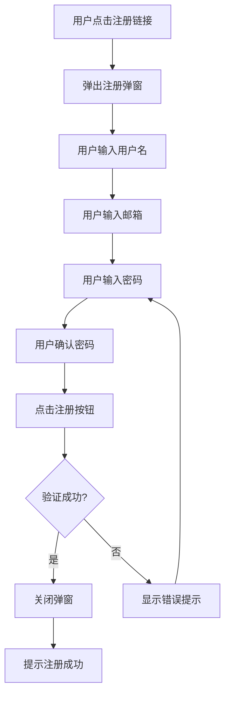

# 注册-交互文档

## 1. 交互流程

### 1.1 注册流程



### 1.2 切换登录流程

```mermaid
flowchart TD
    A[用户在注册弹窗] --> B[点击"立即登录"链接]
    B --> C[关闭注册弹窗]
    C --> D[打开登录弹窗]
```

---

## 2. 测试用例

### 2.1 功能测试用例

| 测试编号 | 测试场景 | 测试步骤 | 预期结果 | 优先级 |
|----------|----------|----------|----------|--------|
| TC-REG-001 | 打开注册弹窗 | 点击"立即注册"链接 | 注册弹窗显示 | 高 |
| TC-REG-002 | 注册成功 | 输入新用户信息，点击注册 | 弹窗关闭，提示成功 | 高 |
| TC-REG-003 | 用户名重复 | 输入已存在用户名 | 显示"用户名已存在"提示 | 高 |
| TC-REG-004 | 邮箱重复 | 输入已存在邮箱 | 显示"邮箱已存在"提示 | 高 |
| TC-REG-005 | 密码不一致 | 两次输入不同密码 | 显示"密码不一致"提示 | 高 |
| TC-REG-006 | 密码过短 | 输入少于6位密码 | 显示"密码至少6位"提示 | 中 |
| TC-REG-007 | 切换登录 | 点击"立即登录"链接 | 注册弹窗关闭，登录弹窗打开 | 高 |

### 2.2 API测试用例

| 测试编号 | 接口路径 | 方法 | 请求数据 | 预期结果 | 优先级 |
|----------|----------|------|----------|----------|--------|
| TC-API-REG-001 | /api/users/register | POST | {"username":"newuser","email":"new@test.com","password":"123456"} | 返回用户信息，状态码201 | 高 |
| TC-API-REG-002 | /api/users/register | POST | {"username":"admin","email":"admin@test.com","password":"123456"} | 返回错误，用户名已存在，状态码400 | 高 |
| TC-API-REG-003 | /api/users/register | POST | {"username":"","email":"","password":""} | 返回错误，状态码400 | 中 |

---

## 3. 界面设计

### 3.1 注册弹窗

| 元素 | 描述 | 位置 |
|------|------|------|
| 标题 | "用户注册" | 弹窗顶部 |
| 用户名输入框 | 文本输入，placeholder:"请输入用户名" | 标题下方 |
| 邮箱输入框 | 文本输入，placeholder:"请输入邮箱" | 用户名输入框下方 |
| 密码输入框 | 密码输入，placeholder:"请输入密码" | 邮箱输入框下方 |
| 确认密码输入框 | 密码输入，placeholder:"请确认密码" | 密码输入框下方 |
| 注册按钮 | 蓝色主按钮，文字:"注册" | 确认密码输入框下方 |
| 登录链接 | 文字:"已有账号？立即登录"，可点击 | 注册按钮下方 |