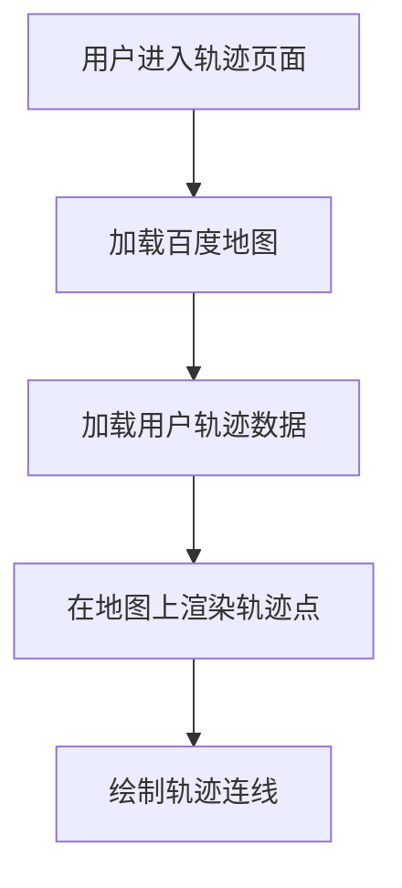
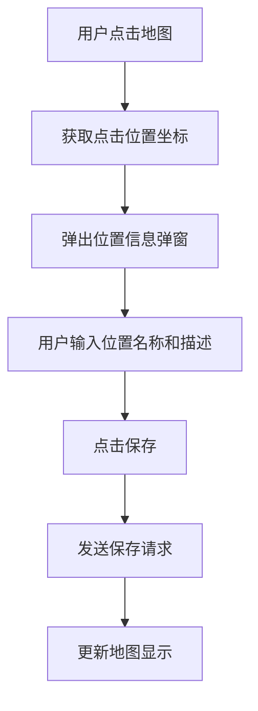
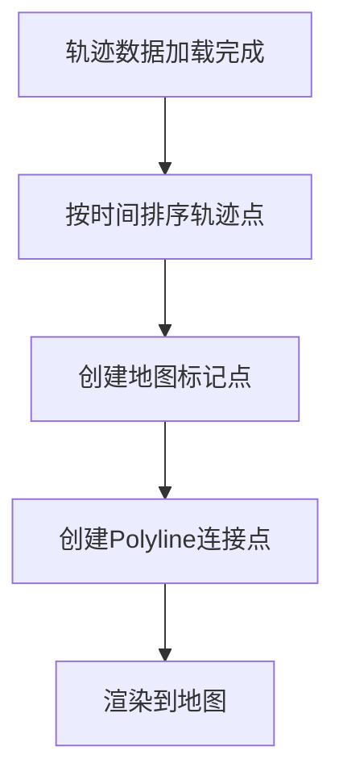

# 轨迹-交互文档

## 1. 交互流程

### 1.1 地图加载流程

### 1.2 踩点流程

### 1.3 轨迹显示流程

---

## 2. 测试用例

### 2.1 功能测试用例

| 测试编号 | 测试场景 | 测试步骤 | 预期结果 | 优先级 |
|----------|----------|----------|----------|--------|
| TC-TRK-001 | 地图加载 | 进入轨迹页面 | 百度地图正常显示 | 高 |
| TC-TRK-002 | 点击踩点 | 点击地图任意位置 | 弹出位置信息弹窗 | 高 |
| TC-TRK-003 | 保存轨迹点 | 输入名称，点击保存 | 轨迹点保存成功，地图显示标记 | 高 |
| TC-TRK-004 | 轨迹显示 | 加载已有轨迹数据 | 轨迹点按时间顺序显示，并有连线 | 高 |
| TC-TRK-005 | 删除轨迹点 | 点击标记点，选择删除 | 轨迹点删除，连线更新 | 高 |

### 2.2 API测试用例

| 测试编号 | 接口路径 | 方法 | 请求数据 | 预期结果 | 优先级 |
|----------|----------|------|----------|----------|--------|
| TC-API-TRK-001 | /api/trackpoints | GET | 无 | 返回轨迹点列表，状态码200 | 高 |
| TC-API-TRK-002 | /api/trackpoints | POST | {"latitude":39.9042,"longitude":116.4074,"name":"测试点"} | 创建成功，状态码201 | 高 |
| TC-API-TRK-003 | /api/trackpoints/{id} | GET | 有效ID | 返回轨迹点信息，状态码200 | 高 |
| TC-API-TRK-004 | /api/trackpoints/{id} | PUT | {"name":"新名称"} | 更新成功，状态码200 | 高 |
| TC-API-TRK-005 | /api/trackpoints/{id} | DELETE | 有效ID | 删除成功，状态码204 | 高 |

---

## 3. 界面设计

### 3.1 轨迹页面布局

| 元素 | 描述 | 位置 |
|------|------|------|
| 标题 | "用户轨迹" | 页面顶部 |
| 操作按钮 | 清空轨迹、导出轨迹 | 标题右侧 |
| 地图容器 | 百度地图显示区域 | 页面主体 |
| 轨迹列表 | 轨迹点列表（侧边栏） | 页面右侧 |

### 3.2 踩点弹窗

| 元素 | 描述 | 位置 |
|------|------|------|
| 标题 | "添加轨迹点" | 弹窗顶部 |
| 名称输入框 | 文本输入，placeholder:"位置名称" | 表单第一行 |
| 描述输入框 | 文本域，placeholder:"位置描述（可选）" | 表单第二行 |
| 坐标显示 | 显示点击的经纬度 | 表单第三行 |
| 确定按钮 | 蓝色主按钮 | 弹窗底部左侧 |
| 取消按钮 | 白色按钮 | 弹窗底部右侧 |

### 3.3 轨迹点标记

| 元素 | 描述 | 样式 |
|------|------|------|
| 标记图标 | 蓝色圆形标记 | 半径10px，蓝色边框 |
| 序号标记 | 显示轨迹点顺序 | 标记中心数字 |
| 连线 | 连接相邻轨迹点 | 蓝色实线，宽度3px |