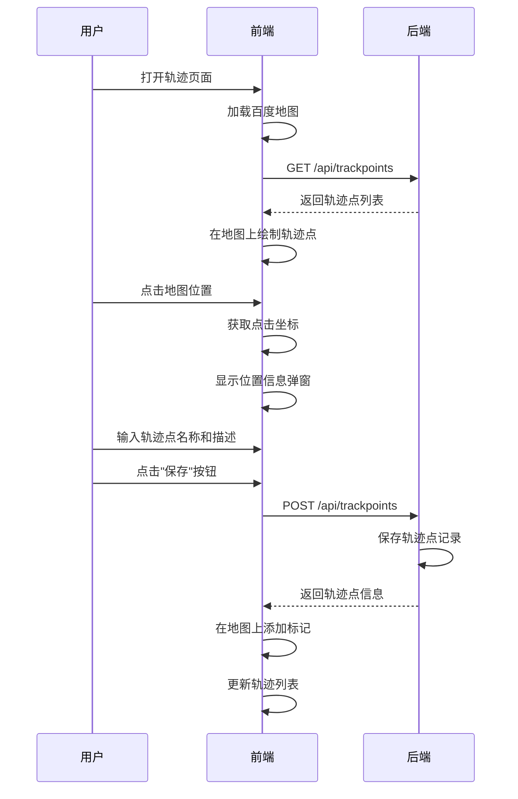
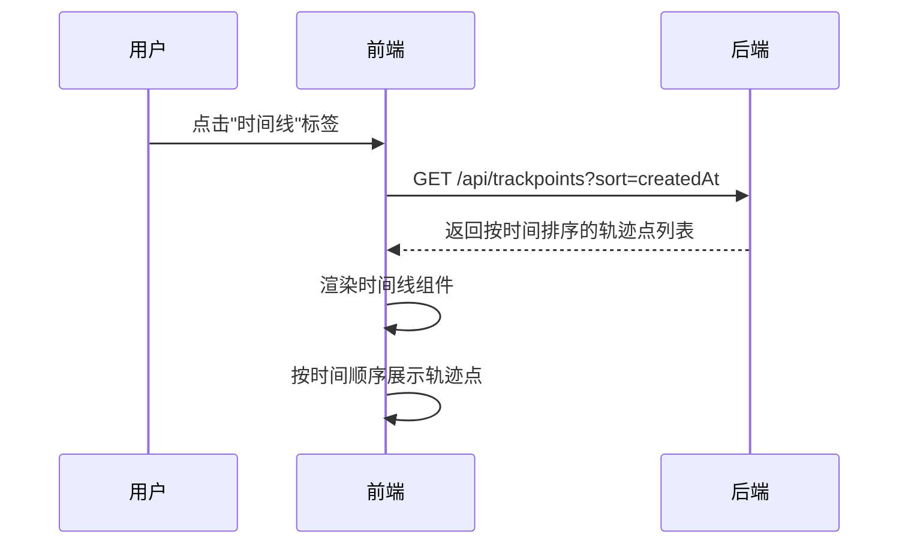
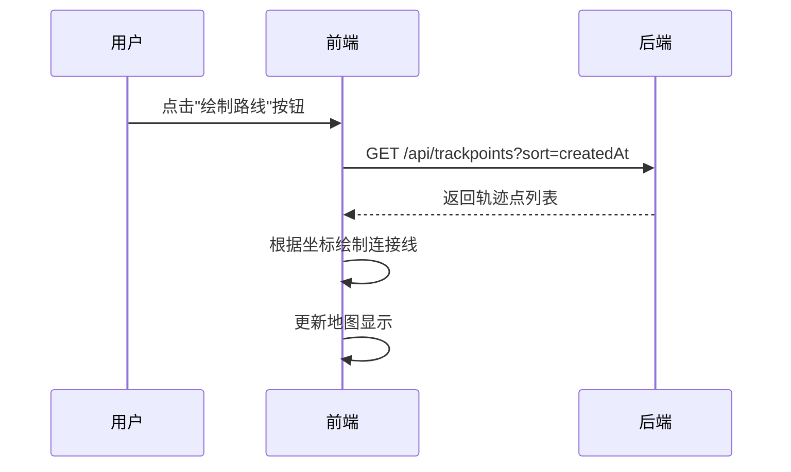
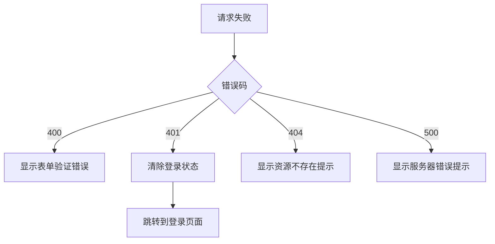

# 轨迹追踪功能需求文档

## 更新记录

| 版本 | 日期 | 修改人 | 修改内容 |
|------|------|--------|----------|
| V1.0.0 | 2026-05-12 | 系统 | 初始版本 |
| V1.1.0 | 2026-05-13 | 系统 | 添加需求拆分、交互流程、测试用例 |

---

## 一、需求概述

### 1.1 需求来源
- 产品需求：用户需要记录和展示旅行轨迹
- 用户反馈：希望能够在地图上查看自己的足迹

### 1.2 功能描述
实现轨迹点的创建、编辑、删除和展示功能，支持在地图上标记位置，记录旅行足迹，并以时间线形式展示轨迹历史。

### 1.3 业务价值
- 记录用户的旅行经历
- 可视化展示轨迹路线
- 支持分享旅行故事
- 纪念意义和回忆价值

### 1.4 竞对分析

| 竞品 | 优势 | 劣势 | 借鉴点 |
|------|------|------|--------|
| 高德地图足迹 | 地图数据丰富 | 功能单一 | 地图展示 |
| 百度地图 | 定位准确 | 社交功能弱 | 定位服务 |
| 旅行APP | 社交属性强 | 地图功能弱 | 用户体验 |

### 1.5 竞争力分析

**核心优势：**
- 集成百度地图SDK
- 支持精确坐标选择
- 时间线形式展示
- 与家族管理结合

---

## 二、需求拆分

### 2.1 功能需求拆分

| 需求编号 | 需求点 | 描述 | 优先级 | 依赖 |
|----------|--------|------|--------|------|
| REQ_TRACK_001 | 创建轨迹点 | 在地图上点击创建轨迹点 | 高 | - |
| REQ_TRACK_002 | 编辑轨迹点 | 修改轨迹点信息 | 高 | REQ_TRACK_001 |
| REQ_TRACK_003 | 删除轨迹点 | 删除已有轨迹点 | 高 | REQ_TRACK_001 |
| REQ_TRACK_004 | 查看轨迹列表 | 查看用户所有轨迹点 | 高 | - |
| REQ_TRACK_005 | 地图展示 | 在地图上展示轨迹点 | 高 | REQ_TRACK_001 |
| REQ_TRACK_006 | 时间线展示 | 按时间顺序展示轨迹 | 高 | REQ_TRACK_001 |
| REQ_TRACK_007 | 轨迹路线绘制 | 按顺序连接轨迹点 | 中 | REQ_TRACK_001 |
| REQ_TRACK_008 | 批量上传 | 批量导入轨迹点 | 中 | - |
| REQ_TRACK_009 | 轨迹分享 | 分享轨迹给他人 | 中 | REQ_TRACK_001 |

### 2.2 非功能需求

#### 2.2.1 性能要求
| 需求编号 | 描述 | 目标值 |
|----------|------|--------|
| NFR_TRACK_001 | 地图加载时间 | ≤ 3s |
| NFR_TRACK_002 | 轨迹点渲染时间 | ≤ 1s |
| NFR_TRACK_003 | API响应时间 | ≤ 500ms |

#### 2.2.2 安全要求
| 需求编号 | 描述 | 状态 |
|----------|------|------|
| NFR_TRACK_004 | 用户数据隔离 | ✅ |
| NFR_TRACK_005 | HTTPS传输 | ✅ |
| NFR_TRACK_006 | 权限验证 | ✅ |

#### 2.2.3 兼容性要求
| 需求编号 | 描述 |
|----------|------|
| NFR_TRACK_007 | 支持主流浏览器 |
| NFR_TRACK_008 | 支持移动端访问 |

---

## 三、交互流程

### 3.1 创建轨迹点流程



### 3.2 查看轨迹时间线流程



### 3.3 绘制轨迹路线流程



---

## 四、数据流向

```
用户操作 → 前端处理 → API请求 → 后端处理 → 返回响应 → 更新UI
```

### 4.1 创建轨迹点数据流
1. 用户打开轨迹页面
2. 前端加载百度地图
3. 获取已有轨迹点并绘制
4. 用户点击地图位置
5. 显示位置信息弹窗
6. 输入名称和描述
7. 调用POST /api/trackpoints
8. 后端保存轨迹点
9. 返回轨迹点信息
10. 更新地图和列表

### 4.2 查看时间线数据流
1. 用户点击时间线标签
2. 调用GET /api/trackpoints?sort=createdAt
3. 后端返回按时间排序的轨迹点
4. 前端渲染时间线组件

---

## 五、验收标准

### 5.1 轨迹点管理功能
| 验收项 | 验收条件 | 测试方法 |
|--------|----------|----------|
| 创建轨迹点 | 点击地图后成功创建 | 在地图上点击 |
| 编辑轨迹点 | 修改信息后保存成功 | 点击编辑按钮 |
| 删除轨迹点 | 确认后成功删除 | 点击删除按钮 |
| 查看轨迹列表 | 显示用户所有轨迹点 | 进入轨迹页面 |
| 列表排序 | 按创建时间倒序排列 | 检查列表顺序 |

### 5.2 地图展示功能
| 验收项 | 验收条件 | 测试方法 |
|--------|----------|----------|
| 地图加载 | 成功加载百度地图 | 进入轨迹页面 |
| 轨迹点标记 | 显示所有轨迹点标记 | 检查地图标记 |
| 点击地图 | 显示位置信息弹窗 | 点击地图空白处 |
| 路线绘制 | 正确连接轨迹点 | 点击绘制路线按钮 |

### 5.3 时间线展示功能
| 验收项 | 验收条件 | 测试方法 |
|--------|----------|----------|
| 时间线显示 | 按时间顺序展示 | 切换到时间线标签 |
| 时间排序 | 最新的在最上方 | 检查顺序 |
| 详情展开 | 点击可查看详情 | 点击轨迹点 |

---

## 六、接口定义

### 6.1 创建轨迹点

**POST /api/trackpoints**

请求体：
```json
{
  "latitude": "number (必填，纬度)",
  "longitude": "number (必填，经度)",
  "name": "string (必填，轨迹点名称)",
  "description": "string (可选，描述)",
  "address": "string (可选，地址)",
  "visitDate": "string (可选，访问日期)"
}
```

成功响应（200）：
```json
{
  "code": 200,
  "message": "success",
  "data": {
    "id": "number",
    "latitude": "number",
    "longitude": "number",
    "name": "string",
    "description": "string",
    "address": "string",
    "visitDate": "string",
    "createdAt": "string"
  }
}
```

### 6.2 获取轨迹点列表

**GET /api/trackpoints**

请求参数：
| 参数 | 类型 | 说明 |
|------|------|------|
| page | number | 页码 |
| size | number | 每页数量 |
| sort | string | 排序字段 |

成功响应（200）：
```json
{
  "code": 200,
  "message": "success",
  "data": {
    "content": [
      {
        "id": "number",
        "latitude": "number",
        "longitude": "number",
        "name": "string",
        "address": "string",
        "createdAt": "string"
      }
    ],
    "totalElements": "number",
    "totalPages": "number"
  }
}
```

### 6.3 更新轨迹点

**PUT /api/trackpoints/{id}**

请求体：
```json
{
  "name": "string (可选)",
  "description": "string (可选)",
  "address": "string (可选)",
  "visitDate": "string (可选)"
}
```

成功响应（200）：
```json
{
  "code": 200,
  "message": "success",
  "data": null
}
```

### 6.4 删除轨迹点

**DELETE /api/trackpoints/{id}**

成功响应（200）：
```json
{
  "code": 200,
  "message": "success",
  "data": null
}
```

---

## 七、测试用例

### 7.1 后端单元测试用例

| 测试用例ID | 测试名称 | 测试步骤 | 预期结果 |
|------------|----------|----------|----------|
| UT-TRACK-001 | 创建轨迹点 | 1.调用POST /api/trackpoints<br>2.传入坐标和名称 | 返回200，返回轨迹点信息 |
| UT-TRACK-002 | 创建轨迹点无坐标 | 1.调用POST /api/trackpoints<br>2.不传坐标 | 返回400错误 |
| UT-TRACK-003 | 获取轨迹点列表 | 1.调用GET /api/trackpoints | 返回用户所有轨迹点 |
| UT-TRACK-004 | 获取单个轨迹点 | 1.调用GET /api/trackpoints/{id} | 返回轨迹点详情 |
| UT-TRACK-005 | 更新轨迹点 | 1.调用PUT /api/trackpoints/{id} | 更新成功 |
| UT-TRACK-006 | 删除轨迹点 | 1.调用DELETE /api/trackpoints/{id} | 删除成功 |
| UT-TRACK-007 | 删除不存在轨迹点 | 1.调用DELETE /api/trackpoints/999 | 返回404错误 |
| UT-TRACK-008 | 分页查询轨迹点 | 1.调用GET /api/trackpoints?page=0&size=10 | 返回分页结果 |
| UT-TRACK-009 | 按时间排序 | 1.调用GET /api/trackpoints?sort=createdAt | 返回排序结果 |

### 7.2 前端UI测试用例

| 测试用例ID | 测试名称 | 测试步骤 | 预期结果 |
|------------|----------|----------|----------|
| UI-TRACK-001 | 轨迹页面显示正确 | 1.登录后进入轨迹页面 | 显示地图和轨迹列表 |
| UI-TRACK-002 | 创建轨迹点 | 1.点击地图位置<br>2.输入名称<br>3.点击保存 | 轨迹点添加成功 |
| UI-TRACK-003 | 编辑轨迹点 | 1.点击Edit按钮<br>2.修改名称<br>3.点击保存 | 轨迹点更新成功 |
| UI-TRACK-004 | 删除轨迹点 | 1.点击Delete按钮<br>2.点击确定 | 轨迹点删除成功 |
| UI-TRACK-005 | 时间线显示 | 1.切换到时间线标签 | 显示时间线视图 |
| UI-TRACK-006 | 路线绘制 | 1.点击绘制路线按钮 | 显示轨迹路线 |

---

## 八、错误处理

### 8.1 错误类型

| 错误码 | 错误信息 | 处理方式 |
|--------|----------|----------|
| 400 | 请求参数错误 | 显示表单验证提示 |
| 401 | 未授权 | 跳转到登录页面 |
| 404 | 资源不存在 | 显示资源不存在提示 |
| 500 | 服务器错误 | 显示通用错误提示 |

### 8.2 错误处理流程


