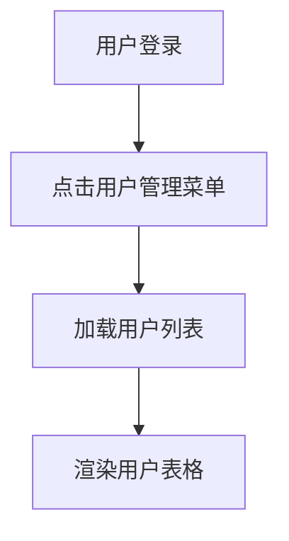
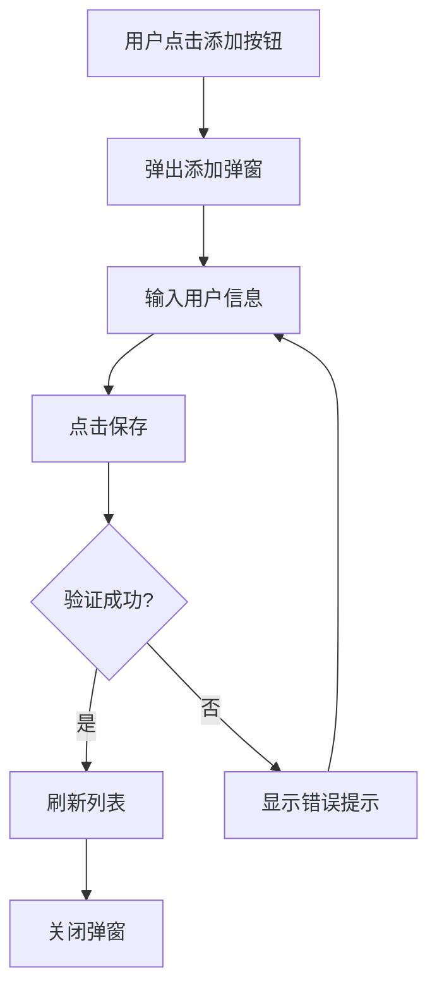
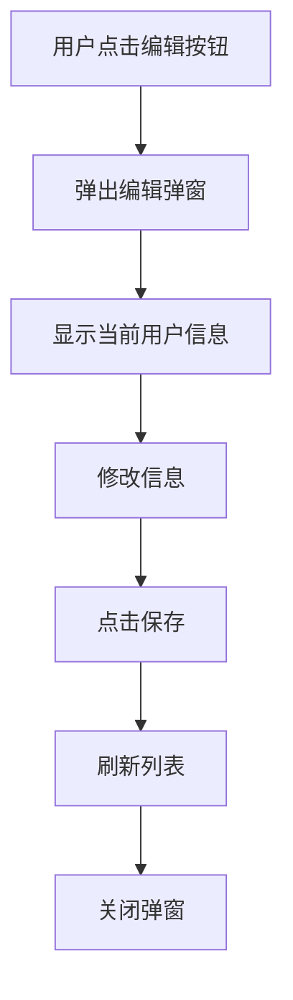
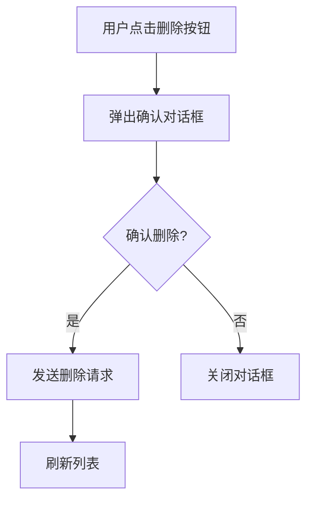

# 用户-交互文档

## 1. 交互流程

### 1.1 用户列表展示

### 1.2 添加用户流程

### 1.3 编辑用户流程

### 1.4 删除用户流程

---

## 2. 测试用例

### 2.1 功能测试用例

| 测试编号 | 测试场景 | 测试步骤 | 预期结果 | 优先级 |
|----------|----------|----------|----------|--------|
| TC-USR-001 | 用户列表展示 | 登录后点击用户管理 | 显示用户列表 | 高 |
| TC-USR-002 | 添加用户 | 点击添加按钮，输入信息，保存 | 用户添加成功，列表刷新 | 高 |
| TC-USR-003 | 编辑用户 | 点击编辑按钮，修改信息，保存 | 用户信息更新，列表刷新 | 高 |
| TC-USR-004 | 删除用户 | 点击删除按钮，确认删除 | 用户删除成功，列表刷新 | 高 |
| TC-USR-005 | 取消删除 | 点击删除按钮，点击取消 | 对话框关闭，用户不变 | 中 |

### 2.2 API测试用例

| 测试编号 | 接口路径 | 方法 | 预期结果 | 优先级 |
|----------|----------|------|----------|--------|
| TC-API-USR-001 | /api/users | GET | 返回用户列表，状态码200 | 高 |
| TC-API-USR-002 | /api/users/{id} | GET | 返回指定用户，状态码200 | 高 |
| TC-API-USR-003 | /api/users/{id} | GET | 用户不存在，状态码404 | 高 |
| TC-API-USR-004 | /api/users | POST | 创建成功，状态码201 | 高 |
| TC-API-USR-005 | /api/users/{id} | PUT | 更新成功，状态码200 | 高 |
| TC-API-USR-006 | /api/users/{id} | DELETE | 删除成功，状态码204 | 高 |

---

## 3. 界面设计

### 3.1 用户管理页面

| 元素 | 描述 | 位置 |
|------|------|------|
| 标题 | "用户管理" | 页面顶部 |
| 添加按钮 | 蓝色按钮，文字:"添加用户" | 标题右侧 |
| 用户表格 | 显示用户列表，包含ID、用户名、邮箱、操作列 | 页面中部 |
| 编辑按钮 | 操作列图标按钮 | 每行操作列 |
| 删除按钮 | 操作列图标按钮 | 每行操作列 |

### 3.2 添加/编辑弹窗

| 元素 | 描述 | 位置 |
|------|------|------|
| 标题 | "添加用户"或"编辑用户" | 弹窗顶部 |
| 用户名输入框 | 文本输入 | 表单第一行 |
| 邮箱输入框 | 文本输入 | 表单第二行 |
| 密码输入框 | 密码输入（添加时显示，编辑时可选） | 表单第三行 |
| 确认密码输入框 | 密码输入（添加时显示） | 表单第四行 |
| 确定按钮 | 蓝色主按钮 | 弹窗底部左侧 |
| 取消按钮 | 白色按钮 | 弹窗底部右侧 |