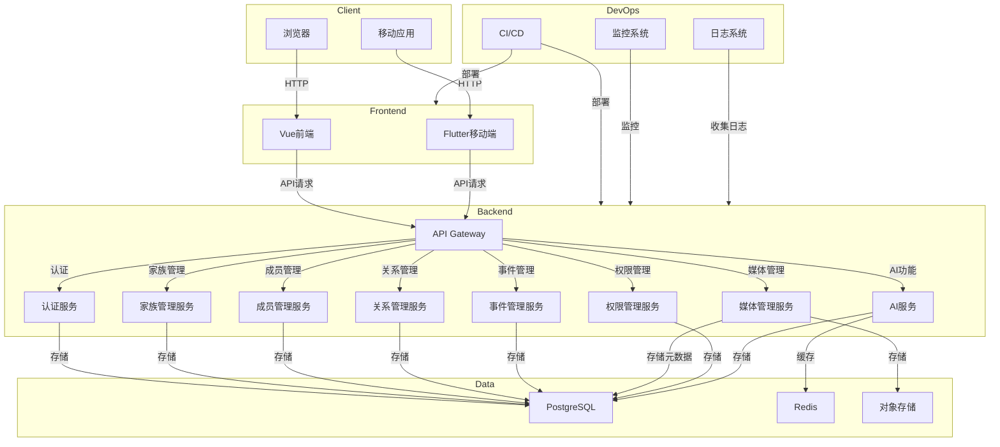

# 系统架构设计规范

## 1. 技能概述

本技能提供了家族树应用的系统架构设计规范，包括架构风格选择、技术栈选型、模块划分、数据流设计等。通过本规范，开发者可以构建一个可扩展、可维护、高性能的系统架构。

## 2. 架构设计原则

### 2.1 核心原则
- **高内聚，低耦合**：模块内部高度内聚，模块之间低耦合
- **可扩展性**：系统能够方便地添加新功能和模块
- **可维护性**：代码结构清晰，易于理解和修改
- **性能优化**：系统响应速度快，资源利用率高
- **可靠性**：系统稳定运行，容错能力强
- **安全性**：系统安全可靠，保护用户数据

### 2.2 设计模式
- **分层架构**：表现层、业务逻辑层、数据访问层
- **依赖注入**：使用Spring的依赖注入管理组件
- **工厂模式**：创建对象的最佳实践
- **单例模式**：管理全局资源
- **策略模式**：灵活切换算法或行为
- **观察者模式**：事件处理和消息传递

## 3. 技术栈选型

### 3.1 后端技术
- **框架**：Spring Boot 3.1.10+
- **JDK**：21+
- **数据库**：PostgreSQL 15+（生产环境）/ H2（开发环境）
- **缓存**：Redis（可选）
- **消息队列**：RabbitMQ（可选）
- **搜索**：Elasticsearch（可选）

### 3.2 前端技术
- **框架**：Vue 3.5.30+
- **构建工具**：Vite 8.0.1+
- **状态管理**：Pinia 3.0.4+
- **路由**：Vue Router 4.6.4+
- **HTTP客户端**：Axios 1.14.0+
- **CSS框架**：Tailwind CSS 4.2.2+

### 3.3 基础设施
- **容器化**：Docker
- **编排**：Docker Compose
- **CI/CD**：GitHub Actions / GitLab CI
- **监控**：Prometheus + Grafana
- **日志**：ELK Stack

## 4. 系统架构图

## 5. 模块划分

### 5.1 后端模块

| 模块 | 职责 | 主要功能 |
|------|------|----------|
| **认证模块** | 用户认证和授权 | 登录、注册、JWT管理 |
| **家族管理模块** | 家族信息管理 | 创建、编辑、删除家族 |
| **成员管理模块** | 家族成员管理 | 添加、编辑、删除成员 |
| **关系管理模块** | 成员关系管理 | 建立、修改、删除关系 |
| **事件管理模块** | 家族事件管理 | 创建、编辑、删除事件 |
| **媒体管理模块** | 多媒体文件管理 | 上传、管理照片和文档 |
| **权限管理模块** | 权限控制 | 角色分配、权限验证 |
| **AI模块** | 智能功能 | 人脸识别、关系预测、故事生成 |

### 5.2 前端模块

| 模块 | 职责 | 主要功能 |
|------|------|----------|
| **认证模块** | 用户登录注册 | 登录、注册、忘记密码 |
| **家族模块** | 家族管理界面 | 家族列表、家族详情、家族创建 |
| **成员模块** | 成员管理界面 | 成员列表、成员详情、成员编辑 |
| **关系模块** | 关系管理界面 | 关系绑定、关系可视化 |
| **事件模块** | 事件管理界面 | 事件列表、事件详情、事件创建 |
| **媒体模块** | 媒体管理界面 | 照片上传、相册管理、文档管理 |
| **设置模块** | 系统设置 | 个人设置、隐私设置、数据备份 |
| **AI模块** | AI功能界面 | 人脸识别、关系预测、故事生成 |

## 6. 数据流设计

### 6.1 数据模型

#### 6.1.1 用户表 (users)
- id: 主键
- email: 邮箱（唯一）
- password: 密码（加密）
- nickname: 昵称
- avatar: 头像
- phone: 电话
- created_at: 创建时间
- updated_at: 更新时间

#### 6.1.2 家族表 (families)
- id: 主键
- name: 家族名称
- description: 家族描述
- avatar: 家族头像
- creator_id: 创建者ID
- created_at: 创建时间
- updated_at: 更新时间

#### 6.1.3 成员表 (members)
- id: 主键
- family_id: 家族ID
- name: 成员姓名
- gender: 性别
- birth_date: 出生日期
- death_date: 死亡日期
- photo: 照片
- details: 详细信息
- created_at: 创建时间
- updated_at: 更新时间

#### 6.1.4 关系表 (relationships)
- id: 主键
- member_id1: 成员1 ID
- member_id2: 成员2 ID
- relationship_type: 关系类型
- created_at: 创建时间
- updated_at: 更新时间

#### 6.1.5 事件表 (events)
- id: 主键
- family_id: 家族ID
- title: 事件标题
- description: 事件描述
- date: 事件日期
- location: 事件地点
- created_at: 创建时间
- updated_at: 更新时间

#### 6.1.6 媒体表 (media)
- id: 主键
- family_id: 家族ID
- file_name: 文件名
- file_path: 文件路径
- description: 描述
- created_at: 创建时间
- updated_at: 更新时间

#### 6.1.7 权限表 (permissions)
- id: 主键
- user_id: 用户ID
- family_id: 家族ID
- role: 角色
- created_at: 创建时间
- updated_at: 更新时间

### 6.2 数据流向

1. **用户操作** → 前端界面 → API请求 → 后端服务 → 数据库
2. **数据变更** → 数据库 → 后端服务 → API响应 → 前端界面
3. **媒体上传** → 前端界面 → API请求 → 后端服务 → 对象存储 → 数据库
4. **AI处理** → 前端界面 → API请求 → 后端服务 → AI服务 → 数据库 → 前端界面

## 7. 性能优化策略

### 7.1 后端优化
- **数据库优化**：索引设计、查询优化、连接池配置
- **缓存策略**：Redis缓存热点数据，减少数据库访问
- **异步处理**：使用消息队列处理耗时操作
- **负载均衡**：多实例部署，负载均衡
- **代码优化**：减少循环嵌套，优化算法

### 7.2 前端优化
- **组件懒加载**：按需加载组件，减少初始加载时间
- **资源优化**：图片压缩，代码分割，CDN加速
- **缓存策略**：合理使用浏览器缓存
- **状态管理**：优化Pinia状态，避免不必要的重渲染
- **API调用优化**：合并请求，避免重复请求

### 7.3 基础设施优化
- **容器化**：使用Docker容器化部署，提高部署效率
- **自动扩缩容**：根据负载自动调整实例数量
- **CDN加速**：使用CDN加速静态资源
- **数据库读写分离**：提高数据库性能

## 8. 安全设计

### 8.1 认证与授权
- **JWT认证**：无状态认证，便于水平扩展
- **密码加密**：使用BCrypt加密存储密码
- **权限控制**：基于角色的访问控制（RBAC）
- **API保护**：所有API端点都需要认证

### 8.2 数据安全
- **数据加密**：敏感数据加密存储
- **HTTPS传输**：所有通信使用HTTPS
- **SQL注入防护**：使用参数化查询
- **XSS防护**：前端输入验证，后端输出编码
- **CSRF防护**：使用CSRF令牌

### 8.3 安全监控
- **日志监控**：记录所有安全相关事件
- **异常检测**：检测异常登录和访问行为
- **漏洞扫描**：定期进行安全漏洞扫描
- **安全审计**：定期进行安全审计

## 9. 部署架构

### 9.1 开发环境
- **本地开发**：Docker Compose启动完整环境
- **数据库**：H2内存数据库
- **服务**：本地启动所有服务

### 9.2 测试环境
- **环境**：独立的测试服务器
- **数据库**：PostgreSQL
- **服务**：完整部署所有服务
- **CI/CD**：自动部署测试分支

### 9.3 生产环境
- **环境**：云服务器或容器平台
- **数据库**：PostgreSQL（主从复制）
- **服务**：容器化部署，负载均衡
- **监控**：Prometheus + Grafana
- **日志**：ELK Stack
- **CI/CD**：自动部署master分支

## 10. 扩展性设计

### 10.1 水平扩展
- **无状态设计**：服务设计为无状态，便于水平扩展
- **负载均衡**：使用负载均衡器分发请求
- **数据库分片**：数据量大时进行数据库分片

### 10.2 垂直扩展
- **模块化设计**：服务模块化，便于独立扩展
- **微服务架构**：将大型服务拆分为微服务
- **API网关**：统一管理API，支持服务发现

### 10.3 功能扩展
- **插件架构**：支持插件扩展功能
- **钩子系统**：提供钩子点，便于功能扩展
- **配置管理**：集中化配置管理，支持动态配置

## 11. 监控与维护

### 11.1 监控指标
- **服务指标**：响应时间、错误率、QPS
- **系统指标**：CPU、内存、磁盘、网络
- **数据库指标**：查询性能、连接数、缓存命中率
- **业务指标**：用户活跃度、功能使用频率

### 11.2 告警机制
- **阈值告警**：设置合理的阈值，超过阈值触发告警
- **异常告警**：检测到异常行为触发告警
- **可用性告警**：服务不可用触发告警

### 11.3 维护策略
- **定期备份**：定期备份数据库和配置
- **版本管理**：代码和配置的版本管理
- **变更管理**：变更前评估，变更后验证
- **灾备方案**：制定灾难恢复方案

## 12. 最佳实践

1. **架构设计先行**：在编码前进行充分的架构设计
2. **模块化开发**：按功能模块进行开发，提高代码复用率
3. **测试驱动开发**：编写测试用例，确保代码质量
4. **持续集成**：使用CI/CD工具，自动化构建和部署
5. **监控先行**：在开发阶段就加入监控
6. **安全第一**：在设计阶段就考虑安全因素
7. **性能优化**：定期进行性能分析和优化
8. **文档完备**：保持架构文档的更新

## 13. 常见架构问题及解决方案

| 问题 | 原因 | 解决方案 |
|------|------|----------|
| 服务响应慢 | 数据库查询效率低 | 优化查询，添加索引，使用缓存 |
| 系统可用性低 | 单点故障 | 多实例部署，负载均衡，故障转移 |
| 数据一致性问题 | 分布式事务 | 使用分布式事务或最终一致性 |
| 系统扩展性差 | 紧耦合设计 | 模块化设计，微服务架构 |
| 安全漏洞 | 安全意识不足 | 定期安全审计，使用安全框架 |

## 14. 总结

本架构设计规范提供了全面的系统架构设计指南，包括架构原则、技术栈选型、模块划分、数据流设计、性能优化、安全设计、部署架构、扩展性设计和监控维护等方面。通过遵循本规范，开发者可以构建一个高性能、可扩展、安全可靠的家族树应用系统。