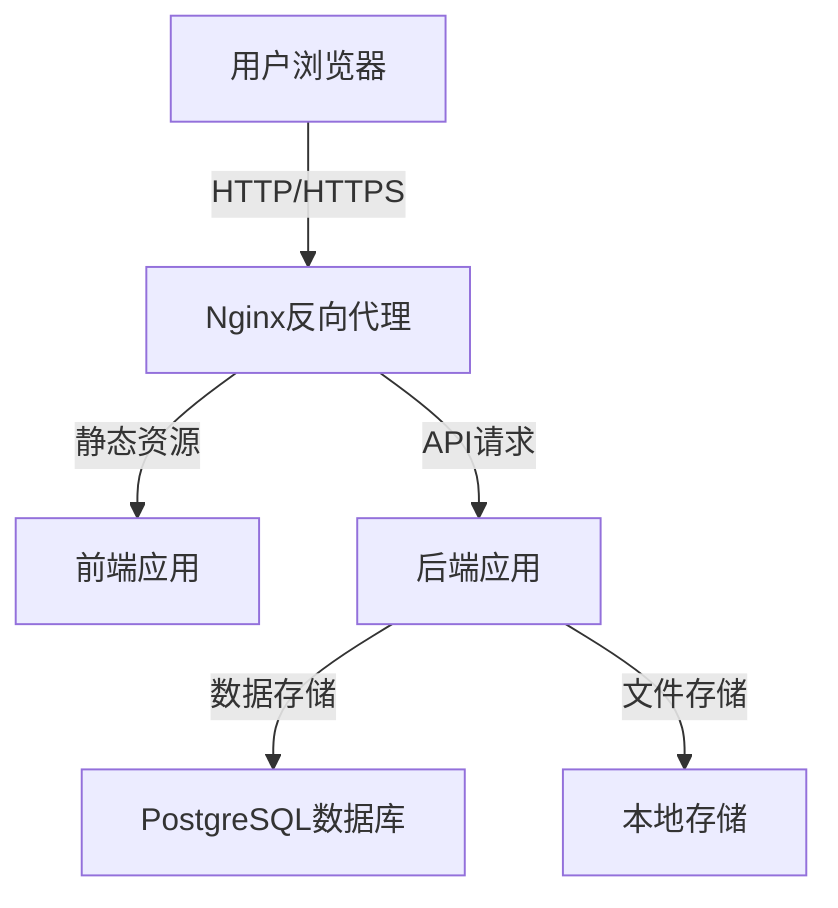
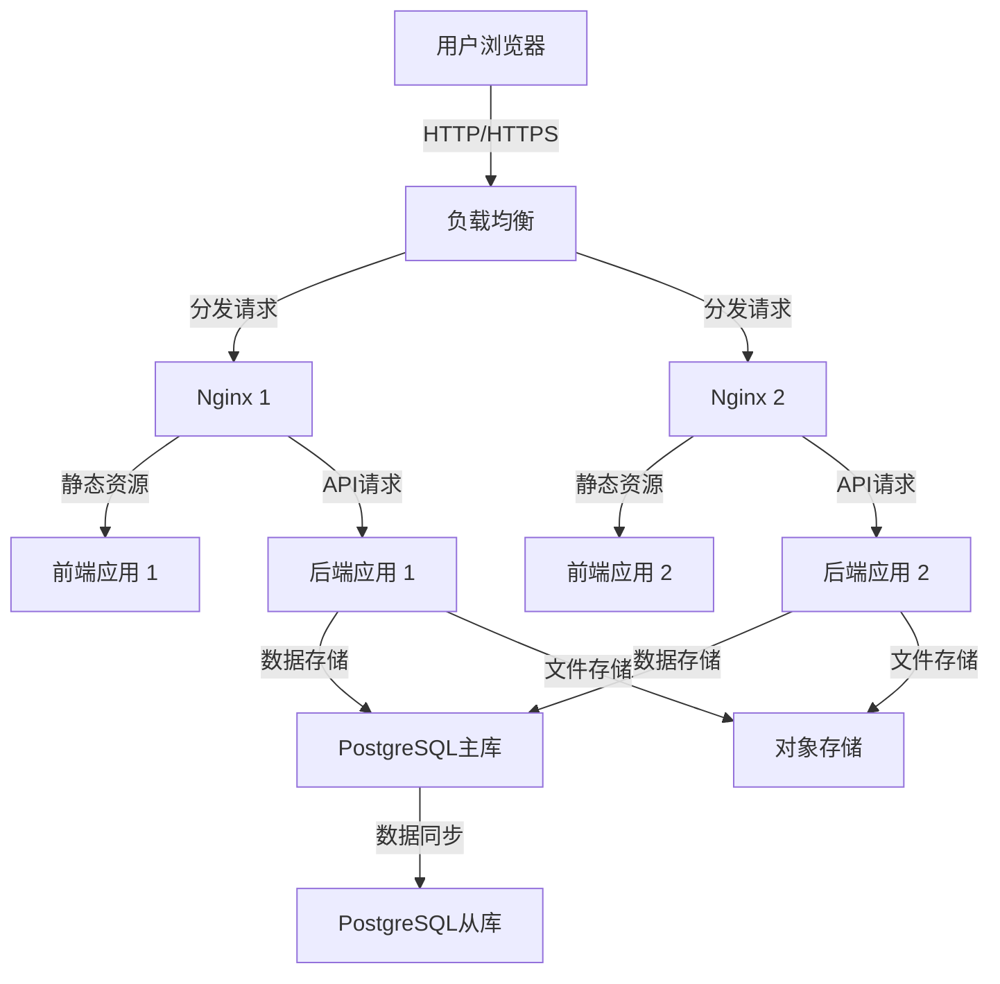

# 云服务与部署规范

## 1. 技能概述

本技能提供了家族树应用的云服务与部署规范，包括云服务选型、部署架构、基础设施管理、成本优化等方面。通过本规范，开发者可以选择合适的云服务，构建可靠、可扩展的部署架构。

## 2. 云服务选型

### 2.1 云服务提供商

| 提供商 | 优势 | 劣势 | 适用场景 |
|--------|------|------|----------|
| **阿里云** | 国内访问速度快，稳定性好，服务丰富 | 国际访问速度一般 | 国内用户为主的应用 |
| **腾讯云** | 国内访问速度快，价格实惠，服务丰富 | 国际访问速度一般 | 国内用户为主的应用 |
| **华为云** | 安全性高，服务稳定，政府项目支持 | 价格较高 | 企业级应用，政府项目 |
| **AWS** | 全球覆盖，服务丰富，技术领先 | 国内访问速度慢，价格高 | 国际用户为主的应用 |
| **Azure** | 全球覆盖，企业级服务，集成Microsoft生态 | 国内访问速度慢，价格高 | 企业级应用，Microsoft生态 |
| **Google Cloud** | 技术领先，AI服务强大，全球覆盖 | 国内访问速度慢，价格高 | 国际用户为主的应用，AI相关 |

### 2.2 推荐方案

**方案1：阿里云轻量应用服务器**
- **配置**：2核2G内存，20GB SSD，200Mbps带宽
- **价格**：约38元/年（限时秒杀）
- **适用场景**：个人项目，小型应用

**方案2：阿里云ECS服务器**
- **配置**：2核4G内存，40GB SSD，公网IP
- **价格**：约100元/月
- **适用场景**：企业级应用，高流量网站

**方案3：腾讯云轻量应用服务器**
- **配置**：2核2G内存，40GB SSD，100Mbps带宽
- **价格**：约60元/年
- **适用场景**：个人项目，小型应用

## 3. 部署架构

### 3.1 单服务器架构

#### 3.1.1 架构图


#### 3.1.2 适用场景
- 小型应用，访问量低
- 预算有限
- 开发和测试环境

### 3.2 多服务器架构

#### 3.2.1 架构图


#### 3.2.2 适用场景
- 大型应用，访问量高
- 高可用性要求
- 企业级应用

## 4. 云服务配置

### 4.1 服务器配置

#### 4.1.1 轻量应用服务器配置
- **操作系统**：Ubuntu 22.04 LTS
- **CPU**：2核
- **内存**：2GB
- **存储**：20GB SSD
- **带宽**：200Mbps
- **公网IP**：1个

#### 4.1.2 ECS服务器配置
- **操作系统**：Ubuntu 22.04 LTS
- **CPU**：2核
- **内存**：4GB
- **存储**：40GB SSD
- **带宽**：1Mbps
- **公网IP**：1个

### 4.2 网络配置

#### 4.2.1 安全组配置
- **入站规则**：
  - SSH (22)：允许特定IP访问
  - HTTP (80)：允许所有IP访问
  - HTTPS (443)：允许所有IP访问
  - 数据库 (5432)：仅允许应用服务器访问
- **出站规则**：
  - 允许所有出站流量

#### 4.2.2 域名配置
- **域名注册**：阿里云域名注册
- **域名解析**：
  - A记录：将域名指向服务器IP
  - CNAME记录：将子域名指向主域名
- **SSL证书**：Let's Encrypt免费证书

### 4.3 存储配置

#### 4.3.1 数据库存储
- **PostgreSQL**：使用云数据库RDS或自建
- **备份**：自动备份，保留7天
- **监控**：启用数据库监控

#### 4.3.2 文件存储
- **对象存储**：阿里云OSS，腾讯云COS
- **本地存储**：服务器本地磁盘
- **备份**：定期备份到对象存储

## 5. 部署流程

### 5.1 环境准备

#### 5.1.1 服务器初始化
```bash
# 更新系统
apt update && apt upgrade -y

# 安装必要软件
apt install -y docker.io docker-compose nginx certbot python3-certbot-nginx

# 启动Docker
systemctl start docker
systemctl enable docker

# 创建项目目录
mkdir -p /opt/familytree
cd /opt/familytree
```

#### 5.1.2 代码部署
```bash
# 克隆代码
git clone https://github.com/yourusername/study-ai-myapp-fimaly.git .

# 构建后端
cd backend
mvn clean package -DskipTests

# 构建前端
cd ../frontend/web
npm install
npm run build
```

### 5.2 服务部署

#### 5.2.1 Docker Compose部署
```bash
# 启动服务
docker-compose up -d

# 查看服务状态
docker-compose ps

# 查看日志
docker-compose logs -f
```

#### 5.2.2 服务配置
- **Nginx配置**：配置反向代理
- **SSL证书**：申请并配置SSL证书
- **环境变量**：配置必要的环境变量

### 5.3 健康检查

#### 5.3.1 服务检查
```bash
# 检查后端服务
curl -s http://localhost:8080/actuator/health

# 检查前端服务
curl -s http://localhost

# 检查数据库
docker exec familytree-postgres pg_isready -U familytree
```

#### 5.3.2 监控配置
- 配置Prometheus监控
- 配置Grafana仪表盘
- 配置告警规则

## 6. 基础设施即代码

### 6.1 Terraform配置

#### 6.1.1 服务器配置
```hcl
# main.tf
provider "alicloud" {
  region = "cn-hangzhou"
}

resource "alicloud_instance" "familytree" {
  image_id           = "ubuntu_22_04_x64_20G_alibase_20230619.vhd"
  instance_type      = "ecs.t6-c2m2.large"
  security_group_ids = [alicloud_security_group.familytree.id]
  vswitch_id         = alicloud_vswitch.familytree.id
  system_disk {
    category = "cloud_ssd"
    size     = 40
  }
  internet_max_bandwidth_out = 1
  allocate_public_ip         = true
}

resource "alicloud_security_group" "familytree" {
  name        = "familytree-security-group"
  description = "Family Tree Security Group"
}

resource "alicloud_security_group_rule" "allow_ssh" {
  type              = "ingress"
  ip_protocol       = "tcp"
  nic_type          = "intranet"
  policy            = "accept"
  port_range        = "22/22"
  priority          = 1
  security_group_id = alicloud_security_group.familytree.id
  cidr_ip           = "0.0.0.0/0"
}

resource "alicloud_security_group_rule" "allow_http" {
  type              = "ingress"
  ip_protocol       = "tcp"
  nic_type          = "intranet"
  policy            = "accept"
  port_range        = "80/80"
  priority          = 1
  security_group_id = alicloud_security_group.familytree.id
  cidr_ip           = "0.0.0.0/0"
}

resource "alicloud_security_group_rule" "allow_https" {
  type              = "ingress"
  ip_protocol       = "tcp"
  nic_type          = "intranet"
  policy            = "accept"
  port_range        = "443/443"
  priority          = 1
  security_group_id = alicloud_security_group.familytree.id
  cidr_ip           = "0.0.0.0/0"
}

resource "alicloud_vpc" "familytree" {
  name       = "familytree-vpc"
  cidr_block = "192.168.0.0/16"
}

resource "alicloud_vswitch" "familytree" {
  vpc_id            = alicloud_vpc.familytree.id
  cidr_block        = "192.168.1.0/24"
  availability_zone = "cn-hangzhou-b"
}
```

### 6.2 Ansible配置

#### 6.2.1 服务器配置
```yaml
# playbook.yml
- name: Configure Family Tree Server
  hosts: familytree
  become: yes
  tasks:
    - name: Update system
      apt:
        update_cache: yes
        upgrade: yes

    - name: Install required packages
      apt:
        name:
          - docker.io
          - docker-compose
          - nginx
          - certbot
          - python3-certbot-nginx
        state: present

    - name: Start Docker service
      service:
        name: docker
        state: started
        enabled: yes

    - name: Create project directory
      file:
        path: /opt/familytree
        state: directory

    - name: Clone code
      git:
        repo: https://github.com/yourusername/study-ai-myapp-fimaly.git
        dest: /opt/familytree

    - name: Build backend
      shell:
        cmd: mvn clean package -DskipTests
        chdir: /opt/familytree/backend

    - name: Build frontend
      shell:
        cmd: npm install && npm run build
        chdir: /opt/familytree/frontend/web

    - name: Start services
      shell:
        cmd: docker-compose up -d
        chdir: /opt/familytree

    - name: Configure Nginx
      template:
        src: nginx.conf.j2
        dest: /etc/nginx/sites-available/familytree

    - name: Enable Nginx site
      file:
        src: /etc/nginx/sites-available/familytree
        dest: /etc/nginx/sites-enabled/familytree
        state: link

    - name: Restart Nginx
      service:
        name: nginx
        state: restarted

    - name: Obtain SSL certificate
      shell:
        cmd: certbot --nginx -d your-domain.com --non-interactive --agree-tos -m your-email@example.com
```

## 7. 成本优化

### 7.1 服务器优化

#### 7.1.1 实例选型
- **按需实例**：按实际使用付费
- **预留实例**：长期使用时选择，享受折扣
- **抢占式实例**：临时使用时选择，价格更低

#### 7.1.2 资源管理
- **自动扩缩容**：根据负载自动调整实例数量
- **资源监控**：监控资源使用情况，及时调整
- **闲置资源回收**：回收闲置资源

### 7.2 存储优化

#### 7.2.1 存储选型
- **对象存储**：存储静态文件，成本低
- **块存储**：存储数据库，性能好
- **文件存储**：存储共享文件

#### 7.2.2 存储管理
- **生命周期管理**：自动归档旧数据
- **压缩**：压缩存储数据
- ** deduplication**：去重存储

### 7.3 网络优化

#### 7.3.1 网络选型
- **内网通信**：使用内网通信，避免公网费用
- **CDN**：使用CDN加速静态资源
- **带宽管理**：合理设置带宽上限

#### 7.3.2 网络管理
- **流量监控**：监控网络流量
- **优化路由**：选择最优路由
- **避免跨区域流量**：减少跨区域流量费用

## 8. 高可用性设计

### 8.1 多可用区部署

#### 8.1.1 架构设计
- **多可用区**：部署在多个可用区
- **负载均衡**：跨可用区负载均衡
- **数据同步**：跨可用区数据同步

#### 8.1.2 故障转移
- **自动故障转移**：检测到故障时自动转移
- **手动故障转移**：手动触发故障转移
- **故障恢复**：故障恢复后自动切回

### 8.2 容灾备份

#### 8.2.1 数据备份
- **定期备份**：每日全量备份，每小时增量备份
- **跨区域备份**：备份到不同区域
- **备份验证**：定期验证备份可用性

#### 8.2.2 灾难恢复
- **灾难恢复计划**：制定详细的恢复计划
- **恢复演练**：定期进行恢复演练
- **恢复时间目标**：设定合理的恢复时间目标

## 9. 监控与维护

### 9.1 云服务监控

#### 9.1.1 监控指标
- **服务器指标**：CPU、内存、磁盘、网络
- **应用指标**：响应时间、错误率、QPS
- **数据库指标**：连接数、查询性能
- **存储指标**：存储使用率、IOPS

#### 9.1.2 监控工具
- **云监控**：使用云服务商提供的监控服务
- **Prometheus**：开源监控系统
- **Grafana**：指标可视化

### 9.2 维护计划

#### 9.2.1 日常维护
- **系统更新**：定期更新系统和软件
- **安全补丁**：及时应用安全补丁
- **日志清理**：定期清理日志
- **备份验证**：验证备份可用性

#### 9.2.2 定期维护
- **性能优化**：定期进行性能优化
- **安全审计**：定期进行安全审计
- **容量规划**：根据业务增长调整容量
- **灾备演练**：定期进行灾备演练

## 10. 最佳实践

1. **选择合适的云服务**：根据业务需求选择合适的云服务
2. **使用容器化**：使用Docker容器化部署，提高部署效率
3. **自动化部署**：使用CI/CD工具自动化部署
4. **监控先行**：在部署前配置监控
5. **安全第一**：配置安全组，使用HTTPS
6. **成本优化**：合理使用云资源，优化成本
7. **高可用性**：设计高可用架构，提高系统可靠性
8. **灾难恢复**：制定完善的灾难恢复计划
9. **基础设施即代码**：使用Terraform、Ansible等工具管理基础设施
10. **持续改进**：不断优化部署架构和流程

## 11. 常见问题及解决方案

| 问题 | 原因 | 解决方案 |
|------|------|----------|
| 服务器访问慢 | 带宽不足 | 升级带宽，使用CDN |
| 数据库性能差 | 配置不合理 | 优化数据库配置，添加索引 |
| 服务不可用 | 资源不足 | 增加资源，优化配置 |
| 成本过高 | 资源浪费 | 优化资源使用，使用预留实例 |
| 安全漏洞 | 配置不当 | 加强安全配置，定期安全审计 |

## 12. 总结

本云服务与部署规范提供了全面的云服务选型和部署指南，包括云服务提供商选择、部署架构设计、基础设施配置、部署流程、成本优化、高可用性设计和监控维护等方面。通过遵循本规范，开发者可以选择合适的云服务，构建可靠、可扩展的部署架构，确保系统的稳定运行。

云服务和部署是一个持续优化的过程，需要根据业务需求和技术发展不断调整和改进。开发者应该保持学习，关注最新的云服务和部署技术，不断提高部署水平。