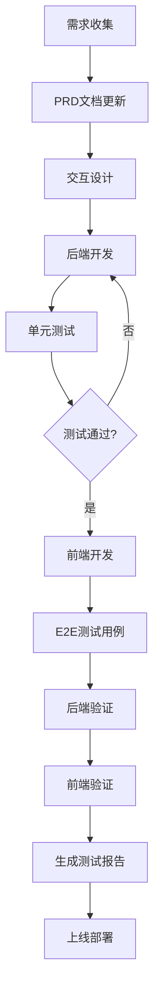

# 项目功能新增流程规范

## 1. 文档概述

本文档定义了家庭族谱项目新增功能的标准开发流程，确保所有功能开发遵循统一的规范，保证代码质量和可维护性。

---

## 2. 功能新增流程总览

```
需求收集 → PRD文档更新 → 交互设计 → 后端开发 → 前端开发 → 测试验证 → 测试报告 → 上线部署
```

---

## 3. 详细流程说明

### 3.1 阶段一：需求收集与PRD更新

**责任人**：产品经理

**输出物**：更新后的PRD文档

**流程步骤**：

| 步骤 | 操作内容 | 说明 |
|------|----------|------|
| 1 | 需求收集 | 收集业务需求、用户反馈、竞品分析结果 |
| 2 | 需求评审 | 组织技术团队进行需求评审 |
| 3 | PRD文档更新 | 在 `docs/prd/prd.md` 中添加新功能描述 |
| 4 | 功能优先级评估 | 确定功能优先级（P0/P1/P2） |

**PRD文档更新规范**：
- 在「功能完成情况」表格中添加新功能条目
- 包含功能ID、功能名称、功能描述、优先级、计划完成时间
- 更新整体完成度统计

---

### 3.2 阶段二：交互设计文档更新

**责任人**：UI/UX设计师

**输出物**：交互设计文档

**流程步骤**：

| 步骤 | 操作内容 | 说明 |
|------|----------|------|
| 1 | 页面设计 | 设计新功能的页面布局和交互方式 |
| 2 | 交互文档编写 | 更新或新增交互说明文档 |
| 3 | 设计评审 | 组织技术团队进行设计评审 |

**交互文档位置**：`docs/interaction-flow/`

---

### 3.3 阶段三：后端代码开发

**责任人**：后端开发工程师

**输出物**：后端代码、单元测试代码

**流程步骤**：

| 步骤 | 操作内容 | 说明 |
|------|----------|------|
| 1 | 接口设计 | 设计RESTful API接口 |
| 2 | 数据模型设计 | 设计数据库表结构 |
| 3 | Controller层开发 | 编写API控制层代码 |
| 4 | Service层开发 | 编写业务逻辑层代码 |
| 5 | Repository层开发 | 编写数据访问层代码 |
| 6 | 单元测试编写 | 编写单元测试用例 |

**代码规范**：
- 代码位置：`backend/src/main/java/com/familytree/`
- 测试位置：`backend/src/test/java/com/familytree/`
- 遵循Spring Boot编码规范
- 方法注释覆盖率≥80%

---

### 3.4 阶段四：前端代码开发

**责任人**：前端开发工程师

**输出物**：前端代码、测试用例

**流程步骤**：

| 步骤 | 操作内容 | 说明 |
|------|----------|------|
| 1 | 页面组件开发 | 编写Vue组件 |
| 2 | 状态管理 | 使用Pinia管理状态 |
| 3 | API集成 | 调用后端API接口 |
| 4 | 路由配置 | 配置Vue Router |
| 5 | 测试用例编写 | 编写E2E测试用例 |

**代码规范**：
- 代码位置：`frontend/web/src/`
- 测试位置：`frontend/web/tests/`
- 遵循Vue 3编码规范
- 使用Tailwind CSS进行样式开发

---

### 3.5 阶段五：后端代码验证

**责任人**：后端开发工程师/测试工程师

**验证方式**：

| 验证类型 | 方法 | 工具 |
|----------|------|------|
| 单元测试 | 运行JUnit测试 | `mvn test` |
| 集成测试 | 运行集成测试 | `mvn test -Dtest=*IntegrationTest` |
| API测试 | 使用Swagger UI测试 | http://localhost:8080/swagger-ui.html |
| 代码覆盖率 | 生成Jacoco报告 | `mvn test jacoco:report` |

**验证标准**：
- 单元测试覆盖率≥80%
- 所有测试用例通过
- API响应时间<500ms

---

### 3.6 阶段六：前端代码测试验证

**责任人**：前端开发工程师/测试工程师

**验证方式**：

| 验证类型 | 方法 | 工具 |
|----------|------|------|
| 页面功能测试 | 实际操作验证 | 浏览器/Selenium |
| E2E测试 | 运行Playwright测试 | `npm test` |
| 代码质量检查 | ESLint检查 | `npm run lint` |

**验证步骤**：

1. **启动前端服务**：
   ```bash
   cd frontend/web
   npm install
   npm run dev
   ```

2. **启动后端服务**：
   ```bash
   cd backend
   mvn spring-boot:run
   ```

3. **功能验证清单**：
   - 页面是否正常加载
   - 表单验证是否正常
   - 按钮交互是否正常
   - API调用是否成功
   - 页面跳转是否正确
   - 数据展示是否正确

---

### 3.7 阶段七：测试报告生成

**责任人**：测试工程师

**输出物**：测试报告文档

**报告内容结构**：

```
1. 测试概述
   - 测试范围
   - 测试环境
   - 测试时间

2. 测试用例清单
   - 功能模块
   - 测试用例名称
   - 测试步骤
   - 预期结果
   - 实际结果
   - 状态（通过/失败/跳过）

3. 问题清单
   - 问题ID
   - 问题描述
   - 严重程度（高/中/低）
   - 复现步骤
   - 关联模块
   - 状态（待修复/已修复/已关闭）

4. 测试总结
   - 测试覆盖率
   - 通过率
   - 遗留问题说明
```

**报告位置**：`docs/testing/TEST_REPORT.md`

---

## 4. 工具链说明

| 工具 | 用途 | 版本要求 |
|------|------|----------|
| Maven | 后端构建工具 | 3.8+ |
| Node.js | 前端运行环境 | 18+ |
| Vite | 前端构建工具 | 8.0+ |
| Playwright | E2E测试框架 | 1.40+ |
| Jacoco | 代码覆盖率工具 | 0.8+ |
| ESLint | 前端代码检查 | 8.0+ |

---

## 5. 流程图



---

## 6. 版本历史

| 版本 | 更新日期 | 更新内容 | 作者 |
|------|----------|----------|------|
| 1.0 | 2026-05-11 | 初始版本 | 系统管理员 |

---

## 附录：测试报告模板

### 测试报告

**报告编号**：TEST-YYYYMMDD-XXX

**测试范围**：[功能模块名称]

**测试环境**：
- 前端：http://localhost:5173
- 后端：http://localhost:8080
- 数据库：H2/MySQL

**测试时间**：YYYY-MM-DD

---

#### 一、测试用例清单

| 序号 | 测试用例名称 | 测试步骤 | 预期结果 | 实际结果 | 状态 |
|------|--------------|----------|----------|----------|------|
| 1 | 登录功能-成功登录 | 1. 输入正确邮箱密码<br>2. 点击登录 | 跳转到首页 | 跳转到首页 | ✅ 通过 |
| 2 | 登录功能-失败登录 | 1. 输入错误密码<br>2. 点击登录 | 显示错误提示 | 显示错误提示 | ✅ 通过 |

---

#### 二、问题清单

| 问题ID | 问题描述 | 严重程度 | 复现步骤 | 关联模块 | 状态 |
|--------|----------|----------|----------|----------|------|
| P001 | 登录页面密码输入框未显示密码强度 | 中 | 1. 进入登录页<br>2. 输入密码 | 登录模块 | 待修复 |

---

#### 三、测试总结

- **测试覆盖率**：XX%
- **测试通过率**：XX%
- **遗留问题**：X个
- **建议**：[改进建议]