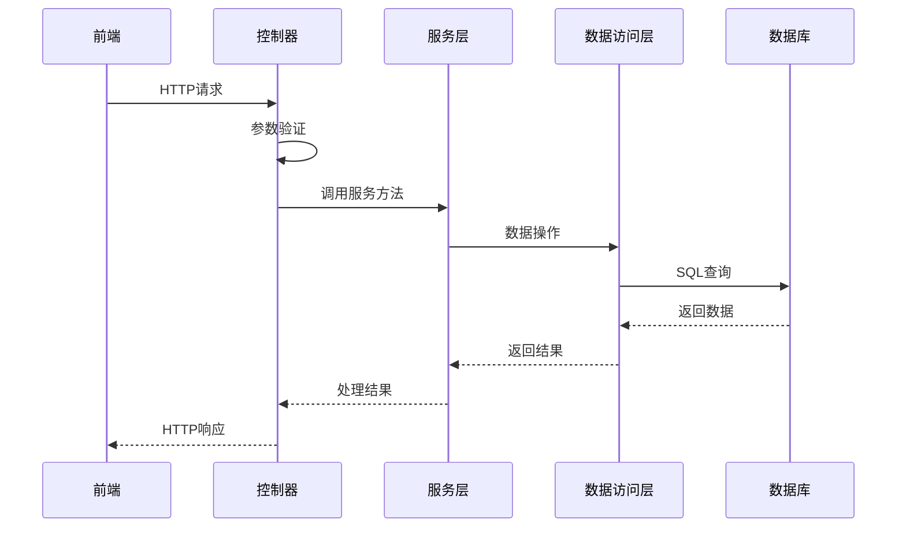

# 家庭族谱APP后端实现方案

## 1. 技术选型

### 1.1 核心框架

- **Spring Boot**：2.5+，提供快速开发和自动配置
- **Spring MVC**：处理HTTP请求和响应
- **Spring Security**：提供认证和授权功能
- **Spring Data JPA**：简化数据库操作

### 1.2 数据库

- **MySQL**：8.0+，关系型数据库，适合存储结构化数据
- **Redis**：用于缓存和会话管理

### 1.3 其他技术

- **JWT**：用于无状态认证
- **Lombok**：简化Java代码
- **MapStruct**：对象映射
- **Swagger**：API文档生成
- **Maven**：项目构建和依赖管理

## 2. 架构设计

### 2.1 分层架构

- **Controller层**：处理HTTP请求，参数验证，返回响应
- **Service层**：业务逻辑处理
- **Repository层**：数据访问，与数据库交互
- **Model层**：数据模型，对应数据库表结构
- **DTO层**：数据传输对象，用于前后端数据交互

### 2.2 模块划分

```
com.familytree
├── config          # 配置类
├── controller      # 控制器
├── service         # 服务层
├── repository      # 数据访问层
├── model           # 数据模型
├── dto             # 数据传输对象
├── exception       # 异常处理
├── util            # 工具类
└── security        # 安全相关
```

### 2.3 核心流程图



## 3. 核心功能实现

### 3.1 用户管理

#### 3.1.1 用户注册

- **API**：`POST /api/auth/register`
- **请求体**：
  ```json
  {
    "username": "string",
    "email": "string",
    "password": "string"
  }
  ```
- **响应**：
  ```json
  {
    "id": "long",
    "username": "string",
    "email": "string",
    "token": "string"
  }
  ```
- **实现逻辑**：
  1. 验证请求参数
  2. 检查用户是否已存在
  3. 密码加密
  4. 创建用户
  5. 生成JWT token
  6. 返回用户信息和token

#### 3.1.2 用户登录

- **API**：`POST /api/auth/login`
- **请求体**：
  ```json
  {
    "email": "string",
    "password": "string"
  }
  ```
- **响应**：
  ```json
  {
    "id": "long",
    "username": "string",
    "email": "string",
    "token": "string"
  }
  ```
- **实现逻辑**：
  1. 验证请求参数
  2. 检查用户是否存在
  3. 验证密码
  4. 生成JWT token
  5. 返回用户信息和token

### 3.2 家族管理

#### 3.2.1 创建家族

- **API**：`POST /api/families`
- **请求体**：
  ```json
  {
    "name": "string",
    "description": "string",
    "avatar": "string"
  }
  ```
- **响应**：
  ```json
  {
    "id": "long",
    "name": "string",
    "description": "string",
    "avatar": "string",
    "createdAt": "string",
    "creatorId": "long"
  }
  ```
- **实现逻辑**：
  1. 验证请求参数
  2. 创建家族
  3. 设置创建者权限
  4. 返回家族信息

#### 3.2.2 邀请成员

- **API**：`POST /api/families/{familyId}/invite`
- **请求体**：
  ```json
  {
    "email": "string",
    "role": "string"
  }
  ```
- **响应**：
  ```json
  {
    "status": "success",
    "message": "邀请已发送"
  }
  ```
- **实现逻辑**：
  1. 验证请求参数
  2. 检查用户是否存在
  3. 检查邀请者权限
  4. 创建邀请记录
  5. 发送邀请邮件
  6. 返回响应

### 3.3 成员管理

#### 3.3.1 添加成员

- **API**：`POST /api/members`
- **请求体**：
  ```json
  {
    "familyId": "long",
    "name": "string",
    "gender": "string",
    "birthDate": "string",
    "deathDate": "string",
    "photo": "string",
    "details": "string",
    "phone": "string",
    "email": "string"
  }
  ```
- **响应**：
  ```json
  {
    "id": "long",
    "familyId": "long",
    "name": "string",
    "gender": "string",
    "birthDate": "string",
    "deathDate": "string",
    "photo": "string",
    "details": "string",
    "phone": "string",
    "email": "string"
  }
  ```
- **实现逻辑**：
  1. 验证请求参数
  2. 检查用户权限
  3. 创建成员
  4. 返回成员信息

#### 3.3.2 获取成员列表

- **API**：`GET /api/members/family?familyId=1`
- **响应**：
  ```json
  [
    {
      "id": "long",
      "familyId": "long",
      "name": "string",
      "gender": "string",
      "birthDate": "string",
      "deathDate": "string",
      "photo": "string",
      "details": "string",
      "phone": "string",
      "email": "string"
    }
  ]
  ```
- **实现逻辑**：
  1. 验证查询参数
  2. 检查用户权限
  3. 根据familyId查询成员列表
  4. 返回成员列表

#### 3.3.3 更新成员

- **API**：`PUT /api/members/{memberId}`
- **请求体**：
  ```json
  {
    "name": "string",
    "gender": "string",
    "birthDate": "string",
    "deathDate": "string",
    "photo": "string",
    "details": "string",
    "phone": "string",
    "email": "string"
  }
  ```
- **响应**：
  ```json
  {
    "id": "long",
    "familyId": "long",
    "name": "string",
    "gender": "string",
    "birthDate": "string",
    "deathDate": "string",
    "photo": "string",
    "details": "string",
    "phone": "string",
    "email": "string"
  }
  ```
- **实现逻辑**：
  1. 验证请求参数
  2. 检查用户权限
  3. 更新成员信息
  4. 返回更新后的成员信息

### 3.4 家族树

#### 3.4.1 获取家族树

- **API**：`GET /api/families/{familyId}/tree`
- **响应**：
  ```json
  {
    "root": {
      "id": "long",
      "name": "string",
      "gender": "string",
      "children": [
        {
          "id": "long",
          "name": "string",
          "gender": "string",
          "children": []
        }
      ]
    }
  }
  ```
- **实现逻辑**：
  1. 检查用户权限
  2. 获取家族成员
  3. 构建家族树结构
  4. 返回家族树

### 3.5 历史记录

#### 3.5.1 添加历史事件

- **API**：`POST /api/families/{familyId}/events`
- **请求体**：
  ```json
  {
    "title": "string",
    "description": "string",
    "date": "string",
    "relatedMembers": ["long"],
    "photo": "string"
  }
  ```
- **响应**：
  ```json
  {
    "id": "long",
    "title": "string",
    "description": "string",
    "date": "string",
    "relatedMembers": ["long"],
    "photo": "string"
  }
  ```
- **实现逻辑**：
  1. 验证请求参数
  2. 检查用户权限
  3. 创建历史事件
  4. 返回事件信息

### 3.6 多媒体管理

#### 3.6.1 上传媒体

- **API**：`POST /api/families/{familyId}/media`
- **请求体**：multipart/form-data
- **响应**：
  ```json
  {
    "id": "long",
    "type": "string",
    "url": "string",
    "description": "string",
    "uploadedAt": "string",
    "uploaderId": "long"
  }
  ```
- **实现逻辑**：
  1. 验证请求参数
  2. 检查用户权限
  3. 上传文件到对象存储
  4. 创建媒体记录
  5. 返回媒体信息

## 4. 数据库设计

### 4.1 核心表结构

#### 4.1.1 用户表 (`users`)

| 字段名 | 数据类型 | 约束 | 描述 |
|-------|---------|------|------|
| `id` | `BIGINT` | `PRIMARY KEY AUTO_INCREMENT` | 用户ID |
| `username` | `VARCHAR(50)` | `NOT NULL` | 用户名 |
| `email` | `VARCHAR(100)` | `UNIQUE NOT NULL` | 邮箱 |
| `password` | `VARCHAR(100)` | `NOT NULL` | 密码（加密） |
| `avatar` | `VARCHAR(255)` | | 头像URL |
| `created_at` | `TIMESTAMP` | `DEFAULT CURRENT_TIMESTAMP` | 创建时间 |
| `updated_at` | `TIMESTAMP` | `DEFAULT CURRENT_TIMESTAMP ON UPDATE CURRENT_TIMESTAMP` | 更新时间 |

#### 4.1.2 家族表 (`families`)

| 字段名 | 数据类型 | 约束 | 描述 |
|-------|---------|------|------|
| `id` | `BIGINT` | `PRIMARY KEY AUTO_INCREMENT` | 家族ID |
| `name` | `VARCHAR(100)` | `NOT NULL` | 家族名称 |
| `description` | `TEXT` | | 家族描述 |
| `avatar` | `VARCHAR(255)` | | 家族头像URL |
| `created_at` | `TIMESTAMP` | `DEFAULT CURRENT_TIMESTAMP` | 创建时间 |
| `creator_id` | `BIGINT` | `REFERENCES users(id)` | 创建者ID |

#### 4.1.3 成员表 (`members`)

| 字段名 | 数据类型 | 约束 | 描述 |
|-------|---------|------|------|
| `id` | `BIGINT` | `PRIMARY KEY AUTO_INCREMENT` | 成员ID |
| `family_id` | `BIGINT` | `REFERENCES families(id)` | 家族ID |
| `name` | `VARCHAR(50)` | `NOT NULL` | 成员姓名 |
| `gender` | `VARCHAR(10)` | `NOT NULL` | 性别 |
| `birth_date` | `DATE` | | 出生日期 |
| `death_date` | `DATE` | | 去世日期 |
| `photo` | `VARCHAR(255)` | | 照片URL |
| `details` | `TEXT` | | 详细信息 |

#### 4.1.4 关系表 (`relationships`)

| 字段名 | 数据类型 | 约束 | 描述 |
|-------|---------|------|------|
| `id` | `BIGINT` | `PRIMARY KEY AUTO_INCREMENT` | 关系ID |
| `member_id1` | `BIGINT` | `REFERENCES members(id)` | 成员1 ID |
| `member_id2` | `BIGINT` | `REFERENCES members(id)` | 成员2 ID |
| `relationship_type` | `VARCHAR(20)` | `NOT NULL` | 关系类型（如父子、夫妻等） |

#### 4.1.5 历史事件表 (`events`)

| 字段名 | 数据类型 | 约束 | 描述 |
|-------|---------|------|------|
| `id` | `BIGINT` | `PRIMARY KEY AUTO_INCREMENT` | 事件ID |
| `family_id` | `BIGINT` | `REFERENCES families(id)` | 家族ID |
| `title` | `VARCHAR(100)` | `NOT NULL` | 事件标题 |
| `description` | `TEXT` | | 事件描述 |
| `date` | `DATE` | | 发生日期 |
| `photo` | `VARCHAR(255)` | | 照片URL |
| `created_at` | `TIMESTAMP` | `DEFAULT CURRENT_TIMESTAMP` | 创建时间 |

#### 4.1.6 多媒体表 (`media`)

| 字段名 | 数据类型 | 约束 | 描述 |
|-------|---------|------|------|
| `id` | `BIGINT` | `PRIMARY KEY AUTO_INCREMENT` | 媒体ID |
| `family_id` | `BIGINT` | `REFERENCES families(id)` | 家族ID |
| `type` | `VARCHAR(20)` | `NOT NULL` | 媒体类型（如照片、视频等） |
| `url` | `VARCHAR(255)` | `NOT NULL` | 媒体URL |
| `description` | `TEXT` | | 描述 |
| `uploaded_at` | `TIMESTAMP` | `DEFAULT CURRENT_TIMESTAMP` | 上传时间 |
| `uploader_id` | `BIGINT` | `REFERENCES users(id)` | 上传者ID |

#### 4.1.7 权限表 (`permissions`)

| 字段名 | 数据类型 | 约束 | 描述 |
|-------|---------|------|------|
| `id` | `BIGINT` | `PRIMARY KEY AUTO_INCREMENT` | 权限ID |
| `user_id` | `BIGINT` | `REFERENCES users(id)` | 用户ID |
| `family_id` | `BIGINT` | `REFERENCES families(id)` | 家族ID |
| `role` | `VARCHAR(20)` | `NOT NULL` | 角色（如管理员、成员等） |

## 5. 安全设计

### 5.1 认证

- **JWT认证**：使用JSON Web Token进行无状态认证
- **密码加密**：使用BCrypt对密码进行加密存储
- **Token过期**：设置合理的token过期时间
- **Refresh Token**：支持token刷新

### 5.2 授权

- **基于角色的访问控制**：不同角色拥有不同的权限
- **权限检查**：在控制器层使用注解进行权限验证
- **资源级权限**：确保用户只能访问自己有权限的资源

### 5.3 防止安全漏洞

- **SQL注入**：使用JPA和参数化查询
- **XSS攻击**：对输入进行验证和转义
- **CSRF攻击**：使用CSRF令牌
- **敏感信息泄露**：不在响应中返回敏感信息
- **日志安全**：不在日志中记录敏感信息

## 6. 性能优化

### 6.1 数据库优化

- **索引**：为常用查询字段创建索引
- **分页**：对列表查询使用分页
- **批量操作**：减少数据库操作次数
- **缓存**：使用Redis缓存热点数据

### 6.2 API优化

- **响应压缩**：启用HTTP响应压缩
- **请求缓存**：对GET请求进行缓存
- **异步处理**：对耗时操作使用异步处理
- **限流**：防止API被滥用

### 6.3 代码优化

- **懒加载**：使用JPA的懒加载功能
- **连接池**：使用数据库连接池
- **线程池**：使用线程池处理并发请求
- **资源释放**：确保资源正确释放

## 7. 部署与运维

### 7.1 部署方式

- **容器化**：使用Docker容器部署
- **CI/CD**：使用Jenkins或GitHub Actions进行持续集成和部署
- **环境分离**：开发、测试、生产环境分离

### 7.2 监控与日志

- **日志管理**：使用ELK Stack收集和分析日志
- **监控**：使用Prometheus和Grafana监控系统状态
- **告警**：设置关键指标告警

### 7.3 备份与恢复

- **数据备份**：定期备份数据库
- **灾难恢复**：制定灾难恢复计划
- **版本控制**：使用Git进行代码版本控制

## 8. 测试策略

### 8.1 单元测试

- **测试框架**：使用JUnit 5和Mockito
- **测试覆盖率**：目标覆盖率80%以上
- **测试重点**：Service层和关键工具类

### 8.2 集成测试

- **测试框架**：使用Spring Boot Test
- **测试内容**：API接口、数据库操作、安全认证
- **测试环境**：使用H2内存数据库

### 8.3 性能测试

- **测试工具**：使用JMeter或Gatling
- **测试场景**：并发请求、大数据量操作
- **性能指标**：响应时间、吞吐量、资源使用率

## 9. 开发规范

### 9.1 代码规范

- **命名规范**：使用驼峰命名法
- **代码风格**：遵循Spring Boot代码风格
- **注释规范**：关键代码添加注释
- **代码审查**：进行代码审查

### 9.2 文档规范

- **API文档**：使用Swagger生成API文档
- **技术文档**：维护技术文档
- **变更记录**：记录代码变更

### 9.3 版本控制

- **分支策略**：使用Git Flow
- **提交规范**：遵循Conventional Commits
- **版本号**：使用语义化版本

## 10. 总结

本方案使用Spring Boot作为后端框架，MySQL作为数据库，实现了家庭族谱APP的核心功能。通过分层架构和模块化设计，确保了代码的可维护性和可扩展性。同时，注重安全性和性能优化，为用户提供稳定、高效的服务。

后续可以考虑：
- 增加更多社交功能，如家族成员之间的消息通知
- 集成第三方服务，如基因检测、家族DNA分析
- 开发更多数据可视化功能，如家族统计分析
- 支持多语言和国际化