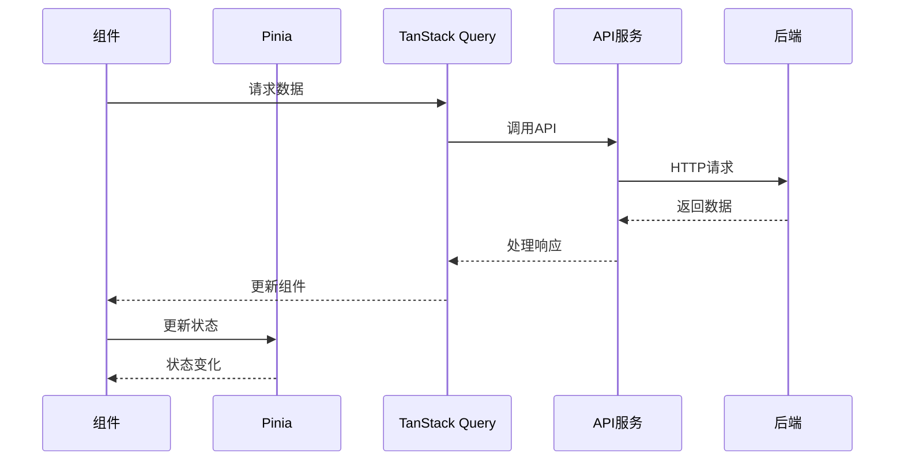
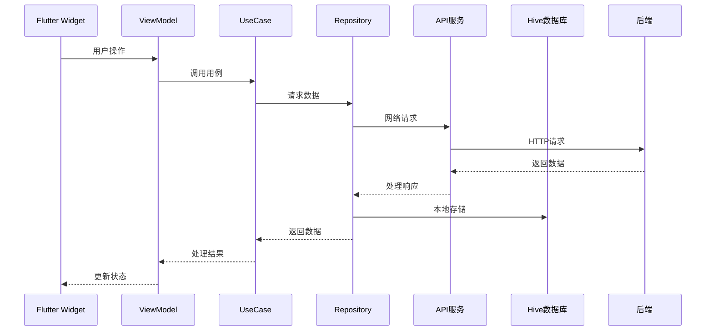

# 家庭族谱APP前端实现方案

## 1. Web前端实现方案

### 1.1 技术选型

#### 1.1.1 核心框架

- **Vue**：3+，用于构建用户界面的JavaScript框架
- **Vue Router**：用于路由管理
- **Pinia**：用于状态管理
- **Axios**：用于HTTP请求
- **Tailwind CSS**：用于样式管理
- **Vue Transition**：用于动画效果

#### 1.1.2 工具库

- **VeeValidate**：用于表单处理
- **TanStack Query**：用于数据获取和缓存
- **D3.js**：用于家族树可视化
- **Day.js**：用于日期处理
- **Element Plus**：用于UI组件

#### 1.1.3 构建工具

- **Vite**：用于项目构建和开发服务器
- **ESLint**：用于代码质量检查
- **Prettier**：用于代码格式化

### 1.2 架构设计

#### 1.2.1 组件结构

```
src/
├── components/        # 可复用组件
│   ├── layout/        # 布局组件
│   ├── common/        # 通用组件
│   └── features/      # 功能组件
├── views/             # 页面组件
├── composables/       # 自定义组合式函数
├── services/          # API服务
├── stores/            # Pinia状态管理
├── utils/             # 工具函数
├── styles/            # 全局样式
└── App.vue            # 应用入口
```

#### 1.2.2 状态管理

- **Pinia**：管理全局状态，如用户信息、家族信息等
- **Vue Reactive**：管理局部状态，如表单状态等
- **TanStack Query**：管理服务器状态，如API响应数据

#### 1.2.3 数据流



### 1.3 核心功能实现

#### 1.3.1 用户认证

- **登录/注册页面**：使用VeeValidate处理表单，Axios发送请求
- **JWT管理**：使用localStorage存储token，Axios拦截器处理认证
- **权限控制**：使用路由守卫实现权限控制

#### 1.3.2 家族树可视化

- **D3.js**：实现家族树的可视化展示
- **交互功能**：支持缩放、平移、点击查看详情
- **数据处理**：将后端返回的扁平数据转换为树形结构

#### 1.3.3 成员管理

- **成员列表**：使用TanStack Query获取数据，支持分页和搜索
- **成员详情**：展示成员详细信息，支持编辑
- **添加成员**：使用表单收集成员信息，发送到后端

#### 1.3.4 历史记录

- **时间轴展示**：使用自定义组件实现时间轴
- **事件管理**：支持添加、编辑、删除历史事件
- **相关成员**：关联事件与家族成员

#### 1.3.5 多媒体管理

- **文件上传**：使用原生文件上传API实现文件上传
- **媒体展示**：使用网格布局展示媒体文件
- **分类管理**：支持按类型、日期等筛选

### 1.4 响应式设计

- **Tailwind CSS**：使用响应式类实现不同屏幕尺寸的适配
- **断点设置**：
  - 移动设备：< 640px
  - 平板设备：640px - 1024px
  - 桌面设备：> 1024px
- **布局调整**：根据屏幕尺寸调整布局和组件大小

### 1.5 性能优化

- **代码分割**：使用动态导入实现代码分割
- **虚拟滚动**：对长列表使用虚拟滚动
- **缓存策略**：使用TanStack Query的缓存功能
- **图片优化**：使用适当尺寸的图片，支持懒加载
- **减少重渲染**：使用Vue的响应式系统和computed属性

## 2. Flutter移动端实现方案

### 2.1 技术选型

#### 2.1.1 核心框架

- **Flutter**：跨平台UI框架
- **Dart**：开发语言
- **Provider**：状态管理
- **Riverpod**：现代化状态管理
- **Hive**：本地数据库
- **Dio**：网络请求

#### 2.1.2 工具库

- **Flutter Bloc**：状态管理
- **GetX**：路由和依赖注入
- **CachedNetworkImage**：图片加载和缓存
- **Flutter SVG**：SVG图标支持
- **Permission Handler**：权限管理

#### 2.1.3 构建工具

- **Flutter CLI**：项目构建
- **Android Studio/VS Code**：开发环境

### 2.2 架构设计

#### 2.2.1 组件结构

```
lib/
├── widgets/           # 可复用组件
├── screens/           # 页面组件
├── navigation/        # 导航
├── theme/             # 主题
├── data/              # 数据层
│   ├── api/           # API服务
│   ├── database/      # 本地数据库
│   └── repository/    # 数据仓库
├── domain/            # 业务逻辑
│   ├── models/        # 数据模型
│   └── usecases/      # 用例
├── utils/             # 工具函数
└── main.dart          # 应用入口
```

#### 2.2.2 架构模式

- **MVVM**：Model-View-ViewModel架构
- **Repository模式**：统一数据访问接口
- **UseCase模式**：封装业务逻辑

#### 2.2.3 数据流



### 2.3 核心功能实现

#### 2.3.1 用户认证

- **登录/注册**：使用Flutter表单组件，Dio发送请求
- **Token管理**：使用SharedPreferences存储token
- **会话管理**：应用启动时检查token有效性

#### 2.3.2 家族树可视化

- **Custom Painter**：实现家族树的可视化展示
- **触摸交互**：支持缩放、平移、点击操作
- **数据处理**：将后端数据转换为树形结构

#### 2.3.3 成员管理

- **成员列表**：使用ListView.builder实现列表，支持分页
- **成员详情**：使用Flutter组件构建详情页面
- **添加/编辑成员**：使用表单收集信息

#### 2.3.4 历史记录

- **时间轴**：自定义时间轴组件
- **事件管理**：支持CRUD操作
- **关联成员**：选择相关家族成员

#### 2.3.5 多媒体管理

- **文件选择**：使用image_picker库选择文件
- **文件上传**：使用Dio上传文件
- **媒体展示**：使用GridView展示媒体文件

### 2.4 响应式设计

- **Flutter布局**：使用Flexible、Expanded等组件实现自适应布局
- **屏幕适配**：使用MediaQuery适配不同屏幕尺寸
- **深色模式**：支持系统深色模式

### 2.5 性能优化

- **异步操作**：使用async/await处理异步操作
- **图片优化**：使用CachedNetworkImage加载和缓存图片
- **数据库优化**：合理使用Hive数据库
- **内存管理**：避免内存泄漏
- **网络优化**：使用Dio的缓存功能

## 3. 前后端交互

### 3.1 API设计

- **RESTful API**：使用RESTful风格的API
- **统一响应格式**：
  ```json
  {
    "code": 200,
    "message": "success",
    "data": {}
  }
  ```
- **错误处理**：统一的错误处理机制

### 3.2 数据传输

- **JSON格式**：使用JSON格式传输数据
- **DTO模式**：使用数据传输对象
- **数据验证**：前后端都进行数据验证

### 3.3 认证机制

- **JWT**：使用JSON Web Token
- **Bearer Token**：在请求头中携带token
- **过期处理**：处理token过期的情况

## 4. 开发规范

### 4.1 代码规范

- **Web端**：遵循Vue代码规范，使用ESLint和Prettier
- **移动端**：遵循Dart代码规范，使用Flutter Lint

### 4.2 命名规范

- **组件命名**：使用PascalCase
- **函数命名**：使用camelCase
- **变量命名**：使用camelCase
- **常量命名**：使用UPPER_SNAKE_CASE

### 4.3 文档规范

- **API文档**：使用Swagger生成API文档
- **代码注释**：关键代码添加注释
- **README**：项目说明文档

### 4.4 版本控制

- **Git**：使用Git进行版本控制
- **分支策略**：使用Git Flow
- **提交规范**：遵循Conventional Commits

## 5. 测试策略

### 5.1 Web端测试

- **单元测试**：使用Vitest测试组件和函数
- **集成测试**：使用Vue Test Utils测试组件交互
- **E2E测试**：使用Cypress测试端到端流程

### 5.2 Flutter移动端测试

- **单元测试**：使用Flutter Test测试业务逻辑
- **Widget测试**：测试Flutter组件
- **集成测试**：测试组件和服务的集成

## 6. 部署与发布

### 6.1 Web端部署

- **构建**：使用Vite构建生产版本
- **部署**：部署到静态网站托管服务（如Vercel、Netlify）
- **CI/CD**：使用GitHub Actions进行持续部署

### 6.2 Flutter移动端发布

- **构建**：使用Flutter CLI构建APK或AAB
- **签名**：使用签名密钥签名
- **发布**：发布到Google Play Store和Apple App Store
- **CI/CD**：使用GitHub Actions进行持续集成

## 7. 总结

本方案为家庭族谱APP提供了完整的前端实现方案，包括Web端和Flutter移动端。Web端使用Vue、Pinia和Tailwind CSS，实现了响应式设计和良好的用户体验。Flutter移动端使用Dart、Provider和MVVM架构，提供了跨平台的移动应用体验。

通过合理的架构设计和技术选型，确保了前端应用的可维护性、可扩展性和性能。同时，注重代码规范和测试策略，保证了代码质量和应用稳定性。

后续可以考虑：
- 增加PWA功能，使Web应用可以离线使用
- 集成更多社交功能，如家族成员之间的消息通知
- 优化家族树的可视化效果，支持更多交互方式
- 增加多语言支持，实现国际化
- 利用Flutter的跨平台优势，同时支持iOS和Android平台