# 家庭族谱应用 - 交互流程设计

## 1. 概述

本文档详细描述家庭族谱应用的页面跳转和交互流程，旨在提供清晰、直观、符合用户习惯的用户体验。

### 1.1 设计原则

| 原则 | 描述 |
|------|------|
| **直观性** | 用户能够快速理解每个功能的用途和操作方式 |
| **一致性** | 相同类型的操作保持一致的交互模式 |
| **简洁性** | 减少操作步骤，简化用户路径 |
| **反馈及时** | 操作后立即给予明确的视觉反馈 |
| **容错性** | 提供清晰的错误提示和恢复路径 |

### 1.2 用户旅程概览

```
未登录 → 登录/注册 → 首页 → 功能选择 → 具体操作 → 返回/退出
```

---

## 2. 页面清单

| 页面名称 | 路径 | 功能描述 |
|----------|------|----------|
| 登录页 | `/login` | 用户登录入口 |
| 注册页 | `/register` | 新用户注册 |
| 首页 | `/home` | 功能导航和家族概览 |
| 家族管理 | `/family-management` | 创建/编辑/删除家族 |
| 家族树 | `/family-tree` | 可视化家族关系图 |
| 成员管理 | `/member-management` | 添加/编辑/删除成员 |
| 关系管理 | `/relationship-management` | 管理成员关系 |
| 历史记录 | `/historical-records` | 查看历史事件 |
| 多媒体库 | `/media-library` | 上传和管理媒体文件 |
| 项目进度 | `/progress` | 查看项目完成进度 |
| 成员大事件 | `/milestone` | 记录成员重要时刻 |
| 成员位置 | `/location-map` | 查看成员地理位置 |
| AI关系分析 | `/ai-relationship-analysis` | AI辅助分析家族关系 |
| 操作日志 | `/operation-logs` | 查看系统操作记录 |
| 家族故事 | `/family-stories` | 生成和查看家族故事 |
| 图片导入 | `/image-import-analysis` | 上传图片解析家族关系 |
| 个人信息 | `/profile` | 查看和编辑个人资料 |

---

## 3. 详细交互流程

### 3.1 认证流程

#### 3.1.1 登录流程

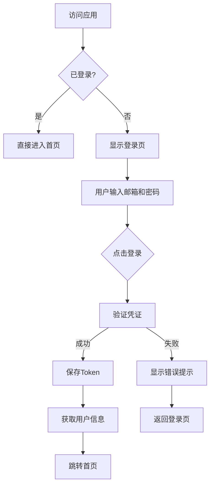

**交互细节：**
- 登录页默认聚焦邮箱输入框
- 密码输入支持显示/隐藏切换
- 登录按钮在表单验证通过前为禁用状态
- 登录失败后保持用户输入的邮箱
- 提供"忘记密码"链接（预留功能）

#### 3.1.2 注册流程

```mermaid
flowchart TD
    A[登录页] --> B[点击"注册"链接]
    B --> C[跳转到注册页]
    C --> D[用户填写注册信息]
    D --> E{点击注册}
    E --> F[验证信息]
    F -->|成功| G[创建用户]
    G --> H[自动登录]
    H --> I[跳转首页]
    F -->|失败| J[显示错误提示]
    J --> K[返回注册页]
```

**交互细节：**
- 邮箱格式实时验证
- 密码强度提示（弱/中/强）
- 确认密码实时比对
- 注册成功后自动登录，无需二次操作

#### 3.1.3 退出流程

```mermaid
flowchart TD
    A[任意页面] --> B[点击导航条"退出"]
    B --> C[清除Token和用户信息]
    C --> D[跳转登录页]
```

---

### 3.2 首页交互

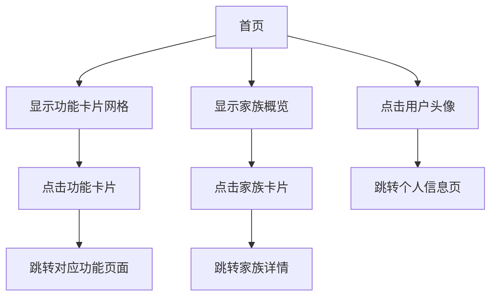

**交互细节：**
- 功能卡片支持悬停放大效果
- 家族概览展示最近更新的家族
- 用户头像点击跳转到个人信息页
- 导航条显示用户昵称（优先）或邮箱

---

### 3.3 家族管理流程

#### 3.3.1 创建家族

```mermaid
flowchart TD
    A[家族管理页] --> B[点击"创建家族"按钮]
    B --> C[弹出创建表单]
    C --> D[填写家族名称等信息]
    D --> E{点击确认}
    E --> F[验证信息]
    F -->|成功| G[创建家族]
    G --> H[刷新列表]
    H --> I[显示成功提示]
    F -->|失败| J[显示错误提示]
```

#### 3.3.2 编辑家族

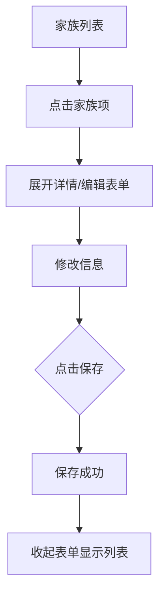

#### 3.3.3 删除家族

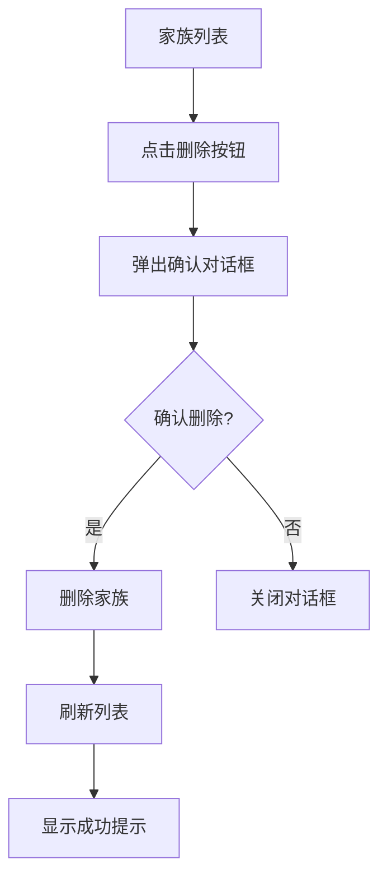

---

### 3.4 家族树交互

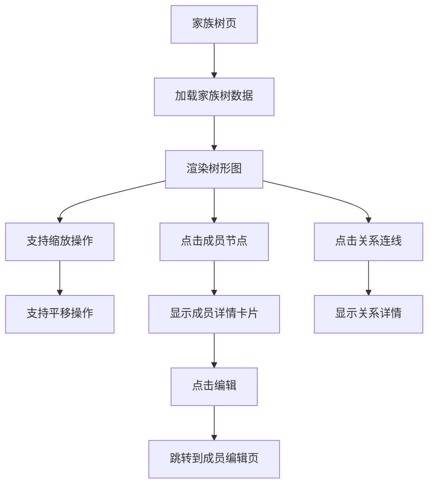

**交互细节：**
- 首次加载显示完整家族树
- 支持鼠标滚轮缩放
- 支持拖拽平移
- 成员节点悬停高亮
- 点击节点显示详情浮层

---

### 3.5 成员管理流程

#### 3.5.1 添加成员

```mermaid
flowchart TD
    A[成员管理页] --> B[点击"添加成员"按钮]
    B --> C[显示添加表单]
    C --> D[填写成员信息]
    D --> E{点击保存}
    E --> F[验证信息]
    F -->|成功| G[添加成员]
    G --> H[刷新列表]
    H --> I[显示成功提示]
    F -->|失败| J[显示字段错误]
```

#### 3.5.2 编辑成员

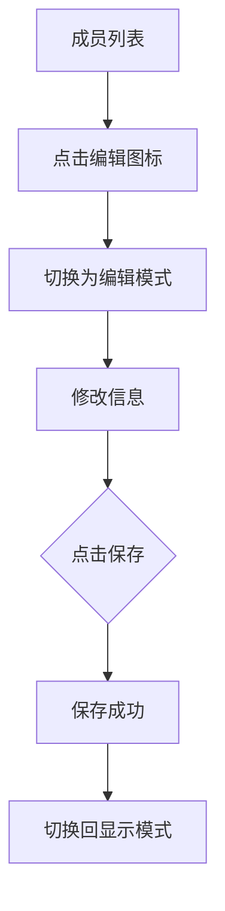

#### 3.5.3 删除成员

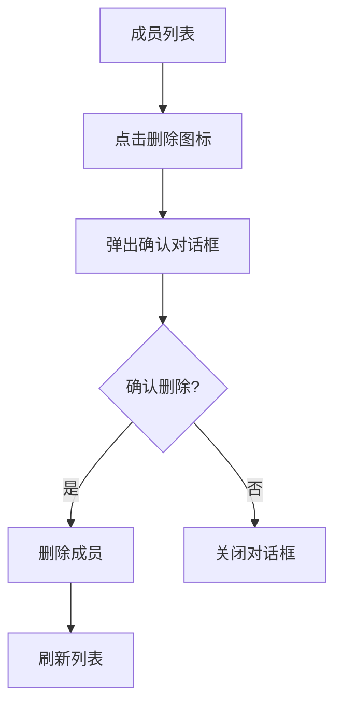

---

### 3.6 关系管理流程

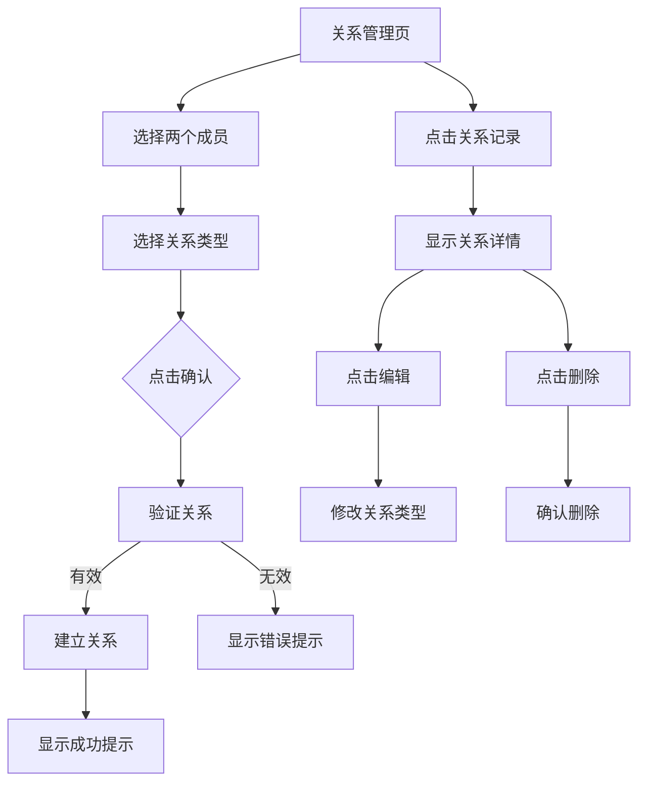

---

### 3.7 多媒体库交互

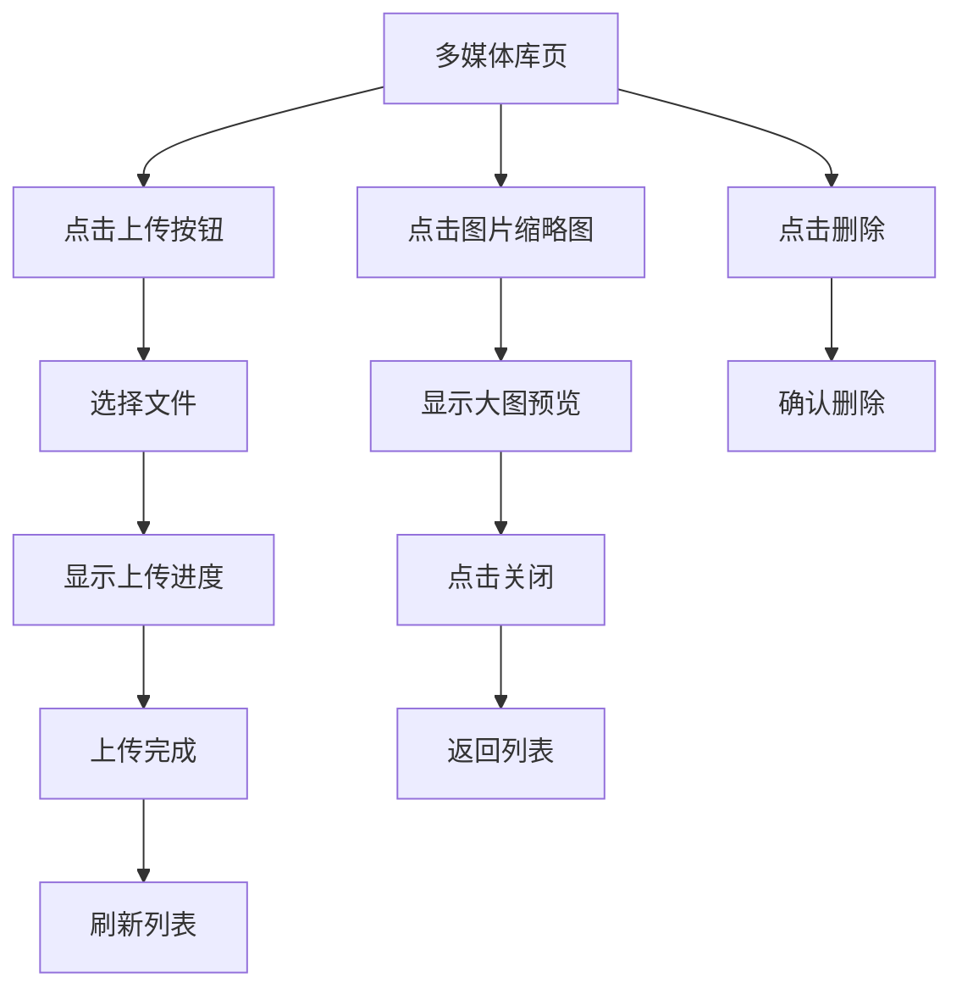

**交互细节：**
- 支持拖拽上传
- 实时显示上传进度
- 支持批量上传
- 图片预览支持缩放

---

### 3.8 图片导入流程

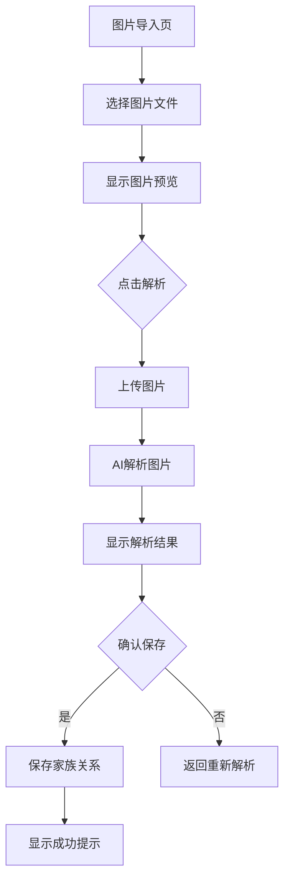

**交互细节：**
- 支持JPG/PNG格式
- 解析过程显示加载动画
- 解析结果可编辑确认
- 支持选择性保存

---

### 3.9 个人信息管理

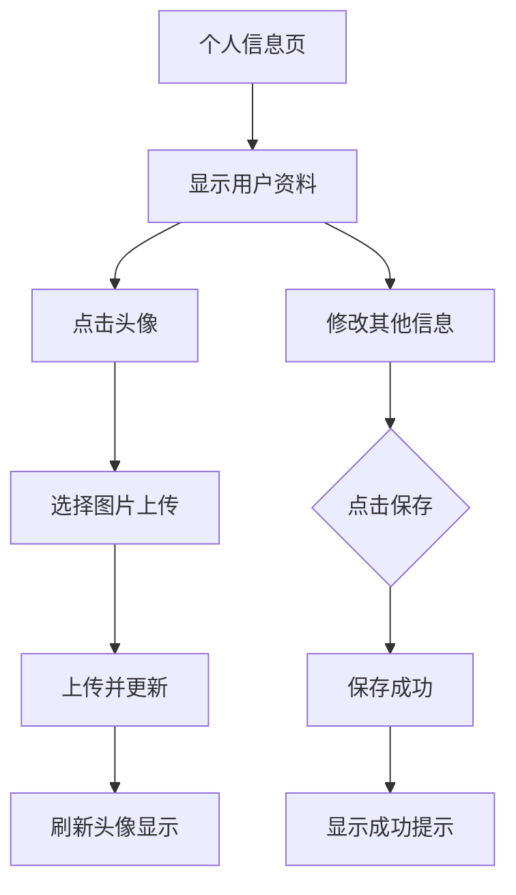

**交互细节：**
- 头像点击可更换
- 表单实时验证
- 保存按钮在有修改时才可用

---

### 3.10 AI功能交互

#### 3.10.1 AI关系分析

```mermaid
flowchart TD
    A[AI关系分析页] --> B[选择目标家族]
    B --> C[点击"开始分析"]
    C --> D[显示分析进度]
    D --> E[分析完成]
    E --> F[显示分析结果]
    F --> G[显示建议关系]
    G --> H{确认添加}
    H -->|是| I[添加关系]
    H -->|否| J[跳过]
```

#### 3.10.2 家族故事生成

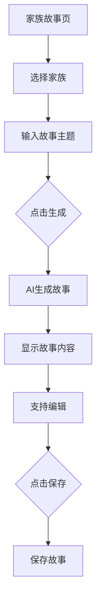

---

## 4. 全局交互模式

### 4.1 导航模式

| 导航元素 | 交互方式 | 说明 |
|----------|----------|------|
| 返回按钮 | 点击 | 返回上一页 |
| 导航条Logo | 点击 | 返回首页 |
| 用户头像 | 点击 | 跳转到个人信息页 |
| 退出按钮 | 点击 | 退出登录 |

### 4.2 表单交互

| 元素 | 交互方式 | 说明 |
|------|----------|------|
| 输入框 | 聚焦/失焦 | 显示/隐藏错误提示 |
| 下拉选择 | 点击展开 | 支持搜索过滤 |
| 按钮 | 点击 | 悬停高亮，禁用状态置灰 |
| 复选框 | 点击切换 | 支持全选/反选 |

### 4.3 弹窗交互

| 弹窗类型 | 交互方式 | 说明 |
|----------|----------|------|
| 确认对话框 | 点击按钮 | 支持确认/取消 |
| 表单弹窗 | 填写后确认 | 支持验证 |
| 提示弹窗 | 自动关闭 | 显示操作结果 |

### 4.4 列表交互

| 操作 | 交互方式 | 说明 |
|------|----------|------|
| 悬停 | 鼠标悬停 | 显示操作按钮 |
| 点击 | 点击行 | 展开详情或跳转 |
| 排序 | 点击表头 | 升序/降序切换 |
| 筛选 | 输入关键词 | 实时过滤 |
| 分页 | 点击页码 | 切换分页 |

---

## 5. 错误处理与反馈

### 5.1 错误类型与处理

| 错误类型 | 处理方式 | 用户反馈 |
|----------|----------|----------|
| 网络错误 | 自动重试 | "网络异常，请稍后重试" |
| 登录失效 | 自动跳转登录页 | "登录已失效，请重新登录" |
| 参数错误 | 表单验证 | 字段旁显示错误提示 |
| 权限不足 | 阻止操作 | "无权限执行此操作" |
| 数据不存在 | 友好提示 | "未找到相关数据" |

### 5.2 加载状态

| 场景 | 加载方式 | 用户反馈 |
|------|----------|----------|
| 页面加载 | 全屏加载 | 加载动画 + 提示文字 |
| 列表加载 | 骨架屏 | 占位骨架动画 |
| 按钮点击 | 按钮加载 | 按钮变为加载状态 |
| 提交操作 | 禁用表单 | 提交按钮显示加载中 |

### 5.3 成功反馈

| 操作 | 反馈方式 |
|------|----------|
| 创建成功 | 绿色提示条 + 自动消失 |
| 更新成功 | 绿色提示条 + 自动消失 |
| 删除成功 | 绿色提示条 + 自动消失 |
| 上传成功 | 预览图 + 成功提示 |

---

## 6. 移动端适配

### 6.1 触控交互

| 操作 | 移动端方式 |
|------|------------|
| 点击 | 触摸 |
| 长按 | 弹出操作菜单 |
| 滑动 | 列表滚动、返回上一页 |
| 双指缩放 | 图片/家族树缩放 |

### 6.2 响应式布局

| 屏幕尺寸 | 布局方式 |
|----------|----------|
| 手机 (<768px) | 单列布局，底部导航 |
| 平板 (768-1024px) | 双列布局 |
| 桌面 (>1024px) | 多列布局，侧边导航 |

---

## 7. 无障碍支持

### 7.1 键盘导航

| 操作 | 快捷键 |
|------|--------|
| 提交表单 | Enter |
| 取消/关闭 | Escape |
| 导航焦点 | Tab |
| 返回上一页 | Alt + 左箭头 |

### 7.2 屏幕阅读器支持

- 所有按钮和链接添加 aria-label
- 表单字段添加 aria-describedby
- 动态内容更新通知屏幕阅读器

---

## 附录：交互流程图索引

| 流程名称 | 章节 |
|----------|------|
| 登录流程 | 3.1.1 |
| 注册流程 | 3.1.2 |
| 退出流程 | 3.1.3 |
| 创建家族 | 3.3.1 |
| 编辑家族 | 3.3.2 |
| 删除家族 | 3.3.3 |
| 添加成员 | 3.5.1 |
| 编辑成员 | 3.5.2 |
| 删除成员 | 3.5.3 |
| 关系管理 | 3.6 |
| 多媒体上传 | 3.7 |
| 图片导入 | 3.8 |
| 个人信息 | 3.9 |
| AI关系分析 | 3.10.1 |
| 家族故事生成 | 3.10.2 |