# 家庭族谱应用 - 页面交互说明

## 目录

1. [登录页](#1-登录页)
2. [注册页](#2-注册页)
3. [首页](#3-首页)
4. [家族管理页](#4-家族管理页)
5. [家族树页](#5-家族树页)
6. [成员管理页](#6-成员管理页)
7. [关系管理页](#7-关系管理页)
8. [历史记录页](#8-历史记录页)
9. [多媒体库页](#9-多媒体库页)
10. [项目进度页](#10-项目进度页)
11. [成员大事件页](#11-成员大事件页)
12. [成员位置页](#12-成员位置页)
13. [AI关系分析页](#13-ai关系分析页)
14. [操作日志页](#14-操作日志页)
15. [家族故事页](#15-家族故事页)
16. [图片导入页](#16-图片导入页)
17. [个人信息页](#17-个人信息页)

---

## 1. 登录页

### 页面元素

| 元素 | 类型 | 交互行为 |
|------|------|----------|
| 邮箱输入框 | Input | 聚焦时显示蓝色边框高亮，输入时实时验证格式，错误时红色边框 |
| 密码输入框 | Input | 支持显示/隐藏切换，输入时显示密码强度条和文字提示 |
| 记住我复选框 | Checkbox | 点击切换选中状态 |
| 登录按钮 | Button | 表单验证通过前禁用（灰色），点击后显示加载状态 |
| 注册链接 | Link | 点击平滑跳转到注册页 |
| 忘记密码链接 | Link | 预留功能，点击显示提示Toast |
| 社交登录按钮 | Button | 悬停高亮，点击预留跳转 |

### 交互流程

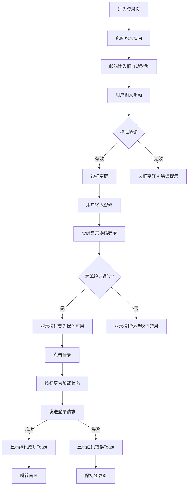

### 视觉反馈

| 场景 | 反馈方式 | 动画效果 |
|------|----------|----------|
| 页面进入 | 容器从上方淡入 | `fadeIn` 0.4s |
| 输入框聚焦 | 蓝色边框 + 内阴影 | 过渡动画 0.2s |
| 邮箱格式错误 | 红色边框 + 错误图标 + 提示文字 | 边框闪烁 |
| 密码强度弱 | 红色进度条 + "弱"文字 | 进度条渐变 |
| 密码强度中 | 黄色进度条 + "中"文字 | 进度条渐变 |
| 密码强度强 | 绿色进度条 + "强"文字 | 进度条渐变 |
| 登录成功 | 绿色Toast从上方滑入 | `slideDown` 0.3s |
| 登录失败 | 红色Toast从上方滑入 + 抖动 | `shake` 0.5s |
| 按钮点击 | 按钮缩放至98% | `scale(0.98)` |

---

## 2. 注册页

### 页面元素

| 元素 | 类型 | 交互行为 |
|------|------|----------|
| 邮箱输入框 | Input | 实时验证格式，失焦时检查唯一性 |
| 密码输入框 | Input | 显示密码强度，支持显示/隐藏切换 |
| 确认密码输入框 | Input | 实时与密码比对，显示匹配状态 |
| 昵称输入框 | Input | 实时验证长度（2-20字符）和格式 |
| 注册按钮 | Button | 表单验证通过前禁用 |
| 登录链接 | Link | 点击平滑跳转到登录页 |
| 服务条款链接 | Link | 点击打开弹窗（预留） |

### 交互流程

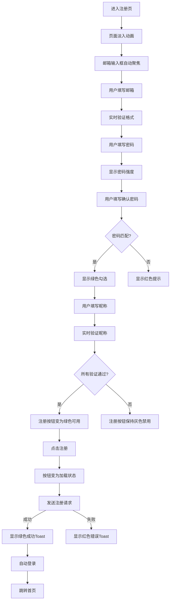

### 视觉反馈

| 场景 | 反馈方式 | 动画效果 |
|------|----------|----------|
| 页面进入 | 容器从上方淡入 | `fadeIn` 0.4s |
| 昵称太短/太长 | 红色边框 + 提示文字 | 即时反馈 |
| 昵称格式错误 | 红色边框 + 提示"只能包含中文、英文、数字、下划线" | 即时反馈 |
| 邮箱格式错误 | 红色边框 + 错误图标 | 即时反馈 |
| 密码匹配 | 绿色勾选图标 | 淡入效果 |
| 密码不匹配 | 红色提示文字 | 抖动效果 |
| 注册成功 | 绿色Toast + 自动跳转 | 平滑过渡 |
| 按钮禁用 | 灰色背景 + 光标禁用 | 无 |

---

## 3. 首页

### 页面元素

| 元素 | 类型 | 交互行为 |
|------|------|----------|
| 欢迎标题 | Text | 显示用户昵称（优先）或邮箱 |
| 统计卡片 | Card | 显示家族/成员/事件/照片数量 |
| 功能卡片 | Card | 悬停时图标放大+旋转，点击跳转对应页面 |
| 家族卡片 | Card | 悬停显示箭头，点击跳转家族树 |
| 创建家族按钮 | Button | 点击跳转到家族管理页 |
| 用户头像 | Image | 点击跳转到个人信息页 |
| 退出按钮 | Button | 点击确认退出，跳转登录页 |
| 最近动态 | List | 显示用户最近操作记录 |

### 交互流程

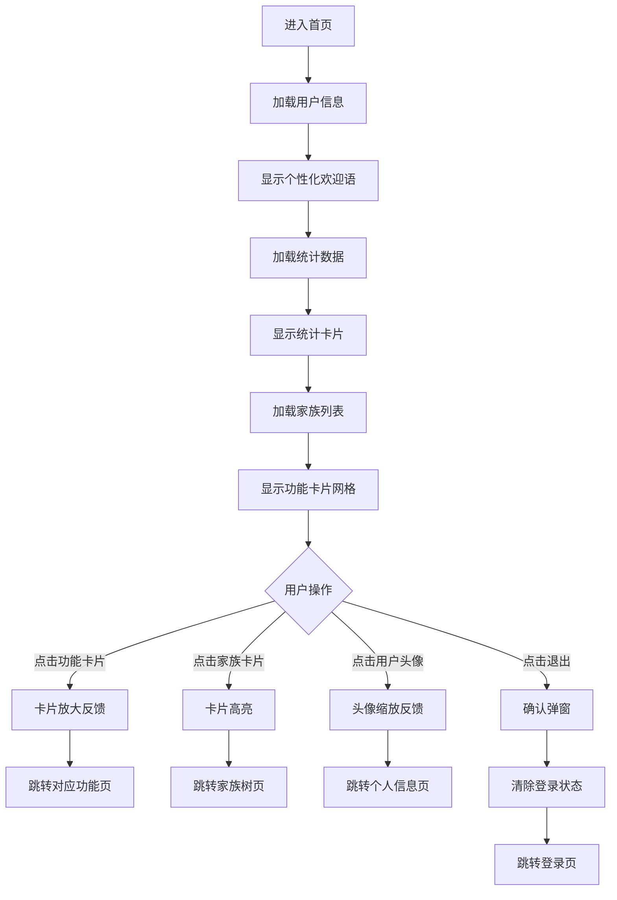

### 视觉反馈

| 场景 | 反馈方式 | 动画效果 |
|------|----------|----------|
| 页面加载 | 整体淡入 | `fadeIn` 0.5s |
| 统计卡片 | 数字跳动动画 | 数值递增 |
| 功能卡片悬停 | 图标放大110% + 旋转3° + 边框高亮 | `scale(1.1)` + `rotate(3deg)` |
| 功能卡片点击 | 按钮缩放至98% | `scale(0.98)` |
| 家族卡片悬停 | 右侧箭头显示 + 颜色过渡 | 渐入效果 |
| 家族为空 | 友好提示 + 创建按钮 | 居中显示 |
| 最近动态 | 时间轴布局 + 图标区分 | 无 |

---

## 4. 家族管理页

### 页面元素

| 元素 | 类型 | 交互行为 |
|------|------|----------|
| 创建家族按钮 | Button | 点击显示创建表单抽屉 |
| 家族列表 | List | 支持搜索、排序、分页 |
| 编辑按钮 | Button | 点击展开行内编辑表单 |
| 删除按钮 | Button | 点击弹出确认对话框 |
| 搜索框 | Input | 实时过滤家族列表 |
| 分页控件 | Pagination | 点击切换页码 |

### 交互流程

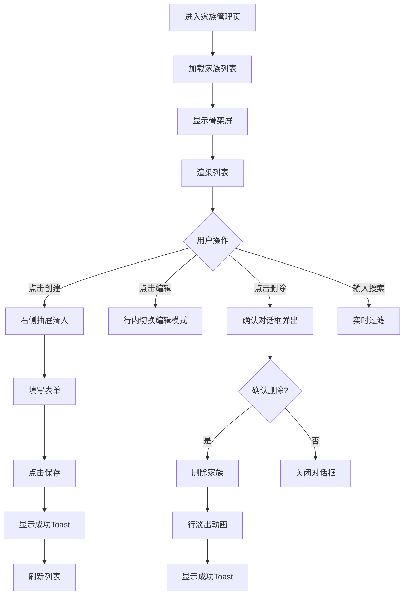

### 视觉反馈

| 场景 | 反馈方式 | 动画效果 |
|------|----------|----------|
| 列表加载 | 骨架屏动画 | 灰色占位闪烁 |
| 搜索输入 | 实时过滤 + 匹配项高亮 | 即时响应 |
| 创建表单 | 右侧抽屉滑入 | `slideInRight` 0.3s |
| 创建成功 | 新行从上方滑入 | `slideDown` 0.3s |
| 删除确认 | 对话框从中心弹出 | `zoomIn` 0.2s |
| 删除成功 | 行淡出并移除 | `fadeOut` + `slideUp` |
| 分页切换 | 列表淡入淡出 | 过渡动画 |

---

## 5. 家族树页

### 页面元素

| 元素 | 类型 | 交互行为 |
|------|------|----------|
| 家族树画布 | Canvas/SVG | 支持缩放、平移、点击 |
| 成员节点 | Node | 点击显示详情卡片，双击编辑 |
| 关系连线 | Line | 点击显示关系类型 |
| 缩放控制 | Control | 放大/缩小/重置按钮 |
| 搜索框 | Input | 搜索成员并高亮闪烁 |
| 导出按钮 | Button | 导出家族树图片 |

### 交互流程

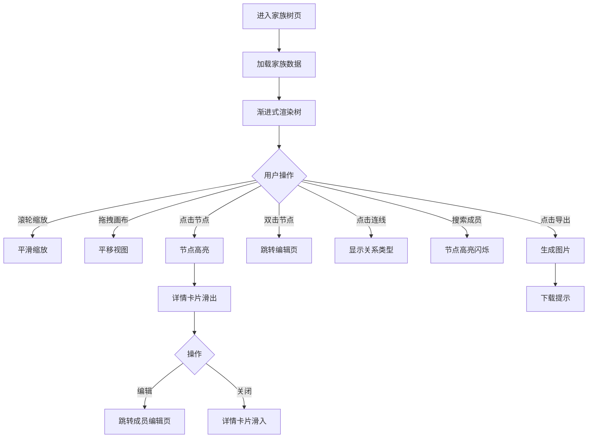

### 视觉反馈

| 场景 | 反馈方式 | 动画效果 |
|------|----------|----------|
| 树加载 | 渐进式渲染 | 节点逐个出现 |
| 节点悬停 | 节点放大 + 阴影 | `scale(1.05)` |
| 节点选中 | 高亮边框 + 详情卡片 | 卡片滑入 |
| 缩放操作 | 平滑缩放动画 | 过渡效果 |
| 搜索匹配 | 节点高亮闪烁 | `pulse` 动画 |
| 拖拽平移 | 视图跟随鼠标 | 流畅跟随 |

---

## 6. 成员管理页

### 页面元素

| 元素 | 类型 | 交互行为 |
|------|------|----------|
| 添加成员按钮 | Button | 点击显示添加表单抽屉 |
| 成员列表 | Table | 支持筛选、排序、分页 |
| 编辑按钮 | Button | 行内切换为编辑模式 |
| 删除按钮 | Button | 点击弹出确认对话框 |
| 性别筛选 | Select | 按性别过滤 |
| 状态筛选 | Select | 按状态过滤 |

### 交互流程

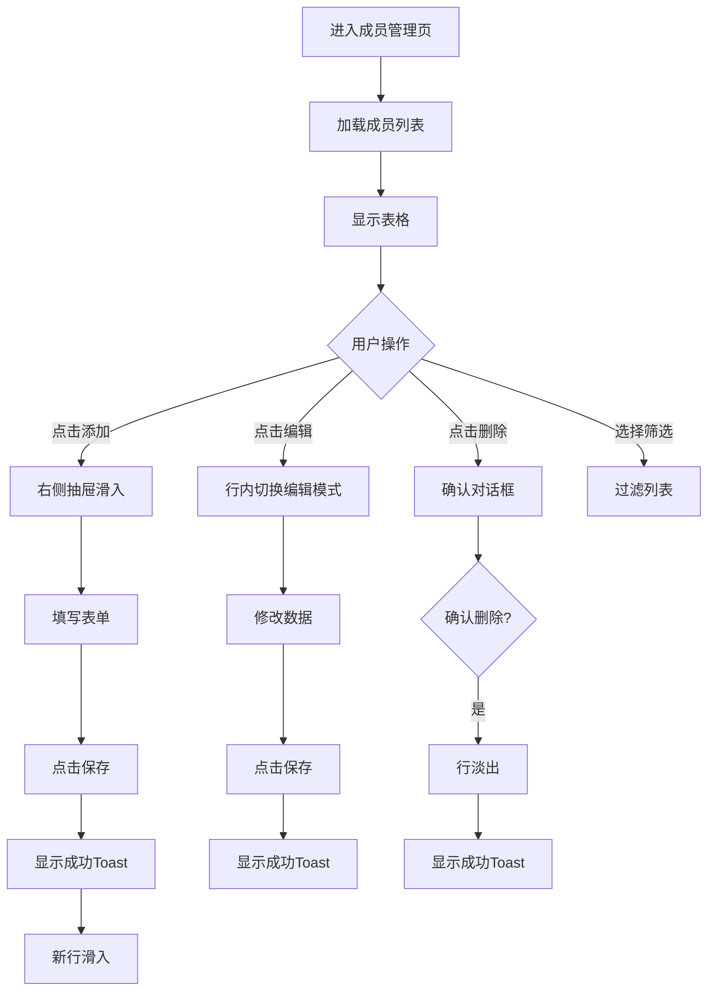

### 视觉反馈

| 场景 | 反馈方式 | 动画效果 |
|------|----------|----------|
| 表格加载 | 骨架屏 | 灰色占位 |
| 行悬停 | 背景高亮 | 渐变效果 |
| 编辑模式 | 输入框替换文本 | 即时切换 |
| 添加成功 | 新行从上方滑入 | `slideDown` |
| 删除成功 | 行淡出并上移 | `fadeOut` + `slideUp` |
| 筛选变化 | 列表重新渲染 | 淡入效果 |

---

## 7. 关系管理页

### 页面元素

| 元素 | 类型 | 交互行为 |
|------|------|----------|
| 添加关系按钮 | Button | 点击显示关系选择表单 |
| 关系列表 | List | 显示成员对和关系类型 |
| 编辑按钮 | Button | 点击修改关系类型 |
| 删除按钮 | Button | 点击删除关系 |
| 成员选择器 | Select | 搜索选择成员 |
| 关系类型选择 | Select | 选择父子/夫妻/兄弟姐妹等 |

### 交互流程

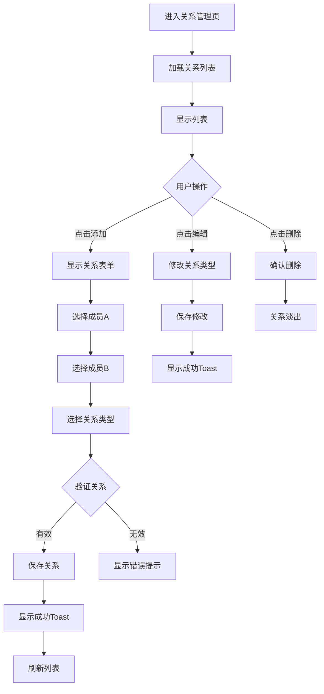

### 视觉反馈

| 场景 | 反馈方式 | 动画效果 |
|------|----------|----------|
| 关系列表加载 | 淡入动画 | 逐个出现 |
| 成员选择 | 下拉搜索建议 | 实时过滤 |
| 关系有效 | 绿色提示图标 | 即时反馈 |
| 关系无效 | 红色提示文字 | 抖动效果 |
| 添加成功 | 新关系滑入 | `slideIn` |
| 删除成功 | 关系淡出 | `fadeOut` |

---

## 8. 历史记录页

### 页面元素

| 元素 | 类型 | 交互行为 |
|------|----------|
| 事件列表 | Timeline | 时间轴展示，按时间倒序 |
| 添加事件按钮 | Button | 点击显示添加表单抽屉 |
| 类型筛选 | Select | 按事件类型筛选 |
| 时间筛选 | DatePicker | 按日期范围筛选 |
| 详情卡片 | Card | 点击展开/收起详情 |

### 交互流程

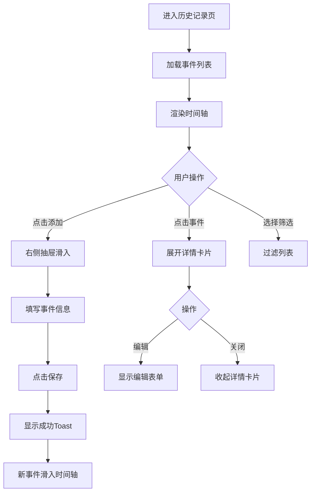

### 视觉反馈

| 场景 | 反馈方式 | 动画效果 |
|------|----------|----------|
| 时间轴加载 | 渐入动画 | 逐个出现 |
| 事件卡片悬停 | 阴影加深 + 光标指针 | 过渡效果 |
| 点击展开 | 卡片向下展开 | `expandDown` |
| 添加成功 | 新事件从上方滑入 | `slideDown` |
| 筛选变化 | 列表重新渲染 | 淡入淡出 |

---

## 9. 多媒体库页

### 页面元素

| 元素 | 类型 | 交互行为 |
|------|------|----------|
| 上传按钮 | Button | 点击选择文件 |
| 拖拽区域 | Dropzone | 支持拖拽上传 |
| 图片网格 | Grid | 显示缩略图，点击预览 |
| 删除按钮 | Button | 悬停显示，点击删除 |
| 预览弹窗 | Modal | 显示大图，支持缩放 |
| 批量选择 | Checkbox | 多选删除 |

### 交互流程

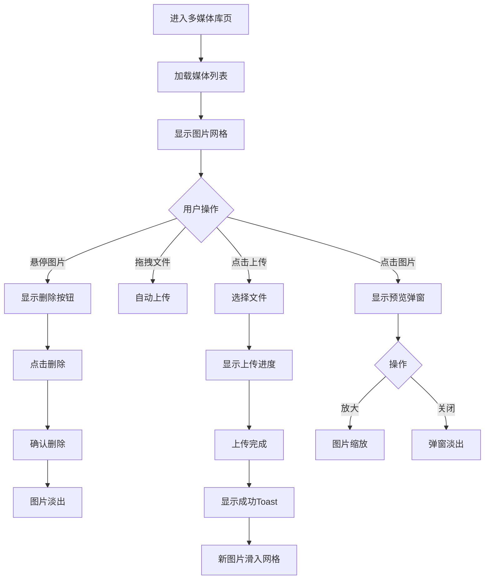

### 视觉反馈

| 场景 | 反馈方式 | 动画效果 |
|------|----------|----------|
| 网格加载 | 骨架屏 | 灰色占位 |
| 拖拽区域 | 高亮边框 + 提示文字 | 边框脉冲 |
| 上传进度 | 进度条动画 | 平滑填充 |
| 预览弹窗 | 淡入效果 | `fadeIn` |
| 删除成功 | 图片淡出并缩小 | `fadeOut` + `scale(0.8)` |
| 图片悬停 | 阴影加深 + 删除按钮显示 | 过渡效果 |

---

## 10. 项目进度页

### 页面元素

| 元素 | 类型 | 交互行为 |
|------|------|----------|
| 进度条 | Progress | 显示完成百分比，带动画 |
| 功能列表 | List | 显示功能状态和进度 |
| 状态标签 | Badge | 已完成(绿)/进行中(黄)/待开始(灰) |
| 统计卡片 | Card | 显示完成数量和百分比 |
| 详情按钮 | Button | 点击显示功能详情 |

### 交互流程

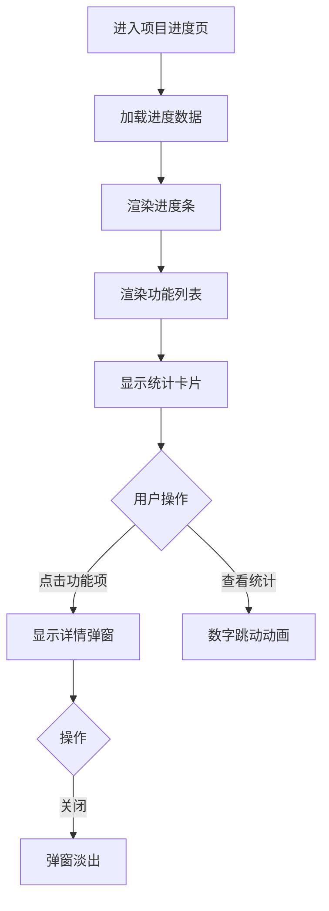

### 视觉反馈

| 场景 | 反馈方式 | 动画效果 |
|------|----------|----------|
| 进度条 | 渐变填充动画 | 从左到右填充 |
| 功能状态 | 颜色区分 | 绿/黄/灰标签 |
| 统计卡片 | 数字跳动动画 | 数值递增 |
| 功能项悬停 | 背景高亮 | 过渡效果 |
| 详情弹窗 | 淡入效果 | `fadeIn` |

---

## 11. 成员大事件页

### 页面元素

| 元素 | 类型 | 交互行为 |
|------|------|----------|
| 添加大事件按钮 | Button | 点击显示添加表单抽屉 |
| 事件列表 | List | 按时间排序，带时间戳 |
| 编辑按钮 | Button | 点击编辑事件 |
| 删除按钮 | Button | 点击删除事件 |
| 事件类型标签 | Badge | 区分事件类型 |

### 交互流程

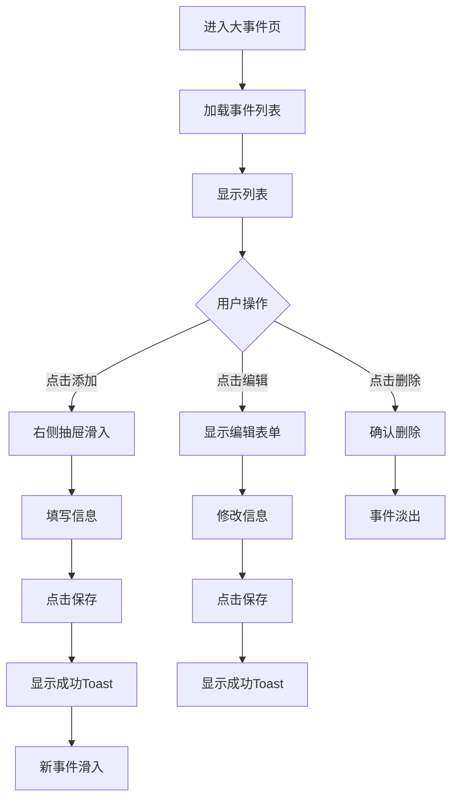

### 视觉反馈

| 场景 | 反馈方式 | 动画效果 |
|------|----------|----------|
| 列表加载 | 淡入动画 | 逐个出现 |
| 添加成功 | 新事件从上方滑入 | `slideDown` |
| 删除成功 | 事件淡出并移除 | `fadeOut` |
| 编辑模式 | 表单滑入 | `slideIn` |
| 事件类型 | 颜色标签区分 | 无 |

---

## 12. 成员位置页

### 页面元素

| 元素 | 类型 | 交互行为 |
|------|------|----------|
| 地图 | Map | 显示成员位置标记 |
| 成员列表 | List | 显示成员和位置信息 |
| 位置标记 | Marker | 点击显示成员信息弹窗 |
| 家族筛选 | Select | 按家族筛选成员 |
| 搜索框 | Input | 搜索成员 |

### 交互流程

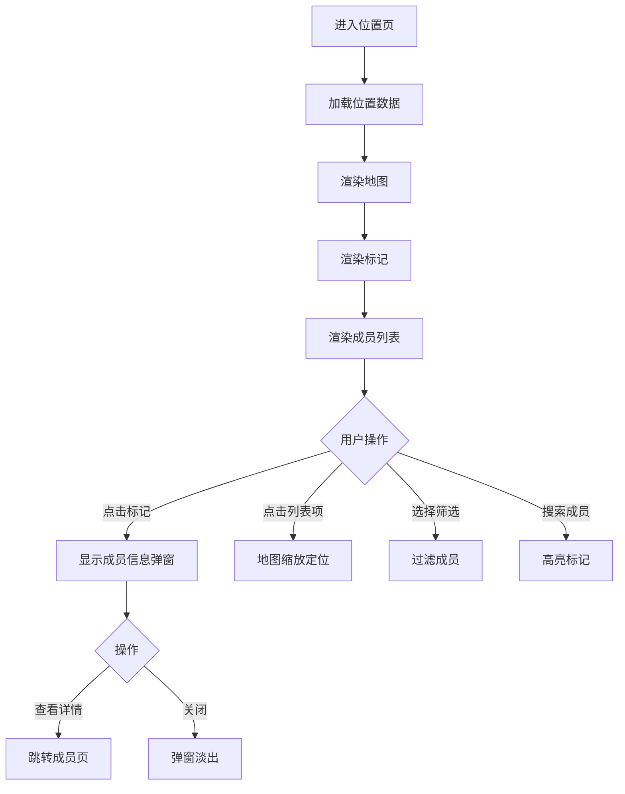

### 视觉反馈

| 场景 | 反馈方式 | 动画效果 |
|------|----------|----------|
| 地图加载 | 渐进式渲染 | 从模糊到清晰 |
| 标记点击 | 信息弹窗滑出 | `slideUp` |
| 列表点击 | 地图缩放定位 | 平滑缩放 |
| 搜索匹配 | 标记高亮闪烁 | `pulse` |
| 筛选变化 | 标记显示/隐藏 | 淡入淡出 |

---

## 13. AI关系分析页

### 页面元素

| 元素 | 类型 | 交互行为 |
|------|------|----------|
| 分析按钮 | Button | 点击开始AI分析 |
| 家族选择 | Select | 选择要分析的家族 |
| 分析结果 | Card | 显示建议关系 |
| 添加按钮 | Button | 点击添加建议关系 |
| 跳过按钮 | Button | 跳过当前建议 |
| 完成按钮 | Button | 结束分析流程 |

### 交互流程

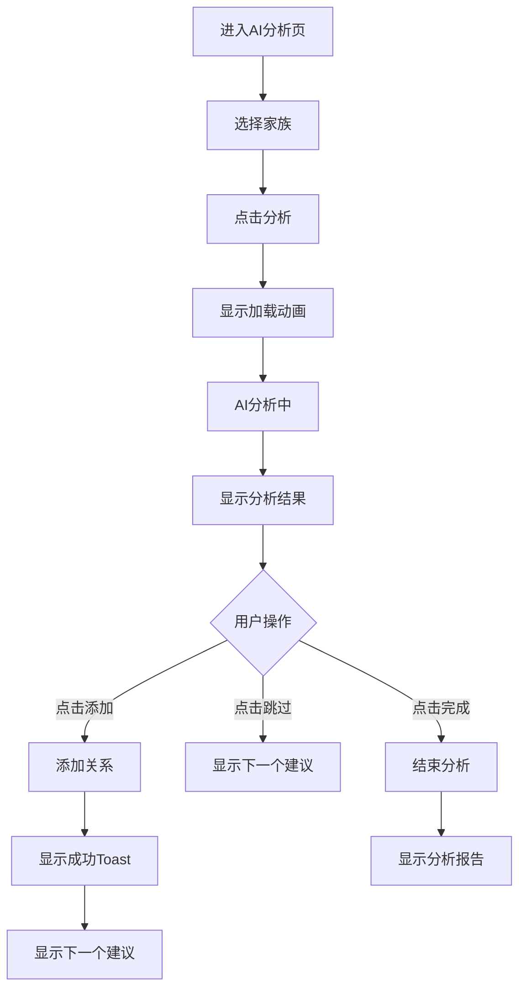

### 视觉反馈

| 场景 | 反馈方式 | 动画效果 |
|------|----------|----------|
| 分析中 | 加载动画 + 进度提示 | 旋转动画 |
| 结果显示 | 卡片从右侧滑入 | `slideInRight` |
| 添加成功 | 绿色Toast | 淡入效果 |
| 跳过 | 卡片滑出 | `slideOutLeft` |
| 分析完成 | 报告淡入 | `fadeIn` |

---

## 14. 操作日志页

### 页面元素

| 元素 | 类型 | 交互行为 |
|------|------|----------|
| 日志列表 | Table | 按时间倒序显示 |
| 操作类型筛选 | Select | 按类型筛选 |
| 时间筛选 | DatePicker | 按日期范围筛选 |
| 详情弹窗 | Modal | 点击查看详情 |
| 搜索框 | Input | 搜索日志内容 |
| 导出按钮 | Button | 导出日志（预留） |

### 交互流程

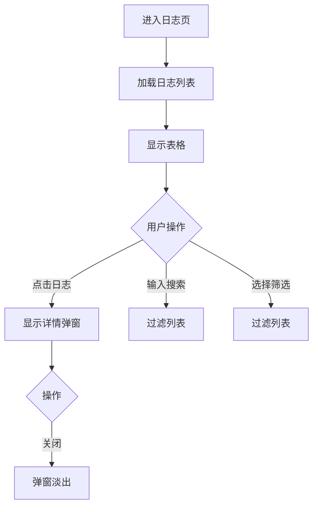

### 视觉反馈

| 场景 | 反馈方式 | 动画效果 |
|------|----------|----------|
| 表格加载 | 骨架屏 | 灰色占位 |
| 操作类型 | 颜色区分 | 不同颜色标签 |
| 详情弹窗 | 淡入效果 | `fadeIn` |
| 搜索过滤 | 实时更新列表 | 即时响应 |

---

## 15. 家族故事页

### 页面元素

| 元素 | 类型 | 交互行为 |
|------|------|----------|
| 生成按钮 | Button | 点击生成故事 |
| 主题输入 | Input | 输入故事主题 |
| 故事列表 | List | 显示已生成故事 |
| 编辑按钮 | Button | 点击编辑故事 |
| 删除按钮 | Button | 点击删除故事 |
| 预览卡片 | Card | 点击查看完整故事 |

### 交互流程

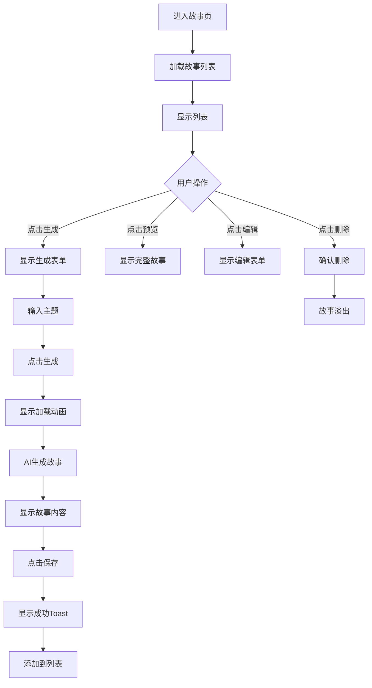

### 视觉反馈

| 场景 | 反馈方式 | 动画效果 |
|------|----------|----------|
| 生成中 | 打字机效果逐字显示 | 文字逐个出现 |
| 故事显示 | 渐入动画 | `fadeIn` |
| 保存成功 | 绿色Toast | 淡入效果 |
| 故事卡片悬停 | 阴影加深 | 过渡效果 |
| 删除成功 | 卡片淡出 | `fadeOut` |

---

## 16. 图片导入页

### 页面元素

| 元素 | 类型 | 交互行为 |
|------|------|----------|
| 上传区域 | Dropzone | 支持点击和拖拽上传 |
| 图片预览 | Image | 显示上传图片缩略图 |
| 解析按钮 | Button | 点击开始AI解析 |
| 解析结果 | Card | 显示识别的成员和关系 |
| 保存按钮 | Button | 点击保存解析结果 |
| 重新上传 | Button | 重新选择图片 |

### 交互流程

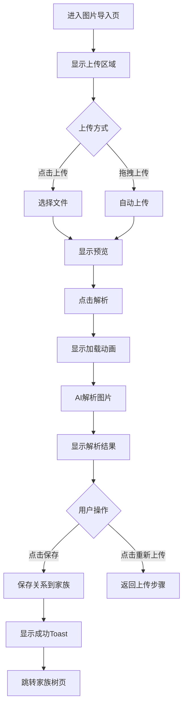

### 视觉反馈

| 场景 | 反馈方式 | 动画效果 |
|------|----------|----------|
| 拖拽区域 | 高亮边框 + 图标提示 | 边框脉冲 |
| 图片上传 | 预览图淡入 | `fadeIn` |
| 解析中 | 加载动画 + 进度提示 | 旋转动画 |
| 结果显示 | 卡片逐个渐入 | `fadeIn` 依次 |
| 保存成功 | 绿色Toast | 淡入效果 |
| 解析失败 | 红色Toast | 抖动效果 |

---

## 17. 个人信息页

### 页面元素

| 元素 | 类型 | 交互行为 |
|------|------|----------|
| 头像 | Image | 点击上传新头像 |
| 昵称输入 | Input | 修改昵称 |
| 邮箱显示 | Text | 显示邮箱，不可修改 |
| 保存按钮 | Button | 保存修改 |
| 密码修改 | Link | 跳转密码修改（预留） |
| 退出登录 | Button | 退出当前账号 |

### 交互流程

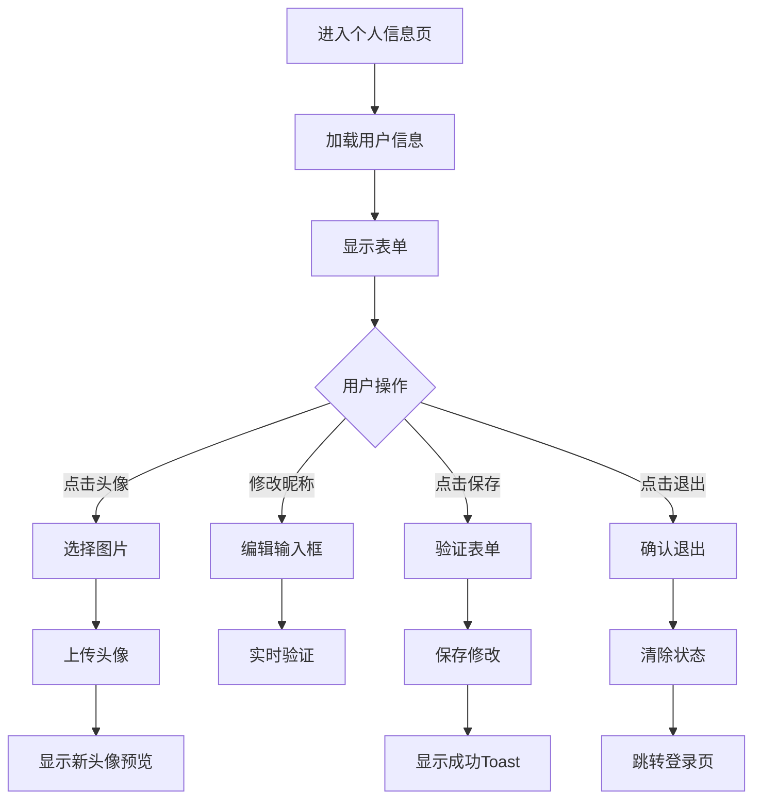

### 视觉反馈

| 场景 | 反馈方式 | 动画效果 |
|------|----------|----------|
| 头像上传 | 预览图更新 | 淡入效果 |
| 表单修改 | 实时验证提示 | 即时反馈 |
| 保存成功 | 绿色Toast | 淡入效果 |
| 保存失败 | 红色Toast | 抖动效果 |
| 退出确认 | 对话框弹出 | `zoomIn` |

---

## 附录：全局交互模式

### Toast提示

| 类型 | 颜色 | 图标 | 用途 | 动画 |
|------|------|------|------|------|
| success | 绿色背景 | ✓ 勾选 | 操作成功 | 从上方滑入，3秒后淡出 |
| error | 红色背景 | ✗ 叉号 | 操作失败 | 从上方滑入 + 抖动 |
| warning | 黄色背景 | ! 警告 | 警告信息 | 从上方滑入 |
| info | 蓝色背景 | i 信息 | 一般信息 | 从上方滑入 |

### Loading状态

| 场景 | 样式 | 动画 |
|------|------|------|
| 页面加载 | 全屏遮罩 + 旋转圆环 | 持续旋转 |
| 按钮点击 | 按钮内旋转图标 | 持续旋转 |
| 列表加载 | 灰色骨架屏占位 | 闪烁效果 |
| 数据请求 | 小型旋转图标 | 持续旋转 |

### 按钮状态

| 状态 | 样式 | 交互 |
|------|------|------|
| 正常 | 原色背景，白色文字 | 悬停变深 |
| 悬停 | 深色背景 | 光标指针 |
| 禁用 | 灰色背景，浅色文字 | 光标禁用 |
| 加载 | 旋转图标替代文字 | 不可点击 |

### 过渡动画

| 动画名称 | 效果 | 时长 | 用途 |
|----------|------|------|------|
| fadeIn | 淡入 | 0.3-0.5s | 页面、卡片进入 |
| slideDown | 从上方滑入 | 0.3s | Toast、弹窗 |
| slideUp | 从下方滑入 | 0.3s | 详情卡片 |
| slideInRight | 从右侧滑入 | 0.3s | 抽屉表单 |
| slideOutLeft | 向左侧滑出 | 0.3s | 卡片移除 |
| zoomIn | 缩放进入 | 0.2s | 对话框 |
| pulse | 脉冲闪烁 | 1s | 搜索高亮 |
| shake | 左右抖动 | 0.5s | 错误提示 |