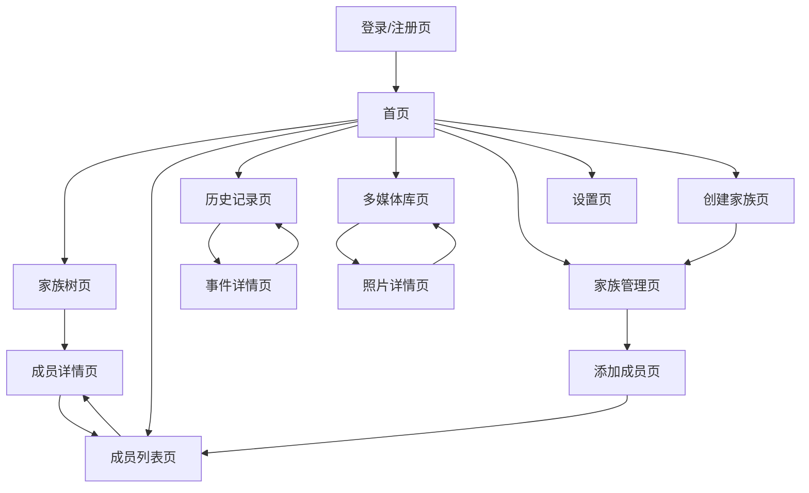
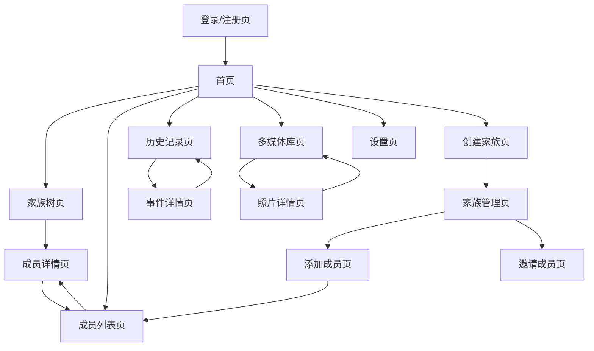
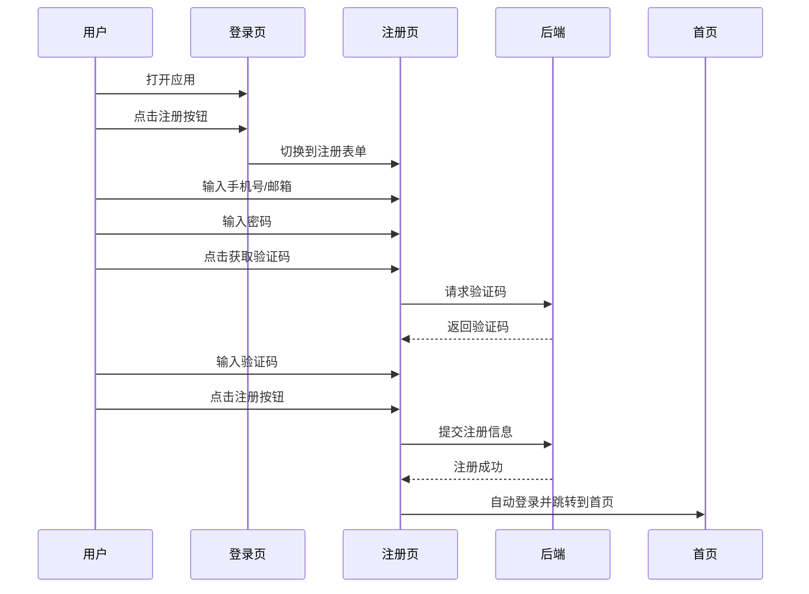
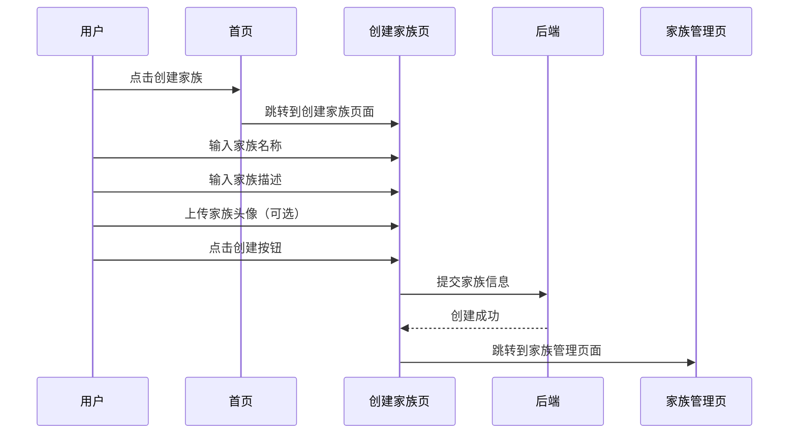
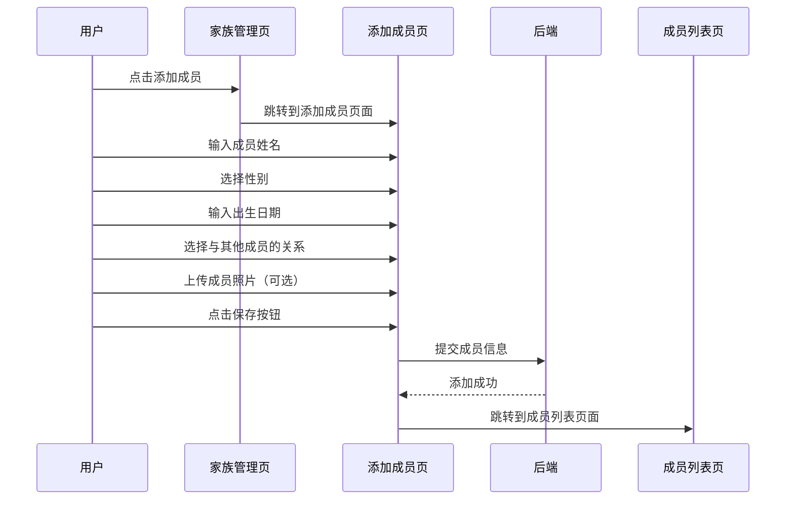
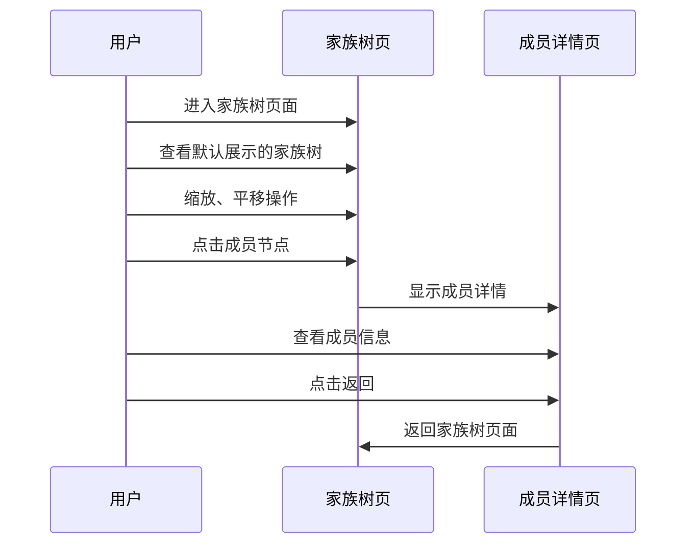

# 家庭族谱APP UI交互稿

## 1. 设计系统

### 1.1 颜色系统

| 颜色名称 | 颜色值 | 用途 |
|---------|-------|------|
| 主色调 | #3B82F6 (蓝色) | 按钮、链接、强调元素 |
| 辅助色 | #F3F4F6 (浅灰色) | 背景、卡片、分隔线 |
| 文字主色 | #1F2937 (深灰色) | 主要文字 |
| 文字次要色 | #6B7280 (中灰色) | 次要文字、说明文字 |
| 成功色 | #10B981 (绿色) | 成功状态、确认按钮 |
| 警告色 | #F59E0B (黄色) | 警告状态、提示信息 |
| 错误色 | #EF4444 (红色) | 错误状态、删除按钮 |
| 白色 | #FFFFFF | 背景、卡片背景 |

### 1.2 字体系统

| 字体类型 | 字号 | 字重 | 用途 |
|---------|------|------|------|
| 标题 | 24px | 600 | 页面标题 |
| 副标题 | 20px | 500 | 卡片标题、 section标题 |
| 正文 | 16px | 400 | 主要文字内容 |
| 小文字 | 14px | 400 | 说明文字、辅助信息 |
| 微小文字 | 12px | 400 | 标签、时间戳 |

### 1.3 组件库

#### 1.3.1 按钮

| 按钮类型 | 样式 | 用途 |
|---------|------|------|
| 主按钮 | 蓝色背景，白色文字，圆角4px | 主要操作，如登录、创建等 |
| 次要按钮 | 白色背景，蓝色边框，圆角4px | 次要操作，如取消、返回等 |
| 文本按钮 | 蓝色文字，无背景 | 链接、跳转操作 |
| 危险按钮 | 红色背景，白色文字，圆角4px | 删除、确认危险操作 |

#### 1.3.2 输入框

- 样式：白色背景，灰色边框，获取焦点时边框变蓝色，圆角4px
- 尺寸：高度40px， padding 0 12px
- 错误状态：红色边框，下方显示错误信息

#### 1.3.3 卡片

- 样式：白色背景，阴影效果，圆角8px
- 内边距：16px
- 用途：展示信息、功能模块

#### 1.3.4 图标

- 风格：线性图标，简约现代
- 尺寸：16px、24px、32px
- 颜色：主色调或文字主色

## 2. Web端界面设计

### 2.1 布局结构

- **顶部导航栏**：Logo、主导航菜单、用户头像
- **侧边栏**：功能导航菜单（在小屏幕上折叠）
- **主内容区**：页面主要内容
- **底部**：版权信息、链接

### 2.2 页面设计

#### 2.2.1 登录/注册页

- **布局**：居中布局，最大宽度400px
- **元素**：
  - Logo
  - 登录/注册切换标签
  - 输入框（手机号/邮箱、密码）
  - 验证码输入框
  - 记住密码复选框
  - 登录/注册按钮
  - 忘记密码链接
- **交互**：
  - 点击切换标签切换登录/注册表单
  - 输入框获取焦点时边框变蓝色
  - 提交按钮点击后显示加载状态
  - 错误信息实时显示

#### 2.2.2 首页

- **布局**：卡片式布局
- **元素**：
  - 顶部导航栏（Logo、导航菜单、用户头像）
  - 侧边栏（功能导航）
  - 家族概览卡片（家族名称、成员数量、最近活动）
  - 快速功能入口（创建家族、添加成员、查看家族树）
  - 最近活动列表
  - 待办事项提醒
- **交互**：
  - 点击卡片进入对应功能页面
  - 侧边栏菜单项点击切换页面
  - 鼠标悬停在卡片上显示轻微阴影效果

#### 2.2.3 家族树页

- **布局**：全屏布局，左侧控制面板，右侧家族树展示区
- **元素**：
  - 顶部导航栏
  - 侧边栏
  - 家族树控制按钮（缩放、平移、重置）
  - 家族树可视化区域
  - 成员信息卡片（点击成员节点显示）
- **交互**：
  - 鼠标滚轮缩放家族树
  - 鼠标拖拽平移家族树
  - 点击成员节点显示成员详情
  - 双击成员节点展开/折叠分支

#### 2.2.4 成员列表页

- **布局**：列表布局，顶部搜索栏，下方成员列表
- **元素**：
  - 顶部导航栏
  - 侧边栏
  - 搜索框
  - 筛选器
  - 成员列表（头像、姓名、关系、出生日期）
  - 添加成员按钮
- **交互**：
  - 输入搜索关键词实时过滤列表
  - 点击筛选器展开筛选选项
  - 点击列表项进入成员详情页
  - 点击添加成员按钮打开添加成员表单

#### 2.2.5 成员详情页

- **布局**：卡片式布局，顶部成员基本信息，下方详细信息
- **元素**：
  - 顶部导航栏
  - 侧边栏
  - 成员头像
  - 基本信息（姓名、性别、出生日期、去世日期）
  - 详细信息（联系方式、教育经历、工作经历等）
  - 相关成员列表
  - 编辑按钮
- **交互**：
  - 点击编辑按钮进入编辑模式
  - 编辑完成后点击保存按钮
  - 点击相关成员进入对应成员详情页

#### 2.2.6 历史记录页

- **布局**：时间轴布局
- **元素**：
  - 顶部导航栏
  - 侧边栏
  - 时间轴
  - 事件卡片（日期、事件名称、描述、相关成员、照片）
  - 添加事件按钮
- **交互**：
  - 滚动时间轴查看历史事件
  - 点击事件卡片展开详细信息
  - 点击添加事件按钮打开添加事件表单

#### 2.2.7 多媒体库页

- **布局**：网格布局
- **元素**：
  - 顶部导航栏
  - 侧边栏
  - 上传按钮
  - 分类筛选器
  - 照片网格（缩略图）
- **交互**：
  - 点击上传按钮打开文件选择器
  - 点击分类筛选器切换分类
  - 点击照片缩略图查看大图
  - 鼠标悬停在照片上显示操作按钮（删除、编辑）

#### 2.2.8 家族管理页

- **布局**：表单布局
- **元素**：
  - 顶部导航栏
  - 侧边栏
  - 家族信息表单（名称、描述、头像）
  - 成员列表
  - 邀请成员按钮
  - 权限设置
- **交互**：
  - 编辑家族信息表单
  - 点击邀请成员按钮发送邀请
  - 调整成员权限

#### 2.2.9 设置页

- **布局**：列表布局
- **元素**：
  - 顶部导航栏
  - 侧边栏
  - 设置选项列表（个人信息、通知设置、隐私设置、数据备份）
  - 退出登录按钮
- **交互**：
  - 点击设置选项进入详细设置页面
  - 点击退出登录按钮退出应用

## 3. Flutter移动端界面设计

### 3.1 布局结构

- **顶部导航栏**：页面标题、返回按钮
- **底部导航栏**：主要功能入口
- **主内容区**：页面主要内容

### 3.2 页面设计

#### 3.2.1 登录/注册页

- **布局**：垂直居中布局
- **元素**：
  - Logo
  - 登录/注册切换标签
  - 输入框（手机号/邮箱、密码）
  - 验证码输入框
  - 记住密码复选框
  - 登录/注册按钮
  - 忘记密码链接
- **交互**：
  - 点击切换标签切换登录/注册表单
  - 输入框获取焦点时边框变蓝色
  - 提交按钮点击后显示加载状态
  - 错误信息实时显示

#### 3.2.2 首页

- **布局**：垂直滚动布局，卡片式设计
- **元素**：
  - 顶部导航栏（标题、用户头像）
  - 底部导航栏（首页、家族树、成员、历史、我的）
  - 家族概览卡片（家族名称、成员数量）
  - 快速功能入口（添加成员、添加事件、上传照片）
  - 最近活动列表
- **交互**：
  - 点击卡片进入对应功能页面
  - 底部导航栏切换功能模块
  - 下拉刷新获取最新数据

#### 3.2.3 家族树页

- **布局**：全屏布局，底部控制按钮
- **元素**：
  - 顶部导航栏（标题、更多选项）
  - 家族树可视化区域
  - 底部控制按钮（缩放、重置）
- **交互**：
  - 双指捏合缩放家族树
  - 单指拖拽平移家族树
  - 点击成员节点显示成员详情
  - 长按成员节点显示操作菜单

#### 3.2.4 成员列表页

- **布局**：列表布局
- **元素**：
  - 顶部导航栏（标题、搜索按钮、添加按钮）
  - 搜索框
  - 成员列表（头像、姓名、关系、出生日期）
- **交互**：
  - 点击搜索按钮显示搜索框
  - 输入搜索关键词实时过滤列表
  - 点击列表项进入成员详情页
  - 点击添加按钮打开添加成员表单

#### 3.2.5 成员详情页

- **布局**：垂直滚动布局
- **元素**：
  - 顶部导航栏（标题、编辑按钮）
  - 成员头像
  - 基本信息（姓名、性别、出生日期、去世日期）
  - 详细信息（联系方式、教育经历、工作经历等）
  - 相关成员列表
- **交互**：
  - 点击编辑按钮进入编辑模式
  - 编辑完成后点击保存按钮
  - 点击相关成员进入对应成员详情页

#### 3.2.6 历史记录页

- **布局**：时间轴布局
- **元素**：
  - 顶部导航栏（标题、添加按钮）
  - 时间轴
  - 事件卡片（日期、事件名称、描述、相关成员、照片）
- **交互**：
  - 滚动时间轴查看历史事件
  - 点击事件卡片展开详细信息
  - 点击添加按钮打开添加事件表单

#### 3.2.7 多媒体库页

- **布局**：网格布局
- **元素**：
  - 顶部导航栏（标题、上传按钮）
  - 分类筛选器
  - 照片网格（缩略图）
- **交互**：
  - 点击上传按钮打开文件选择器
  - 点击分类筛选器切换分类
  - 点击照片缩略图查看大图
  - 长按照片显示操作菜单（删除、编辑）

#### 3.2.8 家族管理页

- **布局**：垂直滚动布局
- **元素**：
  - 顶部导航栏（标题、保存按钮）
  - 家族信息（名称、描述、头像）
  - 成员列表
  - 邀请成员按钮
  - 权限设置
- **交互**：
  - 编辑家族信息
  - 点击邀请成员按钮发送邀请
  - 调整成员权限

#### 3.2.9 设置页

- **布局**：列表布局
- **元素**：
  - 顶部导航栏（标题）
  - 设置选项列表（个人信息、通知设置、隐私设置、数据备份）
  - 退出登录按钮
- **交互**：
  - 点击设置选项进入详细设置页面
  - 点击退出登录按钮退出应用

## 4. 导航流程

### 4.1 Web端导航流程

### 4.2 Flutter移动端导航流程

## 5. 核心功能交互流程

### 5.1 用户注册流程

### 5.2 家族创建流程

### 5.3 成员添加流程

### 5.4 家族树查看流程

## 6. 响应式设计

### 6.1 Web端响应式断点

| 断点 | 屏幕尺寸 | 布局调整 |
|------|---------|----------|
| 大屏幕 | > 1200px | 完整布局，侧边栏展开 |
| 中屏幕 | 992px - 1199px | 完整布局，侧边栏展开 |
| 小屏幕 | 768px - 991px | 侧边栏折叠为抽屉式，主内容区自适应 |
| 平板 | 576px - 767px | 侧边栏隐藏，通过顶部菜单按钮打开，主内容区单列布局 |
| 手机 | < 576px | 单栏布局，所有辅助元素隐藏或通过菜单按钮打开 |

### 6.2 Flutter移动端响应式设计

- **小屏幕手机**：单栏布局，简化界面元素
- **中屏幕手机**：标准布局，完整功能
- **平板设备**：多栏布局，利用更大屏幕空间展示更多信息

## 7. 动画和过渡效果

### 7.1 Web端动画

- **页面切换**：淡入淡出效果
- **卡片悬停**：轻微阴影和缩放效果
- **按钮点击**：轻微下沉效果
- **表单验证**：错误信息淡入效果
- **数据加载**：骨架屏或加载动画

### 7.2 Flutter移动端动画

- **页面切换**：滑动过渡效果
- **列表项**：淡入效果
- **按钮点击**：波纹效果
- **底部导航栏**：平滑切换效果
- **加载状态**：圆形加载动画

## 8. 无障碍设计

- **Web端**：
  - 符合WCAG 2.1标准
  - 支持键盘导航
  - 适当的颜色对比度
  - 屏幕阅读器支持

- **Flutter移动端**：
  - 语义化标签
  - 适当的触摸目标大小
  - 屏幕阅读器支持
  - 键盘导航支持

## 9. 总结

本UI交互稿基于PRD文档，为家庭族谱APP提供了详细的界面设计和交互流程。通过清晰的设计系统、完整的页面设计和流畅的交互流程，确保了应用的易用性和用户体验。

在后续的编码实现中，开发人员可以参考本交互稿，按照设计系统的规范实现界面，并遵循交互流程实现功能。同时，根据实际开发过程中的需要，可以对设计进行适当的调整和优化。