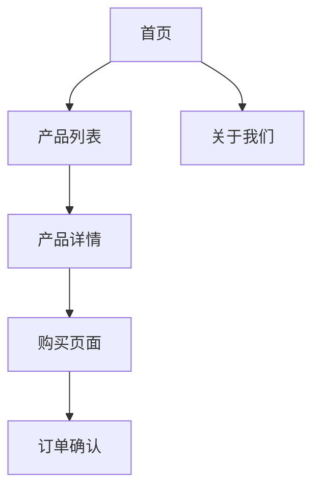

# common-ui-mockup

## 功能描述

UI原型图生成技能根据需求描述生成页面设计草稿图、线框图和UI设计文档。支持多种格式输出，包括ASCII艺术图、Mermaid图表、HTML原型等，帮助团队快速可视化设计方案。

## 触发条件

- 需求提出后需要快速生成页面草稿时
- 需要创建线框图进行评审时
- 需要生成UI设计文档时
- 需要向团队展示设计方案时

## 何时使用

- 需求澄清阶段需要可视化需求时
- 设计评审前需要准备原型时
- 开发开始前需要提供设计参考时
- 需要快速验证设计思路时

## 何时不使用

- 已有完善的设计稿且无需调整时
- 仅需要简单的文字描述时
- 用户明确不需要可视化时

## 核心功能

### 1. 线框图生成

- 基于需求描述生成页面结构线框
- 支持多种布局类型（单栏、双栏、仪表盘）
- 自动识别页面元素（导航、内容区、侧边栏）

### 2. 页面草稿图

- ASCII艺术图形式的页面草图
- 清晰展示页面布局和元素位置
- 支持移动端和桌面端视图

### 3. UI设计文档

- 生成完整的设计规格文档
- 包含页面结构、组件说明、交互规范
- 支持导出为Markdown格式

### 4. 交互原型

- 描述页面间的导航和交互流程
- 状态转换说明
- 用户操作路径图

## 输出格式

### 1. ASCII 页面草图

```
┌─────────────────────────────────────────────────────┐
│  [Logo]                    [导航菜单]     [登录]    │
├─────────────────────────────────────────────────────┤
│                                                     │
│          ┌───────────────────────────────┐         │
│          │         Hero 区域              │         │
│          │                               │         │
│          │   标题：欢迎使用我们的产品        │         │
│          │   副标题：一句话描述产品价值      │         │
│          │                               │         │
│          │           [开始使用] [了解更多]   │         │
│          └───────────────────────────────┘         │
├─────────────────────────────────────────────────────┤
│          ┌─────────┐  ┌─────────┐  ┌─────────┐    │
│          │  功能1   │  │  功能2   │  │  功能3   │    │
│          │  描述文字 │  │  描述文字 │  │  描述文字 │    │
│          └─────────┘  └─────────┘  └─────────┘    │
├─────────────────────────────────────────────────────┤
│                    [页脚信息]                        │
└─────────────────────────────────────────────────────┘
```

### 2. Mermaid 流程图



### 3. UI 设计文档

```markdown
# 页面设计文档 - 用户列表页

## 页面概述

- 页面路径：/users
- 页面类型：列表页
- 目标用户：管理员
- 核心功能：用户管理、搜索、筛选

## 页面结构

| 区域 | 元素 | 说明 |
|------|------|------|
| 顶部栏 | 标题、搜索框、新增按钮 | 搜索和操作入口 |
| 列表区 | 表格、分页、批量操作 | 用户数据展示 |
| 侧边栏 | 筛选条件、排序选项 | 数据过滤 |

## 组件规范

### 表格行

| 状态 | 样式 | 说明 |
|------|------|------|
| 正常 | 默认背景 | 鼠标悬停高亮 |
| 选中 | 蓝色背景 | 支持批量选择 |
| 禁用 | 灰色背景 | 不可操作 |

## 交互规范

| 操作 | 触发方式 | 响应 |
|------|----------|------|
| 点击行 | 鼠标左键 | 展开详情或跳转到详情页 |
| 双击行 | 鼠标左键双击 | 编辑用户信息 |
| 批量删除 | 选择多行后点击删除 | 弹出确认对话框 |
```

### 4. 响应式视图

**桌面端（≥1200px）**：
```
┌────────────────────────────────────────────┐
│  导航                    内容                  │
│  ┌─────┐  ┌──────────────────────────┐     │
│  │侧边 │  │     主内容区域            │     │
│  │栏   │  │                          │     │
│  └─────┘  └──────────────────────────┘     │
└────────────────────────────────────────────┘
```

**平板端（768-1199px）**：
```
┌────────────────────────────────────┐
│          导航栏                     │
├────────────────────────────────────┤
│                                    │
│          主内容区域                  │
│                                    │
└────────────────────────────────────┘
```

**移动端（<768px）**：
```
┌──────────────────────┐
│      顶部导航         │
├──────────────────────┤
│                      │
│     单列内容区域      │
│                      │
├──────────────────────┤
│      底部导航         │
└──────────────────────┘
```

## 输入参数

| 参数名 | 类型 | 必填 | 说明 |
|--------|------|------|------|
| pageName | String | 是 | 页面名称 |
| pageType | String | 否 | 页面类型（list/detail/form/dashboard/landing） |
| elements | List\<String\> | 否 | 需要包含的页面元素 |
| layout | String | 否 | 布局类型（single/double/sidebar/dashboard） |
| targetDevice | String | 否 | 目标设备（desktop/tablet/mobile/all） |
| style | String | 否 | 风格（minimal/modern/corporate/playful） |

## 输出格式

```json
{
  "mockup": {
    "pageName": "用户列表页",
    "pageType": "list",
    "layout": "sidebar",
    "targetDevice": "all",
    "ascii": "...",
    "mermaid": "...",
    "designDoc": "...",
    "responsive": {
      "desktop": "...",
      "tablet": "...",
      "mobile": "..."
    }
  }
}
```

## 使用流程

1. 输入页面名称和类型
2. 选择布局和目标设备
3. 生成页面草稿图
4. 生成设计文档
5. 导出或分享设计方案

## 页面类型模板

### 列表页

```
┌─────────────────────────────────────────────┐
│  标题          [搜索]      [新增] [筛选]     │
├─────────────────────────────────────────────┤
│  ┌───────────────────────────────────────┐  │
│  │ 表头：列1 | 列2 | 列3 | 列4 | 操作    │  │
│  ├───────────────────────────────────────┤  │
│  │ 数据行1                               │  │
│  │ 数据行2                               │  │
│  │ 数据行3                               │  │
│  └───────────────────────────────────────┘  │
├─────────────────────────────────────────────┤
│                    分页导航                  │
└─────────────────────────────────────────────┘
```

### 详情页

```
┌─────────────────────────────────────────────┐
│  [返回]           标题                      │
├─────────────────────────────────────────────┤
│  ┌─────────────┐  ┌─────────────────────┐  │
│  │ 基本信息     │  │ 其他信息            │  │
│  │             │  │                     │  │
│  │ 字段1: 值    │  │ 字段5: 值           │  │
│  │ 字段2: 值    │  │ 字段6: 值           │  │
│  │ 字段3: 值    │  │                     │  │
│  │ 字段4: 值    │  └─────────────────────┘  │
│  └─────────────┘                           │
├─────────────────────────────────────────────┤
│            [编辑] [删除] [相关操作]          │
└─────────────────────────────────────────────┘
```

### 表单页

```
┌─────────────────────────────────────────────┐
│  [返回]           标题                      │
├─────────────────────────────────────────────┤
│  ┌───────────────────────────────────────┐  │
│  │  字段1: [___________]                 │  │
│  │  字段2: [___________]                 │  │
│  │  字段3: [___________]                 │  │
│  │  字段4: [___________]                 │  │
│  │                                       │  │
│  │           [保存] [取消]                │  │
│  └───────────────────────────────────────┘  │
└─────────────────────────────────────────────┘
```

### 仪表盘

```
┌─────────────────────────────────────────────┐
│  仪表盘标题              [时间范围选择]        │
├─────────────────────────────────────────────┤
│  ┌─────────┐  ┌─────────┐  ┌─────────┐    │
│  │  KPI 1  │  │  KPI 2  │  │  KPI 3  │    │
│  │  数值   │  │  数值   │  │  数值   │    │
│  └─────────┘  └─────────┘  └─────────┘    │
├─────────────────────────────────────────────┤
│  ┌───────────────────────────────────────┐  │
│  │              图表区域                  │  │
│  └───────────────────────────────────────┘  │
│  ┌─────────────────┐  ┌─────────────────┐  │
│  │   表格/列表      │  │   其他组件       │  │
│  └─────────────────┘  └─────────────────┘  │
└─────────────────────────────────────────────┘
```

## 最佳实践

1. **先快后精**：快速生成草图验证思路，再细化设计
2. **多设备适配**：考虑不同屏幕尺寸的布局
3. **交互优先**：明确用户操作路径和状态转换
4. **文档配套**：生成设计文档辅助开发
5. **团队协作**：分享草图获取反馈

参考来源：
- https://blog.csdn.net/weimeilayer/article/details/160623448
- https://aiagentskit.com/blog/ai-prompts-ux-ui-designers/
- https://github.com/gabeosx/agent-skills/blob/main/skills/ux-designer/SKILL.md
