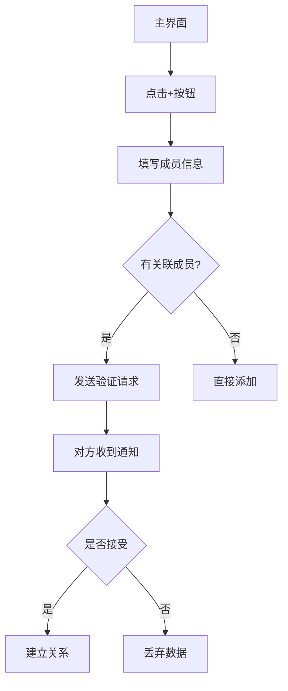

# study-schedule

------

## **一、核心基础功能**

### **用户系统**

- 注册/登录（手机号、邮箱、第三方登录如微信/Google）
- 个人资料管理（头像、昵称、性别等）
- 账户安全（密码修改、绑定手机/邮箱、注销账号）

### 消息通知

- 系统通知（站内信、推送通知）
- 用户互动通知（评论、点赞、私信）
- 推送设置（权限管理、免打扰模式）

------

## **二、扩展通用功能**

### **社交互动**

- 关注/粉丝系统
- 评论、弹幕、打赏
- 群组/聊天室（即时通讯）

### **系统集成**

- 权限管理（相机、相册、位置等）
- 多语言切换
- 深色模式/主题定制

------

## **三、技术支撑功能**

### 数据分析

- 用户行为统计（埋点分析）
- 崩溃监控（错误日志上报）
- A/B测试（功能优化）

### **跨平台适配**

- 响应式设计（适配不同屏幕）
- 多端兼容（iOS/Android/Web/小程序）

------

## **四、运营相关功能**

- 活动页面（弹窗、横幅广告）
- 邀请奖励（分享得积分）
- 反馈入口（用户建议、客服系统）

------

## **五、家庭族谱

- 展示家庭族谱关系，能完成显示相互的之前的关系，比如父子关系、兄弟关系等
- 新增成员
- 成员同意

Syncfusion Flutter Diagram

# 家庭族谱应用原型设计

## 1. 主界面 - 族谱关系图

```ascii
+-------------------------------------------+
| 张氏家族族谱               [🔍] [⋮]       |
+-------------------------------------------+
|                                               |
|             [👴 张爷爷]                       |
|                |                             |
|         [👵 张奶奶]——[👨 张爸爸]             |
|                     |    \                   |
|            [👩 张妈妈]   [👦 你]             |
|                     |                        |
|                  [👧 妹妹]                   |
|                                               |
|                                               |
+-------------------------------------------+
|                  [⊕]                        |
+-------------------------------------------+
```

**设计要素**：
- `🔍` 搜索按钮 | `⋮` 更多选项
- `⊕` 添加成员悬浮按钮
- 连线颜色规范：
  - 红色：`---` 夫妻关系
  - 蓝色：`|` 父子关系
  - 绿色：`\` 兄弟姐妹关系

## 2. 添加成员表单

```ascii
+-------------------------------------------+
| 添加新成员                                |
|  +-------+                                |
|  |   🖼   | 点击上传照片                   |
|  +-------+                                |
|  姓名: _______________                    |
|  出生日期: _________ ⌄                    |
|  性别: ○ 男 ○ 女 ○ 其他                   |
|  ---------------------------------        |
|  关联现有成员:                             |
|  [张爸爸] 的 [儿子] ⌄                      |
|                                          |
|  [取消]        [发送请求]                  |
+-------------------------------------------+
```

**字段说明**：
1. 头像上传区域（支持拍照/相册）
2. 必填字段：
   - 姓名：文本输入
   - 出生日期：日期选择器
   - 性别：单选按钮组
3. 关系建立：
   - 下拉选择现有成员
   - 下拉选择关系类型

## 3. 关系验证通知

```ascii
+-------------------------------------------+
| 🔔 关系验证请求                           |
|                                           |
| 李四请求添加您为父亲                      |
|                                           |
|    [👴 您]                                |
|       |?                                  |
|    [👦 李四]                              |
|                                           |
| 这将在族谱中建立父子关系                  |
|                                           |
|  [拒绝]      [接受]                       |
+-------------------------------------------+
```

**交互逻辑**：
- `?` 表示待确认关系线（显示为虚线）
- 点击操作后的反馈：
  - 接受 → 关系线变实线
  - 拒绝 → 显示"已拒绝"提示

## 4. 成员详情页

```ascii
+-------------------------------------------+
|  +-------------------+                    |
|  |                   |                    |
|  |    成员头像       |                    |
|  |                   |                    |
|  +-------------------+                    |
|                                           |
|  🏷️ 姓名: 张爸爸                          |
|  🎂 出生: 1975年8月12日                   |
|  ⚤ 性别: 男                              |
|                                           |
|  🔗 关系网络:                             |
|   • 父亲: 张爷爷                          |
|   • 配偶: 张妈妈                          |
|   • 儿子: 你                              |
|   • 女儿: 妹妹                            |
|                                           |
|  [编辑]      [分享]                       |
+-------------------------------------------+
```

**功能按钮**：
- 编辑：跳转至编辑表单
- 分享：生成分享链接/图片

## 数据存储结构（参考）

```yaml
# 成员数据示例
members:
  - id: 1
    name: "张爷爷"
    birth: "1940-05-01"
    gender: "male"
    photo: "avatar1.jpg"
    
# 关系数据示例 
relationships:
  - from: 1
    to: 2
    type: "spouse"
    confirmed: true
```

## 交互流程图



将此内容保存为`family_tree_prototype.md`即可获得完整文档。如需补充其他部分（如错误状态、加载状态等），请随时告知。

