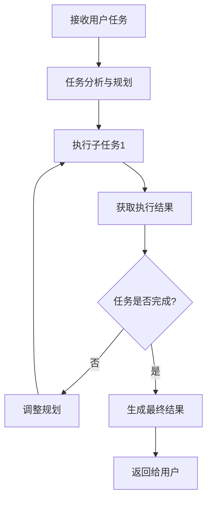

# AI 技术全指南

## 1. 简介

人工智能（Artificial Intelligence，简称 AI）是计算机科学的重要分支，致力于开发能够模拟人类智能行为的系统。本指南涵盖了 AI 领域的核心概念、最新技术、主流工具以及实践应用，旨在为读者提供全面的 AI 技术参考。

## 2. 核心概念

### 2.1 基础概念

- **AI（人工智能）**：计算机科学领域，致力于解决与人类智慧相关的认知问题，如学习、创造和图像识别等。目标是建立能从数据中获取有用知识的自学习系统。

- **AIGC（生成式人工智能）**：机器学习的分支，能够创造新内容和想法，包括对话、故事、图片、视频和音乐。ChatGPT 和 Sora 等都是 AIGC 技术的应用。

- **AGI（通用人工智能）**：具有自主自控能力、自我理解能力以及学习新技能的 AI 系统。能处理未训练过的复杂问题，在存在不确定性时进行推理，甚至使用策略解决问题。目前仍处于理论研究阶段。

- **Agent（AI 代理）**：能够自主执行任务、做出决策并与环境交互的 AI 系统。通常具有感知、推理、规划和执行能力，可以根据目标自主完成复杂任务。

- **Skill（AI 技能）**：AI 系统具备的特定能力，如文本生成、图像识别、语音合成等。在 Agent 系统中，技能通常以模块化形式存在，可被组合使用以完成复杂任务。

- **MDC（多模态对话系统）**：能够处理和生成多种模态信息（如文本、图像、语音、视频等）的对话系统。可理解和响应来自不同模态的输入，提供更自然丰富的交互体验。

- **算法**：一组明确的、有序的步骤或规则，用于解决特定问题或执行某项任务。是计算机科学的核心概念之一，也是许多其他学科的基础。

- **大模型**：参数量巨大、训练数据丰富的 AI 模型，如 GPT-4、Claude 3、文心一言等。通常具有更强的泛化能力和任务适应能力，可在多种任务上表现出色。

- **微调**：在预训练大模型基础上，使用特定领域的数据进行进一步训练，以提高模型在该领域的性能。是大模型适应特定任务的常用方法。

- **提示工程**：设计和优化输入提示（Prompt）以引导 AI 模型生成期望输出的过程。是充分发挥大模型能力的重要技巧。

- **RAG（检索增强生成）**：在生成回答前，先从外部知识库中检索相关信息，然后将这些信息与用户问题一起输入模型，以生成更准确、更可靠的回答。

- **多模态学习**：同时处理和理解多种模态信息（如文本、图像、语音等）的机器学习方法。可捕捉不同模态之间的关联，提高模型的理解和生成能力。

### 2.2 模型概念

- **机器学习**：AI 的重要分支，通过数据和算法使计算机系统能够自主学习和改进，无需人为编程。核心是开发能从数据中提取特征并做出预测或决策的算法。分为监督学习（数据有标签）和无监督学习（数据无标签）。

- **深度学习**：机器学习的分支，使用多层神经网络模拟人脑学习过程。可通过访问更多数据来持续提升性能，适用于复杂任务如驾驶汽车、医学影像诊断等。

- **神经网络**：以类似于人脑的方式做出决策的机器学习模型，通过模仿生物神经元协同工作方式来识别现象、权衡利弊并得出结论。

- **NLP（自然语言处理）**：计算机科学和 AI 的重要领域，旨在使计算机能够理解、解释、生成和响应人类自然语言。结合了语言学、计算机科学和统计学知识。

- **RNN（循环神经网络）**：使用序列数据或时序数据的人工神经网络，常用于语言翻译、自然语言处理、语音识别、图像字幕等顺序或时间相关问题。

- **LLM（大语言模型）**：基于神经网络的模型，利用机器学习技术理解和生成人类语言。通常运用自然语言处理技术处理和计算输出，如 GPT-4、文心一言、通义千问等。

## 3. 技术栈与框架

### 3.1 学习框架

**主流框架**：TensorFlow、PyTorch、Keras、PaddlePaddle

### 3.2 常用的主流组件

#### 3.2.1 大模型服务组件
- **OpenAI API**：提供对 GPT 系列模型的访问接口，支持文本生成、嵌入、语音转文本等功能。
- **Hugging Face Transformers**：提供预训练模型的加载、使用和微调工具，支持多种模型架构。
- **LangChain**：用于构建基于大语言模型的应用框架，提供链式调用、工具集成、记忆管理等功能。
- **LlamaIndex**：专注于 RAG（检索增强生成）应用的框架，提供文档索引、检索和集成功能。
- **FastAPI**：用于构建高性能 API 服务的 Python 框架，常用于部署大模型推理服务。

#### 3.2.2 数据处理组件
- **Pandas**：用于数据清洗、转换和分析的 Python 库，是 AI 数据处理的基础工具。
- **NumPy**：用于科学计算的 Python 库，提供高效的数组操作和数学函数。
- **Matplotlib/Seaborn**：用于数据可视化的 Python 库，帮助分析和展示数据特征。
- **scikit-learn**：提供传统机器学习算法的 Python 库，包括分类、回归、聚类等算法。

#### 3.2.3 部署和监控组件
- **Docker**：容器化平台，用于封装和部署 AI 模型和应用，确保环境一致性。
- **Kubernetes**：容器编排平台，用于管理和扩展 AI 服务的部署。
- **Prometheus/Grafana**：用于监控 AI 服务的性能和健康状态，提供实时指标和告警。
- **MLflow**：用于机器学习生命周期管理的平台，包括实验跟踪、模型注册和部署。

## 4. 最新技术与行业应用

### 4.1 大语言模型技术
- **GPT 系列**：OpenAI 开发的大语言模型，包括 GPT-3.5、GPT-4、GPT-4o 等，在文本生成、问答、代码生成等任务上表现出色。
- **Claude 系列**：Anthropic 开发的大语言模型，包括 Claude 2、Claude 3 等，以安全性和长上下文理解能力著称。
- **文心一言**：百度开发的大语言模型，支持多模态交互，在中文理解和生成方面表现优异。
- **通义千问**：阿里巴巴开发的大语言模型，支持多语言、多模态，在商业应用场景中表现突出。
- **讯飞星火**：科大讯飞开发的大语言模型，在语音识别和多模态交互方面具有优势。

### 4.2 多模态技术
- **Sora**：OpenAI 开发的文本到视频生成模型，可根据文本描述生成高质量、连贯的视频。
- **DALL-E 3**：OpenAI 开发的文本到图像生成模型，可根据详细的文本描述生成准确、创意的图像。
- **MidJourney**：独立研究实验室开发的文本到图像生成模型，以生成艺术风格的图像见长。
- **Gemini**：Google 开发的多模态大模型，支持文本、图像、音频、视频等多种模态的理解和生成。

### 4.3 行业应用技术
- **智能客服**：基于大语言模型的智能客服系统，可理解用户意图，提供个性化的服务和解决方案。
- **代码生成**：如 GitHub Copilot、Cursor 等工具，利用 AI 辅助开发者编写代码，提高开发效率。
- **医疗 AI**：用于医学影像诊断、疾病预测、药物研发等领域，如 IBM Watson Health、推想医疗等。
- **自动驾驶**：如特斯拉 FSD、Waymo 等，利用计算机视觉、传感器融合等技术实现车辆的自动导航和控制。
- **智能推荐**：如抖音、淘宝等平台的推荐系统，利用机器学习算法分析用户行为，提供个性化的内容和商品推荐。

## 5. AI 编程工具

### 5.1 主流 AI 编程工具对比

| 工具名称 | 开发公司/组织 | 主要功能 | 优势 | 劣势 | 适用场景 |
| --- | --- | --- | --- | --- | --- |
| GitHub Copilot | GitHub + OpenAI | 代码自动补全、生成、解释 | 集成 IDE、支持多种语言、上下文理解强 | 订阅费用较高、离线使用受限 | 日常开发、代码编写辅助 |
| Cursor | Cursor Team | 智能代码编辑器、AI 聊天、重构建议 | 专注于 AI 编程体验、代码理解能力强 | 生态系统相对较小 | 代码开发、重构、理解 |
| TabNine | TabNine | 代码补全、智能提示 | 支持多种 IDE、离线模式 | 生成质量相对较弱 | 快速代码补全、辅助编码 |
| Amazon CodeWhisperer | AWS | 代码生成、安全扫描 | 与 AWS 服务集成、免费使用额度 | 对非 AWS 用户价值有限 | AWS 相关项目开发 |
| Claude Code | Anthropic | 代码生成、解释、调试 | 长上下文理解、代码质量高 | API 调用费用 | 复杂代码开发、代码审查 |
| GPT Engineer | OpenAI | 基于提示生成完整项目 | 快速原型开发、项目结构生成 | 生成质量不稳定 | 快速项目启动、原型开发 |
| Devin | Cognition AI | 自主开发代理、端到端任务完成 | 自主性强、能处理复杂任务 | 仍在开发中、访问受限 | 复杂软件开发任务 |

### 5.2 最新 AI 编程工具使用情况

- **GitHub Copilot X**：集成了 GPT-4，支持更高级的代码理解和生成，包括自然语言到代码的转换、代码解释、测试生成等功能。

- **Cursor 4**：引入了 "Command K" 功能，可通过自然语言指令控制编辑器，支持更复杂的代码操作和重构。

- **Claude 3 Code**：利用 Claude 3 的长上下文能力，支持处理大型代码库，提供更准确的代码生成和解释。

- **Devin**：作为第一个 AI 软件工程师，能够自主完成端到端的软件开发任务，包括代码编写、调试、测试和部署。

- **Codeium**：免费的 AI 编程工具，提供代码补全、搜索和生成功能，支持多种 IDE 和语言。

## 6. AI 编程最佳实践

### 6.1 提示工程最佳实践

- **明确任务目标**：清晰描述需要 AI 完成的具体任务，包括输入输出格式、约束条件等。
- **提供上下文信息**：包含相关的代码片段、项目结构、依赖关系等，帮助 AI 理解代码环境。
- **使用结构化提示**：采用分步骤的提示结构，引导 AI 逐步完成复杂任务。
- **示例引导**：提供 1-2 个示例，展示期望的输入输出格式和风格。
- **迭代优化**：根据 AI 的输出结果，不断调整和优化提示，提高生成质量。

### 6.2 代码质量保证

- **代码审查**：对 AI 生成的代码进行严格审查，确保逻辑正确、安全性高。
- **测试覆盖**：为 AI 生成的代码编写单元测试和集成测试，验证功能正确性。
- **代码风格**：确保 AI 生成的代码符合项目的代码风格规范，如 PEP 8（Python）、Google Java Style 等。
- **性能优化**：评估 AI 生成代码的性能，必要时进行优化，避免引入性能瓶颈。

### 6.3 开发流程集成

- **需求分析**：使用 AI 辅助分析和整理需求，生成详细的需求文档。
- **设计阶段**：利用 AI 生成系统架构、数据结构和 API 设计方案。
- **编码阶段**：结合 AI 工具加速代码编写，同时保持对代码的控制权。
- **测试阶段**：使用 AI 生成测试用例，提高测试覆盖率和效率。
- **文档编写**：让 AI 辅助生成技术文档、API 文档和用户手册。

### 6.4 常见问题与解决方案

- **代码错误**：当 AI 生成的代码存在错误时，提供具体的错误信息和上下文，让 AI 自行修复。
- **逻辑偏差**：如果 AI 生成的代码逻辑与预期不符，明确指出偏差点，提供更详细的需求说明。
- **过度复杂**：当 AI 生成的代码过于复杂时，要求其简化实现，遵循 "简单优于复杂" 的原则。
- **安全性问题**：提醒 AI 注意代码安全性，避免生成包含安全漏洞的代码。

## 7. 大语言模型

### 7.1 基本原理

大语言模型（LLM）是基于 Transformer 架构的深度神经网络模型，通过学习大量文本数据来理解和生成人类语言。其核心原理包括：

- **自监督学习**：通过预测文本序列中的下一个词来学习语言规律，无需人工标注数据。
- **注意力机制**：通过自注意力机制捕捉文本中不同位置之间的依赖关系，理解上下文含义。
- **海量参数**：拥有数十亿甚至数千亿个参数，能够存储和处理复杂的语言知识。
- **迁移学习**：通过预训练学习通用语言能力，然后通过微调适应特定任务。

### 7.2 发展历程

| 时间 | 模型名称 | 参数量 | 主要贡献 |
| --- | --- | --- | --- |
| 2017 | Transformer | - | 提出自注意力机制，奠定 LLM 基础 |
| 2018 | BERT | 3.4 亿 | 双向注意力机制，刷新 NLP 任务基准 |
| 2019 | GPT-2 | 15 亿 | 零样本学习能力，生成连贯文本 |
| 2020 | GPT-3 | 1750 亿 | Few-shot 学习能力，通用任务表现优异 |
| 2022 | ChatGPT | 1750 亿+ | 对话能力突破，引爆 AI 热潮 |
| 2023 | GPT-4 | 约 1.76 万亿 | 多模态能力，专业领域表现接近人类专家 |
| 2024 | GPT-4o | - | 实时多模态交互，理解能力进一步提升 |

### 7.3 技术挑战

- **计算资源需求**：训练和推理需要大量 GPU/TPU 资源，成本高昂。
- **数据质量与隐私**：需要高质量、多样化的训练数据，同时要保护用户隐私。
- **模型对齐**：确保模型输出符合人类价值观和伦理标准。
- **幻觉问题**：模型可能生成看似合理但事实上错误的信息。
- **上下文长度限制**：虽然不断提升，但仍有限制，影响长文本处理能力。

### 7.4 应用场景

- **自然语言处理**：文本分类、情感分析、机器翻译、摘要生成等。
- **对话系统**：智能客服、个人助手、教育辅导等。
- **内容创作**：文章写作、文案生成、剧本创作、代码编写等。
- **知识问答**：基于知识的问答、信息检索、智能搜索等。
- **多模态交互**：图文生成、视频理解、语音交互等。

### 7.5 评估指标

- **困惑度（Perplexity）**：衡量模型预测文本的能力，值越低越好。
- **BLEU/ROUGE**：评估生成文本与参考文本的相似度。
- **人类评估**：通过人类评判来评估模型输出的质量、相关性和准确性。
- **专业领域测试**：使用特定领域的测试集评估模型在专业任务上的表现。
- **安全性评估**：测试模型对有害提示的响应，确保输出安全。

## 8. Agent 技术

### 8.1 基本原理

Agent 是一种能够自主执行任务、做出决策并与环境交互的 AI 系统。其核心组件包括：

- **感知模块**：接收和处理来自环境的信息，如用户输入、工具执行结果等。
- **决策模块**：基于感知到的信息和内部状态，决定下一步行动。
- **执行模块**：执行决策结果，如调用工具、生成输出等。
- **记忆模块**：存储和管理历史交互信息，为决策提供上下文支持。
- **规划模块**：将复杂任务分解为可执行的子任务序列。

### 8.2 工作流程



### 8.3 实践样例

#### 8.3.1 示例 1：基于 LangChain 的简单 Agent

```python
from langchain.agents import initialize_agent, AgentType
from langchain.chat_models import ChatOpenAI
from langchain.tools import SerpAPIWrapper, Tool

# 初始化工具
search = SerpAPIWrapper()
tools = [
    Tool(
        name="Search",
        func=search.run,
        description="用于搜索最新信息，如新闻、天气、事件等"
    )
]

# 初始化 LLM
llm = ChatOpenAI(model_name="gpt-4", temperature=0)

# 初始化 Agent
agent = initialize_agent(
    tools,
    llm,
    agent=AgentType.CHAT_ZERO_SHOT_REACT_DESCRIPTION,
    verbose=True
)

# 使用 Agent
result = agent.run("今天北京的天气如何？未来三天的天气预报是什么？")
print(result)
```

#### 8.3.2 示例 2：带记忆功能的 Agent

```python
from langchain.agents import initialize_agent, AgentType
from langchain.chat_models import ChatOpenAI
from langchain.memory import ConversationBufferMemory
from langchain.tools import SerpAPIWrapper, Tool

# 初始化工具
search = SerpAPIWrapper()
tools = [
    Tool(
        name="Search",
        func=search.run,
        description="用于搜索最新信息"
    )
]

# 初始化记忆
memory = ConversationBufferMemory(memory_key="chat_history", return_messages=True)

# 初始化 LLM
llm = ChatOpenAI(model_name="gpt-4", temperature=0)

# 初始化 Agent
agent = initialize_agent(
    tools,
    llm,
    agent=AgentType.CHAT_CONVERSATIONAL_REACT_DESCRIPTION,
    memory=memory,
    verbose=True
)

# 多轮对话
agent.run("北京有哪些著名的旅游景点？")
agent.run("其中哪些景点适合带小孩去？")
```

#### 8.3.3 示例 3：自定义工具的 Agent

```python
from langchain.agents import initialize_agent, AgentType
from langchain.chat_models import ChatOpenAI
from langchain.tools import Tool

# 自定义工具函数
def get_weather(city):
    """获取指定城市的天气信息"""
    # 模拟数据，实际应用中可调用真实天气 API
    weather_data = {
        "北京": "晴，20-28°C",
        "上海": "多云，18-25°C",
        "广州": "雷阵雨，23-30°C"
    }
    return weather_data.get(city, "未找到该城市的天气信息")

def calculate(expression):
    """计算数学表达式的值"""
    try:
        result = eval(expression)
        return f"计算结果：{result}"
    except Exception as e:
        return f"计算错误：{str(e)}"

# 初始化工具
tools = [
    Tool(
        name="Weather",
        func=get_weather,
        description="用于获取指定城市的天气信息"
    ),
    Tool(
        name="Calculator",
        func=calculate,
        description="用于计算数学表达式的值"
    )
]

# 初始化 LLM
llm = ChatOpenAI(model_name="gpt-4", temperature=0)

# 初始化 Agent
agent = initialize_agent(
    tools,
    llm,
    agent=AgentType.ZERO_SHOT_REACT_DESCRIPTION,
    verbose=True
)

# 使用 Agent
agent.run("北京的天气如何？3加5乘2等于多少？")
```

### 8.4 开发最佳实践

- **明确职责边界**：定义 Agent 能够处理和不能处理的任务范围，避免超出能力范围的请求。
- **选择合适模型**：根据任务复杂度和需求，选择合适的 LLM 作为 Agent 的核心引擎。
- **设计有效工具集**：为 Agent 提供必要的工具，使其能够与外部世界交互，完成复杂任务。
- **实现合理记忆机制**：根据任务类型，设计合适的记忆策略，平衡上下文理解和资源消耗。
- **优化决策逻辑**：通过提示工程和规则设计，提高 Agent 的决策质量和执行效率。
- **持续评估与改进**：定期评估 Agent 的性能，收集用户反馈，不断优化 Agent 的设计和实现。

### 8.5 应用场景

- **智能客服**：自主处理客户咨询，提供个性化服务。
- **个人助理**：管理日程、处理邮件、提供信息查询等。
- **科研助手**：文献搜索、实验设计、数据分析等。
- **教育导师**：个性化学习计划、答疑解惑、作业辅导等。
- **软件开发**：代码生成、调试、测试、文档编写等。

## 9. 常见面试题目与解答

### 9.1 基础概念类

**1. 请解释什么是人工智能 (AI)，并简要说明其发展历程。**

人工智能是计算机科学的一个分支，旨在开发能够模拟人类智能行为的系统。其发展历程可分为以下几个阶段：
- **早期阶段（1950s-1970s）**：符号主义占主导，如逻辑推理、专家系统等。
- **中期阶段（1980s-2000s）**：连接主义兴起，神经网络技术得到发展，但受限于计算能力。
- **现代阶段（2010s至今）**：深度学习爆发，大数据和 GPU 计算能力的提升推动了 AI 的快速发展，大语言模型、计算机视觉等技术取得重大突破。

**2. 请解释机器学习、深度学习和人工智能之间的关系。**

三者是包含与被包含的关系：
- **人工智能**是最广泛的概念，指所有模拟人类智能的技术。
- **机器学习**是人工智能的一个重要分支，通过数据和算法使计算机能够自主学习和改进。
- **深度学习**是机器学习的一个子集，使用多层神经网络来模拟人脑的学习过程，是当前 AI 发展的核心技术之一。

**3. 请解释什么是大语言模型 (LLM)，并列举几个知名的大语言模型。**

大语言模型是指参数量巨大、训练数据丰富的语言模型，能够理解和生成人类语言。知名的大语言模型包括：
- OpenAI 的 GPT 系列（GPT-3.5、GPT-4、GPT-4o）
- Anthropic 的 Claude 系列（Claude 2、Claude 3）
- 百度的文心一言
- 阿里巴巴的通义千问
- 科大讯飞的讯飞星火

### 9.2 技术原理类

**4. 请解释什么是 Transformer 架构，它在大语言模型中的作用是什么？**

Transformer 是一种基于自注意力机制的神经网络架构，由 Google 于 2017 年提出。它在大语言模型中的作用包括：
- **并行计算**：相比 RNN，Transformer 可以并行处理序列数据，提高训练效率。
- **长距离依赖**：通过自注意力机制，Transformer 可以捕捉序列中长距离的依赖关系。
- **可扩展性**：Transformer 架构易于扩展到更大的模型和更多的数据，为大语言模型的发展奠定了基础。

**5. 请解释什么是 RAG（检索增强生成），它的工作原理和优势是什么？**

RAG 是检索增强生成的缩写，是一种结合了信息检索和生成模型的技术。其工作原理是：
1. 当用户提出问题时，首先从外部知识库中检索与问题相关的信息。
2. 将检索到的信息与用户问题一起输入到生成模型中。
3. 生成模型基于这些信息生成回答。

RAG 的优势包括：
- **提高准确性**：通过引入外部知识，减少模型的幻觉现象。
- **实时更新**：可以通过更新知识库来获取最新信息，而无需重新训练模型。
- **降低成本**：相比微调，RAG 的实现成本更低。

**6. 请解释什么是提示工程（Prompt Engineering），并举例说明如何设计有效的提示。**

提示工程是设计和优化输入提示以引导 AI 模型生成期望输出的过程。设计有效提示的技巧包括：
- **明确任务**：清晰说明模型需要完成的任务。
- **提供示例**：通过 few-shot 学习，提供少量示例帮助模型理解任务。
- **指定格式**：明确要求模型输出的格式，如 JSON、列表等。
- **增加约束**：添加约束条件，如长度限制、内容要求等。

示例：设计一个提示让模型生成产品描述
```
请为一款智能手表生成一段产品描述，要求：
1. 突出其健康监测功能（心率、睡眠、运动追踪）
2. 强调其续航能力（最长 14 天）
3. 描述其外观设计（轻薄、时尚）
4. 适合人群（运动爱好者、健康关注者）
5. 字数控制在 100-150 字之间
```

### 9.3 应用实践类

**7. 请说明如何将大语言模型应用到企业客服场景中，需要考虑哪些因素？**

将大语言模型应用到企业客服场景的步骤和考虑因素包括：
- **需求分析**：明确客服场景的具体需求，如常见问题、业务流程等。
- **数据准备**：收集和整理企业的知识库、历史客服记录等数据。
- **模型选择**：根据需求选择合适的模型，如开源模型或 API 服务。
- **系统集成**：将模型集成到现有的客服系统中，如聊天机器人、工单系统等。
- **RAG 实现**：构建企业知识库的检索系统，确保模型能够获取最新、准确的信息。
- **监控与优化**：实时监控系统性能，收集用户反馈，不断优化提示和系统设计。
- **安全与合规**：确保系统处理用户数据的安全性，遵守相关法规和隐私政策。

**8. 请解释什么是 Agent，以及如何构建一个基于大语言模型的 Agent 系统。**

Agent 是指能够自主执行任务、做出决策并与环境交互的 AI 系统。构建基于大语言模型的 Agent 系统的步骤包括：
- **定义目标**：明确 Agent 需要完成的任务和目标。
- **选择模型**：选择适合任务的大语言模型作为核心引擎。
- **设计工具**：为 Agent 提供必要的工具，如搜索引擎、计算器、API 调用等。
- **实现记忆**：设计 Agent 的记忆机制，使其能够存储和利用历史交互信息。
- **规划与执行**：实现 Agent 的任务规划和执行逻辑，使其能够分解复杂任务并逐步完成。
- **评估与优化**：通过测试和用户反馈，不断优化 Agent 的性能和可靠性。

**9. 请说明在部署大语言模型时需要考虑哪些因素，以及如何优化模型的推理性能。**

部署大语言模型时需要考虑的因素包括：
- **硬件资源**：选择合适的硬件，如 GPU、TPU 等，确保足够的计算能力和内存。
- **模型压缩**：通过量化、剪枝等技术减少模型大小，提高推理速度。
- **批处理**：优化批处理策略，提高 GPU 利用率。
- **缓存优化**：合理使用缓存，减少重复计算。
- **服务架构**：设计可扩展的服务架构，如负载均衡、自动扩缩容等。
- **监控与告警**：实时监控系统性能，及时发现和解决问题。

优化模型推理性能的方法包括：
- **使用模型量化**：如 INT8 量化，减少模型大小和计算量。
- **采用轻量级模型**：如 DistilBERT、TinyGPT 等，在保证性能的同时提高速度。
- **使用推理加速库**：如 ONNX Runtime、TensorRT 等，优化模型推理。
- **边缘部署**：将模型部署到边缘设备，减少网络延迟。

### 9.4 前沿趋势类

**10. 请谈谈你对 AGI（通用人工智能）的理解，以及当前 AI 发展距离 AGI 还有多远？**

AGI 是指具有与人类相当或超越人类智能的人工智能系统，能够理解、学习和执行任何人类可以完成的智力任务。当前 AI 发展距离 AGI 还有相当的距离，主要体现在以下几个方面：
- **常识推理**：当前 AI 模型在常识推理方面仍有不足，难以像人类一样理解世界的基本规律。
- **自主学习**：AI 模型需要大量标注数据和人类指导，难以像人类一样自主学习新知识和技能。
- **情感理解**：AI 模型难以真正理解和表达情感，缺乏人类的情感智能。
- **创造力**：虽然 AI 可以生成创意内容，但真正的创造力（如科学发现、艺术创作）仍属于人类。
- **伦理与价值观**：AI 缺乏人类的伦理判断和价值观，难以在复杂情境中做出符合人类道德标准的决策。

尽管如此，AI 技术的发展速度非常快，特别是大语言模型和多模态技术的突破，为 AGI 的实现奠定了基础。未来，随着技术的不断进步，我们可能会逐渐接近 AGI 的目标。

## 10. 参考资源

### 10.1 基础资源
- **什么是人工智能 (AI)**：https://www.ibm.com/cn-zh/topics?topic=all&page=1
- **什么是机器学习**：https://www.ibm.com/cn-zh/think/topics/machine-learning
- **什么是深度学习**：https://www.ibm.com/cn-zh/think/topics/deep-learning
- **大语言模型**：
  - https://zhuanlan.zhihu.com/p/670574382
  - https://www.aiease.net/?p=5936
- **核心流派、算法原理与实战解析**：https://www.woshipm.com/ai/6202602.html
- **人工智能入门指南**：https://zhuanlan.zhihu.com/p/703098876

### 10.2 最新技术参考
- **OpenAI 官方博客**：https://openai.com/blog
- **Anthropic 官方博客**：https://www.anthropic.com/index
- **Hugging Face 模型库**：https://huggingface.co/models
- **LangChain 官方文档**：https://python.langchain.com/docs/get_started/introduction
- **LlamaIndex 官方文档**：https://docs.llamaindex.ai/en/stable/
- **百度文心一言官网**：https://yiyan.baidu.com/
- **阿里巴巴通义千问官网**：https://tongyi.aliyun.com/
- **科大讯飞星火认知大模型官网**：https://xinghuo.xfyun.cn/