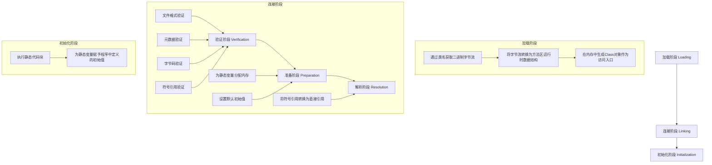
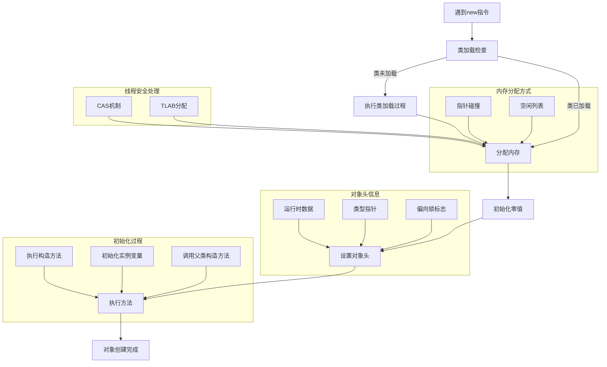
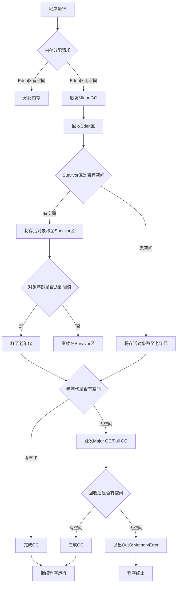

# JVM 核心技术指南

## 目录

### 第一部分：JVM 基础概念
1.1 [JVM 是什么](#11-jvm-是什么)
1.2 [JVM 的作用](#12-jvm-的作用)
1.3 [JVM 的优势](#13-jvm-的优势)
1.4 [JVM 的位置](#14-jvm-的位置)
1.5 [JVM 的整体架构](#15-jvm-的整体架构)

### 第二部分：JVM 内存结构
2.1 [程序计数器](#21-程序计数器)
2.2 [Java 虚拟机栈](#22-java-虚拟机栈)
2.3 [本地方法栈](#23-本地方法栈)
2.4 [Java 堆](#24-java-堆)
2.5 [方法区](#25-方法区)
2.6 [运行时常量池](#26-运行时常量池)
2.7 [直接内存](#27-直接内存)
2.8 [内存结构总结](#28-内存结构总结)

### 第三部分：类加载机制
3.1 [类加载的时机](#31-类加载的时机)
3.2 [类加载的过程](#32-类加载的过程)
3.3 [类加载器](#33-类加载器)
3.4 [类加载器的总结](#34-类加载器的总结)

### 第四部分：字节码技术
4.1 [字节码的基本概念](#41-字节码的基本概念)
4.2 [字节码的结构](#42-字节码的结构)
4.3 [字节码的执行过程](#43-字节码的执行过程)
4.4 [字节码增强技术](#44-字节码增强技术)
4.5 [字节码增强的实现方式](#45-字节码增强的实现方式)
4.6 [字节码增强的应用场景](#46-字节码增强的应用场景)
4.7 [字节码增强的注意事项](#47-字节码增强的注意事项)
4.8 [总结](#48-总结)

### 第五部分：内存分配与回收
5.1 [内存分配方式](#51-内存分配方式)
5.2 [内存分配策略](#52-内存分配策略)

### 第六部分：垃圾回收基础
6.1 [GC 名词概念](#61-gc-名词概念)
6.2 [GC Root](#62-gc-root)
6.3 [三色标记](#63-三色标记)

### 第七部分：垃圾回收算法
7.1 [标记-清除算法](#71-标记-清除算法)
7.2 [复制算法](#72-复制算法)
7.3 [标记-整理算法](#73-标记-整理算法)
7.4 [分代收集算法](#74-分代收集算法)
7.5 [垃圾回收算法对比](#75-垃圾回收算法对比)

### 第八部分：垃圾回收器
8.1 [垃圾回收器概述](#81-垃圾回收器概述)
8.2 [Serial 收集器](#82-serial-收集器)
8.3 [Serial Old 收集器](#83-serial-old-收集器)
8.4 [ParNew 收集器](#84-parnew-收集器)
8.5 [Parallel Scavenge 收集器](#85-parallel-scavenge-收集器)
8.6 [Parallel Old 收集器](#86-parallel-old-收集器)
8.7 [CMS 收集器](#87-cms-收集器)
8.8 [G1 收集器](#88-g1-收集器)
8.9 [ZGC 收集器](#89-zgc-收集器)
8.10 [Shenandoah 收集器](#810-shenandoah-收集器)
8.11 [垃圾回收器选择建议](#811-垃圾回收器选择建议)

### 第九部分：GC 执行与调优
9.1 [GC 执行过程](#91-gc-执行过程)
9.2 [完整GC执行流程](#92-完整gc执行流程)
9.3 [分代执行过程](#93-分代执行过程)
9.4 [GC 日志分析](#94-gc-日志分析)
9.5 [Mixed GC](#95-mixed-gc)

### 第十部分：JVM 面试题解析
10.1 [基础面试题](#101-基础面试题)
10.2 [进阶面试题](#102-进阶面试题)
10.3 [高级面试题](#103-高级面试题)

### 第十一部分：高级 JVM 问题与难点
11.1 [内存管理难点](#111-内存管理难点)
11.2 [性能优化难点](#112-性能优化难点)
11.3 [并发与线程安全](#113-并发与线程安全)

### 第十二部分：参考链接
12.1 [官方文档](#121-官方文档)
12.2 [技术博客](#122-技术博客)
12.3 [工具与资源](#123-工具与资源)
12.4 [视频教程](#124-视频教程)
12.5 [社区与论坛](#125-社区与论坛)

### 第十三部分：JVM参数解析
15. [JVM参数解析](#15-jvm参数解析)

## 1. 简介

本指南详细介绍Java虚拟机（JVM）的核心概念、工作原理、垃圾回收机制以及性能调优策略，旨在帮助开发者深入理解JVM内部机制，从而编写更高效的Java应用并进行有效的性能优化。

主要聚焦于HotSpot JVM，这是目前应用最广泛的JVM实现。

## 2. JVM背景与历史

### 2.1 发展历程

JVM（Java Virtual Machine）的历史可以追溯到1990年代初，当时Sun Microsystems公司的James Gosling领导的团队开始开发一种名为"Green Project"的编程语言，旨在为消费电子产品创建一种可移植的编程解决方案。

1. **1991年**：Green Project启动，开发了一种名为Oak的编程语言，这是Java的前身。

2. **1995年**：Sun正式发布Java 1.0，同时推出了JVM规范。JVM的设计理念是"一次编写，到处运行"（Write Once, Run Anywhere），通过将Java代码编译为字节码，然后由不同平台上的JVM解释执行，实现了跨平台兼容性。

3. **1997年**：Java 1.1发布，引入了JIT（Just-In-Time）编译器，显著提高了Java程序的执行效率。

4. **2000年**：Java 2平台发布，包括J2SE、J2EE和J2ME三个版本，JVM也得到了相应的增强。

5. **2006年**：Sun宣布Java技术开源，成立了OpenJDK项目，JVM的开发开始由社区共同参与。

6. **2009年**：Oracle收购Sun Microsystems，成为Java和JVM的新所有者。

7. **2014年**：Java 8发布，引入了Lambda表达式、Stream API等重要特性，同时JVM在性能和垃圾回收方面也有了显著改进。

8. **2018年**：Java 11发布，这是第一个长期支持（LTS）版本，同时引入了ZGC等新的垃圾回收器。

9. **2021年**：Java 17发布，这是最新的LTS版本，进一步增强了JVM的性能和功能。

### 2.2 技术演进

JVM的技术演进主要体现在以下几个方面：

1. **执行引擎优化**：从最初的纯解释执行，到引入JIT编译器，再到分层编译（Tiered Compilation），不断提高Java程序的执行效率。

   ### 执行引擎演进流程图

   ```mermaid
   flowchart TD
       A[Java源代码] --> B[编译为字节码]
       B --> C{执行方式选择}
       
       subgraph 纯解释执行
       C1[解释器逐行翻译字节码]
       C1 --> D1[实时执行机器码]
       end
       
       subgraph JIT编译
       C2[热点探测]
       C2 --> D2[识别频繁执行代码]
       D2 --> E2[JIT编译为优化机器码]
       E2 --> F2[缓存并执行编译后代码]
       end
       
       subgraph 分层编译
       C3[分层编译策略]
       C3 --> D3[第0层：纯解释执行+收集统计信息]
       D3 --> E3{代码热度检查}
       E3 -->|热点代码| F3[第1层：C1快速编译]
       F3 --> G3{进一步优化}
       G3 -->|需要更多优化| H3[第2层：C1带profiling编译]
       H3 --> I3[第3层：C2深度优化编译]
       end
       C -->|默认策略| C3
   ```
   
   **纯解释执行**：
   
   - **基本概念**：解释器逐行读取字节码指令，实时翻译成机器码并执行
- **原理**：无需编译过程，直接执行字节码
   - **优点**：启动速度快，内存占用小
   - **缺点**：执行效率低，无法充分利用硬件性能
   - **注意事项**：适用于启动时间敏感、执行时间短的应用场景
   
   **JIT编译器**：
   
- **基本概念**：Just-In-Time编译器，将热点代码（频繁执行的代码）编译为本地机器码并缓存
   - **原理**：通过热点探测识别频繁执行的代码片段，将其编译为优化的机器码
   - **优点**：热点代码执行效率接近原生代码，大幅提升应用性能
   - **缺点**：编译过程需要时间和内存，可能影响启动速度
   - **注意事项**：编译开销与执行收益需要平衡，适用于长时间运行的应用
   
   **分层编译**：
- **基本概念**：结合了解释器和JIT编译器的优点，将编译过程分为多个层次
   - **原理**：
     - 第0层：纯解释执行，收集执行统计信息
     - 第1层：C1编译器（客户端编译器），快速编译出简单优化的代码
     - 第2层：C1编译器，带有 profiling 的编译
     - 第3层：C2编译器（服务器编译器），进行深度优化的编译
   - **优点**：兼顾启动速度和执行效率，根据代码热度动态调整编译策略
   - **缺点**：实现复杂，内存占用较大
   - **注意事项**：默认开启，适用于大多数应用场景，可通过-XX:-TieredCompilation关闭
   
2. **内存管理改进**：从早期的**简单内存模型，到分代收集，再到G1、ZGC等先进的垃圾回收器**，内存管理的效率和可靠性不断提升。

3. **并发处理增强**：引入了更高效的并发数据结构和同步机制，支持更大规模的并发应用。

4. **安全性提升**：不断加强JVM的安全机制，防止恶意代码的执行。

5. **工具链完善**：提供了丰富的监控、诊断和调优工具，如JConsole、VisualVM、JMC等，帮助开发者更好地理解和优化JVM的运行状态。

### 2.3 重要的JVM实现

除了Oracle的HotSpot JVM外，还有其他一些重要的JVM实现：

| JVM实现 | 开发方 | 特点 | 适用场景 |
|--------|-------|------|----------|
| HotSpot | Oracle | 高性能、功能丰富，主流JVM实现 | 大多数Java应用 |
| OpenJ9 | Eclipse基金会 | 低内存占用、快速启动 | 云原生应用、微服务 |
| GraalVM | Oracle | 支持多语言、AOT编译 | 多语言混合开发、高性能计算 |
| Azul Zing | Azul Systems | 低延迟、可预测性强 | 金融交易系统、实时应用 |
| BEA JRockit | Oracle (已整合到HotSpot) | 高性能、低延迟 | 已不再单独使用 |

## 3. JVM架构

### 3.1 整体架构

JVM架构由以下几个主要部分组成：


### 3.2 内存结构

JVM内存结构分为以下几个区域：

#### 3.2.1 程序计数器

程序计数器（Program Counter Register）是一块较小的内存空间，用于保存程序当前执行的指令地址。

- **功能**：当CPU需要执行指令时，从程序计数器中获取当前指令的地址，执行完毕后自动更新为下一条指令的地址。
- **特点**：
  - 线程私有，每个线程都有自己独立的程序计数器
  - 如果线程执行的是非native方法，保存的是当前指令的地址
  - 如果线程执行的是native方法，值为undefined
  - 不会发生内存溢出（OutOfMemoryError）

#### 3.2.2 Java虚拟机栈

Java虚拟机栈（Java Virtual Machine Stack）是Java方法执行的内存模型，每个方法执行时都会创建一个栈帧。

- **栈帧组成**：
  - 局部变量表：存储方法参数和局部变量
  - 操作数栈：用于方法执行过程中的计算
  - 动态链接：指向运行时常量池的引用
  - 方法返回地址：方法执行完毕后返回的地址

- **特点**：
  - 线程私有
  - 栈深度有限，过深会导致StackOverflowError
  - 内存不足时会抛出OutOfMemoryError

#### 3.2.3 本地方法栈

本地方法栈（Native Method Stack）与Java虚拟机栈类似，但是为执行本地（Native）方法服务。

- **特点**：
  - 线程私有
  - 在HotSpot JVM中，本地方法栈与Java虚拟机栈合二为一
  - 同样可能抛出StackOverflowError和OutOfMemoryError

#### 3.2.4 堆

堆（Heap）是JVM中最大的内存区域，用于存储对象实例和数组。

- **特点**：
  - 线程共享
  - 垃圾收集器的主要工作区域
  - 内存不足时会抛出OutOfMemoryError

- **堆空间划分**：
  - 新生代（Young Generation）：对象新建区域，分为Eden区和两个Survivor区（From和To）
  - 老年代（Old Generation）：存放存活时间较长的对象
  - 元空间（Metaspace）：JDK 8+中替代永久代，存储类元数据

#### 3.2.5 方法区

方法区（Method Area）用于存储已被虚拟机加载的类信息、常量、静态变量、即时编译器编译后的代码等数据。

- **特点**：
  - 线程共享
  - 在JDK 7及之前称为永久代（Permanent Generation）
  - 在JDK 8及之后被元空间（Metaspace）替代
  - 内存不足时会抛出OutOfMemoryError

### 3.3 执行引擎

执行引擎负责执行字节码，主要包括以下组件：

- **解释器**：逐行解释执行字节码，启动速度快
- **JIT编译器**：将热点代码编译为本地机器码，提高执行效率
- **垃圾回收器**：自动回收不再使用的内存


## 4. 字节码文件

### 4.1 文件结构

Java字节码文件（.class文件）是一种二进制格式文件，包含了以下主要结构：

- **魔数**：0xCAFEBABE，用于识别.class文件
- **版本号**：包含主版本号和次版本号
- **常量池**：存储字面量和符号引用
- **访问标志**：标识类的访问权限和属性
- **类索引、父类索引和接口索引**：确定类的继承关系
- **字段表集合**：描述类的字段信息
- **方法表集合**：描述类的方法信息
- **属性表集合**：存储类的附加信息


### 4.2 反编译工具

使用`javap`命令可以反编译.class文件，查看其内部结构：

```bash
# 查看详细信息，包括常量池、方法表等
javap -verbose -p Main.class

# 编译Java文件
javac HelloTest.java
```


## 5. 类加载过程

### 5.1 概述

Java程序的运行过程可以分为三个主要阶段：**编译 → 类加载 → 执行**。

类加载是JVM将.class文件加载到内存并转换为运行时数据结构的过程，是Java程序运行的基础。


### 5.2 类加载流程图

以下是类加载的详细流程：



类加载过程的核心步骤包括：
1. **加载阶段**：获取字节码、转换数据结构、生成Class对象
2. **连接阶段**：验证字节码合法性、准备静态变量内存、解析符号引用
3. **初始化阶段**：执行静态代码块、初始化静态变量

这个流程确保了类在使用前被正确加载和初始化，为Java程序的运行提供了基础。

### 5.3 类加载的主要过程

类加载过程由JVM负责，主要分为三个阶段：

#### 5.3.1 加载（Loading）

- **功能**：将编译完成的.class二进制文件加载到内存，生成对应的Class对象。
- **过程**：
  1. 通过类的全限定名获取.class文件的二进制字节流
  2. 将字节流所代表的静态存储结构转换为方法区的运行时数据结构
  3. 在内存中生成一个代表该类的Class对象，作为方法区中该类数据的访问入口

- **类加载器**：
  - Bootstrap ClassLoader：加载Java核心类库
  - Extension ClassLoader：加载扩展类库
  - Application ClassLoader：加载应用程序类
  - 自定义类加载器：根据需要自定义加载逻辑

#### 5.3.2 连接（Linking）

连接阶段是将加载到内存的类的二进制数据合并到JVM的运行时环境中，分为三个步骤：

##### 5.3.2.1 验证（Verification）

- **功能**：确保加载的类符合JVM规范，保证安全性。
- **验证内容**：
  - 文件格式验证：确保.class文件格式正确
  - 元数据验证：验证类的元数据信息
  - 字节码验证：验证字节码指令的合法性
  - 符号引用验证：验证符号引用的有效性

##### 5.3.2.2 准备（Preparation）

- **功能**：为类的静态变量分配内存，并设置默认初始值。
- **特点**：
  - 只为静态变量分配内存，不包括实例变量
  - 初始值为JVM默认值，而非程序中定义的初始值
  - 例如：int类型默认值为0，boolean类型默认值为false，引用类型默认值为null

##### 5.3.2.3 解析（Resolution）

- **功能**：将类中的符号引用转换为直接引用。
- **概念**：
  - 符号引用：以字符串形式表示的引用，如方法名、字段名
  - 直接引用：指向目标的指针、偏移量或句柄
- **解析对象**：类、接口、字段、方法等

#### 5.3.3 初始化（Initialization）

- **功能**：为类的静态变量赋予程序中定义的初始值，并执行静态代码块。
- **触发条件**：
  - 创建类的实例 new关键词
  - 调用类的静态方法
  - 访问类的静态字段
  - 反射调用
  - 初始化子类时，父类会先初始化
  - 执行main方法的类

- **执行顺序**：
  1. 父类静态变量和静态代码块
  2. 子类静态变量和静态代码块
  3. 父类实例变量和实例代码块
  4. 父类构造方法
  5. 子类实例变量和实例代码块
  6. 子类构造方法


## 6. 对象初始化

### 6.1 对象创建流程图

以下是Java对象创建的完整流程：



### 6.2 对象创建的详细过程

Java对象的创建过程主要包括以下步骤：

#### 6.2.1 类加载检查

当JVM遇到一条`new`指令时，首先会检查：

- 指令参数是否能在常量池中定位到一个类的符号引用
- 该符号引用代表的类是否已被加载、解析和初始化

如果类尚未加载，则需要先执行类加载过程。

#### 6.2.2 分配内存

类加载检查通过后，JVM为新生对象分配内存：

- **内存大小**：对象所需内存大小在类加载完成后已确定
- **分配方式**：
  - **指针碰撞**：如果堆内存规整，通过移动指针分配内存
  - **空闲列表**：如果堆内存不规整，通过空闲列表分配内存

- **线程安全**：
  - 采用CAS（Compare-And-Swap）机制保证线程安全
  - 或使用TLAB（Thread Local Allocation Buffer）为每个线程预分配内存

#### 6.2.3 初始化零值

为对象的实例变量设置默认零值，确保对象在不赋初值的情况下也能使用。

#### 6.2.4 设置对象头

设置对象头信息，包括：

- 对象的运行时数据（哈希码、GC分代年龄等）
- 指向对象所属类元数据的指针
- 如有必要，设置偏向锁标志

#### 6.2.5 执行＜init＞方法

执行构造方法，为对象的实例变量赋予正确的初始值，完成对象的初始化。

### 6.3 对象初始化的顺序

对象初始化时，各部分的执行顺序为：

1. 父类静态变量和静态代码块
2. 子类静态变量和静态代码块
3. 父类实例变量和实例代码块
4. 父类构造方法
5. 子类实例变量和实例代码块
6. 子类构造方法 


## 7. 字节码技术

### 7.1 概述

字节码技术是JVM生态中的核心技术之一，它不仅是Java "一次编译，到处运行"理念的基础，也是许多高级特性和框架的实现基石。本章节将深入探讨字节码的本质、字节码增强技术及其应用场景。

### 7.2 字节码基础

#### 7.2.1 什么是字节码

字节码（Bytecode）是Java虚拟机的中间指令格式，存储在.class文件中，是连接Java源代码和机器码的桥梁。它具有以下特点：

- **平台无关性**：相同的字节码可以在不同平台的JVM上执行
- **紧凑性**：字节码指令长度固定为1字节，操作数长度可变
- **面向JVM**：设计为JVM易于解析和执行的格式

#### 7.2.2 字节码文件结构

.class文件是一种严格定义的二进制格式，主要包含以下结构：

| 结构 | 描述 | 作用 |
|------|------|------|
| 魔数 | 0xCAFEBABE | 标识.class文件格式 |
| 版本号 | 主版本号和次版本号 | 确保JVM兼容性 |
| 常量池 | 字面量和符号引用 | 存储类、方法、字段的名称和描述符 |
| 访问标志 | 类的访问权限和属性 | 标识public、final、abstract等修饰符 |
| 类索引 | 指向常量池的索引 | 确定类的全限定名 |
| 父类索引 | 指向常量池的索引 | 确定父类的全限定名 |
| 接口索引表 | 指向常量池的索引集合 | 确定实现的接口 |
| 字段表集合 | 字段信息 | 描述类的字段 |
| 方法表集合 | 方法信息 | 描述类的方法，包含Code属性存储字节码指令 |
| 属性表集合 | 附加信息 | 存储类的额外属性 |

#### 7.2.3 JVM执行模型

JVM采用基于栈的执行模型，与基于寄存器的模型相比，具有更好的跨平台性：

- **栈帧**：每个方法执行时创建一个栈帧，包含局部变量表、操作数栈、动态链接和方法返回地址
- **局部变量表**：存储方法参数和局部变量
- **操作数栈**：用于方法执行过程中的计算
- **字节码执行**：JVM解释器或JIT编译器执行字节码指令，操作数栈用于传递参数和接收返回值

### 7.3 字节码增强技术

#### 7.3.1 核心概念

字节码增强是一类对现有字节码进行修改或动态生成全新字节码文件的技术，它允许在不修改源代码的情况下改变类的行为。

#### 7.3.2 主流实现技术

| 技术 | 核心思想 | 优点 | 缺点 | 适用场景 |
|------|---------|------|------|----------|
| ASM | 基于访问者模式，直接操作JVM指令 | 性能极高，功能强大 | 学习曲线陡峭，代码可读性差 | 对性能有极致要求的框架底层 |
| Javassist | 提供源码级API，使用字符串编程 | 易于上手，开发效率高 | 性能低于ASM，复杂字节码操作受限 | 快速原型开发，对性能要求不极致的场景 |
| Java Agent | 通过Instrumentation API实现无侵入增强 | 生产级应用的主要方式，支持运行时增强 | 实现复杂度较高 | APM工具，在线诊断工具 |

#### 7.3.3 ASM核心API

- **ClassReader**：读取字节码文件，解析为内部表示
- **ClassWriter**：生成或修改字节码，输出为字节数组
- **ClassVisitor**：访问类结构，可修改类的各个部分
- **MethodVisitor**：访问方法结构，可修改方法体的字节码指令

#### 7.3.4 Javassist核心类

- **ClassPool**：CtClass对象的容器，管理类的定义
- **CtClass**：类的抽象表示，可修改类的结构
- **CtMethod**：方法的抽象表示，可修改方法体
- **CtField**：字段的抽象表示，可添加或修改字段

#### 7.3.5 Java Agent实现步骤

1. **编写Agent类**：实现premain（启动时加载）或agentmain（运行时加载）方法
2. **实现ClassFileTransformer**：定义字节码转换逻辑
3. **注册Transformer**：通过Instrumentation.addTransformer()注册转换器
4. **打包配置**：在MANIFEST.MF中指定Premain-Class或Agent-Class
5. **加载Agent**：使用-javaagent参数启动或通过Attach API动态加载

### 7.4 应用场景

#### 7.4.1 框架开发

- **Spring AOP**：通过CGLIB（基于ASM）实现方法拦截
- **MyBatis**：动态生成Mapper接口的实现类
- **Lombok**：编译时生成getter、setter、构造方法等

#### 7.4.2 应用性能监控（APM）

- **SkyWalking**：无侵入地收集方法调用链和性能数据
- **Pinpoint**：跟踪分布式系统的调用链路
- **New Relic**：监控应用性能和健康状态

#### 7.4.3 在线诊断与热部署

- **Arthas**：基于Java Agent实现的在线诊断工具
- **JRebel**：实现Java代码的热部署，提高开发效率
- **Btrace**：动态插入调试代码，无需重启应用

#### 7.4.4 安全增强

- **字节码加密**：保护核心代码不被反编译
- **运行时监控**：检测并防止恶意代码执行
- **权限控制**：增强方法的访问控制

### 7.5 优缺点分析

#### 7.5.1 优点

1. **无侵入性**：无需修改源代码，符合"开闭原则"
2. **灵活性高**：可在程序生命周期的不同阶段进行干预
3. **功能强大**：能够实现传统编码难以或无法实现的功能
4. **性能优化**：可针对特定场景优化字节码，提高执行效率

#### 7.5.2 缺点与风险

1. **技术门槛高**：需要深入理解JVM字节码、类文件结构和类加载机制
2. **调试困难**：增强后的字节码难以直接调试，问题定位复杂
3. **兼容性风险**：不同JVM版本的字节码细节可能有差异
4. **性能影响**：不当的增强会增加方法调用开销和内存占用
5. **稳定性风险**：错误的字节码修改可能导致JVM验证失败或程序崩溃

### 7.6 最佳实践

#### 7.6.1 设计原则

- **最小化影响**：只增强必要的类和方法，注入最精简的代码
- **保持兼容性**：确保增强后的类与原类接口一致
- **异常处理**：增强代码应正确处理异常，不破坏原有逻辑
- **性能考虑**：选择合适的字节码操作库，平衡开发效率和运行性能

#### 7.6.2 实施建议

1. **充分测试**：在目标环境进行全面测试，包括功能、性能和压力测试
2. **监控与回滚**：生产环境中实施字节码增强时，应有监控和回滚机制
3. **版本管理**：对增强逻辑进行版本管理，便于追踪和调试
4. **文档完善**：详细记录增强逻辑和实现细节，便于后续维护

#### 7.6.3 工具推荐

- **ASM Bytecode Outline**：Eclipse插件，可视化字节码结构
- **Bytecode Viewer**：反编译和分析字节码的工具
- **JClassLib**：Java类文件浏览器和字节码编辑器
- **Arthas**：在线诊断和字节码增强工具

### 7.7 总结

字节码技术是JVM生态中的重要组成部分，它不仅是Java跨平台能力的基础，也是许多高级特性和框架的实现手段。通过字节码增强技术，我们可以在不修改源代码的情况下改变类的行为，实现无侵入的监控、AOP、热部署等功能。

虽然字节码技术具有较高的技术门槛和一定的风险，但在正确使用的情况下，它可以为我们的应用带来巨大的价值。随着JVM技术的不断发展，字节码技术也在不断演进，为Java生态系统注入新的活力。


## 8. 内存分配方式

### 8.1 指针碰撞（Bump the Pointer）

**适用场景**：当Java堆中内存是绝对规整的，所有用过的内存都放在一边，空闲的内存放在另一边。

**分配过程**：
- 中间有一个指针作为分界点的指示器
- 分配内存时，只需将指针向空闲空间方向挪动一段与对象大小相等的距离

**优点**：

- 分配速度快，只需移动指针
- 实现简单

### 8.2 空闲列表（Free List）

**适用场景**：当Java堆中的内存不规整，已使用的内存和空闲的内存相互交错。

**分配过程**：
- 虚拟机维护一个列表，记录哪些内存块是可用的
- 分配时，从列表中找到一块足够大的空间划分给对象实例
- 更新列表上的记录，标记已分配的内存

**优点**：
- 可以处理内存碎片问题
- 适用于内存使用频繁、对象大小不一的场景

### 8.3 线程安全的内存分配

由于堆是线程共享的，内存分配过程中需要考虑线程安全问题。JVM采用以下两种方式保证线程安全：

#### 8.3.1 CAS机制

- 使用CAS（Compare-And-Swap）操作配合失败重试机制，保证内存分配的原子性
- 适用于内存分配频繁的场景

#### 8.3.2 TLAB（Thread Local Allocation Buffer）

- 为每个线程预分配一块独立的内存区域
- 线程在自己的TLAB中分配内存，不需要加锁
- 只有当TLAB用完需要重新分配时，才需要进行CAS操作
- 提高了内存分配的效率

### 8.4 内存分配策略

1. **对象优先在Eden区分配**：大多数对象在Eden区创建

2. **大对象直接进入老年代**：超过一定大小的对象直接分配到老年代

   **参数设置**：
   - `-XX:PretenureSizeThreshold`：设置大对象阈值，单位为字节
   - 示例：`-XX:PretenureSizeThreshold=3145728`（3MB）

   **默认值**：
   - 不同JVM实现可能不同，通常默认值为0，表示不启用此功能
   - 需要注意的是，此参数仅对Serial和ParNew收集器有效，对Parallel Scavenge收集器无效

   **验证方法**：
   1. **GC日志验证**：
      - 添加参数 `-XX:+PrintGCDetails -XX:+PrintGCDateStamps`
      - 观察GC日志中是否有大对象直接分配到老年代的记录
   2. **内存分析工具**：
      - 使用jmap生成堆转储文件：`jmap -dump:format=b,file=heap.hprof <pid>`
      - 使用MAT（Memory Analyzer Tool）分析堆转储，查看大对象的分配位置
   3. **代码验证**：
      ```java
      public class LargeObjectTest {
          public static void main(String[] args) {
              // 分配一个超过阈值的大对象
              byte[] largeObject = new byte[4 * 1024 * 1024]; // 4MB
              System.out.println("Allocated large object");
              // 保持程序运行，便于观察
              try {
                  Thread.sleep(60000);
              } catch (InterruptedException e) {
                  e.printStackTrace();
              }
          }
      }
      ```

   **注意事项**：
   - 阈值设置过小会导致大量对象直接进入老年代，可能触发频繁的Full GC
   - 阈值设置过大可能导致大对象在新生代分配，增加Minor GC的压力
   - 仅对Serial和ParNew收集器有效，Parallel Scavenge收集器使用自己的策略
   - 对于G1收集器，大对象会被分配到Humongous区域，而不是直接进入老年代

   **优点**：
   - 减少新生代的内存碎片
   - 避免大对象在新生代和老年代之间频繁复制，减少GC开销

   **缺点**：
   - 可能导致老年代过早被填满，触发Full GC
   - 需要根据应用特点调整阈值，否则可能影响性能

3. **长期存活的对象进入老年代**：对象年龄达到阈值后进入老年代

4. **动态对象年龄判断**：如果Survivor区中相同年龄的对象总和超过一半，年龄大于等于该年龄的对象直接进入老年代

5. **空间分配担保**：Minor GC前，检查老年代剩余空间是否足够容纳新生代所有对象，如果不足，可能会提前触发Full GC 


## 9. GC 名词概念

### 9.1 垃圾回收的类型

根据回收范围的不同，垃圾回收可以分为以下几种类型：

| 类型 | 描述 | 回收范围 |
|------|------|----------|
| **部分收集（Partial GC）** | 只回收部分堆空间 | 新生代或老年代 |
| **新生代收集（Young GC/Minor GC）** | 只回收新生代 | Eden区、Survivor区 |
| **老年代收集（Major GC/Old GC）** | 只回收老年代 | 老年代 |
| **整堆收集（Full GC）** | 回收整个堆空间 | 新生代、老年代、元空间 |

### 9.2 垃圾回收的触发条件

#### 9.2.1 Minor GC触发条件

**通用触发条件：**
- **Eden区空间不足**：当新对象分配时，Eden区空间不足
- **大对象直接进入老年代**：当分配的对象超过Eden区大小

**不同JDK版本的差异：**

| JDK版本 | 触发条件 | 特点 |
|---------|----------|------|
| JDK 8 | Eden区空间不足时触发 | 默认使用Parallel Scavenge收集器 |
| JDK 11 | Eden区空间不足时触发 | 默认使用G1收集器，采用增量式回收 |
| JDK 17 | Eden区空间不足时触发 | G1收集器优化，触发更智能 |
| JDK 21 | Eden区空间不足时触发 | G1收集器进一步优化，支持分代ZGC |

#### 9.2.2 Major GC触发条件

**通用触发条件：**
- **老年代空间不足**：当对象从新生代晋升到老年代时，老年代空间不足
- **元空间不足**：当元空间空间不足时

**不同JDK版本的差异：**

| JDK版本 | 触发条件 | 特点 |
|---------|----------|------|
| JDK 8 | 老年代空间不足时触发 | 默认使用Parallel Old收集器，支持CMS |
| JDK 11 | 老年代空间不足时触发 | 默认使用G1收集器，混合回收模式 |
| JDK 17 | 老年代空间不足时触发 | G1收集器优化，混合回收更高效 |
| JDK 21 | 老年代空间不足时触发 | 支持ZGC和Shenandoah，低延迟回收 |

#### 9.2.3 Full GC触发条件

**通用触发条件：**
- **调用System.gc()**：显式触发Full GC
- **老年代空间不足**：当Major GC无法释放足够空间
- **空间分配担保失败**：Minor GC前，老年代剩余空间不足以容纳新生代所有对象

**不同JDK版本的差异：**

| JDK版本 | 触发条件 | 特点 |
|---------|----------|------|
| JDK 8 | CMS收集器并发失败 | CMS收集器在并发阶段无法处理所有垃圾 |
| JDK 11 | G1收集器混合回收失败 | G1收集器混合回收无法释放足够空间 |
| JDK 17 | G1收集器混合回收失败 | G1收集器优化，减少Full GC频率 |
| JDK 21 | ZGC/Shenandoah回收失败 | 低延迟收集器也可能触发Full GC |

#### 9.2.4 各JDK版本垃圾回收器默认配置

**JDK 8：**
- 默认收集器：Parallel Scavenge (新生代) + Parallel Old (老年代)
- 其他可用收集器：CMS、G1（实验性）
- 触发特点：注重吞吐量，Full GC停顿时间较长

**JDK 11：**
- 默认收集器：G1
- 其他可用收集器：CMS（已弃用）、Parallel、ZGC（实验性）
- 触发特点：平衡吞吐量和停顿时间，增量式回收

**JDK 17：**
- 默认收集器：G1
- 其他可用收集器：Parallel、ZGC、Shenandoah
- 触发特点：G1收集器进一步优化，ZGC和Shenandoah成熟

**JDK 21：**
- 默认收集器：G1
- 其他可用收集器：Parallel、ZGC、Shenandoah、Serial
- 触发特点：支持分代ZGC，低延迟回收成为主流

#### 9.2.5 垃圾回收触发的详细流程

**Minor GC流程：**
1. **检查Eden区**：新对象分配时检查Eden区空间
2. **空间不足**：触发Minor GC
3. **对象标记**：标记Eden区和Survivor区的存活对象
4. **对象复制**：将存活对象复制到Survivor区或晋升到老年代
5. **清空Eden区**：回收Eden区的垃圾对象

**Major GC流程：**
1. **检查老年代**：对象晋升时检查老年代空间
2. **空间不足**：触发Major GC
3. **对象标记**：标记老年代的存活对象
4. **对象整理**：根据收集器类型进行整理（标记-清除或标记-整理）
5. **回收空间**：回收老年代的垃圾对象

**Full GC流程：**
1. **触发条件**：满足Full GC触发条件
2. **全局标记**：标记整个堆空间的存活对象
3. **全局回收**：回收整个堆空间的垃圾对象
4. **内存整理**：根据收集器类型进行内存整理

#### 9.2.6 垃圾回收触发的调优建议

**JDK 8调优建议：**
- 关注Parallel收集器的吞吐量设置
- CMS收集器注意并发失败问题
- 合理设置新生代和老年代比例

**JDK 11调优建议：**
- G1收集器关注停顿时间目标设置
- 避免使用已弃用的CMS收集器
- 合理设置最大堆大小和GC线程数

**JDK 17调优建议：**
- 考虑使用ZGC或Shenandoah获得更低的停顿时间
- G1收集器关注混合回收阈值设置
- 合理设置元空间大小

**JDK 21调优建议：**
- 考虑使用分代ZGC获得更好的性能
- 关注低延迟收集器的内存开销
- 合理设置GC相关的JVM参数

### 9.3 垃圾回收的性能指标

- **吞吐量**：CPU用于执行用户代码的时间占总时间的比例
- **停顿时间**：垃圾回收期间应用程序暂停的时间
- **内存占用**：垃圾回收器本身需要的内存开销
- **回收频率**：垃圾回收发生的频率

### 9.4 垃圾回收的常见问题

- **频繁GC**：可能由内存泄漏、对象创建过快等原因导致
- **Full GC时间过长**：可能由老年代空间不足、大对象过多等原因导致
- **内存碎片**：可能由标记-清除算法导致，影响内存分配效率


## 10. GC Root

### 10.1 基本概念

GC Root（Garbage Collection Root）是指在Java虚拟机中被直接引用的对象集合，它们被认为是存活对象，不能被垃圾回收器回收。

### 10.2 GC Root的类型

| 类型 | 描述 | 示例 |
|------|------|------|
| **虚拟机栈中引用的对象** | 栈帧中局部变量表和操作数栈中引用的对象 | 方法参数、局部变量 |
| **方法区中类静态属性引用的对象** | 类的静态字段引用的对象 | `static Object obj = new Object()` |
| **方法区中常量引用的对象** | 常量池中的引用类型常量 | `static final Object obj = new Object()` |
| **Native方法中引用的对象** | 本地方法中引用的Java对象 | JNI调用中的对象引用 |
| **活动线程中的对象** | 当前正在执行的线程对象 | 线程对象本身 |
| **当前类加载器加载的类的对象** | 类加载器引用的类对象 | 加载的类的Class对象 |
| **锁对象** | 被synchronized持有的对象 | `synchronized(obj) { ... }`中的obj |
| **JVM内部对象** | JVM自身使用的对象 | 类加载器、系统类等 |

### 10.3 GC Root的作用

GC Root为垃圾回收器提供了初始的扫描位置，垃圾回收过程如下：

1. **标记阶段**：从GC Root开始，标记所有可达的对象
2. **清除阶段**：回收所有未被标记的对象

### 10.4 GC Root的特点

- **存活对象**：GC Root本身是存活对象，不会被回收
- **动态变化**：GC Root集合会随着程序执行而动态变化
- **扫描起点**：垃圾回收器的扫描过程必须从GC Root开始

### 10.5 可达性分析

可达性分析是垃圾回收的核心算法，其过程如下：

1. **确定GC Root**：识别所有的GC Root对象
2. **标记可达对象**：从GC Root开始，递归标记所有可达的对象
3. **回收不可达对象**：回收所有未被标记的对象

通过可达性分析，垃圾回收器能够准确识别哪些对象是存活的，哪些对象是可以被回收的，从而实现高效的内存回收。


## 11. 三色标记

### 11.1 基本概念

三色标记（Tri-color Marking）是一种用于并发可达性分析的算法，通过三种颜色标记对象的状态：

| 颜色 | 含义 |
|------|------|
| **白色** | 对象尚未被垃圾收集器访问过。分析开始时所有对象都是白色，分析结束后仍为白色的对象表示不可达，将被回收。 |
| **黑色** | 对象已经被垃圾收集器访问过，且其所有引用都已扫描完毕。黑色对象是安全存活的，不需要重新扫描。 |
| **灰色** | 对象已经被垃圾收集器访问过，但至少有一个引用尚未被扫描。灰色对象是分析过程中的中间状态。 |

### 11.2 工作原理

可达性分析的扫描过程可以看作是一股以灰色为波峰的波纹从黑向白推进的过程：

1. **初始状态**：所有对象都是白色
2. **标记根对象**：将GC Root标记为灰色
3. **扫描过程**：
   - 取出一个灰色对象，标记为黑色
   - 扫描其所有引用，将引用的对象标记为灰色
   - 重复此过程，直到没有灰色对象
4. **结束状态**：所有白色对象都是不可达的，将被回收

### 11.3 并发标记的问题

在并发标记过程中，由于用户线程仍在运行，可能会导致"对象消失"的问题：

#### 11.3.1 对象消失的场景

1. **场景一**：黑色对象指向新的白色对象
   - 黑色对象A新建了对白色对象B的引用
   - 由于A已经是黑色，不会被重新扫描，导致B无法被标记

2. **场景二**：灰色对象断开对白色对象的引用
   - 灰色对象C断开了对白色对象D的引用
   - 同时，黑色对象E新建了对D的引用
   - 由于C仍在扫描中，可能导致D被错误回收

### 11.4 解决方案

为了解决并发标记中的对象消失问题，JVM采用了以下两种方案：

#### 11.4.1 增量更新（Incremental Update）

- **原理**：当黑色对象新建对白色对象的引用时，将黑色对象重新标记为灰色
- **适用**：CMS收集器采用此方案

#### 11.4.2 原始快照（Snapshot At The Beginning, SATB）

- **原理**：在并发标记开始时创建一个快照，记录所有可达对象
- **适用**：G1收集器采用此方案

### 11.5 三色标记的优势

- **支持并发标记**：减少STW时间，提高应用响应速度
- **标记效率高**：通过颜色区分对象状态，避免重复扫描
- **为现代垃圾收集器奠定基础**：G1、ZGC等先进收集器都基于此算法


## 12. 垃圾回收算法

### 12.1 标记-清除算法

**核心思想**：标记-清除算法是最基础的垃圾收集算法，将垃圾回收分为两个阶段：

1. **标记阶段**：遍历所有对象，标记出需要回收的对象
2. **清除阶段**：回收被标记对象所占用的内存空间

**适用场景**：
- 适用于对象存活率低的场景，如老年代的部分回收
- 适用于对内存碎片不敏感的应用

**优点**：
- 实现简单，不需要移动对象
- 对于大量对象需要回收的场景，效率较高

**缺点**：
- 标记和清除过程效率较低，需要遍历所有对象
- 产生大量不连续的内存碎片，可能导致后续大对象分配失败
- 碎片过多会增加垃圾回收的频率

**工作原理**：
标记-清除算法会标记所有死亡的对象，然后清除它们，留下的存活对象和空闲空间会交错分布，形成内存碎片。


### 12.2 复制算法

**核心思想**：复制算法将内存空间划分为两个相等的区域，每次只使用其中一个。垃圾收集时，将当前区域中的存活对象复制到另一个区域，然后清除整个当前区域。

**适用场景**：
- 适用于对象存活率低的场景，如新生代的回收
- 适用于对内存分配效率要求高的应用

**优点**：
- 实现简单，运行高效
- 按顺序分配内存，不需要考虑内存碎片
- 内存分配速度快，只需指针碰撞即可

**缺点**：
- 可用内存缩小为原来的一半，空间利用率低
- 对象存活率高时会频繁进行复制操作，效率下降

**工作原理**：
复制算法通过将存活对象复制到新区域，然后清空原区域，避免了内存碎片问题。在新生代中，通常将内存分为Eden区和两个Survivor区，比例为8:1:1，每次只使用Eden和一个Survivor区，这样空间利用率可达90%。


### 12.3 标记-整理算法

**核心思想**：标记-整理算法结合了标记-清除和复制算法的优点，分为三个阶段：

1. **标记阶段**：标记出需要回收的对象
2. **整理阶段**：将所有存活对象压缩到内存的一端，紧凑排列
3. **清除阶段**：清理边界以外的内存空间

**适用场景**：
- 适用于对象存活率高的场景，如老年代的回收
- 适用于对内存碎片敏感的应用

**优点**：
- 解决了标记-清除算法的内存碎片问题
- 空间利用率高，不需要额外的内存空间

**缺点**：
- 需要移动对象，一定程度上降低了效率
- 整理过程中需要暂停用户线程（STW）

**工作原理**：
标记-整理算法通过移动存活对象，使它们紧凑排列，然后清理边界外的内存，既避免了内存碎片，又提高了空间利用率。


### 12.4 分代收集算法

**核心思想**：分代收集算法根据对象的生命周期将内存划分为不同区域，对不同区域采用不同的垃圾收集策略。

**适用场景**：
- 几乎所有现代JVM的默认垃圾收集策略
- 适用于大多数Java应用

**优点**：
- 根据对象特点采用不同策略，提高回收效率
- 减少Full GC的频率，提高应用性能
- 针对性强，优化效果明显

**工作原理**：
1. **新生代**：对象存活率低，采用复制算法，分为Eden区和两个Survivor区
2. **老年代**：对象存活率高，采用标记-清除或标记-整理算法
3. **元空间**：存储类信息，采用专门的回收策略

通过分代收集，Minor GC（新生代回收）频率高但速度快，Major GC（老年代回收）频率低但耗时较长，平衡了回收效率和应用性能。

### 12.5 垃圾回收算法对比

| 算法 | 适用场景 | 优点 | 缺点 |
|------|----------|------|------|
| 标记-清除 | 老年代、对象存活率低 | 实现简单、不需要移动对象 | 产生内存碎片、效率较低 |
| 复制 | 新生代、对象存活率低 | 无内存碎片、分配速度快 | 空间利用率低、对象存活率高时效率下降 |
| 标记-整理 | 老年代、对象存活率高 | 无内存碎片、空间利用率高 | 需要移动对象、效率较低 |
| 分代收集 | 全堆 | 针对性强、效率高 | 实现复杂 |


## 13. 垃圾回收器

### 13.1 垃圾回收器概述

垃圾回收器是JVM中负责执行垃圾回收的组件，不同的垃圾回收器采用不同的算法和策略，适用于不同的应用场景。根据回收线程的数量和执行方式，垃圾回收器可以分为以下几类：

| 类型 | 特点 | 适用场景 |
|------|------|----------|
| **串行收集器** | 单线程执行垃圾回收 | 单核CPU环境、客户端应用 |
| **并行收集器** | 多线程执行垃圾回收 | 多核CPU环境、对吞吐量要求高的应用 |
| **并发收集器** | 与用户线程并发执行垃圾回收 | 对延迟要求高的应用、服务器应用 |
| **增量收集器** | 将垃圾回收分解为多个小步骤 | 实时应用、对响应时间要求高的场景 |

### 13.2 Serial收集器

**背景**：Serial收集器是最古老、最基本的垃圾收集器，也是JVM客户端模式下的默认收集器。

**特点**：
- 单线程执行垃圾回收，只使用一个CPU核心
- 新生代采用复制算法，老年代采用标记-整理算法
- 执行过程中会暂停所有用户线程（STW）

**适用场景**：
- 适用于单核CPU环境
- 适用于内存较小的客户端应用
- 适用于对响应时间要求不高的场景

**优点**：
- 实现简单，代码量小
- 单线程执行，没有线程切换开销
- 在单核CPU环境下效率较高

**缺点**：
- 垃圾回收时会暂停所有用户线程，导致应用卡顿
- 在多核CPU环境下，无法充分利用硬件资源
- 不适用于大型服务器应用

### 13.3 Serial Old收集器

**背景**：Serial Old是Serial收集器的老年代版本，主要用于与其他收集器配合使用。

**特点**：
- 单线程执行老年代垃圾回收
- 采用标记-整理算法
- 执行过程中会暂停所有用户线程

**适用场景**：
- 作为CMS收集器的备选方案，当CMS收集失败时使用
- 在JDK 5之前与Parallel Scavenge收集器配合使用
- 适用于小型应用或客户端环境

### 13.4 ParNew收集器

**背景**：ParNew是Serial收集器的并行版本，主要用于与CMS收集器配合使用。

**特点**：
- 多线程执行新生代垃圾回收
- 新生代采用复制算法
- 执行过程中会暂停所有用户线程

**适用场景**：
- 适用于多核CPU环境
- 与CMS收集器配合使用，作为新生代收集器
- 适用于对响应时间有一定要求的服务器应用

**优点**：
- 多线程执行，充分利用多核CPU资源
- 与CMS收集器兼容性好
- 新生代回收速度快

**缺点**：
- 垃圾回收时会暂停所有用户线程
- 线程数量过多时，线程切换开销会影响性能

### 13.5 Parallel Scavenge收集器

**背景**：Parallel Scavenge是一款专注于吞吐量的并行收集器，也称为"吞吐量优先收集器"。

**特点**：
- 多线程执行垃圾回收
- 新生代采用复制算法，老年代采用标记-整理算法
- 执行过程中会暂停所有用户线程
- 支持自适应调节策略，可以根据系统运行情况自动调整内存分配和回收策略

**适用场景**：
- 适用于多核CPU环境
- 适用于对吞吐量要求较高的应用，如科学计算、批处理任务
- 适用于后台服务，对响应时间要求不高的场景

**优点**：
- 高吞吐量，适合计算密集型应用
- 自适应调节能力强，减少人工调优成本
- 多线程执行，充分利用硬件资源

**缺点**：
- 垃圾回收时会暂停所有用户线程
- 对响应时间敏感的应用不友好

### 13.6 Parallel Old收集器

**背景**：Parallel Old是Parallel Scavenge收集器的老年代版本，在JDK 6中引入。

**特点**：
- 多线程执行老年代垃圾回收
- 采用标记-整理算法
- 执行过程中会暂停所有用户线程

**适用场景**：
- 与Parallel Scavenge收集器配合使用，组成"Parallel Scavenge + Parallel Old"的收集器组合
- 适用于对吞吐量要求较高的应用

### 13.7 CMS收集器

**背景**：CMS（Concurrent Mark Sweep）收集器是一款以低延迟为目标的并发收集器，在JDK 5中引入。

**特点**：
- 并发执行垃圾回收，减少STW时间
- 老年代采用标记-清除算法
- 执行过程分为四个阶段：初始标记、并发标记、重新标记、并发清除

**适用场景**：
- 适用于对响应时间要求较高的应用，如Web服务器、电子商务系统
- 适用于多核CPU环境
- 适用于内存较大的服务器应用

**优点**：
- 并发执行，减少STW时间，提高应用响应速度
- 适用于对延迟敏感的应用

**缺点**：
- 采用标记-清除算法，会产生内存碎片
- 对CPU资源敏感，并发执行时会占用部分CPU资源
- 无法处理浮动垃圾，可能导致并发失败
- 老年代空间不足时会触发Full GC，导致长时间STW

### 13.8 G1收集器

G1（Garbage First）收集器是JDK 7中引入的一款面向服务端应用的垃圾收集器，在JDK 9中成为默认收集器。

**特点**：
- 分区收集：将堆内存划分为多个大小相等的区域（Region）
- 并发标记：与CMS类似，支持并发标记
- 增量压缩：只对部分区域进行压缩，减少STW时间
- 可预测的停顿时间：通过设置停顿时间目标，控制垃圾回收的时间
- 混合回收：同时回收新生代和老年代的部分区域

**适用场景**：
- 适用于大内存服务器应用，堆大小可达数GB甚至数十GB
- 适用于对响应时间要求较高的应用
- 适用于需要可预测停顿时间的场景

**优点**：
- 可预测的停顿时间，满足延迟敏感应用的需求
- 高吞吐量，适合大内存环境
- 减少内存碎片，提高内存利用率
- 灵活的回收策略，可根据应用特点调整

**缺点**：
- 实现复杂，内存开销较大
- 对于小内存环境，性能可能不如其他收集器
- 并发执行时会占用部分CPU资源


### 13.9 ZGC收集器

**背景**：ZGC（Z Garbage Collector）是JDK 11中引入的一款低延迟垃圾收集器，旨在实现亚毫秒级的垃圾回收停顿时间。

**特点**：
- 并发执行：几乎所有阶段都与用户线程并发执行
- 基于Region：将堆内存划分为多个Region
- 着色指针：使用指针压缩技术，支持更大的堆内存
- 读屏障：通过读屏障实现并发标记和并发重定位
- 无内存碎片：采用复制算法，自动整理内存

**适用场景**：
- 适用于超大内存环境，堆大小可达数TB
- 适用于对延迟要求极高的应用，如金融交易系统、实时控制系统
- 适用于需要处理大量数据的服务器应用

**优点**：
- 极低的停顿时间，通常在1毫秒以内
- 支持超大堆内存，最大可达16TB
- 无内存碎片，提高内存利用率
- 吞吐量与停顿时间的平衡较好

**缺点**：
- 内存开销较大，需要额外的内存用于标记和重定位
- 对CPU资源要求较高
- 实现复杂，维护成本高

### 13.10 Shenandoah收集器

**背景**：Shenandoah是Red Hat开发的一款低延迟垃圾收集器，在JDK 12中成为正式特性。

**特点**：
- 并发执行：与ZGC类似，支持几乎所有阶段的并发执行
- 基于Region：将堆内存划分为多个Region
- 转发指针：使用转发指针技术，支持并发重定位
- 读屏障：通过读屏障实现并发标记和并发重定位
- 无内存碎片：采用复制算法，自动整理内存

**适用场景**：
- 适用于大内存环境，堆大小可达数十GB
- 适用于对延迟要求较高的应用
- 适用于需要平衡吞吐量和延迟的场景

**优点**：
- 低停顿时间，通常在毫秒级别
- 支持大堆内存
- 无内存碎片，提高内存利用率
- 对CPU资源的要求相对较低

**缺点**：
- 内存开销较大
- 实现复杂，维护成本高
- 在某些场景下吞吐量可能不如其他收集器

### 13.11 垃圾回收器选择建议

| 应用场景 | 推荐收集器 | JVM参数 |
|----------|------------|---------|
| 客户端应用 | Serial | `-XX:+UseSerialGC` |
| 计算密集型应用 | Parallel Scavenge + Parallel Old | `-XX:+UseParallelGC -XX:+UseParallelOldGC` |
| 响应时间敏感应用 | CMS | `-XX:+UseConcMarkSweepGC -XX:+UseParNewGC` |
| 大内存服务器应用 | G1 | `-XX:+UseG1GC -XX:MaxGCPauseMillis=200` |
| 超大内存低延迟应用 | ZGC | `-XX:+UseZGC` |


## 14. GC执行过程与日志分析

### 14.1 GC执行流程图

以下是GC执行的详细流程：



### 9.2 完整GC执行流程

1. **对象分配**：当新对象产生时，首先会判断Eden区是否有内存空间，如果有，则直接将新对象保存在Eden区。

2. **Minor GC触发**：如果Eden区内存不足，会自动执行Minor GC操作，清理Eden区的无用内存空间。

3. **存活对象处理**：
   - Minor GC后，如果Eden区内存仍不足，会检查Survivor区是否有剩余空间
   - 如果Survivor区有空间，将Eden区部分活跃对象保存在Survivor区
   - 如果Survivor区也没有空间，则将部分存活对象保存在老年代

4. **Major GC/Full GC触发**：如果老年代也满了，会触发Major GC（或Full GC），进行老年代的清理。

5. **OOM异常**：如果老年代执行Full GC后，无法进行对象的保存，则会产生OutOfMemoryError异常。

通过这个流程，JVM实现了自动的内存管理，确保了Java应用的内存使用效率和稳定性。

### 9.3 分代执行过程

#### 9.3.1 内存分配比例
- **新生代**：默认占总堆空间的1/3，包含Eden区和两个Survivor区（From和To），默认比例为8:1:1。
- **老年代**：默认占总堆空间的2/3，存放存活时间较长的对象。

#### 9.3.2 Minor GC执行过程
当Eden区内存不足时，触发Minor GC：

1. **第一次GC**：在Eden区执行GC，存活的对象会被移动到其中一个Survivor分区。

2. **后续GC**：采用复制算法，将Eden和From Survivor区一起清理，存活的对象会被复制到To Survivor区。

3. **对象年龄增长**：对象每移动一次，年龄加1，当对象年龄大于阈值（默认15）时，直接移动到老年代。

4. **动态年龄判断**：如果Survivor区中相同年龄的对象总和超过Survivor区大小的50%（可通过-XX:TargetSurvivorRatio调整），则年龄大于等于该年龄的对象直接进入老年代。

5. **空间分配担保**：如果Survivor区内存不足，会使用老年代空间作为担保。

6. **大对象直接进入老年代**：超过指定大小的对象（可通过-XX:PretenureSizeThreshold调整）可以直接进入老年代。

### 9.4 GC日志分析

#### 9.4.1 GC日志格式

不同的垃圾收集器产生的日志格式略有不同，以下是常见的GC日志格式：

**Parallel Scavenge收集器日志**：
```
[GC (Allocation Failure) [PSYoungGen: 76800K->10240K(89600K)] 76800K->14336K(294400K), 0.0087359 secs] [Times: user=0.02 sys=0.00, real=0.01 secs]
[Full GC (Ergonomics) [PSYoungGen: 10240K->0K(89600K)] [ParOldGen: 4096K->13881K(204800K)] 14336K->13881K(294400K), [Metaspace: 3465K->3465K(1056768K)], 0.0147439 secs] [Times: user=0.04 sys=0.00, real=0.01 secs]
```

**CMS收集器日志**：
```
[GC (Allocation Failure) [ParNew: 8192K->1024K(9216K), 0.0038473 secs] 8192K->3072K(29696K), 0.0038842 secs] [Times: user=0.01 sys=0.00, real=0.00 secs]
[GC (CMS Initial Mark) [1 CMS-initial-mark: 2048K(20480K)] 5120K(29696K), 0.0006887 secs] [Times: user=0.00 sys=0.00, real=0.00 secs]
[GC (CMS Concurrent Mark) [CMS-concurrent-mark: 0.0027361 secs] [Times: user=0.01 sys=0.00, real=0.00 secs]
[GC (CMS Concurrent Preclean) [CMS-concurrent-preclean: 0.0006583 secs] [Times: user=0.00 sys=0.00, real=0.00 secs]
[GC (CMS Final Remark) [YG occupancy: 1024 K (9216 K)] [Rescan (parallel) , 0.0005068 secs] [weak refs processing, 0.0000147 secs] [class unloading, 0.0003157 secs] [scrub symbol table, 0.0003065 secs] [scrub string table, 0.0001239 secs] [1 CMS-remark: 2048K(20480K)] 3072K(29696K), 0.0013749 secs] [Times: user=0.00 sys=0.00, real=0.00 secs]
[GC (CMS Concurrent Sweep) [CMS-concurrent-sweep: 0.0015857 secs] [Times: user=0.00 sys=0.00, real=0.00 secs]
[GC (CMS Concurrent Reset) [CMS-concurrent-reset: 0.0005637 secs] [Times: user=0.00 sys=0.00, real=0.00 secs]
```

**G1收集器日志**：
```
[GC pause (G1 Evacuation Pause) (young), 0.0032458 secs] [Eden: 8192K->0K(8192K) Survivors: 0K->1024K Heap: 8192K->1536K(32768K)] [Times: user=0.01 sys=0.00, real=0.00 secs]
[GC pause (G1 Evacuation Pause) (mixed), 0.0045678 secs] [Eden: 8192K->0K(8192K) Survivors: 1024K->1024K Heap: 16384K->8192K(32768K)] [Times: user=0.01 sys=0.00, real=0.00 secs]
```

#### 9.4.2 关键信息解读

**GC 日志的基本组成**

GC 日志是 JVM 垃圾回收过程的详细记录，包含了垃圾回收的类型、时间、内存变化等重要信息。不同收集器的 GC 日志格式略有不同，但基本组成部分相似。

**1. GC 日志的基本格式**

```
[GC类型] [时间戳:GC前内存使用情况 -> GC后内存使用情况 (总内存)] [GC耗时]
```

**2. 常见 GC 日志组成部分**

| 组成部分 | 含义 | 示例 |
|---------|------|------|
| GC类型 | 垃圾回收的类型 | [GC]、[Full GC]、[G1 GC]、[ZGC] |
| 时间戳 | GC 发生的时间 | 2023-01-01T12:00:00.000+0000: |
| GC前内存 | GC 前各内存区域的使用情况 | Eden:100M->0M(200M), Survivor:10M->15M(20M), Old:200M->150M(300M) |
| GC后内存 | GC 后各内存区域的使用情况 | Eden:0M->0M(200M), Survivor:15M->10M(20M), Old:150M->145M(300M) |
| 总内存 | 各内存区域的总大小 | (200M+20M+300M)=520M |
| GC耗时 | GC 执行的时间 | 50ms |
| 触发原因 | GC 触发的原因 | Allocation Failure、Ergonomics |
| 收集器信息 | 使用的垃圾收集器 | [PSYoungGen]、[ParOldGen]、[G1 Young Generation] |

**3. 不同收集器的 GC 日志解读**

**3.1 Parallel 收集器 GC 日志**

```
2023-01-01T12:00:00.000+0000: [GC (Allocation Failure) [PSYoungGen: 100M->10M(200M)] 300M->210M(520M), 0.050s] [Times: user=0.10, sys=0.02, real=0.05s]
```

**字段解读**：
- `GC (Allocation Failure)`：GC 类型为 Minor GC，触发原因是分配失败
- `PSYoungGen: 100M->10M(200M)`：新生代 GC 前使用 100M，GC 后使用 10M，总大小 200M
- `300M->210M(520M)`：整个堆 GC 前使用 300M，GC 后使用 210M，总大小 520M
- `0.050s`：GC 耗时 50ms
- `Times: user=0.10, sys=0.02, real=0.05s`：用户时间、系统时间、实际时间

**3.2 CMS 收集器 GC 日志**

```
2023-01-01T12:00:00.000+0000: [GC (Allocation Failure) [ParNew: 100M->10M(200M)] 300M->210M(520M), 0.050s] [Times: user=0.10, sys=0.02, real=0.05s]

2023-01-01T12:00:01.000+0000: [GC [1 CMS-initial-mark: 200M(300M)] 250M(520M), 0.001s] [Times: user=0.00, sys=0.00, real=0.00s]
2023-01-01T12:00:01.001+0000: [CMS-concurrent-mark-start]
2023-01-01T12:00:01.050+0000: [CMS-concurrent-mark: 0.049/0.049 secs] [Times: user=0.10, sys=0.01, real=0.05s]
2023-01-01T12:00:01.050+0000: [CMS-concurrent-preclean-start]
2023-01-01T12:00:01.060+0000: [CMS-concurrent-preclean: 0.010/0.010 secs] [Times: user=0.02, sys=0.00, real=0.01s]
2023-01-01T12:00:01.060+0000: [CMS-concurrent-abortable-preclean-start]
2023-01-01T12:00:01.100+0000: [CMS-concurrent-abortable-preclean: 0.040/0.040 secs] [Times: user=0.08, sys=0.01, real=0.04s]
2023-01-01T12:00:01.100+0000: [GC [YG occupancy: 150M (200M)]2023-01-01T12:00:01.100+0000: [Rescan (parallel) , 0.005s]2023-01-01T12:00:01.105+0000: [weak refs processing, 0.001s]2023-01-01T12:00:01.106+0000: [class unloading, 0.005s]2023-01-01T12:00:01.111+0000: [scrub symbol table, 0.003s]2023-01-01T12:00:01.114+0000: [scrub string table, 0.001s][1 CMS-remark: 200M(300M)] 350M(520M), 0.015s] [Times: user=0.03, sys=0.00, real=0.02s]
2023-01-01T12:00:01.115+0000: [CMS-concurrent-sweep-start]
2023-01-01T12:00:01.150+0000: [CMS-concurrent-sweep: 0.035/0.035 secs] [Times: user=0.07, sys=0.01, real=0.04s]
2023-01-01T12:00:01.150+0000: [CMS-concurrent-reset-start]
2023-01-01T12:00:01.155+0000: [CMS-concurrent-reset: 0.005/0.005 secs] [Times: user=0.01, sys=0.00, real=0.01s]
```

**字段解读**：
- `GC (Allocation Failure) [ParNew: ...]`：Minor GC，使用 ParNew 收集器
- `GC [1 CMS-initial-mark: ...]`：CMS 初始标记阶段
- `CMS-concurrent-mark-start`：CMS 并发标记开始
- `CMS-concurrent-mark: 0.049/0.049 secs`：CMS 并发标记耗时
- `CMS-concurrent-preclean-start`：CMS 并发预清理开始
- `CMS-concurrent-abortable-preclean-start`：CMS 可中止的并发预清理开始
- `GC [YG occupancy: ...]`：年轻代占用情况
- `Rescan (parallel)`：重新扫描
- `weak refs processing`：弱引用处理
- `class unloading`：类卸载
- `scrub symbol table`：清理符号表
- `scrub string table`：清理字符串表
- `CMS-remark: ...`：CMS 重新标记阶段
- `CMS-concurrent-sweep-start`：CMS 并发清理开始
- `CMS-concurrent-reset-start`：CMS 并发重置开始

**3.3 G1 收集器 GC 日志**

```
2023-01-01T12:00:00.000+0000: [GC pause (G1 Evacuation Pause) (young), 0.050s] [Parallel Time: 40.0ms, GC Workers: 4] [GC Worker Start (ms): Min: 1000.0, Avg: 1000.0, Max: 1000.0, Diff: 0.0] [Ext Root Scanning (ms): Min: 5.0, Avg: 6.0, Max: 7.0, Diff: 2.0, Sum: 24.0] [Update RS (ms): Min: 0.0, Avg: 0.0, Max: 0.0, Diff: 0.0, Sum: 0.0] [Processed Buffers: Min: 0, Avg: 0.0, Max: 0, Diff: 0, Sum: 0] [Scan RS (ms): Min: 0.0, Avg: 0.0, Max: 0.0, Diff: 0.0, Sum: 0.0] [Code Root Scanning (ms): Min: 0.0, Avg: 0.0, Max: 0.0, Diff: 0.0, Sum: 0.0] [Object Copy (ms): Min: 30.0, Avg: 31.0, Max: 32.0, Diff: 2.0, Sum: 124.0] [Termination (ms): Min: 0.0, Avg: 0.0, Max: 0.0, Diff: 0.0, Sum: 0.0] [Termination Attempts: Min: 1, Avg: 1.0, Max: 1, Diff: 0, Sum: 4] [GC Worker Other (ms): Min: 0.0, Avg: 0.0, Max: 0.0, Diff: 0.0, Sum: 0.0] [GC Worker Total (ms): Min: 40.0, Avg: 40.0, Max: 40.0, Diff: 0.0, Sum: 160.0] [GC Worker End (ms): Min: 1040.0, Avg: 1040.0, Max: 1040.0, Diff: 0.0] [Code Root Fixup: 0.0ms] [Code Root Purge: 0.0ms] [Clear CT: 0.5ms] [Other: 9.5ms] [Choose CSet: 0.1ms] [Ref Proc: 5.0ms] [Ref Enq: 0.1ms] [Redirty Cards: 0.2ms] [Humongous Register: 0.1ms] [Humongous Reclaim: 0.0ms] [Free CSet: 0.1ms] [Eden: 100.0M(100.0M)->0.0M(100.0M) Survivors: 10.0M->10.0M Heap: 150.0M(520.0M)->50.0M(520.0M)] [Times: user=0.10, sys=0.02, real=0.05s]
```

**字段解读**：
- `GC pause (G1 Evacuation Pause) (young)`：G1 收集器的年轻代回收
- `Parallel Time: 40.0ms, GC Workers: 4`：并行时间 40ms，GC 工作线程数 4
- `Ext Root Scanning (ms)`：根对象扫描时间
- `Object Copy (ms)`：对象复制时间
- `Eden: 100.0M(100.0M)->0.0M(100.0M)`：Eden 区使用情况
- `Survivors: 10.0M->10.0M`：Survivor 区使用情况
- `Heap: 150.0M(520.0M)->50.0M(520.0M)`：整个堆使用情况

**3.4 ZGC 收集器 GC 日志**

```
[2023-01-01T12:00:00.000+0000][12345][gc] GC(1) Pause Mark Start 1000M->1000M(2048M) 1.0ms
[2023-01-01T12:00:00.001+0000][12345][gc] GC(1) Concurrent Mark 20.0ms
[2023-01-01T12:00:00.021+0000][12345][gc] GC(1) Pause Mark End 1000M->1000M(2048M) 0.5ms
[2023-01-01T12:00:00.021+0000][12345][gc] GC(1) Concurrent Relocate Start
[2023-01-01T12:00:00.050+0000][12345][gc] GC(1) Concurrent Relocate End 800M->800M(2048M) 29.0ms
```

**字段解读**：
- `GC(1)`：GC 编号为 1
- `Pause Mark Start`：标记开始暂停
- `Concurrent Mark`：并发标记阶段
- `Pause Mark End`：标记结束暂停
- `Concurrent Relocate Start`：并发重定位开始
- `Concurrent Relocate End`：并发重定位结束
- `1000M->1000M(2048M)`：堆内存使用情况

**4. GC 日志的配置**

**基本配置**：
```bash
# 输出 GC 日志到文件
-XX:+PrintGCDetails -XX:+PrintGCDateStamps -Xloggc:gc.log

# 输出 GC 前后的堆内存情况
-XX:+PrintHeapAtGC

# 输出对象晋升老年代的详细信息
-XX:+PrintPromotionFailure

# 输出 CMS 收集器的详细信息
-XX:+PrintCMSInitiationStatistics -XX:+PrintCMSDetails

# 输出 G1 收集器的详细信息
-XX:+PrintG1Details
```

**JDK 9+ 统一日志配置**：
```bash
# 输出 GC 日志到文件
-Xlog:gc*:file=gc.log:time,level,tags:filecount=5,filesize=20M

# 输出详细的 GC 信息
-Xlog:gc*=debug:file=gc.log:time,level,tags:filecount=5,filesize=20M
```

**5. GC 日志解读的最佳实践**

1. **关注 GC 频率**：频繁的 Minor GC 可能表明对象创建过快
2. **关注 GC 耗时**：长时间的 GC 停顿会影响应用响应时间
3. **关注内存变化**：观察 Eden、Survivor、Old 区的内存使用变化
4. **关注晋升情况**：频繁的对象晋升可能导致老年代空间不足
5. **关注 Full GC**：Full GC 通常意味着严重的内存问题

**6. 常见 GC 日志触发原因**

| 触发原因 | 含义 | 可能的问题 |
|---------|------|------------|
| Allocation Failure | 新生代空间不足，无法分配对象 | 对象创建过快、新生代空间过小 |
| Ergonomics | JVM 自动调优触发 | 内存使用达到阈值 |
| System.gc() | 显式调用 System.gc() | 代码中调用了 System.gc() |
| Metadata GC Threshold | 元空间不足 | 类加载过多、元空间配置过小 |
| G1 Evacuation Pause | G1 收集器的对象复制阶段 | 正常的 G1 垃圾回收 |
| CMS Initial Mark | CMS 收集器的初始标记阶段 | CMS 垃圾回收开始 |
| ZGC Pause Mark Start | ZGC 收集器的标记开始阶段 | ZGC 垃圾回收开始 |

**7. GC 日志分析工具**

- **GCViewer**：可视化分析 GC 日志的工具
- **GCEasy**：在线 GC 日志分析工具
- **HPJmeter**：HP 提供的 JVM 性能分析工具
- **IBM GC and Memory Visualizer**：IBM 提供的 GC 分析工具
- **JDK 自带工具**：jstat、jmap、jcmd 等

通过对 GC 日志的详细解读，可以深入了解 JVM 的内存使用情况和垃圾回收行为，从而进行有针对性的调优，提高应用的性能和稳定性。


### 9.5 Mixed GC

#### 9.5.1 基本概念说明

**Mixed GC（混合垃圾收集）**是G1收集器特有的一种垃圾回收模式，它同时回收新生代和部分老年代的Region（区域）。与传统的Full GC不同，Mixed GC只回收部分老年代区域，而不是整个老年代，从而减少了GC停顿时间。

**核心概念**：
- **Region**：G1收集器将堆内存划分为多个大小相等的区域（Region），每个Region可以是Eden、Survivor或Old区域
- **Humongous Region**：用于存储大对象的特殊Region
- **Mixed GC**：同时回收新生代和部分老年代Region的垃圾收集过程

#### 9.5.2 基本过程、原理

Mixed GC的执行过程主要包括以下步骤：

1. **初始标记（Initial Mark）**：
   - 暂停所有用户线程（STW）
   - 标记GC Root直接引用的对象
   - 此阶段停顿时间很短

2. **并发标记（Concurrent Mark）**：
   - 恢复用户线程执行
   - 从GC Root开始，并发标记所有可达对象
   - 此阶段与用户线程并行执行，几乎不影响应用响应时间

3. **最终标记（Final Mark）**：
   - 暂停所有用户线程（STW）
   - 处理并发标记阶段产生的新引用
   - 此阶段停顿时间较短

4. **筛选回收（Live Data Counting and Evacuation）**：
   - 暂停所有用户线程（STW）
   - 计算每个Region的存活对象比例
   - 选择回收价值最高的一组Region（包括新生代和部分老年代Region）
   - 使用复制算法，将选中Region中的存活对象复制到空Region中
   - 清理被回收的Region

**执行触发条件**：
- 老年代堆占用达到阈值（默认45%，可通过`-XX:InitiatingHeapOccupancyPercent`调整）
- 并发标记完成后，G1会自动触发Mixed GC

**关键参数**：
- `-XX:InitiatingHeapOccupancyPercent`：触发并发标记的老年代堆占用阈值
- `-XX:G1MixedGCLiveThresholdPercent`：Mixed GC中Region被选中的存活对象比例阈值
- `-XX:G1MixedGCCountTarget`：设置在标记周期后执行的Mixed GC数量目标
- `-XX:G1OldCSetRegionThresholdPercent`：Mixed GC中老年代Region的最大数量

#### 9.5.3 优劣分析

**优点**：

1. **减少停顿时间**：只回收部分老年代Region，避免了Full GC的长时间停顿
2. **可预测的停顿时间**：通过`-XX:MaxGCPauseMillis`参数，可以控制Mixed GC的最大停顿时间
3. **更高的吞吐量**：与CMS收集器相比，Mixed GC在大内存环境下有更好的吞吐量
4. **内存碎片少**：使用复制算法，自动整理内存，减少内存碎片
5. **灵活性高**：根据Region的回收价值动态选择回收区域，提高回收效率

**缺点**：

1. **内存开销大**：需要维护Region的状态信息，内存开销比其他收集器大
2. **CPU开销高**：并发标记和筛选回收过程需要更多的CPU资源
3. **实现复杂**：G1收集器的实现比其他收集器复杂，调优难度较大
4. **小内存环境不适用**：在小内存环境（如堆内存小于4GB）下，性能可能不如其他收集器
5. **Young GC频率可能增加**：为了控制Mixed GC的停顿时间，可能会增加Young GC的频率

**适用场景**：
- 大内存服务器应用（堆内存大于4GB）
- 对响应时间有要求的应用
- 需要可预测停顿时间的应用
- 内存碎片敏感的应用

#### 9.5.4 Mixed GC与其他GC类型的对比

| GC类型 | 回收范围 | 特点 | 适用场景 |
|--------|----------|------|----------|
| **Young GC** | 只回收新生代Region | 停顿时间短，频率高 | 所有应用 |
| **Mixed GC** | 回收新生代和部分老年代Region | 停顿时间中等，频率较低 | 大内存应用 |
| **Full GC** | 回收整个堆内存 | 停顿时间长，频率低 | 内存不足时 |
| **CMS GC** | 回收老年代 | 并发执行，停顿时间短 | 响应时间敏感应用 |

Mixed GC是G1收集器的核心特性之一，它通过局部回收策略，在保证应用响应时间的同时，有效管理大内存环境下的垃圾回收，为现代服务器应用提供了更好的性能体验。


## 第十部分：JVM 面试题解析

### 10.1 基础面试题

#### 10.1.1 JVM 的内存结构包括哪些部分？

**答案**：JVM 的内存结构包括：
- 程序计数器：线程私有，存储字节码指令地址
- Java 虚拟机栈：线程私有，存储栈帧
- 本地方法栈：线程私有，为本地方法服务
- Java 堆：线程共享，存储对象实例
- 方法区：线程共享，存储类信息、常量、静态变量等
- 运行时常量池：方法区的一部分，存储常量和符号引用
- 直接内存：堆外内存，用于提高 I/O 性能

#### 10.1.2 什么是 GC？为什么需要 GC？

**答案**：
- GC（Garbage Collection）是垃圾回收的缩写，是 JVM 自动回收不再使用的内存的过程。
- 需要 GC 的原因：
  - 自动内存管理，减少内存泄漏
  - 提高开发效率，无需手动管理内存
  - 确保内存使用的安全性和稳定性

#### 10.1.3 垃圾回收的算法有哪些？

**答案**：垃圾回收的算法包括：
- 标记-清除算法：标记需要回收的对象，然后清除
- 复制算法：将存活对象复制到新区域，然后清除原区域
- 标记-整理算法：标记存活对象，然后将其整理到内存一端，清除边界外的内存
- 分代收集算法：根据对象生命周期将内存分为不同区域，采用不同的回收策略

### 10.2 进阶面试题

#### 10.2.1 什么是 GC Root？哪些对象可以作为 GC Root？

**答案**：
- GC Root 是垃圾回收的起点，是指在 Java 虚拟机中被直接引用的对象集合。
- 可以作为 GC Root 的对象包括：
  - 虚拟机栈中引用的对象
  - 方法区中类静态属性引用的对象
  - 方法区中常量引用的对象
  - Native 方法中引用的对象
  - 活动线程中的对象
  - 当前类加载器加载的类的对象
  - 锁对象
  - JVM 内部对象

#### 10.2.2 什么是类加载器？类加载器的委派模型是什么？

**答案**：
- 类加载器是负责加载类的组件，它根据类的全限定名获取二进制字节流，并将其转换为 Class 对象。
- 类加载器的委派模型是指：当一个类加载器需要加载一个类时，它首先会委托父加载器加载，只有当父加载器无法加载时，才会自己加载。
- 委派模型的优势：避免类的重复加载，保证核心类的安全。

#### 10.2.3 什么是字节码增强？有哪些应用场景？

**答案**：
- 字节码增强是指在运行时或编译时修改字节码，以实现一些特殊的功能。
- 应用场景：
  - AOP 实现（如 Spring AOP、AspectJ）
  - ORM 框架（如 Hibernate、MyBatis）
  - 热部署（如 JRebel、Spring Loaded）
  - 性能监控（如 Arthas、Btrace）
  - RPC 框架（如 Dubbo、gRPC）
  - 测试工具（如 Mockito、PowerMock）

### 10.3 高级面试题

#### 10.3.1 G1 收集器的工作原理是什么？

**答案**：
G1 收集器的工作原理：
1. **分区收集**：将堆内存划分为多个大小相等的区域（Region）
2. **并发标记**：与 CMS 类似，支持并发标记
3. **增量压缩**：只对部分区域进行压缩，减少 STW 时间
4. **可预测的停顿时间**：通过设置停顿时间目标，控制垃圾回收的时间
5. **混合回收**：同时回收新生代和老年代的部分区域

**可预测的停顿时间详解**：

**什么是可预测的停顿时间**：
可预测的停顿时间是 G1 收集器的核心特性，指 G1 能够根据用户设置的停顿时间目标（如 `-XX:MaxGCPauseMillis=200`），在大多数情况下将垃圾回收的停顿时间控制在目标范围内，满足延迟敏感应用的需求。

**G1 为什么能实现可预测的停顿时间**：

1. **基于 Region 的内存布局**
   - 将堆内存划分为多个大小相等的 Region（通常为 1MB 到 32MB）
   - 每个 Region 可以独立进行垃圾回收，无需回收整个堆
   - 回收单位从整个堆缩小到单个 Region，粒度更细

2. **停顿时间预测模型**
   - G1 收集器维护一个停顿时间预测模型，记录历史回收时间
   - 基于历史数据预测不同 Region 的回收时间
   - 在选择回收区域时，根据预测模型计算回收时间

3. **动态调整回收区域数量**
   - 根据停顿时间目标，动态调整每次回收的 Region 数量
   - 回收时间 = 单个 Region 回收时间 × 回收 Region 数量
   - 通过控制回收 Region 数量，控制总停顿时间

4. **优先级排序机制**
   - G1 会对所有 Region 进行优先级排序，优先回收垃圾最多的 Region
   - 优先回收垃圾多的 Region 可以在有限时间内回收更多内存
   - 提高回收效率，确保在目标时间内完成回收

5. **增量回收策略**
   - 将大的回收任务分解为多个小任务
   - 每次只执行一部分回收工作，避免长时间 STW
   - 逐步完成整个堆的垃圾回收

**实现可预测停顿时间的关键参数**：

| 参数 | 描述 | 默认值 | 建议值 |
|------|------|--------|--------|
| `-XX:MaxGCPauseMillis` | 最大 GC 停顿时间目标 | 200ms | 根据应用需求设置，如 100-500ms |
| `-XX:G1HeapRegionSize` | Region 大小 | 自动计算 | 1-32MB，根据堆大小调整 |
| `-XX:InitiatingHeapOccupancyPercent` | 并发标记启动阈值 | 45% | 40-50%，根据应用内存使用情况调整 |
| `-XX:G1MixedGCLiveThresholdPercent` | 混合回收时 Region 存活对象阈值 | 85% | 70-90%，影响回收区域选择 |
| `-XX:G1MixedGCCountTarget` | 标记周期后执行的混合回收次数 | 8 | 5-10，影响混合回收频率 |

**实际应用中的注意事项**：

1. **停顿时间目标设置**
   - 目标设置过严（如 < 50ms）可能导致回收不充分，内存占用增加
   - 目标设置过松（如 > 1000ms）可能导致停顿时间过长，影响用户体验
   - 应根据应用的实际延迟要求和硬件环境设置合理目标

2. **内存大小影响**
   - 小内存环境（< 4GB）下，G1 的优势不明显，可能不如其他收集器
   - 大内存环境（> 8GB）下，G1 的可预测停顿时间优势更加明显

3. **GC 频率平衡**
   - 为了控制停顿时间，G1 可能会增加 Young GC 的频率
   - 频繁的 Young GC 可能会增加整体 GC 开销
   - 需要在停顿时间和 GC 频率之间找到平衡

4. **监控与调优**
   - 应密切监控 G1 的 GC 行为，包括停顿时间、回收频率、内存使用等
   - 根据监控数据调整相关参数，优化 G1 的性能
   - 关注并发标记、混合回收等阶段的执行情况

G1 收集器的优点：
- 可预测的停顿时间，满足延迟敏感应用的需求
- 高吞吐量，适合大内存环境
- 减少内存碎片，提高内存利用率
- 灵活的回收策略，可根据应用特点调整

G1 收集器的适用场景：
- 大内存服务器应用（堆内存大于 4GB）
- 对响应时间有严格要求的应用
- 需要可预测停顿时间的应用
- 内存碎片敏感的应用

#### 10.3.2 如何排查 JVM 内存泄漏问题？

**答案**：
排查 JVM 内存泄漏问题的步骤：
1. **监控内存使用**：使用 jstat、jconsole 等工具监控内存使用情况
2. **生成堆转储**：使用 jmap 生成堆转储文件
3. **分析堆转储**：使用 MAT、VisualVM 等工具分析堆转储文件
4. **定位泄漏对象**：查找占用内存最多的对象，分析其引用链
5. **修复问题**：根据分析结果修复内存泄漏问题

#### 10.3.3 ZGC 收集器的特点是什么？

**答案**：
ZGC 收集器的特点：
- **并发执行**：几乎所有阶段都与用户线程并发执行
- **基于 Region**：将堆内存划分为多个 Region
- **着色指针**：使用指针压缩技术，支持更大的堆内存
- **读屏障**：通过读屏障实现并发标记和并发重定位
- **无内存碎片**：采用复制算法，自动整理内存
- **低停顿时间**：通常在 1 毫秒以内
- **支持超大堆**：最大可达 16 TB

## 第十一部分：高级 JVM 问题与难点

### 11.1 内存管理难点

#### 11.1.1 内存泄漏的常见原因

1. **静态集合类**：如 HashMap、ArrayList 等，如果长期持有对象引用，会导致内存泄漏
2. **监听器和回调**：未正确注销的监听器和回调会导致内存泄漏
3. **资源未关闭**：如数据库连接、文件流、网络连接等未关闭
4. **内部类引用**：非静态内部类会持有外部类的引用
5. **线程局部变量**：ThreadLocal 未正确清理会导致内存泄漏

#### 11.1.2 内存溢出的解决方案

1. **增加内存**：适当增加 JVM 堆内存大小
2. **优化代码**：减少对象创建，及时释放无用对象
3. **调整 GC 策略**：选择合适的垃圾收集器，调整 GC 参数
4. **内存分析**：使用内存分析工具找出内存使用热点
5. **代码审查**：检查是否存在内存泄漏问题

### 11.2 性能优化难点

#### 11.2.1 GC 调优的挑战

1. **停顿时间与吞吐量的平衡**：减少 GC 停顿时间可能会影响吞吐量
2. **不同应用场景的差异**：不同应用对 GC 的要求不同
3. **参数调优的复杂性**：JVM 参数众多，调优过程复杂
4. **监控与分析的难度**：需要专业工具和经验来监控和分析 GC 行为

#### 11.2.2 大内存应用的优化策略

1. **选择合适的收集器**：如 G1 或 ZGC
2. **合理设置内存参数**：根据应用特点调整堆大小和分代比例
3. **优化对象创建**：减少临时对象的创建，使用对象池
4. **使用堆外内存**：对于大对象，考虑使用直接内存
5. **定期监控与分析**：及时发现和解决内存问题

### 11.3 并发与线程安全

#### 11.3.1 线程局部变量的使用陷阱

1. **内存泄漏**：ThreadLocal 未正确清理会导致内存泄漏
2. **线程池中的问题**：线程池中的线程会长期存在，ThreadLocal 变量也会长期存在
3. **性能影响**：每个线程都有自己的 ThreadLocal 变量副本，可能会增加内存使用

**解决方案**：
- 在使用完毕后调用 remove() 方法清理 ThreadLocal 变量
- 避免在 ThreadLocal 中存储大对象
- 合理设置线程池大小

## 第十二部分：参考链接

### 12.1 官方文档

- [Oracle JVM 官方文档](https://docs.oracle.com/en/java/javase/17/docs/specs/jvm-specification/jvm-spec.html)
- [OpenJDK 官方网站](https://openjdk.org/)
- [JDK 17 文档](https://docs.oracle.com/en/java/javase/17/)

### 12.2 技术博客

- [深入理解 Java 虚拟机](https://book.douban.com/subject/24722612/)
- [Java Performance](https://book.douban.com/subject/11613203/)
- [JVM 调优实战](https://time.geekbang.org/column/intro/100028001)
- [G1 垃圾收集器详解](https://www.oracle.com/technical-resources/articles/java/g1gc.html)

### 12.3 工具与资源

- [VisualVM](https://visualvm.github.io/)
- [MAT (Memory Analyzer Tool)](https://www.eclipse.org/mat/)
- [Arthas](https://arthas.aliyun.com/)
- [JVM 调优指南](https://docs.oracle.com/en/java/javase/17/gctuning/)

### 12.4 视频教程

- [Java 虚拟机原理与实践](https://www.imooc.com/learn/933)
- [JVM 调优实战](https://www.imooc.com/learn/1193)
- [深入理解 Java 内存模型](https://www.imooc.com/learn/1236)

### 12.5 社区与论坛

- [Stack Overflow](https://stackoverflow.com/questions/tagged/jvm)
- [Java 技术论坛](https://bbs.csdn.net/forums/Java)
- [Reddit r/java](https://www.reddit.com/r/java/)

## 总结

JVM 是 Java 平台的核心，它负责将 Java 字节码转换为特定平台上的机器码并执行。JVM 具有跨平台性、内存管理、安全性等优势，是 Java 程序能够"一次编写，多处运行"的关键。

本文详细介绍了 JVM 的内存结构、类加载机制、字节码技术、垃圾回收、内存分配等核心概念，以及 GC 执行过程、JVM 调优策略等实践内容。同时，本文还提供了丰富的面试题解析和高级 JVM 问题分析，希望能够帮助读者深入理解 JVM 技术，为面试和实际开发提供参考。

随着 JVM 技术的不断发展，新的垃圾收集器（如 ZGC、Shenandoah）和优化技术不断涌现，JVM 的性能和可靠性也在不断提高。作为 Java 开发者，我们应该持续关注 JVM 技术的发展，不断学习和实践，以提高我们的技术水平和应用性能。


## 13. JVM参数解析

### 13.1 参数分类

JVM参数根据其格式和作用可以分为以下几类：

| 类型 | 格式 | 示例 | 说明 |
|------|------|------|------|
| **标准参数** | `-`开头 | `-version` | 所有JVM实现都必须支持的参数 |
| **非标准参数** | `-X`开头 | `-Xmx512m` | 特定JVM实现支持的参数，可能在不同版本间变化 |
| **高级参数** | `-XX:`开头 | `-XX:+UseG1GC` | 用于调优和调试的参数，变化性较大 |
| **属性参数** | `-D`开头 | `-Djava.home=/path` | 设置系统属性 |

### 13.2 内存相关参数

#### 13.2.1 堆内存参数

| 参数 | 说明 | 默认值 | 示例 |
|------|------|--------|------|
| `-Xms` | 初始堆大小 | 物理内存的1/64 | `-Xms512m` |
| `-Xmx` | 最大堆大小 | 物理内存的1/4 | `-Xmx1g` |
| `-Xmn` | 新生代大小 | 堆大小的1/3 | `-Xmn384m` |
| `-XX:SurvivorRatio` | Eden区与Survivor区的比例 | 8 | `-XX:SurvivorRatio=8` |
| `-XX:NewRatio` | 老年代与新生代的比例 | 2 | `-XX:NewRatio=2` |
| `-XX:MetaspaceSize` | 元空间初始大小 | 21MB | `-XX:MetaspaceSize=64m` |
| `-XX:MaxMetaspaceSize` | 元空间最大大小 | 无限制 | `-XX:MaxMetaspaceSize=256m` |
| `-XX:PretenureSizeThreshold` | 大对象阈值 | 0（不启用） | `-XX:PretenureSizeThreshold=3145728`（3MB） |

#### 13.2.2 栈内存参数

| 参数 | 说明 | 默认值 | 示例 |
|------|------|--------|------|
| `-Xss` | 线程栈大小 | 1MB（64位系统） | `-Xss256k` |

### 13.3 GC相关参数

#### 13.3.1 收集器选择

| 参数 | 说明 | 适用场景 |
|------|------|----------|
| `-XX:+UseSerialGC` | 使用Serial收集器 | 客户端应用 |
| `-XX:+UseParallelGC` | 使用Parallel Scavenge收集器 | 计算密集型应用 |
| `-XX:+UseConcMarkSweepGC` | 使用CMS收集器 | 响应时间敏感应用 |
| `-XX:+UseG1GC` | 使用G1收集器 | 大内存服务器应用 |
| `-XX:+UseZGC` | 使用ZGC收集器 | 超大内存低延迟应用 |

#### 15.3.2 GC行为调优

| 参数 | 说明 | 示例 |
|------|------|------|
| `-XX:MaxGCPauseMillis` | 最大GC停顿时间目标 | `-XX:MaxGCPauseMillis=200` |
| `-XX:GCTimeRatio` | 吞吐量目标（1/(N+1)） | `-XX:GCTimeRatio=99` |
| `-XX:ParallelGCThreads` | 并行GC线程数 | `-XX:ParallelGCThreads=4` |
| `-XX:ConcGCThreads` | CMS/ZGC并发线程数 | `-XX:ConcGCThreads=2` |
| `-XX:InitiatingHeapOccupancyPercent` | G1启动标记周期的堆占用阈值 | `-XX:InitiatingHeapOccupancyPercent=45` |

#### 15.3.3 GC日志参数

| 参数 | 说明 | 示例 |
|------|------|------|
| `-XX:+PrintGCDetails` | 打印详细GC日志 | `-XX:+PrintGCDetails` |
| `-XX:+PrintGCDateStamps` | 打印GC发生的时间戳 | `-XX:+PrintGCDateStamps` |
| `-XX:+PrintHeapAtGC` | 打印GC前后的堆信息 | `-XX:+PrintHeapAtGC` |
| `-Xloggc:file` | 将GC日志写入文件 | `-Xloggc:gc.log` |

### 15.4 性能调优参数

| 参数 | 说明 | 示例 |
|------|------|------|
| `-XX:+TieredCompilation` | 启用分层编译 | `-XX:+TieredCompilation` |
| `-XX:CompileThreshold` | JIT编译阈值 | `-XX:CompileThreshold=10000` |
| `-XX:MetaspaceSize` | 元空间初始大小 | `-XX:MetaspaceSize=64m` |
| `-XX:MaxMetaspaceSize` | 元空间最大大小 | `-XX:MaxMetaspaceSize=256m` |
| `-XX:+UseLargePages` | 使用大页内存 | `-XX:+UseLargePages` |

### 15.5 常用调优组合

#### 15.5.1 服务器端应用调优

```bash
# 8GB堆内存，使用G1收集器，最大停顿时间200ms
java -Xms8g -Xmx8g -XX:+UseG1GC -XX:MaxGCPauseMillis=200 -XX:ParallelGCThreads=8 -XX:ConcGCThreads=2 -XX:InitiatingHeapOccupancyPercent=45 -XX:+PrintGCDetails -XX:+PrintGCDateStamps -Xloggc:gc.log -jar application.jar
```

#### 15.5.2 客户端应用调优

```bash
# 512MB堆内存，使用Serial收集器
java -Xms512m -Xmx512m -XX:+UseSerialGC -jar application.jar
```

#### 15.5.3 低延迟应用调优

```bash
# 4GB堆内存，使用ZGC收集器
java -Xms4g -Xmx4g -XX:+UseZGC -XX:ConcGCThreads=4 -jar application.jar
```

### 15.6 参数调优建议

1. **内存设置**：
   - 初始堆大小与最大堆大小设置为相同值，避免运行时动态调整
   - 根据应用特性和服务器内存大小合理设置堆大小
   - 新生代大小通常设置为堆大小的1/3左右

2. **收集器选择**：
   - 客户端应用：Serial收集器
   - 计算密集型应用：Parallel Scavenge收集器
   - 响应时间敏感应用：CMS或G1收集器
   - 大内存低延迟应用：ZGC收集器

3. **GC调优**：
   - 通过GC日志分析应用的内存使用情况
   - 根据GC日志调整相关参数
   - 优先关注Major GC的频率和耗时

4. **监控与分析**：
   - 启用GC日志记录
   - 使用JVM监控工具（如JConsole、VisualVM）实时监控
   - 定期分析GC日志，优化参数设置

通过合理的JVM参数调优，可以显著提高Java应用的性能和稳定性，减少内存溢出和GC停顿带来的问题。