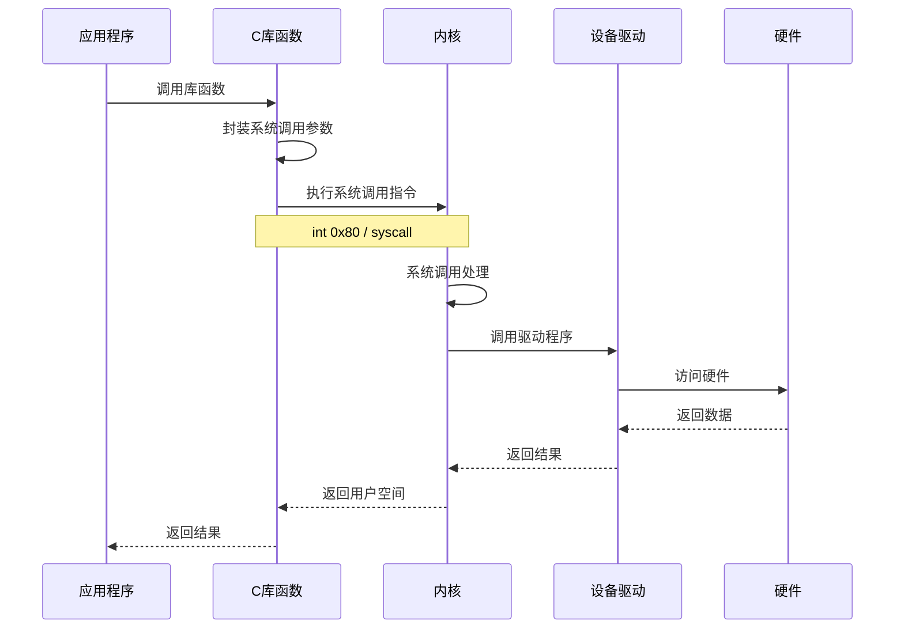

# Linux 技术总结

## 1. 基础概念

### 1.1 什么是 Linux
Linux 是一种开源的、自由的类 Unix 操作系统内核，由 Linus Torvalds 于 1991 年创建。它是目前世界上最流行的服务器操作系统，也是许多嵌入式系统和移动设备（如 Android）的基础。

### 1.2 Linux 内核概念

Linux 内核是 Linux 操作系统的核心部分，负责管理系统的硬件资源和提供基本服务。主要功能包括：

- **内存管理**：管理系统的物理内存和虚拟内存
- **进程管理**：调度和管理系统中的进程
- **硬件管理**：通过设备驱动程序与硬件设备交互
- **文件管理**：提供文件系统接口和管理
- **网络管理**：实现网络协议栈和网络设备支持

#### 1.2.1 Linux 内核整体架构

Linux 内核采用宏内核（Monolithic Kernel）架构，所有核心功能都运行在内核态，具有高性能的特点。

**Linux 内核分层架构图**：

```
┌─────────────────────────────────────────────────────────────┐
│                      用户空间 (User Space)                    │
│  ┌──────────┐ ┌──────────┐ ┌──────────┐ ┌──────────┐       │
│  │ 应用程序  │ │  Shell   │ │  库函数  │ │ 系统工具 │       │
│  └──────────┘ └──────────┘ └──────────┘ └──────────┘       │
└─────────────────────────────────────────────────────────────┘
                            ▲
                            │ 系统调用 (System Calls)
                            ▼
┌─────────────────────────────────────────────────────────────┐
│                      内核空间 (Kernel Space)                  │
│                                                              │
│  ┌────────────────────────────────────────────────────┐    │
│  │              系统调用接口 (System Call Interface)    │    │
│  └────────────────────────────────────────────────────┘    │
│                            ▲                                │
│  ┌─────────────────────────┴────────────────────────┐      │
│  │              内核核心子系统                         │      │
│  │                                                    │      │
│  │  ┌──────────┐  ┌──────────┐  ┌──────────┐       │      │
│  │  │ 进程管理  │  │ 内存管理  │  │ 文件系统  │       │      │
│  │  │ (Process) │  │ (Memory)  │  │  (VFS)   │       │      │
│  │  └──────────┘  └──────────┘  └──────────┘       │      │
│  │                                                    │      │
│  │  ┌──────────┐  ┌──────────┐  ┌──────────┐       │      │
│  │  │ 网络协议  │  │ 设备驱动  │  │  IPC     │       │      │
│  │  │ (Network) │  │ (Drivers) │  │ (IPC)    │       │      │
│  │  └──────────┘  └──────────┘  └──────────┘       │      │
│  └────────────────────────────────────────────────────┘      │
│                            ▲                                │
│  ┌─────────────────────────┴────────────────────────┐      │
│  │              硬件抽象层 (HAL)                       │      │
│  └────────────────────────────────────────────────────┘      │
└─────────────────────────────────────────────────────────────┘
                            ▲
                            ▼
┌─────────────────────────────────────────────────────────────┐
│                      硬件层 (Hardware)                        │
│  ┌──────────┐ ┌──────────┐ ┌──────────┐ ┌──────────┐       │
│  │   CPU    │ │   内存   │ │   磁盘   │ │ 网卡/其他 │       │
│  └──────────┘ └──────────┘ └──────────┘ └──────────┘       │
└─────────────────────────────────────────────────────────────┘
```

#### 1.2.2 Linux 内核详细架构图

```
┌──────────────────────────────────────────────────────────────────┐
│                         用户空间进程                               │
│   ┌────────────┐  ┌────────────┐  ┌────────────┐               │
│   │  用户进程A  │  │  用户进程B  │  │  用户进程C  │               │
│   └────────────┘  └────────────┘  └────────────┘               │
└──────────────────────────────────────────────────────────────────┘
                              │
                              │ 系统调用
                              ▼
┌──────────────────────────────────────────────────────────────────┐
│                          系统调用层                               │
│   read, write, open, close, fork, exec, socket, ioctl, ...     │
└──────────────────────────────────────────────────────────────────┘
                              │
        ┌─────────────────────┼─────────────────────┐
        │                     │                     │
        ▼                     ▼                     ▼
┌──────────────┐    ┌──────────────┐    ┌──────────────┐
│  进程管理     │    │  内存管理     │    │  文件系统     │
│              │    │              │    │              │
│ - 进程调度    │    │ - 页面管理    │    │ - VFS虚拟文件 │
│ - 进程创建    │    │ - 内存映射    │    │ - ext4/XFS   │
│ - 进程通信    │    │ - 交换分区    │    │ - NFS/procfs │
│ - 信号处理    │    │ - 内存分配    │    │ - 设备文件   │
└──────────────┘    └──────────────┘    └──────────────┘
        │                     │                     │
        └─────────────────────┼─────────────────────┘
                              │
        ┌─────────────────────┼─────────────────────┐
        │                     │                     │
        ▼                     ▼                     ▼
┌──────────────┐    ┌──────────────┐    ┌──────────────┐
│  网络协议栈   │    │  设备驱动     │    │  IPC机制     │
│              │    │              │    │              │
│ - TCP/UDP    │    │ - 字符设备    │    │ - 管道(pipe) │
│ - IP路由     │    │ - 块设备      │    │ - 信号量     │
│ - 网络接口   │    │ - 网络设备    │    │ - 共享内存   │
│ - Socket     │    │ - USB/PCI    │    │ - 消息队列   │
└──────────────┘    └──────────────┘    └──────────────┘
                              │
                              ▼
┌──────────────────────────────────────────────────────────────────┐
│                        硬件抽象层 (HAL)                           │
│              统一的硬件访问接口，屏蔽硬件差异                       │
└──────────────────────────────────────────────────────────────────┘
                              │
                              ▼
┌──────────────────────────────────────────────────────────────────┐
│                          硬件层                                   │
│   CPU  │  内存  │  磁盘  │  网卡  │  显卡  │  其他设备            │
└──────────────────────────────────────────────────────────────────┘
```

#### 1.2.3 Linux 内核子系统详解

**1. 进程管理子系统**

```
┌─────────────────────────────────────────────────┐
│              进程管理子系统                       │
├─────────────────────────────────────────────────┤
│                                                 │
│  ┌──────────────┐      ┌──────────────┐       │
│  │  进程调度器   │      │  进程创建     │       │
│  │  (Scheduler) │      │  fork/clone  │       │
│  └──────────────┘      └──────────────┘       │
│                                                 │
│  ┌──────────────┐      ┌──────────────┐       │
│  │  进程状态     │      │  进程通信     │       │
│  │  运行/就绪    │      │  signal/IPC  │       │
│  │  阻塞/僵尸    │      │              │       │
│  └──────────────┘      └──────────────┘       │
│                                                 │
│  ┌──────────────┐      ┌──────────────┐       │
│  │  CFS调度     │      │  实时调度     │       │
│  │  完全公平     │      │  RT调度器     │       │
│  └──────────────┘      └──────────────┘       │
│                                                 │
└─────────────────────────────────────────────────┘

进程状态转换图：

    ┌─────────┐
    │  创建   │
    └────┬────┘
         │ fork()
         ▼
    ┌─────────┐  获得CPU   ┌─────────┐
    │  就绪   │ ─────────> │  运行   │
    └─────────┘            └────┬────┘
         ▲                      │
         │                      │
         │ 时间片用完            │ 进程结束
         │                      ▼
         │                 ┌─────────┐
         └──────────────── │  僵尸   │
                           └─────────┘
                                │
                                │ wait()
                                ▼
                           ┌─────────┐
                           │  终止   │
                           └─────────┘
```

**2. 内存管理子系统**

```
┌─────────────────────────────────────────────────┐
│              内存管理子系统                       │
├─────────────────────────────────────────────────┤
│                                                 │
│  ┌──────────────┐      ┌──────────────┐       │
│  │  虚拟内存     │      │  物理内存     │       │
│  │  Virtual Mem │      │  Physical    │       │
│  └──────────────┘      └──────────────┘       │
│         │                      │               │
│         └──────────┬───────────┘               │
│                    ▼                           │
│            ┌──────────────┐                   │
│            │  页表映射     │                   │
│            │  Page Table  │                   │
│            └──────────────┘                   │
│                                                 │
│  ┌──────────────┐      ┌──────────────┐       │
│  │  内存分配     │      │  内存回收     │       │
│  │  kmalloc     │      │  kfree       │       │
│  │  vmalloc     │      │  页面置换     │       │
│  └──────────────┘      └──────────────┘       │
│                                                 │
│  ┌──────────────┐      ┌──────────────┐       │
│  │  内存映射     │      │  交换分区     │       │
│  │  mmap        │      │  Swap        │       │
│  └──────────────┘      └──────────────┘       │
│                                                 │
└─────────────────────────────────────────────────┘

虚拟内存布局（x86_64）：

高地址 ┌────────────────────┐
       │   内核空间          │  (高地址)
       │   128TB            │
       ├────────────────────┤
       │   用户空间          │
       │                    │
       │   ┌──────────────┐ │
       │   │    栈        │ │  ↓ 向下增长
       │   └──────────────┘ │
       │         ↓          │
       │                    │
       │   ┌──────────────┐ │
       │   │  内存映射区   │ │  mmap
       │   └──────────────┘ │
       │                    │
       │         ↑          │
       │   ┌──────────────┐ │
       │   │    堆        │ │  ↑ 向上增长
       │   └──────────────┘ │
       │                    │
       │   ┌──────────────┐ │
       │   │  BSS段       │ │  未初始化全局变量
       │   └──────────────┘ │
       │   ┌──────────────┐ │
       │   │  数据段       │ │  已初始化全局变量
       │   └──────────────┘ │
       │   ┌──────────────┐ │
       │   │  代码段       │ │  程序代码
       │   └──────────────┘ │
       └────────────────────┘
低地址
```

**3. 文件系统子系统**

```
┌─────────────────────────────────────────────────┐
│              文件系统子系统                       │
├─────────────────────────────────────────────────┤
│                                                 │
│  ┌──────────────────────────────────────┐     │
│  │        VFS (虚拟文件系统)              │     │
│  │   - 统一的文件操作接口                 │     │
│  │   - open, read, write, close          │     │
│  └──────────────────────────────────────┘     │
│                    │                           │
│     ┌──────────────┼──────────────┐           │
│     │              │              │           │
│     ▼              ▼              ▼           │
│  ┌────────┐   ┌────────┐   ┌────────┐       │
│  │ ext4   │   │  XFS   │   │  Btrfs │       │
│  │ 本地FS │   │ 本地FS │   │ 本地FS │       │
│  └────────┘   └────────┘   └────────┘       │
│                                                 │
│  ┌────────┐   ┌────────┐   ┌────────┐       │
│  │  NFS   │   │  SMB   │   │  procfs│       │
│  │ 网络FS │   │ 网络FS │   │ 虚拟FS │       │
│  └────────┘   └────────┘   └────────┘       │
│                                                 │
│  ┌──────────────────────────────────────┐     │
│  │        块设备层 (Block Layer)         │     │
│  │   - I/O调度                           │     │
│  │   - 请求队列                          │     │
│  └──────────────────────────────────────┘     │
│                    │                           │
│                    ▼                           │
│  ┌──────────────────────────────────────┐     │
│  │        设备驱动 (Device Driver)       │     │
│  └──────────────────────────────────────┘     │
│                                                 │
└─────────────────────────────────────────────────┘

VFS核心对象：

┌──────────────┐
│ superblock   │  超级块：文件系统元数据
└──────────────┘
       │
       ▼
┌──────────────┐
│  inode       │  索引节点：文件元数据
└──────────────┘
       │
       ▼
┌──────────────┐
│  dentry      │  目录项：路径组件
└──────────────┘
       │
       ▼
┌──────────────┐
│  file        │  文件对象：打开的文件
└──────────────┘
```

**4. 网络协议栈**

```
┌─────────────────────────────────────────────────┐
│              网络协议栈                          │
├─────────────────────────────────────────────────┤
│                                                 │
│  ┌──────────────────────────────────────┐     │
│  │        应用层接口 (Socket API)        │     │
│  │   socket, bind, listen, accept       │     │
│  └──────────────────────────────────────┘     │
│                    │                           │
│                    ▼                           │
│  ┌──────────────────────────────────────┐     │
│  │        传输层 (Transport Layer)       │     │
│  │   ┌──────────────┐ ┌──────────────┐ │     │
│  │   │     TCP      │ │     UDP      │ │     │
│  │   │  可靠传输     │ │  不可靠传输   │ │     │
│  │   └──────────────┘ └──────────────┘ │     │
│  └──────────────────────────────────────┘     │
│                    │                           │
│                    ▼                           │
│  ┌──────────────────────────────────────┐     │
│  │        网络层 (Network Layer)         │     │
│  │   ┌──────────────┐ ┌──────────────┐ │     │
│  │   │     IP       │ │    ICMP      │ │     │
│  │   │  路由转发     │ │  网络诊断     │ │     │
│  │   └──────────────┘ └──────────────┘ │     │
│  └──────────────────────────────────────┘     │
│                    │                           │
│                    ▼                           │
│  ┌──────────────────────────────────────┐     │
│  │        数据链路层 (Data Link)         │     │
│  │   ┌──────────────┐ ┌──────────────┐ │     │
│  │   │   Ethernet   │ │    ARP       │ │     │
│  │   │  以太网协议   │ │  地址解析     │ │     │
│  │   └──────────────┘ └──────────────┘ │     │
│  └──────────────────────────────────────┘     │
│                    │                           │
│                    ▼                           │
│  ┌──────────────────────────────────────┐     │
│  │        网络设备驱动 (Device Driver)   │     │
│  └──────────────────────────────────────┘     │
│                                                 │
└─────────────────────────────────────────────────┘

网络数据流向：

应用层:  数据 ──────────────────────────> 数据
          │                                ▲
          ▼                                │
传输层:  TCP头 + 数据 ───────────────> TCP头 + 数据
          │                                ▲
          ▼                                │
网络层:  IP头 + TCP头 + 数据 ────────> IP头 + TCP头 + 数据
          │                                ▲
          ▼                                │
链路层:  以太网头 + IP头 + ... ──────> 以太网头 + IP头 + ...
          │                                ▲
          ▼                                │
物理层:  比特流 ──────────────────────> 比特流
```

**5. 设备驱动模型**

```
┌─────────────────────────────────────────────────┐
│              设备驱动模型                        │
├─────────────────────────────────────────────────┤
│                                                 │
│  ┌──────────────────────────────────────┐     │
│  │        字符设备 (Character Device)    │     │
│  │   - 按字节流访问                      │     │
│  │   - 终端、串口、键盘                  │     │
│  │   - /dev/tty, /dev/console           │     │
│  └──────────────────────────────────────┘     │
│                                                 │
│  ┌──────────────────────────────────────┐     │
│  │        块设备 (Block Device)          │     │
│  │   - 按块访问（512B-4KB）              │     │
│  │   - 硬盘、SSD、U盘                    │     │
│  │   - /dev/sda, /dev/nvme0n1           │     │
│  └──────────────────────────────────────┘     │
│                                                 │
│  ┌──────────────────────────────────────┐     │
│  │        网络设备 (Network Device)      │     │
│  │   - 网卡驱动                          │     │
│  │   - eth0, wlan0                      │     │
│  │   - 数据包收发                        │     │
│  └──────────────────────────────────────┘     │
│                                                 │
│  ┌──────────────────────────────────────┐     │
│  │        总线设备 (Bus Device)          │     │
│  │   - PCI, USB, I2C, SPI               │     │
│  │   - 设备枚举和配置                    │     │
│  └──────────────────────────────────────┘     │
│                                                 │
└─────────────────────────────────────────────────┘

设备驱动架构：

┌──────────────┐
│  用户空间     │
└──────┬───────┘
       │ 系统调用
       ▼
┌──────────────┐
│  VFS/块层    │
└──────┬───────┘
       │
       ▼
┌──────────────┐
│  设备驱动     │
│  - open()    │
│  - read()    │
│  - write()   │
│  - ioctl()   │
└──────┬───────┘
       │
       ▼
┌──────────────┐
│  硬件设备     │
└──────────────┘
```

#### 1.2.4 用户空间与内核空间

**特权级划分**：

```
┌─────────────────────────────────────────────────┐
│  Ring 3 - 用户态 (User Mode)                     │
│  ┌──────────────────────────────────────┐       │
│  │  - 应用程序                          │       │
│  │  - 受限的内存访问                    │       │
│  │  - 不能直接访问硬件                  │       │
│  │  - 通过系统调用访问内核              │       │
│  └──────────────────────────────────────┘       │
└─────────────────────────────────────────────────┘
                    │ 系统调用
                    ▼
┌─────────────────────────────────────────────────┐
│  Ring 0 - 内核态 (Kernel Mode)                   │
│  ┌──────────────────────────────────────┐       │
│  │  - 内核代码                          │       │
│  │  - 完全访问硬件                      │       │
│  │  - 访问所有内存                      │       │
│  │  - 执行特权指令                      │       │
│  └──────────────────────────────────────┘       │
└─────────────────────────────────────────────────┘

用户态 vs 内核态对比：

┌──────────────┬──────────────────┬──────────────────┐
│   特性        │    用户态         │    内核态         │
├──────────────┼──────────────────┼──────────────────┤
│ 特权级        │ Ring 3           │ Ring 0           │
│ 内存访问      │ 受限             │ 完全访问          │
│ 硬件访问      │ 间接（系统调用）  │ 直接访问          │
│ 指令集        │ 非特权指令        │ 所有指令          │
│ 地址空间      │ 用户空间          │ 内核空间          │
│ 切换成本      │ 低               │ 高（上下文切换）  │
│ 稳定性        │ 进程崩溃不影响系统│ 错误可能导致崩溃  │
└──────────────┴──────────────────┴──────────────────┘
```

**系统调用流程**：



#### 1.2.5 Linux 内核特点

**1. 宏内核架构**

```
优点：
✅ 性能高：所有核心功能在内核态运行，减少上下文切换
✅ 效率高：各子系统之间可以直接调用，通信开销小
✅ 设计简单：模块化设计，易于理解和维护

缺点：
❌ 稳定性风险：内核模块错误可能导致系统崩溃
❌ 扩展性限制：添加新功能需要重新编译内核
❌ 安全性挑战：所有代码运行在最高特权级

解决方案：
- 模块化设计：支持动态加载内核模块
- 驱动隔离：将驱动程序运行在用户态
- 容器技术：通过容器隔离提高安全性
```

**2. 内核模块机制**

```
┌─────────────────────────────────────────────────┐
│              内核模块机制                        │
├─────────────────────────────────────────────────┤
│                                                 │
│  ┌──────────────────────────────────────┐     │
│  │        内核核心 (Kernel Core)         │     │
│  │   - 进程管理                          │     │
│  │   - 内存管理                          │     │
│  │   - 文件系统                          │     │
│  └──────────────────────────────────────┘     │
│                    │                           │
│     ┌──────────────┼──────────────┐           │
│     │              │              │           │
│     ▼              ▼              ▼           │
│  ┌────────┐   ┌────────┐   ┌────────┐       │
│  │ 模块A  │   │ 模块B  │   │ 模块C  │       │
│  │ 驱动   │   │ 文件系统│   │ 网络协议│       │
│  └────────┘   └────────┘   └────────┘       │
│                                                 │
│  模块操作：                                     │
│  - insmod: 加载模块                            │
│  - rmmod: 卸载模块                             │
│  - lsmod: 列出已加载模块                       │
│  - modprobe: 智能加载模块及其依赖              │
│                                                 │
└─────────────────────────────────────────────────┘

模块示例：

// hello.c - 简单的内核模块
#include <linux/module.h>
#include <linux/kernel.h>

static int __init hello_init(void) {
    printk(KERN_INFO "Hello, Kernel!\n");
    return 0;
}

static void __exit hello_exit(void) {
    printk(KERN_INFO "Goodbye, Kernel!\n");
}

module_init(hello_init);
module_exit(hello_exit);

MODULE_LICENSE("GPL");
MODULE_AUTHOR("Author");
MODULE_DESCRIPTION("A simple kernel module");
```

**3. 内核配置与编译**

```bash
# 内核配置方式
make config          # 交互式配置
make menuconfig      # 菜单式配置（推荐）
make xconfig         # 图形化配置
make defconfig       # 使用默认配置
make oldconfig       # 使用旧配置文件

# 内核编译
make                 # 编译内核
make modules         # 编译模块
make modules_install # 安装模块
make install         # 安装内核

# 查看内核信息
uname -r             # 查看内核版本
cat /proc/version    # 查看内核详细信息
lsmod                # 查看已加载模块
```

#### 1.2.6 Linux 内核版本号

**版本号格式**：`主版本.次版本.修订版本.补丁版本`

```
示例：5.15.0-91-generic

主版本: 5
次版本: 15 (偶数=稳定版, 奇数=开发版)
修订版本: 0
补丁版本: 91
扩展标识: generic (通用版本)

版本类型：
- Mainline: 主线版本，最新特性
- Stable: 稳定版本，推荐生产使用
- LTS: 长期支持版本，维护周期长（5-6年）
- EOL: 生命周期结束版本

查看内核版本：
$ uname -r
5.15.0-91-generic

$ cat /proc/version
Linux version 5.15.0-91-generic ...
```

### 1.3 Linux 发行版分类
Linux 发行版是基于 Linux 内核的完整操作系统，通常包含桌面环境、应用程序和工具。常见的发行版包括：

| 类型 | 代表发行版 | 特点 |
|------|-----------|------|
| 企业级 | Red Hat Enterprise Linux (RHEL)、CentOS、SUSE Linux Enterprise | 稳定性高，支持周期长，适合服务器环境 |
| 桌面版 | Ubuntu、Fedora、Debian | 用户友好，软件丰富，适合个人使用 |
| 轻量级 | Alpine Linux、Arch Linux | 体积小，性能高，适合容器和嵌入式系统 |
| 安全导向 | Kali Linux、Tails | 内置安全工具，适合渗透测试和安全研究 |

### 1.4 Linux 文件系统结构
Linux 采用树形文件系统结构，所有文件和目录都从根目录 `/` 开始：

```
/               # 根目录
├── bin/        # 基本命令可执行文件
├── boot/       # 引导加载程序和内核文件
├── dev/        # 设备文件
├── etc/        # 系统配置文件
├── home/       # 用户主目录
├── lib/        # 共享库文件
├── media/      # 可移动媒体挂载点
├── mnt/        # 临时挂载点
├── opt/        # 可选应用程序
├── proc/       # 进程信息和系统状态
├── root/       # root 用户主目录
├── sbin/       # 系统管理命令
├── srv/        # 服务数据
├── sys/        # 系统硬件信息
├── tmp/        # 临时文件
├── usr/        # 用户程序和数据
└── var/        # 可变数据（日志、缓存等）
```

## 2. 核心技术

### 2.1 内核功能模块

#### 2.1.1 内存管理
Linux 内存管理负责：
- 物理内存分配和回收
- 虚拟内存管理
- 内存映射
- 页面置换
- 内存保护

#### 2.1.2 进程管理
Linux 进程管理包括：
- 进程创建和终止
- 进程调度
- 进程间通信（IPC）
- 进程状态管理

#### 2.1.3 硬件管理
通过设备驱动程序与硬件设备交互，支持：
- 字符设备
- 块设备
- 网络设备

#### 2.1.4 文件管理
提供统一的文件系统接口，支持多种文件系统：
- ext4、XFS、Btrfs 等本地文件系统
- NFS、SMB 等网络文件系统
- tmpfs、procfs 等虚拟文件系统

### 2.2 启动过程
Linux 系统启动过程：
1. **BIOS/UEFI 初始化**：硬件自检，加载引导设备
2. **引导加载程序**：GRUB2 加载内核和初始化 RAM 磁盘
3. **内核初始化**：检测硬件，加载驱动，挂载根文件系统
4. **初始化系统**：systemd 或 SysV init 启动系统服务
5. **用户登录**：显示登录界面，等待用户登录

### 2.3 虚拟内存管理

#### 2.3.1 分段与分页
- **分段**：将虚拟地址空间划分为逻辑段（代码段、数据段、堆栈段等）
- **分页**：将物理内存和虚拟内存划分为固定大小的页（通常为 4KB）

#### 2.3.2 页面置换算法

当内存不足时，Linux 使用页面置换算法选择要置换的页面。页面置换算法的目标是在最小化缺页率的同时，保持较低的算法开销。

##### 页面置换算法对比

| 算法 | 全称 | 核心思想 | 优点 | 缺点 | 适用场景 |
|------|------|----------|------|------|----------|
| **FIFO** | First In First Out | 先进先出 | 实现简单 | 可能淘汰常用页 | 简单系统 |
| **LRU** | Least Recently Used | 最近最少使用 | 符合局部性原理 | 开销大 | 通用场景 |
| **LFU** | Least Frequently Used | 最少使用 | 考虑访问频率 | 需要计数器 | 特定场景 |
| **CLOCK** | Clock (Second Chance) | 二次机会 | 近似LRU，开销小 | 不够精确 | Linux默认 |
| **WSClock** | Working Set Clock | 工作集时钟 | 考虑工作集 | 实现复杂 | 复杂系统 |

##### 1. FIFO (First In First Out) 算法

**算法思路**：
- 将页面按照进入内存的先后顺序排列
- 当需要置换页面时，选择最先进入内存的页面
- 类似于队列的先进先出原则

**算法过程**：
```
内存状态: [A, B, C, D]  (A最早进入，D最晚进入)

访问序列: E (新页面，需要置换)

置换过程:
1. 检查页面E是否在内存中 → 不在
2. 选择最早进入的页面A进行置换
3. 内存状态变为: [B, C, D, E]
```

**Belady异常**：
FIFO算法可能出现Belady异常，即分配给进程的物理页面数增加，缺页率反而增加。

**伪代码实现**：
```c
// FIFO页面置换算法
struct Page {
    int pageNumber;      // 页面号
    int loadTime;        // 装入时间
};

struct FIFOQueue {
    Page pages[MAX_PAGES];
    int front;           // 队头
    int rear;            // 队尾
    int size;            // 当前大小
};

// 初始化队列
void initQueue(FIFOQueue* queue) {
    queue->front = 0;
    queue->rear = -1;
    queue->size = 0;
}

// 检查页面是否在内存中
bool isPageInMemory(FIFOQueue* queue, int pageNumber) {
    for (int i = 0; i < queue->size; i++) {
        int index = (queue->front + i) % MAX_PAGES;
        if (queue->pages[index].pageNumber == pageNumber) {
            return true;
        }
    }
    return false;
}

// FIFO页面置换
int fifoPageReplacement(FIFOQueue* queue, int pageNumber, int currentTime) {
    // 页面已在内存中，命中
    if (isPageInMemory(queue, pageNumber)) {
        return 0;  // 命中，无需置换
    }
    
    // 页面不在内存中，发生缺页
    int replacedPage = -1;
    
    if (queue->size < MAX_PAGES) {
        // 内存未满，直接加入
        queue->rear = (queue->rear + 1) % MAX_PAGES;
        queue->pages[queue->rear].pageNumber = pageNumber;
        queue->pages[queue->rear].loadTime = currentTime;
        queue->size++;
    } else {
        // 内存已满，置换最早进入的页面
        replacedPage = queue->pages[queue->front].pageNumber;
        queue->front = (queue->front + 1) % MAX_PAGES;
        queue->rear = (queue->rear + 1) % MAX_PAGES;
        queue->pages[queue->rear].pageNumber = pageNumber;
        queue->pages[queue->rear].loadTime = currentTime;
    }
    
    return 1;  // 发生缺页
}
```

##### 2. LRU (Least Recently Used) 算法

**算法思路**：
- 基于局部性原理：最近被访问的页面很可能再次被访问
- 选择最长时间未被访问的页面进行置换
- 需要记录每个页面的最近访问时间

**算法过程**：
```
内存状态: [A, B, C, D]
访问历史: A(时间10), B(时间5), C(时间8), D(时间3)

访问序列: E (新页面，需要置换)

置换过程:
1. 检查页面E是否在内存中 → 不在
2. 找出最近最少使用的页面：D(时间3)
3. 置换页面D
4. 更新访问历史: E(时间11)
5. 内存状态变为: [A, B, C, E]

访问序列: B (已有页面)

处理过程:
1. 检查页面B是否在内存中 → 在
2. 更新B的访问时间为当前时间
3. 访问历史: A(时间10), B(时间12), C(时间8), E(时间11)
```

**LRU实现方式**：

**方式1：计数器实现**
```c
// LRU计数器实现
struct Page {
    int pageNumber;
    int lastAccessTime;  // 上次访问时间
};

// LRU页面置换（计数器方式）
int lruPageReplacementCounter(Page pages[], int n, int pageNumber, int currentTime) {
    // 查找页面是否在内存中
    int minTime = INT_MAX;
    int minIndex = -1;
    int found = -1;
    
    for (int i = 0; i < n; i++) {
        if (pages[i].pageNumber == pageNumber) {
            found = i;
            break;
        }
        if (pages[i].lastAccessTime < minTime) {
            minTime = pages[i].lastAccessTime;
            minIndex = i;
        }
    }
    
    if (found != -1) {
        // 页面命中，更新访问时间
        pages[found].lastAccessTime = currentTime;
        return 0;  // 命中
    }
    
    // 页面未命中，置换LRU页面
    pages[minIndex].pageNumber = pageNumber;
    pages[minIndex].lastAccessTime = currentTime;
    return 1;  // 缺页
}
```

**方式2：栈实现**
```c
// LRU栈实现
struct LRUStack {
    int pages[MAX_PAGES];
    int top;
    int size;
};

// 初始化栈
void initStack(LRUStack* stack) {
    stack->top = -1;
    stack->size = 0;
}

// 将页面移到栈顶（最近使用）
void moveToTop(LRUStack* stack, int index) {
    int page = stack->pages[index];
    // 将index之后的元素前移
    for (int i = index; i < stack->top; i++) {
        stack->pages[i] = stack->pages[i + 1];
    }
    // 将页面放到栈顶
    stack->pages[stack->top] = page;
}

// LRU页面置换（栈方式）
int lruPageReplacementStack(LRUStack* stack, int pageNumber) {
    // 查找页面是否在栈中
    int found = -1;
    for (int i = 0; i <= stack->top; i++) {
        if (stack->pages[i] == pageNumber) {
            found = i;
            break;
        }
    }
    
    if (found != -1) {
        // 页面命中，移到栈顶
        moveToTop(stack, found);
        return 0;  // 命中
    }
    
    // 页面未命中
    if (stack->size < MAX_PAGES) {
        // 栈未满，直接入栈
        stack->pages[++stack->top] = pageNumber;
        stack->size++;
    } else {
        // 栈已满，置换栈底元素（最久未使用）
        // 将所有元素下移
        for (int i = 0; i < stack->top; i++) {
            stack->pages[i] = stack->pages[i + 1];
        }
        // 新页面入栈顶
        stack->pages[stack->top] = pageNumber;
    }
    
    return 1;  // 缺页
}
```

**LRU优缺点分析**：
```
优点：
✅ 符合局部性原理，缺页率低
✅ 不会出现Belady异常
✅ 性能接近最优算法OPT

缺点：
❌ 需要维护访问时间或栈，开销大
❌ 每次访问都需要更新数据结构
❌ 硬件实现复杂（需要计数器）
```

##### 3. LFU (Least Frequently Used) 算法

**算法思路**：
- 选择访问次数最少的页面进行置换
- 每个页面维护一个访问计数器
- 当计数相同时，可以使用FIFO或LRU作为 tie-breaker

**算法过程**：
```
内存状态: [A, B, C, D]
访问计数: A(5次), B(2次), C(8次), D(3次)

访问序列: E (新页面，需要置换)

置换过程:
1. 检查页面E是否在内存中 → 不在
2. 找出访问次数最少的页面：B(2次)
3. 置换页面B
4. 初始化E的访问计数为1
5. 内存状态变为: [A, C, D, E]

访问序列: A (已有页面)

处理过程:
1. 检查页面A是否在内存中 → 在
2. 增加A的访问计数：A(6次)
3. 访问计数: A(6), C(8), D(3), E(1)
```

**伪代码实现**：
```c
// LFU页面置换算法
struct LFUPage {
    int pageNumber;
    int frequency;       // 访问次数
    int lastAccessTime;  // 上次访问时间（用于tie-breaker）
};

// LFU页面置换
int lfuPageReplacement(LFUPage pages[], int n, int pageNumber, int currentTime) {
    int minFreq = INT_MAX;
    int minTime = INT_MAX;
    int minIndex = -1;
    int found = -1;
    
    // 查找页面是否在内存中
    for (int i = 0; i < n; i++) {
        if (pages[i].pageNumber == pageNumber) {
            found = i;
            break;
        }
        // 找访问次数最少且最久未访问的页面
        if (pages[i].frequency < minFreq || 
            (pages[i].frequency == minFreq && pages[i].lastAccessTime < minTime)) {
            minFreq = pages[i].frequency;
            minTime = pages[i].lastAccessTime;
            minIndex = i;
        }
    }
    
    if (found != -1) {
        // 页面命中，增加访问次数
        pages[found].frequency++;
        pages[found].lastAccessTime = currentTime;
        return 0;  // 命中
    }
    
    // 页面未命中，置换LFU页面
    pages[minIndex].pageNumber = pageNumber;
    pages[minIndex].frequency = 1;  // 新页面计数为1
    pages[minIndex].lastAccessTime = currentTime;
    return 1;  // 缺页
}
```

**LFU优缺点分析**：
```
优点：
✅ 考虑访问频率，适合周期性访问模式
✅ 能够识别"热点"页面

缺点：
❌ 需要维护计数器，开销较大
❌ 对新页面不公平（初始计数低）
❌ 历史访问可能影响当前决策

改进方案：
- Aging LFU：定期衰减计数器
- Window LFU：只考虑最近N次访问
```

##### 4. CLOCK (Second Chance) 算法

**算法思路**：
- LRU的近似实现，使用访问位（reference bit）代替精确时间
- 页面组织成环形队列（时钟）
- 每个页面有一个访问位，被访问时置1
- 置换时，从当前指针位置开始扫描：
  - 访问位为1：给第二次机会，置0，继续扫描
  - 访问位为0：选择该页面置换

**算法过程**：
```
时钟队列: [A(1), B(0), C(1), D(0)]  (括号内为访问位)
当前指针: 指向A

访问序列: E (新页面，需要置换)

置换过程:
1. 检查页面E是否在内存中 → 不在
2. 从指针位置开始扫描：
   - A(1): 给第二次机会，置0，指针移到B
   - B(0): 选择B置换
3. 置换B为E，E的访问位置1
4. 指针移到C
5. 时钟队列: [A(0), E(1), C(1), D(0)]

访问序列: C (已有页面)

处理过程:
1. 检查页面C是否在内存中 → 在
2. 设置C的访问位为1
3. 时钟队列: [A(0), E(1), C(1), D(0)]
```

**伪代码实现**：
```c
// CLOCK页面置换算法
struct ClockPage {
    int pageNumber;
    int referenceBit;    // 访问位
};

struct ClockQueue {
    ClockPage pages[MAX_PAGES];
    int hand;            // 时钟指针
    int size;            // 当前大小
    int capacity;        // 容量
};

// 初始化时钟队列
void initClockQueue(ClockQueue* queue, int capacity) {
    queue->hand = 0;
    queue->size = 0;
    queue->capacity = capacity;
}

// 查找页面位置
int findPage(ClockQueue* queue, int pageNumber) {
    for (int i = 0; i < queue->size; i++) {
        if (queue->pages[i].pageNumber == pageNumber) {
            return i;
        }
    }
    return -1;
}

// CLOCK页面置换
int clockPageReplacement(ClockQueue* queue, int pageNumber) {
    // 检查页面是否在内存中
    int found = findPage(queue, pageNumber);
    
    if (found != -1) {
        // 页面命中，设置访问位
        queue->pages[found].referenceBit = 1;
        return 0;  // 命中
    }
    
    // 页面未命中
    if (queue->size < queue->capacity) {
        // 内存未满，直接加入
        queue->pages[queue->size].pageNumber = pageNumber;
        queue->pages[queue->size].referenceBit = 1;
        queue->size++;
    } else {
        // 内存已满，执行CLOCK算法
        while (1) {
            if (queue->pages[queue->hand].referenceBit == 0) {
                // 找到访问位为0的页面，进行置换
                queue->pages[queue->hand].pageNumber = pageNumber;
                queue->pages[queue->hand].referenceBit = 1;
                queue->hand = (queue->hand + 1) % queue->capacity;
                break;
            } else {
                // 给第二次机会，置0，继续扫描
                queue->pages[queue->hand].referenceBit = 0;
                queue->hand = (queue->hand + 1) % queue->capacity;
            }
        }
    }
    
    return 1;  // 缺页
}
```

**CLOCK算法改进版**：

**Enhanced CLOCK (二次机会算法的改进)**：
```c
// Enhanced CLOCK算法，使用(访问位, 修改位)
struct EnhancedClockPage {
    int pageNumber;
    int referenceBit;    // 访问位
    int modifyBit;       // 修改位
};

// 页面类 (0,0): 最佳置换, (0,1): 次佳, (1,0): 第三, (1,1): 最差
// 优先级: (0,0) > (0,1) > (1,0) > (1,1)

int enhancedClockPageReplacement(EnhancedClockPage pages[], int n, 
                                  int pageNumber, int isModify) {
    int found = -1;
    for (int i = 0; i < n; i++) {
        if (pages[i].pageNumber == pageNumber) {
            found = i;
            break;
        }
    }
    
    if (found != -1) {
        // 页面命中
        pages[found].referenceBit = 1;
        if (isModify) {
            pages[found].modifyBit = 1;
        }
        return 0;
    }
    
    // 页面未命中，执行Enhanced CLOCK
    int hand = 0;
    int rounds = 0;
    
    while (rounds < 4) {
        for (int i = 0; i < n; i++) {
            int idx = (hand + i) % n;
            int r = pages[idx].referenceBit;
            int m = pages[idx].modifyBit;
            
            // 根据轮数选择置换条件
            if (rounds == 0 && r == 0 && m == 0) {
                // 第一轮：找(0,0)
                pages[idx] = (EnhancedClockPage){pageNumber, 1, isModify};
                return 1;
            } else if (rounds == 1 && r == 0 && m == 1) {
                // 第二轮：找(0,1)
                pages[idx] = (EnhancedClockPage){pageNumber, 1, isModify};
                return 1;
            }
        }
        
        // 第三轮、第四轮：清除访问位
        if (rounds == 2) {
            for (int i = 0; i < n; i++) {
                pages[i].referenceBit = 0;
            }
        }
        
        rounds++;
        hand = (hand + 1) % n;
    }
    
    return 1;
}
```

**CLOCK优缺点分析**：
```
优点：
✅ 近似LRU，性能接近
✅ 实现简单，开销小
✅ 只需一个访问位，硬件支持好
✅ 不需要移动页面，只需移动指针

缺点：
❌ 不如LRU精确
❌ 最坏情况下需要扫描整个队列
❌ 对访问模式的适应性不如LRU

适用场景：
- Linux内核默认使用CLOCK算法
- 嵌入式系统
- 对性能要求高的场景
```

##### 5. WSClock (Working Set Clock) 算法

**算法思路**：
- 结合工作集模型和CLOCK算法
- 工作集：进程在最近τ时间内访问的页面集合
- 只考虑在工作集中的页面，其他页面可以直接置换
- 使用访问位和时间戳

**算法过程**：
```
时钟队列: [A, B, C, D, E]
访问位:   [1, 0, 1, 0, 1]
时间戳:   [100, 95, 102, 90, 105]
当前时间: 110
工作集时间窗口: τ = 20

访问序列: F (新页面，需要置换)

置换过程:
1. 从指针位置开始扫描：
   - A: 访问位=1, 时间=100, 当前时间-时间=10 < τ，在工作集中，保留
   - B: 访问位=0, 时间=95, 当前时间-时间=15 < τ，在工作集中，但访问位为0，可以置换
2. 置换B为F
3. 更新F的访问位为1，时间戳为110
4. 指针移到C
```

**伪代码实现**：
```c
// WSClock页面置换算法
struct WSClockPage {
    int pageNumber;
    int referenceBit;    // 访问位
    int timeOfArrival;   // 到达时间/上次访问时间
    int processId;       // 所属进程ID
};

struct WSClockQueue {
    WSClockPage pages[MAX_PAGES];
    int hand;            // 时钟指针
    int size;
    int capacity;
    int tau;             // 工作集时间窗口
};

// 检查页面是否在工作集中
bool isInWorkingSet(WSClockPage* page, int currentTime, int tau) {
    return (currentTime - page->timeOfArrival) <= tau;
}

// WSClock页面置换
int wsClockPageReplacement(WSClockQueue* queue, int pageNumber, 
                           int currentTime, int processId) {
    // 检查页面是否在内存中
    for (int i = 0; i < queue->size; i++) {
        if (queue->pages[i].pageNumber == pageNumber && 
            queue->pages[i].processId == processId) {
            // 页面命中
            queue->pages[i].referenceBit = 1;
            queue->pages[i].timeOfArrival = currentTime;
            return 0;
        }
    }
    
    // 页面未命中
    if (queue->size < queue->capacity) {
        // 内存未满，直接加入
        queue->pages[queue->size] = (WSClockPage){
            pageNumber, 1, currentTime, processId
        };
        queue->size++;
    } else {
        // 内存已满，执行WSClock算法
        int startHand = queue->hand;
        
        do {
            WSClockPage* currentPage = &queue->pages[queue->hand];
            
            if (!isInWorkingSet(currentPage, currentTime, queue->tau)) {
                // 页面不在工作集中，可以直接置换
                currentPage->pageNumber = pageNumber;
                currentPage->referenceBit = 1;
                currentPage->timeOfArrival = currentTime;
                currentPage->processId = processId;
                queue->hand = (queue->hand + 1) % queue->capacity;
                return 1;
            }
            
            if (currentPage->referenceBit == 0) {
                // 在工作集中，但访问位为0，可以置换
                currentPage->pageNumber = pageNumber;
                currentPage->referenceBit = 1;
                currentPage->timeOfArrival = currentTime;
                currentPage->processId = processId;
                queue->hand = (queue->hand + 1) % queue->capacity;
                return 1;
            } else {
                // 给第二次机会，清除访问位
                currentPage->referenceBit = 0;
            }
            
            queue->hand = (queue->hand + 1) % queue->capacity;
        } while (queue->hand != startHand);
        
        // 扫描了一圈，没找到合适的，置换当前指针指向的页面
        queue->pages[queue->hand] = (WSClockPage){
            pageNumber, 1, currentTime, processId
        };
        queue->hand = (queue->hand + 1) % queue->capacity;
    }
    
    return 1;
}
```

**WSClock优缺点分析**：
```
优点：
✅ 考虑工作集，减少抖动(Thrashing)
✅ 适合多道程序环境
✅ 平衡了局部性和全局性
✅ 可以控制每个进程的工作集大小

缺点：
❌ 需要维护时间戳，开销较大
❌ 工作集窗口τ的选择困难
❌ 实现复杂

适用场景：
- 多道程序系统
- 需要防止抖动的场景
- 对性能要求高的服务器
```

##### 算法性能对比

**缺页率对比（模拟数据）**：

```
访问序列: 1, 2, 3, 4, 1, 2, 5, 1, 2, 3, 4, 5
内存帧数: 3

算法        缺页次数    缺页率    说明
━━━━━━━━━━━━━━━━━━━━━━━━━━━━━━━━━━━━━━━━━━━━
OPT         7          58.3%    理论最优
LRU         10         83.3%    接近最优
CLOCK       10         83.3%    近似LRU
FIFO        9          75.0%    Belady异常
LFU         8          66.7%    适合此场景
```

**时间复杂度对比**：

| 算法 | 查找页面 | 更新操作 | 置换操作 | 总复杂度 |
|------|----------|----------|----------|----------|
| **FIFO** | O(n) | O(1) | O(1) | O(n) |
| **LRU(计数器)** | O(n) | O(n) | O(n) | O(n) |
| **LRU(栈)** | O(n) | O(n) | O(1) | O(n) |
| **LFU** | O(n) | O(n) | O(n) | O(n) |
| **CLOCK** | O(n) | O(1) | O(n) | O(n) |
| **WSClock** | O(n) | O(1) | O(n) | O(n) |

**空间复杂度对比**：

| 算法 | 额外空间 | 说明 |
|------|----------|------|
| **FIFO** | O(1) | 只需队列指针 |
| **LRU** | O(n) | 需要维护时间或栈 |
| **LFU** | O(n) | 需要计数器 |
| **CLOCK** | O(1) | 只需访问位 |
| **WSClock** | O(n) | 需要时间戳 |

##### Linux内核中的页面置换

Linux内核使用**改进的CLOCK算法**（称为**LRU/CLOCK混合算法**）：

```
Linux页面置换策略：

1. 活跃链表 (Active List)
   - 存放最近被访问的页面
   - 页面被访问时从非活跃链表移入

2. 非活跃链表 (Inactive List)
   - 存放可能被置换的页面
   - 页面长时间未被访问时移入

3. 页面移动规则：
   - 新分配页面 → 非活跃链表
   - 页面被访问 → 活跃链表
   - 活跃链表满 → 页面移入非活跃链表
   - 非活跃链表满 → 页面被置换

4. 扫描策略：
   - 定期扫描两个链表
   - 根据访问位决定页面去向
   - 优先置换非活跃链表中的页面
```

**Linux页面置换代码示例**：

```c
// 简化的Linux页面置换逻辑
struct Page {
    unsigned long flags;      // 页面标志
    int reference;            // 访问计数
    struct list_head lru;     // LRU链表
};

// 活跃链表和非活跃链表
struct list_head active_list;
struct list_head inactive_list;

// 页面访问处理
void mark_page_accessed(struct Page* page) {
    if (PageActive(page)) {
        // 页面已在活跃链表，增加访问计数
        page->reference++;
    } else {
        // 页面在非活跃链表，激活它
        activate_page(page);
    }
}

// 页面置换
struct Page* shrink_inactive_list(void) {
    struct Page* page;
    struct list_head* pos;
    
    list_for_each(pos, &inactive_list) {
        page = list_entry(pos, struct Page, lru);
        
        if (page->reference > 0) {
            // 页面被访问过，移到活跃链表
            page->reference = 0;
            move_to_active_list(page);
        } else {
            // 页面未被访问，可以置换
            return page;
        }
    }
    
    return NULL;
}
```

### 2.4 I/O 多路复用
Linux 提供多种 I/O 多路复用机制：
- **select**：最早的实现，支持有限的文件描述符
- **poll**：改进的 select，无文件描述符限制
- **epoll**：Linux 特有的高效实现，适用于高并发场景

### 2.5 sendfile 零拷贝技术
`sendfile` 系统调用实现零拷贝，减少数据在内核空间和用户空间之间的复制：
- 适用于文件服务器等需要高效传输大文件的场景
- 减少 CPU 开销和内存带宽使用

## 3. 常用命令

### 3.1 文件目录操作
```bash
# 切换目录
cd /path/to/directory

# 创建目录
mkdir -p directory/path

# 删除文件/目录
rm file.txt
rm -rf directory

# 复制文件/目录
cp source destination
cp -r source_directory destination_directory

# 移动文件/目录
mv source destination

# 查看文件内容
cat file.txt
less file.txt
more file.txt

# 查看文件头部/尾部
head -n 10 file.txt
tail -n 10 file.txt
tail -f file.txt  # 实时查看文件更新
```

### 3.2 权限管理
```bash
# 查看文件权限
ls -l file.txt

# 修改文件权限
chmod 755 file.txt  # rwxr-xr-x
chmod +x file.txt   # 添加执行权限

# 修改文件所有者
chown user:group file.txt

# 修改目录权限（递归）
chmod -R 755 directory
```

### 3.3 用户和组管理
```bash
# 创建用户
useradd username

# 删除用户
userdel username

# 修改用户密码
passwd username

# 创建组
groupadd groupname

# 将用户添加到组
usermod -aG groupname username

# 查看用户所属组
groups username
```

### 3.4 进程管理
```bash
# 查看进程
ps aux
ps -ef

# 查看进程树
pstree

# 实时查看进程
top
htop

# 终止进程
kill PID
kill -9 PID  # 强制终止

# 查找进程
pgrep process_name
```

### 3.5 网络命令
```bash
# 查看网络接口
ifconfig
ip addr

# 查看路由表
route -n
ip route

# 测试网络连接
ping hostname

# 查看网络连接
netstat -tuln
ss -tuln

# 网络诊断
traceroute hostname
nslookup hostname

# 监听端口
nc -l 8080
```

### 3.6 磁盘管理
```bash
# 查看磁盘使用情况
df -h

# 查看目录使用情况
du -sh directory

# 挂载文件系统
mount /dev/sdb1 /mnt

# 卸载文件系统
umount /mnt

# 查看磁盘分区
fdisk -l
```

### 3.7 压缩解压
```bash
# tar 压缩
tar -czvf archive.tar.gz directory

# tar 解压
tar -xzvf archive.tar.gz

# zip 压缩
zip -r archive.zip directory

# unzip 解压
unzip archive.zip
```

### 3.8 软件安装
```bash
# RPM 包管理（RHEL/CentOS）
rpm -ivh package.rpm    # 安装
rpm -e package          # 卸载
rpm -qa                 # 查看已安装包

# YUM 包管理（RHEL/CentOS）
yum install package     # 安装
yum remove package      # 卸载
yum update              # 更新
yum list                # 查看可用包

# APT 包管理（Ubuntu/Debian）
apt-get install package     # 安装
apt-get remove package      # 卸载
apt-get update              # 更新源
apt-get upgrade             # 更新包
```

## 4. 高阶用法

### 4.1 Shell 脚本编程
Shell 脚本是自动化 Linux 操作的强大工具：
```bash
#!/bin/bash

# 变量定义
NAME="Linux"

# 条件判断
if [ "$NAME" = "Linux" ]; then
    echo "Hello, $NAME!"
fi

# 循环
for i in {1..5}; do
    echo "Number: $i"
done

# 函数
function greet() {
    echo "Hello, $1!"
}

greet "World"
```

### 4.2 系统性能监控
```bash
# CPU 使用率
top
mpstat

# 内存使用情况
free -h
vmstat

# 磁盘 I/O
iostat
iotop

# 网络流量
iftop
tcpdump

# 系统负载
uptime
```

### 4.3 网络配置与管理
```bash
# 临时配置 IP 地址
ifconfig eth0 192.168.1.100 netmask 255.255.255.0

# 永久配置网络（RHEL/CentOS）
vi /etc/sysconfig/network-scripts/ifcfg-eth0

# 永久配置网络（Ubuntu）
vi /etc/netplan/00-installer-config.yaml

# 重启网络服务
systemctl restart network  # RHEL/CentOS
systemctl restart networking  # Ubuntu
```

### 4.4 安全加固
```bash
# 防火墙配置
firewall-cmd --zone=public --add-port=80/tcp --permanent  # RHEL/CentOS
ufw allow 80/tcp  # Ubuntu

# SSH 安全配置
vi /etc/ssh/sshd_config
# 禁用 root 登录
# PermitRootLogin no
# 更改默认端口
# Port 2222

# 安装入侵检测系统
yum install fail2ban  # RHEL/CentOS
apt-get install fail2ban  # Ubuntu
```

## 5. 面试题解析

### 5.1 常见 Linux 面试问题

#### 5.1.1 什么是 Linux 内核？它的主要功能是什么？
**答案**：Linux 内核是 Linux 操作系统的核心部分，负责管理系统的硬件资源和提供基本服务。主要功能包括内存管理、进程管理、硬件管理、文件管理和网络管理。

#### 5.1.2 硬链接和软链接的区别是什么？
**答案**：
- **硬链接**：
  - 是文件的另一个名称，指向同一个 inode
  - 不能跨文件系统创建
  - 删除原始文件后，硬链接仍然有效
  - 不能链接到目录

- **软链接**：
  - 是一个特殊的文件，包含指向目标文件的路径
  - 可以跨文件系统创建
  - 删除原始文件后，软链接失效
  - 可以链接到目录

#### 5.1.3 Linux 文件权限中的 rwx 分别代表什么？
**答案**：
r（读）：允许查看文件内容或列出目录中的文件
w（写）：允许修改文件内容或在目录中创建、删除文件
x（执行）：允许执行文件或进入目录

#### 5.1.4 什么是虚拟内存？它的作用是什么？
**答案**：虚拟内存是一种内存管理技术，它允许应用程序使用比实际物理内存更多的内存空间。当物理内存不足时，系统会将部分不常用的内存数据交换到磁盘上，从而为当前活动的进程释放物理内存。虚拟内存的作用是：
- 扩大可用内存空间
- 实现内存保护
- 简化内存管理

#### 5.1.5 解释 Linux 中的进程状态
**答案**：Linux 进程有以下几种状态：
- R（运行）：进程正在运行或在就绪队列中等待运行
- S（睡眠）：进程在等待事件完成
- D（不可中断睡眠）：进程在等待 I/O 操作完成，不能被信号中断
- Z（僵尸）：进程已终止，但父进程尚未回收其资源
- T（停止）：进程被信号停止或被跟踪

#### 5.1.6 什么是 I/O 多路复用？Linux 中有哪些实现？
**答案**：I/O 多路复用是一种技术，允许一个进程同时监控多个文件描述符，当其中任何一个文件描述符就绪时，进程可以进行相应的操作。Linux 中的实现包括：
- select：最早的实现，支持有限的文件描述符
- poll：改进的 select，无文件描述符限制
- epoll：Linux 特有的高效实现，适用于高并发场景

#### 5.1.7 如何查看 Linux 系统的负载？
**答案**：可以使用以下命令查看系统负载：
- `uptime`：显示系统运行时间和平均负载
- `top`：实时显示系统负载和进程状态
- `vmstat`：显示虚拟内存统计信息和系统负载

#### 5.1.8 什么是零拷贝技术？Linux 中如何实现？
**答案**：零拷贝技术是一种减少数据在内核空间和用户空间之间复制的技术，提高数据传输效率。Linux 中通过 `sendfile` 系统调用实现零拷贝，适用于文件服务器等需要高效传输大文件的场景。

## 6. 参考链接

### 6.1 官方文档
- [Linux Kernel Documentation](https://www.kernel.org/doc/html/latest/)
- [Red Hat Enterprise Linux Documentation](https://access.redhat.com/documentation/en-us/red_hat_enterprise_linux/)
- [Ubuntu Documentation](https://help.ubuntu.com/)

### 6.2 教程资源
- [Linux Command](https://linuxcommand.org/)
- [The Linux Documentation Project](https://www.tldp.org/)
- [Linux Journey](https://linuxjourney.com/)

### 6.3 社区论坛
- [Stack Overflow](https://stackoverflow.com/questions/tagged/linux)
- [Linux Questions](https://www.linuxquestions.org/)
- [Ubuntu Forums](https://ubuntuforums.org/)

### 6.4 进阶学习
- [Linux Inside](https://0xax.gitbooks.io/linux-insides/)
- [Advanced Programming in the UNIX Environment](https://man7.org/tlpi/)
- [The Linux Programming Interface](https://man7.org/tlpi/)