# MySQL深度解析与实践指南

## 目录

### 第一部分：MySQL基础
1. [简介](#1-简介)
2. [MySQL架构](#2-mysql架构)
3. [存储引擎](#3-存储引擎)
4. [数据类型](#4-数据类型)
5. [SQL基础](#5-sql基础)

### 第二部分：MySQL核心特性
6. [索引](#6-索引)
7. [事务](#7-事务)
8. [锁机制](#8-锁机制)
9. [MVCC](#9-mvcc)
10. [日志系统](#10-日志系统)

### 第三部分：MySQL高级特性
11. [主从复制](#11-主从复制)
12. [读写分离](#12-读写分离)
13. [分库分表](#13-分库分表)
14. [高可用方案](#14-高可用方案)

### 第四部分：MySQL性能优化
15. [SQL优化](#15-sql优化)
16. [索引优化](#16-索引优化)
17. [配置优化](#17-配置优化)
18. [硬件优化](#18-硬件优化)

### 第五部分：MySQL监控与运维
19. [监控指标](#19-监控指标)
20. [监控工具](#20-监控工具)
21. [备份与恢复](#21-备份与恢复)
22. [常见问题与排查](#22-常见问题与排查)

### 第六部分：MySQL高阶面试题解析
24. [MySQL高阶面试题解析](#24-mysql高阶面试题解析)
24.1 [索引相关面试题](#241-索引相关面试题)
24.2 [事务相关面试题](#242-事务相关面试题)
24.3 [InnoDB相关面试题](#243-innodb相关面试题)
24.4 [性能优化面试题](#244-性能优化面试题)
24.5 [高可用面试题](#245-高可用面试题)
24.6 [分库分表面试题](#246-分库分表面试题)
24.7 [故障排查面试题](#247-故障排查面试题)
24.8 [架构设计面试题](#248-架构设计面试题)

### 第七部分：参考资料
25. [参考链接](#25-参考链接)

## 1. 简介

MySQL是一个关系型数据库管理系统，由瑞典MySQL AB公司开发，属于Oracle旗下产品。MySQL是最流行的关系型数据库管理系统之一，在WEB应用方面，MySQL是最好的RDBMS (Relational Database Management System，关系数据库管理系统)应用软件之一。

### 1.1 核心特点

- **开源免费**：MySQL采用GPL协议，可免费使用和修改
- **跨平台**：支持多种操作系统，如Linux、Windows、macOS等
- **高性能**：针对不同场景有多种存储引擎优化
- **可靠性**：支持事务、复制、故障转移等机制
- **可扩展性**：支持分区、分表、集群等扩展方式
- **丰富的生态**：拥有大量的第三方工具和库

### 1.2 应用场景

- **Web应用**：如电商、社交、内容管理系统等
- **企业应用**：如ERP、CRM、财务系统等
- **数据仓库**：适用于中小规模的数据仓库
- **嵌入式系统**：轻量级版本可用于嵌入式设备

### 1.3 MySQL与其他数据库对比

| 数据库 | 类型 | 特点 | 适用场景 |
|--------|------|------|----------|
| MySQL | 关系型 | 开源、高性能、易用 | Web应用、中小企业 |
| PostgreSQL | 关系型 | 功能丰富、标准兼容 | 复杂业务、数据仓库 |
| Oracle | 关系型 | 功能强大、稳定可靠 | 大型企业、关键业务 |
| MongoDB | 非关系型 | 灵活模式、高并发 | 大数据、实时分析 |
| Redis | 非关系型 | 内存存储、高性能 | 缓存、会话管理 |

## 2. MySQL架构

MySQL采用分层架构设计，从客户端到存储层清晰分离，各组件职责明确。

### 2.1 整体架构

```
┌─────────────────────┐
│     客户端层        │
├─────────────────────┤
│     连接层          │
├─────────────────────┤
│     服务层          │
├─────────────────────┤
│     存储引擎层      │
├─────────────────────┤
│     物理存储层      │
└─────────────────────┘
```

### 2.2 各层职责

#### 2.2.1 客户端层

- 负责与MySQL服务器建立连接
- 发送SQL语句
- 接收并处理结果
- 常见客户端：mysql命令行、MySQL Workbench、Navicat等

#### 2.2.2 连接层

- **连接管理**：处理客户端连接请求，创建线程
- **认证授权**：验证用户身份和权限
- **连接池**：管理和复用数据库连接，提高性能

#### 2.2.3 服务层

- **SQL接口**：接收和解析SQL语句
- **解析器**：将SQL语句解析为语法树
- **优化器**：生成最优执行计划
- **执行器**：执行SQL语句，调用存储引擎API
- **缓存**：查询缓存（MySQL 8.0已移除）、缓冲池

#### 2.2.4 存储引擎层

- **插件式架构**：支持多种存储引擎
- **数据存取**：负责数据的存储和检索
- **事务处理**：实现事务的ACID特性
- **索引管理**：维护数据索引结构

#### 2.2.5 物理存储层

- **文件系统**：管理数据文件和日志文件
- **IO操作**：处理磁盘读写请求
- **数据持久化**：确保数据安全存储

### 2.3 核心组件

- **MySQL Server**：核心服务进程
- **InnoDB Buffer Pool**：InnoDB存储引擎的内存缓存
- **Redo Log Buffer**：重做日志缓冲区
- **Undo Log**：回滚日志
- **Binlog**：二进制日志
- **Error Log**：错误日志
- **Slow Query Log**：慢查询日志
- **General Log**：通用查询日志

### 2.4 MySQL执行流程

#### 2.4.1 整体执行流程图

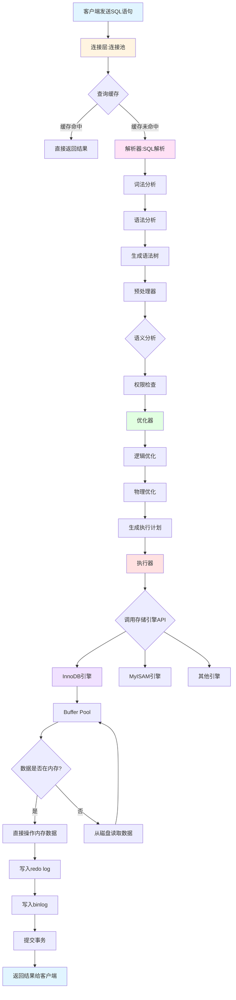

#### 2.4.2 详细执行步骤

**1. 客户端发送SQL语句**
- 通过连接层发送到服务器
- 使用MySQL通信协议
- 支持TCP/IP、Socket、命名管道等方式

**2. 连接层处理**
- 连接池管理
- 线程分配
- 权限验证
- 连接状态维护

**3. 查询缓存（MySQL 8.0已移除）**
- 检查缓存是否命中
- 缓存命中直接返回结果
- 缓存未命中继续执行

**4. SQL解析**
- **词法分析**：识别SQL关键字、标识符、常量等
- **语法分析**：检查SQL语法是否正确
- **生成语法树**：构建解析树（Parse Tree）

**5. 预处理**
- **语义分析**：检查表名、列名是否存在
- **权限检查**：验证用户是否有操作权限
- **视图展开**：展开视图定义
- **常量折叠**：优化常量表达式

**6. 查询优化**
- **逻辑优化**：
  - 条件简化
  - 等价变换
  - 外连接消除
  - 子查询优化
- **物理优化**：
  - 选择索引
  - 确定连接顺序
  - 选择连接算法（NLJ、Hash Join等）
  - 确定访问路径

**7. 生成执行计划**
- 生成查询执行计划（Query Execution Plan）
- 可以通过EXPLAIN查看执行计划
- 包含表访问顺序、索引使用、连接方式等信息

**8. 执行器执行**
- 根据执行计划调用存储引擎API
- 执行器与存储引擎交互
- 处理结果集

**9. 存储引擎操作**
- **InnoDB引擎**：
  - 检查Buffer Pool
  - 数据页读取
  - 索引查找
  - 数据修改
- **MyISAM引擎**：
  - 键缓存
  - 数据文件读取
  - 索引文件操作

**10. 日志写入（写操作）**
- **redo log**：保证事务持久性
- **undo log**：支持事务回滚和MVCC
- **binlog**：主从复制和数据恢复

**11. 返回结果**
- 将执行结果返回给客户端
- 结果集格式化
- 网络传输

#### 2.4.3 查询执行流程示例

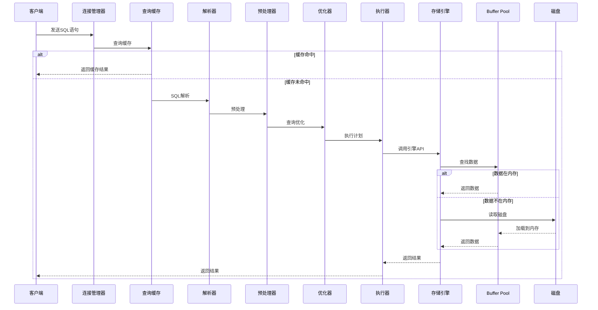

#### 2.4.4 关键组件说明

| 组件 | 功能 | 说明 |
|------|------|------|
| 连接管理器 | 管理客户端连接 | 线程复用、权限验证 |
| 查询缓存 | 缓存查询结果 | MySQL 8.0已移除 |
| 解析器 | SQL语法分析 | 词法分析、语法分析 |
| 预处理器 | 语义分析 | 权限检查、视图展开 |
| 优化器 | 查询优化 | 逻辑优化、物理优化 |
| 执行器 | 执行查询计划 | 调用存储引擎API |
| 存储引擎 | 数据存储和检索 | InnoDB、MyISAM等 |
| Buffer Pool | 内存缓冲池 | 缓存数据和索引 |

#### 2.4.5 执行流程优化建议

1. **连接优化**
   - 使用连接池减少连接开销
   - 合理设置连接超时时间
   - 避免长连接占用资源

2. **查询优化**
   - 避免使用SELECT *
   - 合理使用索引
   - 优化WHERE条件
   - 避免全表扫描

3. **缓存优化**
   - 合理配置Buffer Pool大小
   - 监控缓存命中率
   - 适当使用应用层缓存

4. **存储引擎优化**
   - 根据业务选择合适的存储引擎
   - 优化存储引擎参数
   - 监控引擎性能指标

## 3. 存储引擎

存储引擎是MySQL的核心组件之一，负责数据的存储和检索。MySQL支持多种存储引擎，每种引擎都有其特定的优化和适用场景。

### 3.1 存储引擎对比

| 特性 | MyISAM | InnoDB | Memory | CSV | Archive |
|------|--------|--------|--------|-----|---------|
| 事务支持 | ❌ | ✅ | ❌ | ❌ | ❌ |
| 行级锁 | ❌ | ✅ | ✅ | ❌ | ❌ |
| 外键支持 | ❌ | ✅ | ❌ | ❌ | ❌ |
| 聚簇索引 | ❌ | ✅ | ❌ | ❌ | ❌ |
| 全文索引 | ✅ | ✅ (5.6+) | ❌ | ❌ | ❌ |
| 哈希索引 | ❌ | ✅ (自适应) | ✅ | ❌ | ❌ |
| 数据压缩 | ✅ | ✅ | ❌ | ❌ | ✅ |
| 崩溃恢复 | ❌ | ✅ | ❌ | ❌ | ❌ |

### 3.2 InnoDB存储引擎

InnoDB是MySQL 5.5+的默认存储引擎，专为事务处理设计，具有以下特性：

#### 3.2.1 核心特性

- **事务支持**：完全支持ACID特性
- **行级锁**：提供更细粒度的并发控制
- **外键约束**：保证数据完整性
- **聚簇索引**：提高查询性能
- **MVCC**：多版本并发控制，提高并发性能

#### 3.2.2 关键技术

- **插入缓冲（Insert Buffer）**：优化非聚集索引的插入操作
- **二次写（Double Write）**：提高数据页的可靠性
- **自适应哈希索引（AHI）**：自动为热点数据创建哈希索引
- **预读（Read Ahead）**：提前读取可能需要的数据
- **缓冲池（Buffer Pool）**：缓存数据和索引

### 3.3 MyISAM存储引擎

MyISAM是MySQL早期的默认存储引擎，适用于读多写少的场景：

#### 3.3.1 核心特性

- **表级锁**：并发性能较差
- **全文索引**：支持全文搜索
- **压缩表**：减少存储空间
- **快速读取**：适合读密集型应用

#### 3.3.2 适用场景

- **只读或读多写少的应用**：如博客、新闻网站
- **临时表**：用于中间结果集
- **分析查询**：如报表生成

### 3.4 其他存储引擎

- **Memory**：内存存储，适用于临时数据
- **CSV**：以CSV格式存储，适用于数据交换
- **Archive**：高压缩比，适用于归档数据
- **Blackhole**：黑洞引擎，只记录日志不存储数据

## 4. 数据类型

MySQL支持多种数据类型，选择合适的数据类型对性能和存储空间有重要影响。

### 4.1 数值类型

| 类型 | 大小 | 范围 | 用途 |
|------|------|------|------|
| TINYINT | 1字节 | -128 ~ 127 | 小整数 |
| SMALLINT | 2字节 | -32768 ~ 32767 | 小整数 |
| MEDIUMINT | 3字节 | -8388608 ~ 8388607 | 中等整数 |
| INT | 4字节 | -2147483648 ~ 2147483647 | 整数 |
| BIGINT | 8字节 | -9223372036854775808 ~ 9223372036854775807 | 大整数 |
| FLOAT | 4字节 | 单精度浮点数 | 浮点数 |
| DOUBLE | 8字节 | 双精度浮点数 | 浮点数 |
| DECIMAL | 可变 | 高精度小数 | 货币、精确计算 |

### 4.2 字符串类型

| 类型 | 大小 | 用途 |
|------|------|------|
| CHAR | 0-255字节 | 定长字符串 |
| VARCHAR | 0-65535字节 | 变长字符串 |
| TINYTEXT | 0-255字节 | 短文本 |
| TEXT | 0-65535字节 | 文本 |
| MEDIUMTEXT | 0-16777215字节 | 中等文本 |
| LONGTEXT | 0-4294967295字节 | 长文本 |
| BINARY | 0-255字节 | 二进制数据 |
| VARBINARY | 0-65535字节 | 可变二进制数据 |

### 4.3 日期时间类型

| 类型 | 大小 | 范围 | 格式 |
|------|------|------|------|
| DATE | 3字节 | 1000-01-01 ~ 9999-12-31 | YYYY-MM-DD |
| TIME | 3字节 | -838:59:59 ~ 838:59:59 | HH:MM:SS |
| DATETIME | 8字节 | 1000-01-01 00:00:00 ~ 9999-12-31 23:59:59 | YYYY-MM-DD HH:MM:SS |
| TIMESTAMP | 4字节 | 1970-01-01 00:00:01 ~ 2038-01-19 03:14:07 | YYYY-MM-DD HH:MM:SS |
| YEAR | 1字节 | 1901 ~ 2155 | YYYY |

### 4.4 枚举和集合类型

- **ENUM**：枚举类型，只能取预定义值之一
- **SET**：集合类型，可以取预定义值的任意组合

### 4.5 数据类型选择原则

- **最小化存储**：选择足够小的类型
- **考虑范围**：确保类型能容纳所有可能的值
- **保持一致性**：相同含义的字段使用相同类型
- **考虑查询性能**：索引字段应选择较小的类型
- **避免NULL**：NULL值会增加存储空间和查询复杂度

## 5. SQL基础

SQL（Structured Query Language）是操作关系型数据库的标准语言，MySQL支持标准SQL的大部分功能。

### 5.1 SQL分类

- **DDL（数据定义语言）**：CREATE、ALTER、DROP、TRUNCATE等
- **DML（数据操作语言）**：INSERT、UPDATE、DELETE、SELECT等
- **DCL（数据控制语言）**：GRANT、REVOKE等
- **TCL（事务控制语言）**：COMMIT、ROLLBACK、SAVEPOINT等

### 5.2 常用SQL语句

#### 5.2.1 数据库操作

```sql
-- 创建数据库
CREATE DATABASE IF NOT EXISTS testdb CHARACTER SET utf8mb4 COLLATE utf8mb4_unicode_ci;

-- 使用数据库
USE testdb;

-- 删除数据库
DROP DATABASE IF EXISTS testdb;
```

#### 5.2.2 表操作

```sql
-- 创建表
CREATE TABLE IF NOT EXISTS users (
    id INT PRIMARY KEY AUTO_INCREMENT,
    name VARCHAR(50) NOT NULL,
    email VARCHAR(100) UNIQUE NOT NULL,
    age TINYINT UNSIGNED,
    created_at DATETIME DEFAULT CURRENT_TIMESTAMP
) ENGINE=InnoDB DEFAULT CHARSET=utf8mb4;

-- 修改表
ALTER TABLE users ADD COLUMN phone VARCHAR(20);
ALTER TABLE users MODIFY COLUMN age INT UNSIGNED;
ALTER TABLE users DROP COLUMN phone;

-- 删除表
DROP TABLE IF EXISTS users;
```

#### 5.2.3 数据操作

```sql
-- 插入数据
INSERT INTO users (name, email, age) VALUES ('张三', 'zhangsan@example.com', 25);
INSERT INTO users (name, email, age) VALUES ('李四', 'lisi@example.com', 30), ('王五', 'wangwu@example.com', 35);

-- 更新数据
UPDATE users SET age = 26 WHERE id = 1;
UPDATE users SET age = age + 1 WHERE age > 30;

-- 删除数据
DELETE FROM users WHERE id = 3;
DELETE FROM users WHERE age < 20;

-- 查询数据
SELECT * FROM users;
SELECT id, name, email FROM users WHERE age > 25 ORDER BY age DESC LIMIT 10;
SELECT COUNT(*) AS user_count FROM users GROUP BY age;
```

#### 5.2.4 索引操作

```sql
-- 创建索引
CREATE INDEX idx_age ON users(age);
CREATE UNIQUE INDEX idx_email ON users(email);
CREATE INDEX idx_name_age ON users(name, age);

-- 删除索引
DROP INDEX idx_age ON users;
```

### 5.3 SQL执行顺序

1. FROM：指定查询的表
2. WHERE：过滤条件
3. GROUP BY：分组
4. HAVING：分组后过滤
5. SELECT：选择列
6. DISTINCT：去重
7. ORDER BY：排序
8. LIMIT：限制结果数量

## 6. 索引

索引是提高数据库查询性能的关键技术，通过创建索引可以大幅减少数据扫描范围。

### 6.1 索引类型

#### 6.1.1 按数据结构分类

- **B+树索引**：默认索引类型，适用于范围查询和排序
- **哈希索引**：适用于等值查询，MySQL中Memory引擎支持
- **全文索引**：适用于文本搜索
- **空间索引**：适用于地理空间数据

#### 6.1.2 按物理存储分类

- **聚簇索引**：索引和数据存储在一起，InnoDB的主键索引
- **非聚簇索引**：索引和数据分开存储，MyISAM的所有索引

#### 6.1.3 按逻辑分类

- **主键索引**：唯一标识行数据，不允许NULL
- **唯一索引**：值唯一，允许NULL
- **普通索引**：最基本的索引类型

**复合索引**
- **定义**：基于多个列的索引
- **适用场景**：
  - 频繁使用多个列作为查询条件
  - 经常需要对多个列进行排序
  - 覆盖查询（查询的列都在索引中）
- **使用样例**：
  ```sql
  -- 创建复合索引
  CREATE INDEX idx_name_age ON users(name, age);
  
  -- 有效使用（遵循最左前缀原则）
  SELECT * FROM users WHERE name = '张三';
  SELECT * FROM users WHERE name = '张三' AND age = 25;
  SELECT * FROM users WHERE name = '张三' ORDER BY age;
  
  -- 无效使用（不遵循最左前缀原则）
  SELECT * FROM users WHERE age = 25; -- 不会使用复合索引
  ```

**前缀索引**
- **定义**：基于列的前缀创建索引
- **适用场景**：
  - 列值较长（如URL、邮箱、长文本）
  - 只需要前缀匹配（如LIKE 'prefix%'）
  - 节省索引存储空间
- **使用样例**：
  ```sql
  -- 创建前缀索引（取email列的前20个字符）
  CREATE INDEX idx_email_prefix ON users(email(20));
  
  -- 创建前缀索引（取url列的前30个字符）
  CREATE INDEX idx_url_prefix ON articles(url(30));
  
  -- 有效使用
  SELECT * FROM users WHERE email LIKE 'zhang%';
  SELECT * FROM articles WHERE url LIKE 'https://www.example.com%';
  
  -- 前缀长度选择
  -- 查看不同前缀长度的选择性
  SELECT
      COUNT(DISTINCT LEFT(email, 10)) / COUNT(*) AS selectivity_10,
      COUNT(DISTINCT LEFT(email, 20)) / COUNT(*) AS selectivity_20,
      COUNT(DISTINCT LEFT(email, 30)) / COUNT(*) AS selectivity_30
  FROM users;
  ```

### 6.2 B+树索引

B+树是MySQL中最常用的索引结构，具有以下特点：

#### 6.2.1 B+树结构

**B+树结构图**：

```
                              ┌─────────────────────────────────────────────┐
                              │                根节点                       │
                              ├───────────┬───────────┬───────────┬───────────┤
                              │  10       │  20       │  30       │  40       │
                              └──┬────────┴──┬────────┴──┬────────┴──┬────────┘
                                 │           │           │           │
                  ┌──────────────┘           │           │           └──────────────┐
                  │                          │           │                          │
┌─────────────────────────────┐  ┌─────────────────────────────┐  ┌─────────────────────────────┐
│         子节点 1            │  │         子节点 2            │  │         子节点 3            │
├───────────┬───────────┬─────┤  ├───────────┬───────────┬─────┤  ├───────────┬───────────┬─────┤
│   5       │   8       │  10 │  │  15       │  18       │  20 │  │  35       │  38       │  40 │
└──┬────────┴──┬────────┴┬────┘  └──┬────────┴──┬────────┴┬────┘  └──┬────────┴──┬────────┴┬────┘
   │           │         │           │           │         │           │           │         │
┌──▼──┐    ┌──▼──┐    ┌──▼──┐    ┌──▼──┐    ┌──▼──┐    ┌──▼──┐    ┌──▼──┐    ┌──▼──┐    ┌──▼──┐
│  3  │    │  6  │    │  9  │    │ 12  │    │ 16  │    │ 19  │    │ 32  │    │ 36  │    │ 39  │
│  4  │    │  7  │    │  10 │    │ 14  │    │ 17  │    │ 20  │    │ 34  │    │ 37  │    │ 40  │
└─────┘    └─────┘    └─────┘    └─────┘    └─────┘    └─────┘    └─────┘    └─────┘    └─────┘
   └──────────┬──────────┘          └──────────┬──────────┘          └──────────┬──────────┘
              │                                │                                │
              └──────────────────┬─────────────┘──────────────────┬─────────────┘
                                 │                                │
                                 └────────────────┬───────────────┘
                                                  │
                                      ┌─────────────────────────────┐
                                      │        叶子节点链表         │
                                      └─────────────────────────────┘
```

**B+树结构特点**：
- **非叶子节点**：只存储索引键，不存储数据
- **叶子节点**：存储索引键和数据指针（非聚簇索引）或数据本身（聚簇索引）
- **叶子节点链表**：叶子节点通过双向链表连接，支持范围查询

#### 6.2.2 B+树优势

- **平衡树**：查询时间复杂度稳定为O(log n)
- **范围查询高效**：通过叶子节点链表快速范围扫描
- **排序高效**：叶子节点已排序
- **磁盘IO少**：非叶子节点存储更多索引键，减少树高度

### 6.3 索引设计原则

- **选择合适的列**：选择区分度高、查询频繁的列
- **复合索引顺序**：遵循最左前缀原则，将最常用的列放在前面
- **避免过多索引**：索引会增加写操作开销
- **考虑数据分布**：对于分布不均的列，索引效果更好
- **使用前缀索引**：对于长字符串，使用合适长度的前缀
- **覆盖索引**：查询的列都在索引中，避免回表

### 6.4 索引优化

#### 6.4.1 索引失效场景

- **全表扫描**：如使用`SELECT *`且无索引
- **索引列使用函数**：如`WHERE YEAR(create_time) = 2023`
- **索引列进行运算**：如`WHERE id + 1 = 10`
- **索引列使用不等于**：如`WHERE age != 18`
- **索引列使用IS NULL/IS NOT NULL**：可能导致索引失效
- **LIKE以%开头**：如`WHERE name LIKE '%张三'`
- **OR条件**：如果OR两边的列不全有索引，可能导致索引失效
- **类型转换**：如字符串列与数字比较

#### 6.4.2 索引使用建议

- **使用EXPLAIN分析执行计划**：查看索引使用情况
- **避免使用SELECT ***：只选择需要的列
- **使用覆盖索引**：减少回表操作
- **合理使用复合索引**：遵循最左前缀原则
- **定期重建索引**：解决索引碎片问题
- **监控慢查询**：及时发现索引问题

## 7. 事务

事务是数据库操作的基本单位，保证一组操作的原子性、一致性、隔离性和持久性。

### 7.1 事务的ACID特性

- **原子性（Atomicity）**：事务中的操作要么全部成功，要么全部失败回滚
- **一致性（Consistency）**：事务执行前后，数据从一个一致性状态转移到另一个一致性状态
- **隔离性（Isolation）**：多个事务并发执行时，彼此之间互不影响
- **持久性（Durability）**：事务提交后，数据修改永久保存

### 7.2 事务隔离级别

MySQL支持四种事务隔离级别，由低到高分别是：

| 隔离级别 | 中文名称 | 含义描述 | 脏读 | 不可重复读 | 幻读 | 并发性能 |
|----------|----------|----------|------|------------|------|----------|
| READ UNCOMMITTED | 读未提交 | 允许读取未提交的数据，最低隔离级别 | ✅ | ✅ | ✅ | 最高 |
| READ COMMITTED | 读已提交 | 只能读取已提交的数据，Oracle默认级别 | ❌ | ✅ | ✅ | 较高 |
| REPEATABLE READ | 可重复读 | 同一事务内多次读取结果一致，MySQL默认级别 | ❌ | ❌ | ✅ | 中等 |
| SERIALIZABLE | 串行化 | 完全串行执行，最高隔离级别 | ❌ | ❌ | ❌ | 最低 |

#### 7.2.1 并发事务问题详解

**1. 脏读（Dirty Read）**

**定义**：一个事务读取到了另一个事务未提交的数据。

**场景示例**：
```sql
-- 事务T1
BEGIN;
UPDATE users SET balance = balance - 100 WHERE id = 1;  -- 余额从1000改为900
-- 此时事务T1还未提交

-- 事务T2（在READ UNCOMMITTED隔离级别下）
BEGIN;
SELECT balance FROM users WHERE id = 1;  -- 读到900（脏数据）
-- 如果T1回滚，T2读到的900就是无效的脏数据
```

**危害**：
- 读到的数据可能是不一致的、无效的
- 基于脏数据做出的业务决策可能是错误的
- 可能导致数据不一致

**解决方案**：使用READ COMMITTED及以上隔离级别

**2. 不可重复读（Non-Repeatable Read）**

**定义**：在同一个事务内，多次读取同一行数据，结果不一致（被其他事务修改并提交了）。

**场景示例**：
```sql
-- 事务T1
BEGIN;
SELECT balance FROM users WHERE id = 1;  -- 读到1000

-- 事务T2
BEGIN;
UPDATE users SET balance = balance - 100 WHERE id = 1;
COMMIT;  -- 余额变为900并提交

-- 事务T1继续
SELECT balance FROM users WHERE id = 1;  -- 读到900，与第一次读取不一致
COMMIT;
```

**危害**：
- 同一事务内读取数据不一致，违反一致性
- 可能导致业务逻辑错误

**解决方案**：使用REPEATABLE READ及以上隔离级别

**3. 幻读（Phantom Read）**

**定义**：在同一个事务内，多次查询同一范围的记录，结果集数量不一致（被其他事务插入或删除了数据）。

**场景示例**：
```sql
-- 事务T1
BEGIN;
SELECT * FROM users WHERE age BETWEEN 20 AND 30;  -- 查到5条记录

-- 事务T2
BEGIN;
INSERT INTO users(name, age) VALUES('Alice', 25);
COMMIT;  -- 插入了一条年龄为25的记录

-- 事务T1继续
SELECT * FROM users WHERE age BETWEEN 20 AND 30;  -- 查到6条记录，多了一条"幻影"记录
UPDATE users SET status = 1 WHERE age BETWEEN 20 AND 30;  -- 更新了6条记录
COMMIT;
```

**危害**：
- 查询结果集数量变化，影响业务逻辑
- 可能导致统计错误
- 更新/删除操作的行数与预期不符

**解决方案**：
- 使用SERIALIZABLE隔离级别
- MySQL InnoDB的REPEATABLE READ通过Next-Key Lock也能解决幻读问题

#### 7.2.2 脏读、不可重复读、幻读的区别与联系

**区别对比表：**

| 对比维度 | 脏读 | 不可重复读 | 幻读 |
|----------|------|------------|------|
| **问题本质** | 读到未提交数据 | 读到已提交的修改数据 | 读到已提交的新增/删除数据 |
| **操作类型** | 读操作 | 读操作 | 读操作 |
| **数据变化** | 数据可能被回滚 | 数据被修改（UPDATE） | 数据行数变化（INSERT/DELETE） |
| **影响范围** | 单行数据 | 单行数据 | 多行数据（结果集） |
| **隔离级别** | READ UNCOMMITTED | READ COMMITTED | REPEATABLE READ |
| **解决方式** | 提高到READ COMMITTED | 提高到REPEATABLE READ | 提高到SERIALIZABLE或使用Next-Key Lock |
| **锁机制** | 不需要锁 | 行锁 | 间隙锁（Gap Lock） |

**联系与递进关系：**

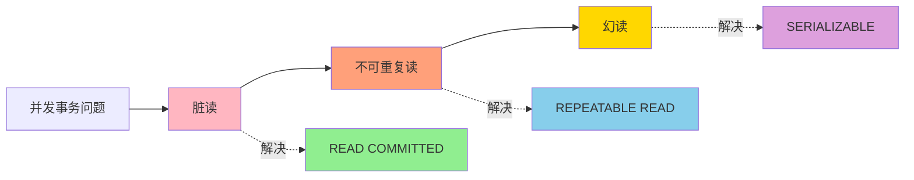

**详细区别说明：**

**1. 脏读 vs 不可重复读**

| 维度 | 脏读 | 不可重复读 |
|------|------|------------|
| **数据状态** | 未提交的数据 | 已提交的数据 |
| **数据有效性** | 可能无效（可能回滚） | 一定有效 |
| **严重程度** | 更严重 | 相对较轻 |
| **出现时机** | 事务未提交时 | 事务提交后 |
| **示例** | T1修改未提交，T2读取 | T1修改并提交，T2再次读取 |

**关键区别**：
- 脏读读到的是**可能无效**的数据（未提交）
- 不可重复读读到的是**有效**的数据（已提交）
- 脏读的问题在于数据可能回滚，不可重复读的问题在于数据一致性

**2. 不可重复读 vs 幻读**

| 维度 | 不可重复读 | 幻读 |
|------|------------|------|
| **操作类型** | UPDATE操作 | INSERT/DELETE操作 |
| **影响对象** | 已存在的行 | 新增或删除的行 |
| **结果变化** | 同一行的值变化 | 结果集的行数变化 |
| **锁范围** | 行锁 | 间隙锁 |
| **解决难度** | 较容易 | 较困难 |

**关键区别**：
- 不可重复读关注的是**数据内容的变化**（UPDATE）
- 幻读关注的是**数据数量的变化**（INSERT/DELETE）
- 不可重复读只需要锁住**已存在的行**
- 幻读需要锁住**不存在的行**（间隙）

**3. 三者的递进关系**

```
隔离级别递增 → 并发问题递减 → 并发性能递减

READ UNCOMMITTED
    ↓ 解决脏读
READ COMMITTED
    ↓ 解决不可重复读
REPEATABLE READ
    ↓ 解决幻读
SERIALIZABLE
```

**实际场景对比：**

```sql
-- 场景1：脏读
-- T1: UPDATE users SET balance = 900 WHERE id = 1; (未提交)
-- T2: SELECT balance FROM users WHERE id = 1; -- 读到900（脏读）
-- T1: ROLLBACK; -- 余额恢复为1000
-- 问题：T2读到的900是无效数据

-- 场景2：不可重复读
-- T1: SELECT balance FROM users WHERE id = 1; -- 读到1000
-- T2: UPDATE users SET balance = 900 WHERE id = 1; COMMIT;
-- T1: SELECT balance FROM users WHERE id = 1; -- 读到900（不可重复读）
-- 问题：T1同一事务内两次读取结果不一致

-- 场景3：幻读
-- T1: SELECT * FROM users WHERE age > 20; -- 5条记录
-- T2: INSERT INTO users(name, age) VALUES('Bob', 25); COMMIT;
-- T1: SELECT * FROM users WHERE age > 20; -- 6条记录（幻读）
-- 问题：T1同一事务内两次查询结果集数量不一致
```

#### 7.2.3 隔离级别选择建议

| 业务场景 | 推荐隔离级别 | 理由 |
|----------|--------------|------|
| **日志系统** | READ UNCOMMITTED | 性能优先，允许少量不一致 |
| **Web应用** | READ COMMITTED | 平衡性能和一致性，Oracle默认 |
| **金融系统** | REPEATABLE READ | 强一致性要求，MySQL默认 |
| **财务报表** | SERIALIZABLE | 严格一致性，可接受性能损失 |
| **电商订单** | REPEATABLE READ | 订单数据一致性要求高 |
| **社交动态** | READ COMMITTED | 允许短暂不一致，性能优先 |

**MySQL默认隔离级别**：REPEATABLE READ（可重复读）

**查看和设置隔离级别**：

```sql
-- 查看当前隔离级别
SELECT @@transaction_isolation;

-- 设置隔离级别（会话级别）
SET SESSION TRANSACTION ISOLATION LEVEL READ COMMITTED;

-- 设置隔离级别（全局级别）
SET GLOBAL TRANSACTION ISOLATION LEVEL READ COMMITTED;

-- 在事务开始时设置
SET TRANSACTION ISOLATION LEVEL READ COMMITTED;
START TRANSACTION;
-- 业务操作
COMMIT;
```

### 7.3 事务控制语句

```sql
-- 开始事务
START TRANSACTION;

-- 执行操作
INSERT INTO orders (user_id, amount) VALUES (1, 100);
UPDATE users SET balance = balance - 100 WHERE id = 1;

-- 提交事务
COMMIT;

-- 回滚事务
ROLLBACK;

-- 设置保存点
SAVEPOINT sp1;
-- 回滚到保存点
ROLLBACK TO sp1;
```

### 7.4 事务优化

- **短事务优先**：减少锁持有时间
- **避免长事务**：长事务会占用资源，增加死锁风险
- **合理设置隔离级别**：根据业务需求选择合适的隔离级别
- **使用索引**：减少事务中的全表扫描
- **避免在事务中执行DDL**：DDL会隐式提交事务
- **批量操作**：对于大量数据操作，考虑分批处理

## 8. 锁机制

锁是MySQL实现并发控制的重要机制，用于解决并发操作中的数据一致性问题。

### 8.1 锁类型

#### 8.1.1 按粒度分类

- **表锁**：锁定整个表，MyISAM默认锁类型
- **行锁**：锁定单行数据，InnoDB默认锁类型
- **页锁**：锁定一页数据，BDB引擎支持

#### 8.1.2 按操作类型分类

- **读锁（共享锁）**：多个事务可以同时读取同一资源
- **写锁（排他锁）**：只有一个事务可以修改资源

#### 8.1.3 InnoDB的锁

- **记录锁**：锁定单行记录
- **间隙锁**：锁定索引范围之间的间隙
- **临键锁**：记录锁和间隙锁的组合
- **意向锁**：表级锁，表示事务准备对表进行操作

### 8.2 锁的使用

```sql
-- 显式加共享锁
SELECT * FROM users WHERE id = 1 LOCK IN SHARE MODE;

-- 显式加排他锁
SELECT * FROM users WHERE id = 1 FOR UPDATE;

-- 自动加锁
-- InnoDB在UPDATE、DELETE时会自动加排他锁
-- InnoDB在SELECT时默认不加锁（MVCC）
```

### 8.3 死锁

死锁是指两个或多个事务相互等待对方释放锁的情况。

#### 8.3.1 死锁产生的条件

- **互斥条件**：资源不能被共享
- **请求与保持条件**：事务已持有资源并请求新资源
- **不剥夺条件**：资源只能由持有方主动释放
- **循环等待条件**：事务形成循环等待链

#### 8.3.2 死锁预防

- **合理设计索引**：减少锁的范围
- **减少事务持有锁的时间**：尽快提交事务
- **使用相同的操作顺序**：避免循环等待
- **设置合理的锁超时**：`innodb_lock_wait_timeout`
- **使用分布式锁**：对于分布式环境

## 9. MVCC

MVCC（Multi-Version Concurrency Control，多版本并发控制）是InnoDB实现高并发的核心技术。

### 9.1 MVCC原理

MVCC（Multi-Version Concurrency Control，多版本并发控制）是InnoDB实现高并发的核心技术。通过为每一行数据维护多个版本，实现并发读写而不阻塞。

#### 9.1.1 MVCC核心组件

MVCC的实现依赖于以下三个核心组件：

1. **隐藏列**：每行数据包含的隐藏字段
2. **Undo Log**：存储数据的历史版本
3. **Read View**：事务的一致性视图

#### 9.1.2 表的隐藏列详解

InnoDB存储引擎会自动为每行数据添加三个隐藏列：

| 隐藏列 | 大小 | 说明 | 作用 |
|--------|------|------|------|
| **DB_TRX_ID** | 6字节 | 事务ID | 最后一次插入或更新该行的事务ID |
| **DB_ROLL_PTR** | 7字节 | 回滚指针 | 指向undo log中该行的上一个版本 |
| **DB_ROW_ID** | 6字节 | 行ID | 单调递增的行标识（如果没有主键则自动创建） |

**隐藏列结构示意图：**

```
┌─────────────────────────────────────────────────────────┐
│                    InnoDB行记录结构                      │
├─────────────────────────────────────────────────────────┤
│  列1数据  │  列2数据  │  ...  │ DB_TRX_ID │ DB_ROLL_PTR │
│  (用户数据)           │       │  (6字节)  │   (7字节)    │
└─────────────────────────────────────────────────────────┘
                                   │
                                   │ DB_ROLL_PTR指向
                                   ▼
                         ┌──────────────────┐
                         │   Undo Log记录    │
                         │  (上一个版本数据)  │
                         └──────────────────┘
```

**DB_TRX_ID详解：**
- 每个事务开始时，InnoDB会分配一个唯一的事务ID
- 事务ID是递增的，先开始的事务ID较小
- 当事务修改某行数据时，会将该行DB_TRX_ID设置为自己的事务ID

**DB_ROLL_PTR详解：**
- 指向undo log中该行的上一个版本
- 通过回滚指针可以构建数据的多版本链
- 每次更新都会生成新的undo log记录，并更新回滚指针

**DB_ROW_ID详解：**
- 如果表没有主键，InnoDB会自动创建DB_ROW_ID作为主键
- 如果表有主键，则不会创建DB_ROW_ID
- DB_ROW_ID是单调递增的6字节整数

#### 9.1.3 Undo Log详解

**Undo Log的作用：**
1. **事务回滚**：记录数据修改前的状态，用于回滚
2. **MVCC多版本读**：存储数据的历史版本，供其他事务读取
3. **崩溃恢复**：帮助恢复未提交的事务

**Undo Log类型：**

| 类型 | 说明 | 存储位置 | 适用操作 |
|------|------|----------|----------|
| **insert undo log** | INSERT操作产生的undo log | 共享表空间 | 事务提交后可立即删除 |
| **update undo log** | UPDATE/DELETE操作产生的undo log | 共享表空间 | 需要保留供MVCC使用 |

**Undo Log版本链示意图：**

```
当前数据行:
┌────────────────────────────────────────────┐
│ id=1, name='Alice', DB_TRX_ID=100,         │
│ DB_ROLL_PTR=0x7F8A...                      │
└────────────────────────────────────────────┘
                    │
                    │ DB_ROLL_PTR
                    ▼
Undo Log版本1 (TRX_ID=100):
┌────────────────────────────────────────────┐
│ id=1, name='Bob', DB_TRX_ID=90,            │
│ DB_ROLL_PTR=0x7F90...                      │
└────────────────────────────────────────────┘
                    │
                    │ DB_ROLL_PTR
                    ▼
Undo Log版本2 (TRX_ID=90):
┌────────────────────────────────────────────┐
│ id=1, name='Charlie', DB_TRX_ID=80,        │
│ DB_ROLL_PTR=NULL                           │
└────────────────────────────────────────────┘
```

**Undo Log的清理：**
- InnoDB后台线程 purge thread负责清理undo log
- 当某个undo log不再被任何活跃事务需要时，才会被清理
- 长时间运行的事务会导致undo log无法清理，占用大量空间

#### 9.1.4 Read View详解

**Read View定义：**
Read View是事务进行快照读时产生的一个一致性视图，用于判断数据版本的可见性。

**Read View核心字段：**

```c
struct ReadView {
    // 最小活跃事务ID
    trx_id_t m_low_limit_id;
    
    // 下一个将要分配的事务ID（最大事务ID+1）
    trx_id_t m_up_limit_id;
    
    // 当前活跃的事务ID集合
    ids_t m_ids;
    
    // 创建该Read View的事务ID
    trx_id_t m_creator_trx_id;
};
```

**Read View字段说明：**

| 字段 | 说明 | 示例 |
|------|------|------|
| **m_low_limit_id** | 最小活跃事务ID | 当前活跃事务中最小的ID |
| **m_up_limit_id** | 下一个将分配的事务ID | 当前最大事务ID + 1 |
| **m_ids** | 活跃事务ID列表 | [100, 102, 105] |
| **m_creator_trx_id** | 创建者事务ID | 当前事务的ID |

**Read View可见性判断规则：**

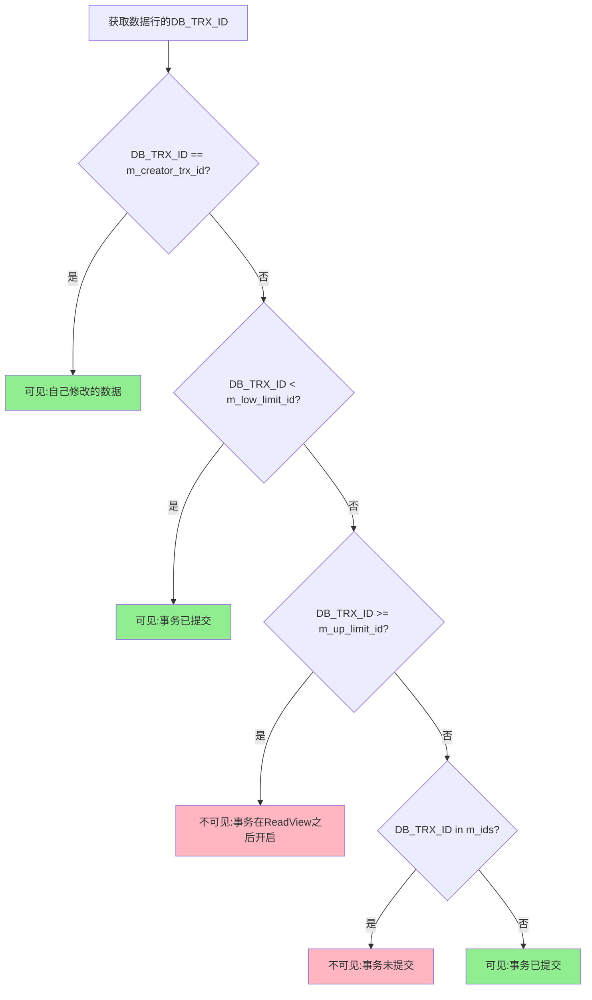

**可见性判断伪代码：**

```java
boolean isVisible(trx_id_t trx_id, ReadView view) {
    // 1. 如果是自己修改的数据，可见
    if (trx_id == view.m_creator_trx_id) {
        return true;
    }
    
    // 2. 如果事务ID小于最小活跃事务ID，说明事务已提交，可见
    if (trx_id < view.m_low_limit_id) {
        return true;
    }
    
    // 3. 如果事务ID大于等于下一个将分配的事务ID，说明事务在ReadView之后开启，不可见
    if (trx_id >= view.m_up_limit_id) {
        return false;
    }
    
    // 4. 如果事务ID在活跃事务列表中，说明事务未提交，不可见
    if (view.m_ids.contains(trx_id)) {
        return false;
    }
    
    // 5. 否则说明事务已提交，可见
    return true;
}
```

#### 9.1.5 MVCC完整工作流程

**快照读流程：**

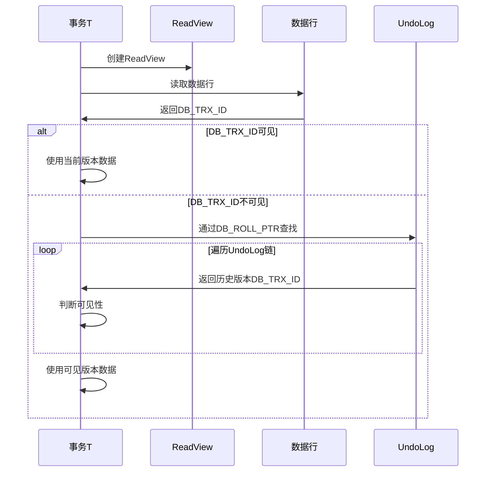

**当前读流程：**

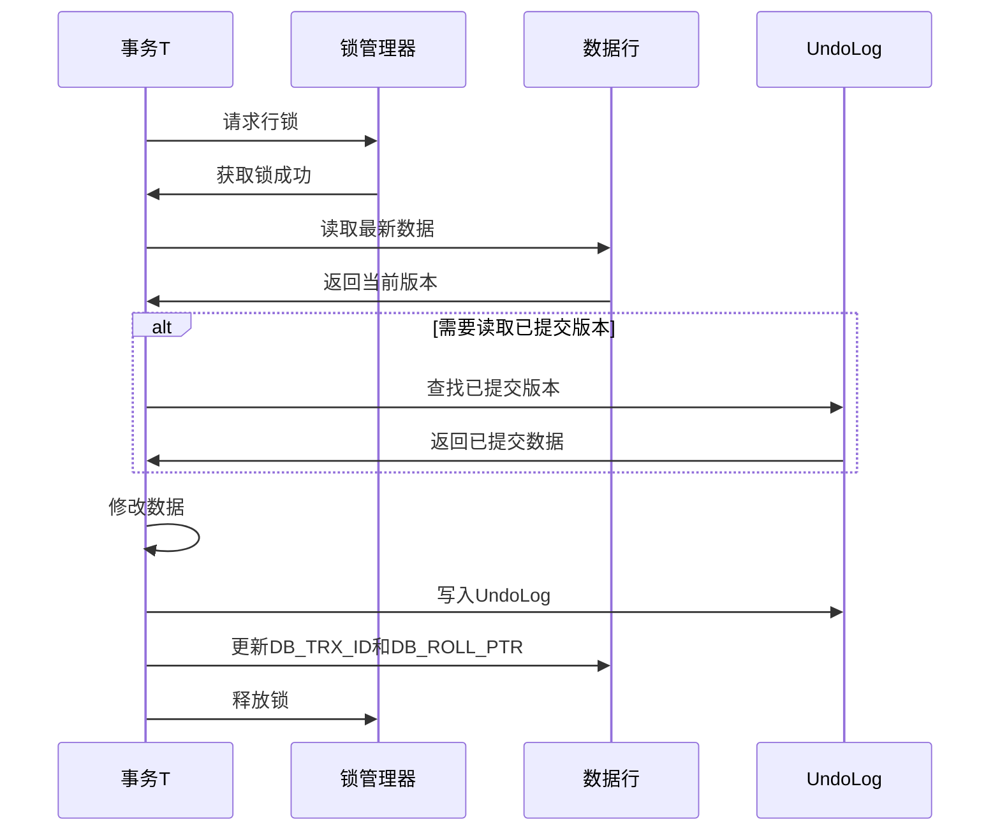

**UPDATE操作完整流程：**

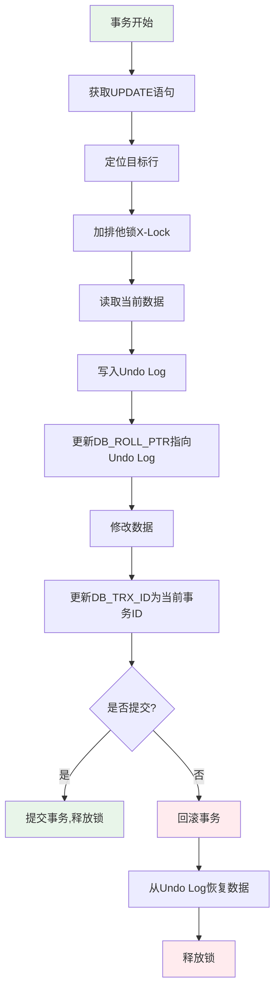

#### 9.1.6 MVCC与隔离级别

不同隔离级别下MVCC的行为：

**READ UNCOMMITTED（读未提交）：**
- 不使用MVCC
- 直接读取最新数据，可能读到未提交数据

**READ COMMITTED（读已提交）：**
- 每次SELECT都生成新的Read View
- 可以读到其他事务已提交的数据
- 可能出现不可重复读问题

**REPEATABLE READ（可重复读）：**
- 第一次SELECT生成Read View，后续复用
- 保证同一事务内多次读取结果一致
- 解决不可重复读问题
- InnoDB通过MVCC+Next-Key Lock解决幻读问题

**SERIALIZABLE（串行化）：**
- 不使用MVCC
- 所有读操作都加锁
- 完全串行执行

**不同隔离级别Read View生成时机：**

```
READ COMMITTED:
┌─────────────────────────────────────────┐
│ 事务T                                    │
├─────────────────────────────────────────┤
│ SELECT ... → 生成ReadView1               │
│ ...                                      │
│ SELECT ... → 生成ReadView2 (新的!)       │
│ ...                                      │
│ SELECT ... → 生成ReadView3 (新的!)       │
└─────────────────────────────────────────┘

REPEATABLE READ:
┌─────────────────────────────────────────┐
│ 事务T                                    │
├─────────────────────────────────────────┤
│ SELECT ... → 生成ReadView1               │
│ ...                                      │
│ SELECT ... → 复用ReadView1               │
│ ...                                      │
│ SELECT ... → 复用ReadView1               │
└─────────────────────────────────────────┘
```

#### 9.1.7 MVCC实例演示

**场景：多个事务并发操作同一行数据**

```sql
-- 初始数据
INSERT INTO users(id, name) VALUES(1, 'Alice');  -- TRX_ID=100

-- 事务T1 (TRX_ID=110)
BEGIN;
UPDATE users SET name='Bob' WHERE id=1;    -- T1修改但未提交

-- 事务T2 (TRX_ID=120)
BEGIN;
SELECT * FROM users WHERE id=1;            -- T2查询，应该读到什么？
```

**数据版本链：**

```
当前版本 (TRX_ID=110, 未提交):
┌────────────────────────────────┐
│ id=1, name='Bob'               │
│ DB_TRX_ID=110                  │
│ DB_ROLL_PTR → Undo Log         │
└────────────────────────────────┘
            │
            ▼
Undo Log (TRX_ID=100, 已提交):
┌────────────────────────────────┐
│ id=1, name='Alice'             │
│ DB_TRX_ID=100                  │
│ DB_ROLL_PTR=NULL               │
└────────────────────────────────┘
```

**T2的Read View：**
- m_low_limit_id = 110 (T1未提交)
- m_up_limit_id = 121 (下一个事务ID)
- m_ids = [110, 120] (活跃事务列表)
- m_creator_trx_id = 120 (T2自己的ID)

**T2读取过程：**
1. 读取当前版本，DB_TRX_ID=110
2. 判断可见性：110 in m_ids → 不可见（T1未提交）
3. 通过DB_ROLL_PTR找到Undo Log版本
4. 读取Undo Log版本，DB_TRX_ID=100
5. 判断可见性：100 < m_low_limit_id → 可见（已提交）
6. 返回name='Alice'

#### 9.1.8 MVCC优势与限制

**优势：**
1. **高并发**：读写互不阻塞
2. **一致性**：保证事务看到一致的数据快照
3. **减少锁竞争**：降低死锁概率
4. **性能优化**：避免频繁加锁开销

**限制：**
1. **空间开销**：Undo Log需要存储历史版本
2. **清理延迟**：长事务导致Undo Log无法及时清理
3. **版本遍历**：需要遍历版本链查找可见版本
4. **内存占用**：Read View需要维护活跃事务列表

#### 9.1.9 MVCC监控与调优

**相关参数：**

```sql
-- 查看undo log相关参数
SHOW VARIABLES LIKE 'innodb_undo%';

-- innodb_undo_directory: undo log存储目录
-- innodb_undo_logs: undo log文件数量
-- innodb_undo_tablespaces: undo表空间数量
```

**监控指标：**

```sql
-- 查看事务状态
SELECT * FROM information_schema.INNODB_TRX;

-- 查看锁等待
SELECT * FROM information_schema.INNODB_LOCK_WAITS;

-- 查看undo log信息
SHOW ENGINE INNODB STATUS\G
```

**调优建议：**
1. 避免长事务，及时提交
2. 合理设置undo表空间大小
3. 监控History List Length（undo log链长度）
4. 定期执行PURGE操作清理undo log

### 9.2 MVCC优势

- **高并发**：读操作不阻塞写操作，写操作不阻塞读操作
- **一致性**：每个事务看到的数据是一致的
- **减少锁竞争**：降低死锁风险
- **提高性能**：避免了频繁的加锁和解锁操作

### 9.3 MVCC实现细节

- **回滚段**：存储行的历史版本
- **undo日志**：记录数据修改前的状态
- **read view**：事务的一致性视图，用于判断数据可见性

## 10. 日志系统

MySQL的日志系统是保证数据安全和可靠性的重要组成部分。

### 10.1 重做日志（Redo Log）

Redo Log记录了数据页的物理修改，用于崩溃恢复。

#### 10.1.1 工作原理

- **写入时机**：事务执行过程中持续写入
- **存储方式**：循环写入，固定大小
- **作用**：保证事务的持久性，崩溃后恢复数据

#### 10.1.2 相关参数

- `innodb_log_file_size`：每个redo log文件大小
- `innodb_log_files_in_group`：redo log文件数量
- `innodb_flush_log_at_trx_commit`：控制redo log刷新策略

### 10.2 回滚日志（Undo Log）

Undo Log记录了数据修改前的状态，用于事务回滚和MVCC。

#### 10.2.1 工作原理

- **写入时机**：数据修改前记录
- **存储方式**：存储在回滚段
- **作用**：事务回滚、MVCC读

### 10.3 二进制日志（Bin Log）

Bin Log记录了所有数据修改操作，用于复制和恢复。

#### 10.3.1 工作原理

- **写入时机**：事务提交后写入
- **存储方式**：追加写入，可配置保留策略
- **作用**：主从复制、数据恢复

#### 10.3.2 格式类型

- **STATEMENT**：记录SQL语句
- **ROW**：记录行的变化
- **MIXED**：混合模式

#### 10.3.3 相关参数

- `log_bin`：启用binlog
- `binlog_format`：binlog格式
- `sync_binlog`：控制binlog刷新策略

### 10.4 其他日志

MySQL除了redo log、undo log和binlog外，还有其他重要的日志类型，用于故障排查、性能优化和审计。

#### 10.4.1 错误日志（Error Log）

**定义**：记录MySQL服务器的启动、运行、停止过程中的错误、警告和注意信息。

**使用场景**：
1. **故障诊断**：服务器启动失败、崩溃恢复
2. **性能问题排查**：内存不足、连接数过多
3. **配置错误检测**：参数配置不当、权限问题
4. **安全审计**：访问拒绝、权限错误

**配置参数**：

```ini
# my.cnf配置文件
[mysqld]
# 错误日志文件路径
log_error = /var/log/mysql/error.log

# 是否记录警告信息（MySQL 5.7+）
log_error_verbosity = 3
# 1: 只记录错误
# 2: 记录错误和警告
# 3: 记录错误、警告和注意信息（推荐）

# 是否将错误输出到系统日志
log_error_services = 'log_sink_internal, log_sink_syseventlog'
```

**查看错误日志**：

```bash
# 查看错误日志位置
mysql -e "SHOW VARIABLES LIKE 'log_error';"

# 实时查看错误日志
tail -f /var/log/mysql/error.log

# 查看最近的错误
grep -i error /var/log/mysql/error.log | tail -20

# 查看启动错误
grep -i "start" /var/log/mysql/error.log

# 查看连接错误
grep -i "access denied" /var/log/mysql/error.log
```

**常见错误示例**：

```
# 内存不足错误
[ERROR] InnoDB: Cannot allocate memory for the buffer pool

# 连接数过多
[ERROR] Too many connections

# 权限错误
[ERROR] Access denied for user 'root'@'localhost'

# 表损坏
[ERROR] Table './database/table' is marked as crashed and should be repaired

# 主从复制错误
[ERROR] Slave I/O: error connecting to master 'repl@master:3306'
```

**错误日志分析工具**：

```bash
# 使用pt-query-digest分析错误日志
pt-query-digest /var/log/mysql/error.log

# 统计错误类型
awk '/ERROR/ {print}' /var/log/mysql/error.log | sort | uniq -c | sort -nr
```

#### 10.4.2 慢查询日志（Slow Query Log）

**定义**：记录执行时间超过指定阈值的SQL语句，用于性能优化。

**使用场景**：
1. **性能优化**：找出执行缓慢的SQL语句
2. **索引优化**：识别缺少索引的查询
3. **应用优化**：优化频繁执行的慢查询
4. **容量规划**：评估数据库性能瓶颈

**配置参数**：

```ini
# my.cnf配置文件
[mysqld]
# 启用慢查询日志
slow_query_log = 1

# 慢查询日志文件路径
slow_query_log_file = /var/log/mysql/slow.log

# 慢查询时间阈值（秒）
long_query_time = 2.0

# 是否记录未使用索引的查询
log_queries_not_using_indexes = 1

# 记录所有查询（包括快查询，用于测试）
# log_output = 'FILE,TABLE'

# 每分钟记录的未使用索引查询的最大数量
log_throttle_queries_not_using_indexes = 60

# 记录管理语句
log_slow_admin_statements = 1

# 记录复制语句
log_slow_slave_statements = 1
```

**查看慢查询日志**：

```bash
# 查看慢查询日志配置
mysql -e "SHOW VARIABLES LIKE '%slow_query%';"
mysql -e "SHOW VARIABLES LIKE 'long_query_time';"

# 实时查看慢查询
tail -f /var/log/mysql/slow.log

# 统计慢查询数量
grep -c "Query_time" /var/log/mysql/slow.log

# 查看最慢的10条查询
mysqldumpslow -s t -t 10 /var/log/mysql/slow.log

# 查看执行次数最多的10条查询
mysqldumpslow -s c -t 10 /var/log/mysql/slow.log

# 查看平均执行时间最长的10条查询
mysqldumpslow -s at -t 10 /var/log/mysql/slow.log
```

**慢查询日志格式示例**：

```
# Time: 2024-01-15T10:30:45.123456Z
# User@Host: appuser[appuser] @ 192.168.1.100 []
# Query_time: 5.123456  Lock_time: 0.000123  Rows_sent: 1000  Rows_examined: 50000
SET timestamp=1705315845;
SELECT * FROM orders WHERE user_id = 12345 AND status = 'pending' ORDER BY created_at DESC;
```

**使用pt-query-digest分析慢查询**：

```bash
# 安装Percona Toolkit
sudo apt-get install percona-toolkit

# 分析慢查询日志
pt-query-digest /var/log/mysql/slow.log > slow_report.txt

# 分析最近1小时的慢查询
pt-query-digest --since '1h' /var/log/mysql/slow.log

# 分析特定时间段的慢查询
pt-query-digest --since '2024-01-01 00:00:00' --until '2024-01-31 23:59:59' /var/log/mysql/slow.log

# 只分析SELECT语句
pt-query-digest --filter '$event->{arg} =~ m/^SELECT/i' /var/log/mysql/slow.log
```

**慢查询优化流程**：

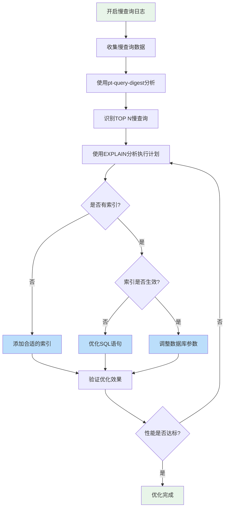

**慢查询优化示例**：

```sql
-- 慢查询
SELECT * FROM orders WHERE user_id = 12345 AND status = 'pending';

-- 使用EXPLAIN分析
EXPLAIN SELECT * FROM orders WHERE user_id = 12345 AND status = 'pending';

-- 添加复合索引
CREATE INDEX idx_user_status ON orders(user_id, status);

-- 优化后的查询（使用覆盖索引）
SELECT id, user_id, status, amount FROM orders 
WHERE user_id = 12345 AND status = 'pending';

-- 验证优化效果
EXPLAIN SELECT id, user_id, status, amount FROM orders 
WHERE user_id = 12345 AND status = 'pending';
```

#### 10.4.3 通用查询日志（General Log）

**定义**：记录所有客户端连接和执行的SQL语句，用于审计和调试。

**使用场景**：
1. **SQL审计**：记录所有数据库操作
2. **问题调试**：追踪客户端执行的SQL语句
3. **安全审计**：监控异常操作
4. **应用调试**：查看应用生成的SQL语句

**配置参数**：

```ini
# my.cnf配置文件
[mysqld]
# 启用通用查询日志（生产环境慎用，影响性能）
general_log = 1

# 通用查询日志文件路径
general_log_file = /var/log/mysql/general.log

# 日志输出方式：FILE（文件）、TABLE（表）、NONE（不输出）
log_output = 'FILE,TABLE'

# 仅在调试时开启，生产环境建议关闭
# general_log = 0
```

**查看通用查询日志**：

```bash
# 查看通用查询日志配置
mysql -e "SHOW VARIABLES LIKE 'general_log%';"

# 实时查看通用查询日志
tail -f /var/log/mysql/general.log

# 查看特定用户的操作
grep "user1" /var/log/mysql/general.log

# 查看特定表的操作
grep "orders" /var/log/mysql/general.log

# 查看特定时间段的操作
grep "2024-01-15" /var/log/mysql/general.log
```

**通用查询日志格式示例**：

```
2024-01-15T10:30:45.123456Z	    10 Connect	appuser@192.168.1.100 on mydb using Socket
2024-01-15T10:30:45.234567Z	    10 Query	SET NAMES utf8mb4
2024-01-15T10:30:45.345678Z	    10 Query	SELECT * FROM users WHERE id = 1
2024-01-15T10:30:46.456789Z	    10 Query	UPDATE users SET last_login = NOW() WHERE id = 1
2024-01-15T10:30:47.567890Z	    10 Quit
```

**查询通用日志表**：

```sql
-- 查看通用日志表
SELECT * FROM mysql.general_log 
WHERE command_type = 'Query' 
ORDER BY event_time DESC 
LIMIT 10;

-- 查看特定用户的操作
SELECT * FROM mysql.general_log 
WHERE user_host LIKE '%appuser%' 
ORDER BY event_time DESC;

-- 查看特定时间段的操作
SELECT * FROM mysql.general_log 
WHERE event_time BETWEEN '2024-01-15 10:00:00' AND '2024-01-15 11:00:00'
ORDER BY event_time;

-- 清空通用日志表
TRUNCATE TABLE mysql.general_log;
```

**通用日志分析脚本**：

```bash
#!/bin/bash
# analyze_general_log.sh

LOG_FILE="/var/log/mysql/general.log"

echo "=== 通用查询日志分析 ==="
echo ""

# 统计连接数
echo "1. 连接统计："
grep "Connect" $LOG_FILE | awk '{print $3}' | sort | uniq -c | sort -nr | head -10

echo ""

# 统计查询类型
echo "2. 查询类型统计："
grep "Query" $LOG_FILE | awk '{print $5}' | sort | uniq -c | sort -nr | head -10

echo ""

# 统计访问的表
echo "3. 访问最频繁的表："
grep -oE "(FROM|JOIN|UPDATE|INSERT INTO|DELETE FROM)\s+\w+" $LOG_FILE | \
awk '{print $2}' | sort | uniq -c | sort -nr | head -10

echo ""

# 统计执行时间分布
echo "4. 按小时统计查询数量："
grep "Query" $LOG_FILE | awk '{print substr($1, 12, 2)}' | sort | uniq -c
```

#### 10.4.4 日志管理最佳实践

**1. 日志轮转配置**

```bash
# /etc/logrotate.d/mysql
/var/log/mysql/error.log 
/var/log/mysql/slow.log 
/var/log/mysql/general.log {
    daily
    rotate 7
    compress
    delaycompress
    missingok
    notifysempty
    create 640 mysql adm
    size 100M
    postrotate
        # 重新打开日志文件
        if test -x /usr/bin/mysqladmin && \
           /usr/bin/mysqladmin ping &>/dev/null; then
            /usr/bin/mysqladmin flush-logs
        fi
    endscript
}
```

**2. 日志监控脚本**

```bash
#!/bin/bash
# monitor_logs.sh

ERROR_LOG="/var/log/mysql/error.log"
SLOW_LOG="/var/log/mysql/slow.log"

# 检查错误日志中的关键错误
check_errors() {
    echo "=== 检查MySQL错误日志 ==="
    ERRORS=$(grep -i "error\|warning" $ERROR_LOG | tail -10)
    if [ -n "$ERRORS" ]; then
        echo "发现错误或警告："
        echo "$ERRORS"
        # 发送告警邮件
        # echo "$ERRORS" | mail -s "MySQL Error Alert" admin@example.com
    else
        echo "未发现错误或警告"
    fi
}

# 检查慢查询数量
check_slow_queries() {
    echo ""
    echo "=== 检查慢查询数量 ==="
    TODAY=$(date +%Y-%m-%d)
    COUNT=$(grep "$TODAY" $SLOW_LOG | grep -c "Query_time")
    echo "今日慢查询数量: $COUNT"
    
    if [ $COUNT -gt 100 ]; then
        echo "警告：慢查询数量过多！"
        # 发送告警
    fi
}

# 检查日志文件大小
check_log_size() {
    echo ""
    echo "=== 检查日志文件大小 ==="
    for log in $ERROR_LOG $SLOW_LOG; do
        SIZE=$(du -h $log | awk '{print $1}')
        echo "$log: $SIZE"
    done
}

# 执行检查
check_errors
check_slow_queries
check_log_size
```

**3. 日志清理策略**

```sql
-- 清理慢查询日志表
TRUNCATE TABLE mysql.slow_log;

-- 清理通用查询日志表
TRUNCATE TABLE mysql.general_log;

-- 关闭日志（临时）
SET GLOBAL slow_query_log = 'OFF';
SET GLOBAL general_log = 'OFF';

-- 开启日志
SET GLOBAL slow_query_log = 'ON';
SET GLOBAL general_log = 'ON';

-- 刷新日志
FLUSH LOGS;
```

**4. 日志配置建议**

| 日志类型 | 生产环境建议 | 开发环境建议 | 存储位置 | 保留时间 |
|----------|--------------|--------------|----------|----------|
| 错误日志 | ✅ 必须开启 | ✅ 必须开启 | 独立磁盘 | 30天 |
| 慢查询日志 | ✅ 建议开启 | ✅ 建议开启 | 独立磁盘 | 7-30天 |
| 通用查询日志 | ❌ 不建议开启 | ✅ 调试时开启 | 独立磁盘 | 1-3天 |
| Binlog | ✅ 必须开启 | ✅ 建议开启 | 独立磁盘 | 7-30天 |
| Redo Log | ✅ 自动开启 | ✅ 自动开启 | 独立磁盘 | 循环使用 |
| Undo Log | ✅ 自动开启 | ✅ 自动开启 | 共享表空间 | 自动清理 |

**5. 日志分析工具对比**

| 工具 | 功能 | 适用场景 | 优点 | 缺点 |
|------|------|----------|------|------|
| **mysqldumpslow** | 慢查询分析 | 快速查看慢查询 | MySQL自带，简单易用 | 功能有限 |
| **pt-query-digest** | 慢查询深度分析 | 详细性能分析 | 功能强大，报告详细 | 需要安装Percona Toolkit |
| **mysqlsla** | 日志分析 | 多种日志分析 | 支持多种日志类型 | 更新较慢 |
| **Percona PMM** | 监控平台 | 实时监控分析 | 可视化界面，功能全面 | 需要部署完整平台 |

**6. 日志性能影响**

```
日志类型          性能影响      建议
━━━━━━━━━━━━━━━━━━━━━━━━━━━━━━━━━━━━━━━━━━━━━━
错误日志          极小          始终开启
慢查询日志        小            建议开启，设置合理阈值
通用查询日志      大            仅在调试时开启
Binlog           中等          必须开启，使用ROW格式
Redo Log         小            自动开启，优化配置
```

## 11. 主从复制

主从复制是MySQL实现高可用、读写分离和负载均衡的基础。

### 11.1 复制原理

#### 11.1.1 主从复制基本原理

MySQL主从复制基于binlog实现，主库将数据变更记录到binlog，从库通过IO线程和SQL线程同步数据。

**核心流程**：
1. **主库**：将数据修改记录到binlog
2. **从库**：IO线程读取主库的binlog，写入relay log
3. **从库**：SQL线程执行relay log中的操作

#### 11.1.2 主从复制详细流程图

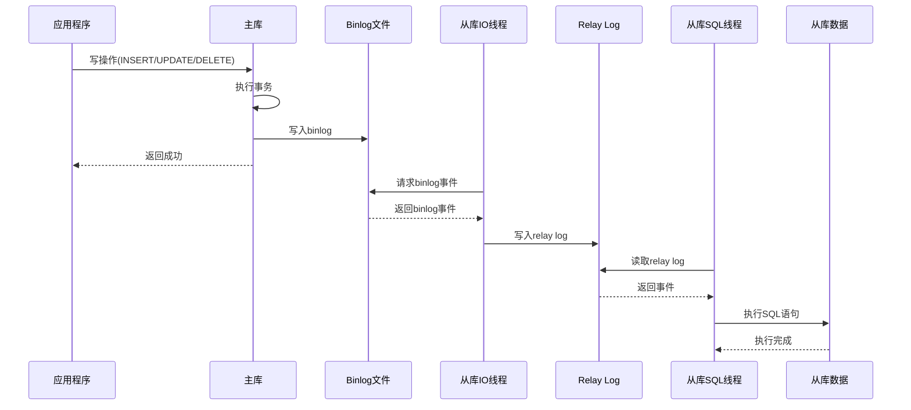

#### 11.1.3 主从复制架构图

**一主一从架构**：

```
┌─────────────────────────────────────────────────────────┐
│                    应用层                                │
└─────────────────────────────────────────────────────────┘
                         │
                         ▼
        ┌────────────────────────────────┐
        │         主库 (Master)           │
        │  - 处理所有写操作                │
        │  - 记录binlog                   │
        │  - server-id: 1                │
        └────────────────────────────────┘
                         │
                    Binlog同步
                         │
                         ▼
        ┌────────────────────────────────┐
        │         从库 (Slave)            │
        │  - 处理读操作                    │
        │  - IO线程读取binlog             │
        │  - SQL线程执行relay log         │
        │  - server-id: 2                │
        └────────────────────────────────┘
```

**一主多从架构**：

```
                        应用层
                           │
                           ▼
        ┌────────────────────────────────┐
        │         主库 (Master)           │
        │  - 处理所有写操作                │
        │  - 负载: 20%                    │
        └────────────────────────────────┘
                │              │
           Binlog同步    Binlog同步
                │              │
        ┌──────▼──────┐ ┌─────▼──────┐
        │ 从库1(Slave) │ │ 从库2(Slave)│
        │ - 读操作     │ │ - 读操作    │
        │ - 负载: 40%  │ │ - 负载: 40% │
        └─────────────┘ └────────────┘
```

**级联复制架构**：

```
        ┌────────────────────────────────┐
        │         主库 (Master)           │
        └────────────────────────────────┘
                         │
                    Binlog同步
                         │
                         ▼
        ┌────────────────────────────────┐
        │      中继从库 (Relay Slave)     │
        │  - 减轻主库压力                  │
        │  - 不处理业务请求                │
        └────────────────────────────────┘
                │              │
           Binlog同步    Binlog同步
                │              │
        ┌──────▼──────┐ ┌─────▼──────┐
        │ 从库1(Slave) │ │ 从库2(Slave)│
        │ - 读操作     │ │ - 读操作    │
        └─────────────┘ └────────────┘
```

**主主复制架构**：

```
        ┌────────────────────────────────┐
        │         主库A (Master A)        │
        │  - 处理写操作A                   │
        │  - 接收主库B的binlog            │
        └────────────────────────────────┘
                │                      ▲
                │ Binlog同步           │ Binlog同步
                ▼                      │
        ┌────────────────────────────────┐
        │         主库B (Master B)        │
        │  - 处理写操作B                   │
        │  - 接收主库A的binlog            │
        └────────────────────────────────┘
        
        注意：需要避免主键冲突和数据循环复制
```

### 11.2 复制类型

#### 11.2.1 三种复制类型对比

| 复制类型 | 英文 | 原理 | 优点 | 缺点 | 适用场景 |
|----------|------|------|------|------|----------|
| **基于语句** | SBR (Statement Based Replication) | 复制SQL语句 | 日志量小，网络传输少 | 不确定性函数可能不一致 | 简单业务，无函数调用 |
| **基于行** | RBR (Row Based Replication) | 复制行的变化 | 数据一致性好，可靠 | 日志量大，网络传输多 | 复杂业务，高一致性要求 |
| **混合模式** | MBR (Mixed Based Replication) | 自动选择SBR或RBR | 兼顾性能和一致性 | 可能产生不可预测行为 | 大多数场景 |

#### 11.2.2 复制类型选择建议

```sql
-- 查看当前binlog格式
SHOW VARIABLES LIKE 'binlog_format';

-- 设置binlog格式（推荐ROW）
SET GLOBAL binlog_format = 'ROW';

-- 配置文件设置
[mysqld]
binlog_format = ROW
```

**选择建议**：
- **金融系统**：使用ROW格式，保证数据一致性
- **电商系统**：使用ROW格式，避免数据不一致
- **日志系统**：可以使用MIXED格式，平衡性能和一致性
- **简单业务**：可以使用STATEMENT格式，减少日志量

### 11.3 复制架构

#### 11.3.1 主流互联网架构

**1. 阿里巴巴架构**

```
┌─────────────────────────────────────────────────────────┐
│                    应用层                                │
│              (微服务架构)                                │
└─────────────────────────────────────────────────────────┘
                         │
                         ▼
        ┌────────────────────────────────┐
        │      数据访问层 (DAL)           │
        │   - TDDL (Taobao Distributed   │
        │     Data Layer)                │
        │   - 读写分离                    │
        │   - 分库分表                    │
        └────────────────────────────────┘
                │              │
        ┌───────▼──────┐ ┌────▼───────┐
        │  主库集群      │ │ 从库集群    │
        │  - 主库A      │ │ - 从库A1-A4 │
        │  - 主库B      │ │ - 从库B1-B4 │
        │  (双主架构)   │ │ (多从架构)  │
        └──────────────┘ └────────────┘
```

**特点**：
- 使用TDDL中间件实现读写分离和分库分表
- 双主架构保证高可用
- 多从架构分担读压力
- 异地多活架构

**2. 腾讯架构**

```
┌─────────────────────────────────────────────────────────┐
│                    应用层                                │
└─────────────────────────────────────────────────────────┘
                         │
                         ▼
        ┌────────────────────────────────┐
        │      TDSQL (腾讯分布式数据库)    │
        │   - 自动读写分离                │
        │   - 自动故障转移                │
        │   - 强一致性同步                │
        └────────────────────────────────┘
                │              │
        ┌───────▼──────┐ ┌────▼───────┐
        │   主库        │ │  从库       │
        │  (主备模式)   │ │ (多副本)    │
        └──────────────┘ └────────────┘
```

**特点**：
- 自研TDSQL分布式数据库
- 主备强同步，保证数据不丢失
- 自动故障检测和转移
- 支持分布式事务

**3. 字节跳动架构**

```
┌─────────────────────────────────────────────────────────┐
│                    应用层                                │
└─────────────────────────────────────────────────────────┘
                         │
                         ▼
        ┌────────────────────────────────┐
        │      数据库代理层               │
        │   - 自研Proxy                  │
        │   - 智能路由                    │
        │   - 负载均衡                    │
        └────────────────────────────────┘
                │              │
        ┌───────▼──────┐ ┌────▼───────┐
        │   主库        │ │  从库       │
        │  (多机房部署) │ │ (多机房)    │
        └──────────────┘ └────────────┘
```

**特点**：
- 自研数据库代理中间件
- 多机房部署，异地多活
- 智能路由和负载均衡
- 实时监控和告警

**4. 美团架构**

```
┌─────────────────────────────────────────────────────────┐
│                    应用层                                │
└─────────────────────────────────────────────────────────┘
                         │
                         ▼
        ┌────────────────────────────────┐
        │      数据库中间件               │
        │   - CAT监控                    │
        │   - 读写分离                    │
        │   - 分库分表                    │
        └────────────────────────────────┘
                │              │
        ┌───────▼──────┐ ┌────▼───────┐
        │   主库        │ │  从库       │
        │  (MHA架构)   │ │ (多从)      │
        └──────────────┘ └────────────┘
```

**特点**：
- 使用MHA实现高可用
- CAT监控实时告警
- 自动故障转移
- 读写分离和分库分表

#### 11.3.2 架构选择建议

| 业务规模 | 推荐架构 | 特点 | 成本 |
|----------|----------|------|------|
| **小型应用** | 一主一从 | 简单可靠，易于维护 | 低 |
| **中型应用** | 一主多从 | 读性能高，可用性好 | 中 |
| **大型应用** | 双主多从 | 高可用，高性能 | 高 |
| **超大型应用** | 异地多活 | 极高可用，容灾能力强 | 很高 |

### 11.4 复制配置

#### 11.4.1 主库配置

```ini
# my.cnf
[mysqld]
# 服务器唯一ID
server-id = 1

# 启用binlog
log_bin = mysql-bin

# binlog格式（推荐ROW）
binlog_format = ROW

# binlog刷盘策略（1=每次事务提交都刷盘）
sync_binlog = 1

# binlog保留天数
expire_logs_days = 7

# 需要复制的数据库（可选）
binlog-do-db = mydb

# 不需要复制的数据库（可选）
binlog-ignore-db = mysql
binlog-ignore-db = information_schema
binlog-ignore-db = performance_schema

# GTID配置（推荐开启）
gtid_mode = ON
enforce_gtid_consistency = ON

# 并行复制配置
binlog_group_commit_sync_delay = 100
binlog_group_commit_sync_no_delay_count = 10
```

#### 11.4.2 从库配置

```ini
# my.cnf
[mysqld]
# 服务器唯一ID（必须与主库不同）
server-id = 2

# 中继日志配置
relay_log = mysql-relay-bin

# 从库只读
read_only = 1
super_read_only = 1

# 从库binlog配置（用于级联复制）
log_bin = mysql-bin
log_slave_updates = ON

# 并行复制配置
slave_parallel_workers = 4
slave_parallel_type = LOGICAL_CLOCK

# GTID配置
gtid_mode = ON
enforce_gtid_consistency = ON

# 复制过滤（可选）
replicate-do-db = mydb
replicate-ignore-db = mysql
```

#### 11.4.3 启动复制

**传统方式**：

```sql
-- 在主库创建复制用户
CREATE USER 'repl'@'%' IDENTIFIED BY 'password';
GRANT REPLICATION SLAVE ON *.* TO 'repl'@'%';
FLUSH PRIVILEGES;

-- 在主库查看状态
SHOW MASTER STATUS;

-- 在从库配置复制
CHANGE MASTER TO
    MASTER_HOST = '192.168.1.100',
    MASTER_PORT = 3306,
    MASTER_USER = 'repl',
    MASTER_PASSWORD = 'password',
    MASTER_LOG_FILE = 'mysql-bin.000001',
    MASTER_LOG_POS = 154;

-- 启动复制
START SLAVE;

-- 查看复制状态
SHOW SLAVE STATUS\G;
```

**GTID方式（推荐）**：

```sql
-- 在主库创建复制用户
CREATE USER 'repl'@'%' IDENTIFIED BY 'password';
GRANT REPLICATION SLAVE ON *.* TO 'repl'@'%';
FLUSH PRIVILEGES;

-- 在从库配置GTID复制
CHANGE MASTER TO
    MASTER_HOST = '192.168.1.100',
    MASTER_PORT = 3306,
    MASTER_USER = 'repl',
    MASTER_PASSWORD = 'password',
    MASTER_AUTO_POSITION = 1;

-- 启动复制
START SLAVE;

-- 查看复制状态
SHOW SLAVE STATUS\G;

-- 关键指标
-- Slave_IO_Running: Yes
-- Slave_SQL_Running: Yes
-- Seconds_Behind_Master: 0
```

### 11.5 复制延迟

#### 11.5.1 复制延迟原因

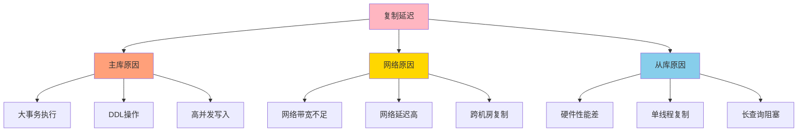

#### 11.5.2 复制延迟监控

```sql
-- 查看复制延迟
SHOW SLAVE STATUS\G;

-- 关键指标
-- Seconds_Behind_Master: 延迟秒数

-- 查看从库执行位置
SHOW SLAVE STATUS\G;
-- Relay_Master_Log_File: 主库binlog文件
-- Exec_Master_Log_Pos: 已执行的位置

-- 监控脚本
SELECT 
    MASTER_HOST,
    MASTER_PORT,
    MASTER_USER,
    Slave_IO_Running,
    Slave_SQL_Running,
    Seconds_Behind_Master,
    Relay_Master_Log_File,
    Exec_Master_Log_Pos
FROM information_schema.PROCESSLIST
WHERE COMMAND = 'Binlog Dump';
```

#### 11.5.3 复制延迟优化

**优化方案对比**：

| 优化方案 | 实施难度 | 效果 | 适用场景 | 风险 |
|----------|----------|------|----------|------|
| **并行复制** | 低 | 好 | 多核CPU | 可能数据不一致 |
| **半同步复制** | 中 | 好 | 高一致性要求 | 性能下降 |
| **硬件升级** | 低 | 好 | 所有场景 | 成本增加 |
| **网络优化** | 中 | 好 | 跨机房复制 | 成本增加 |
| **拆分大事务** | 高 | 好 | 大事务场景 | 需要修改应用 |

**并行复制配置**：

```ini
# my.cnf (MySQL 5.7+)
[mysqld]
# 开启并行复制
slave_parallel_workers = 4

# 并行复制类型
slave_parallel_type = LOGICAL_CLOCK

# 并行复制等待时间
slave_pending_jobs_size_max = 128M

# 主库配置
binlog_group_commit_sync_delay = 100
binlog_group_commit_sync_no_delay_count = 10
```

**半同步复制配置**：

```sql
-- 主库安装半同步插件
INSTALL PLUGIN rpl_semi_sync_master SONAME 'semisync_master.so';

-- 从库安装半同步插件
INSTALL PLUGIN rpl_semi_sync_slave SONAME 'semisync_slave.so';

-- 主库配置
SET GLOBAL rpl_semi_sync_master_enabled = 1;
SET GLOBAL rpl_semi_sync_master_timeout = 1000;  -- 超时时间(毫秒)

-- 从库配置
SET GLOBAL rpl_semi_sync_slave_enabled = 1;

-- 重启从库复制
STOP SLAVE;
START SLAVE;
```

### 11.6 主从复制最佳实践

#### 11.6.1 主从切换流程

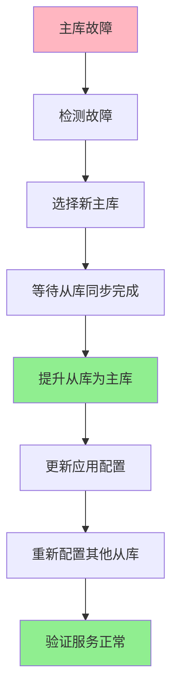

**手动切换步骤**：

```bash
# 1. 停止应用写入
# 2. 等待从库同步完成

# 在从库执行
mysql> STOP SLAVE;
mysql> RESET SLAVE ALL;

# 3. 提升从库为主库
mysql> SET GLOBAL read_only = OFF;
mysql> SET GLOBAL super_read_only = OFF;

# 4. 更新应用配置，指向新主库

# 5. 配置其他从库复制新主库
mysql> CHANGE MASTER TO
    -> MASTER_HOST = 'new_master_host',
    -> MASTER_USER = 'repl',
    -> MASTER_PASSWORD = 'password',
    -> MASTER_AUTO_POSITION = 1;
mysql> START SLAVE;
```

#### 11.6.2 主从复制监控指标

| 监控指标 | 说明 | 告警阈值 | 处理方式 |
|----------|------|----------|----------|
| **Seconds_Behind_Master** | 复制延迟秒数 | > 60秒 | 优化从库性能 |
| **Slave_IO_Running** | IO线程状态 | No | 检查网络和权限 |
| **Slave_SQL_Running** | SQL线程状态 | No | 检查SQL错误 |
| **Relay_Log_Space** | 中继日志大小 | > 1GB | 检查SQL线程 |
| **Binlog_Dump线程数** | 主库dump线程数 | 异常 | 检查从库连接 |

## 12. 读写分离

读写分离是通过将读操作和写操作分发到不同的数据库节点，提高系统性能和可用性。

### 12.1 读写分离架构

#### 12.1.1 读写分离基本原理

读写分离将数据库的读操作和写操作分离到不同的服务器上，主库负责写操作，从库负责读操作，从而提高系统的并发处理能力。

**核心思想**：
- **写操作**：在主库执行，通过主从复制同步到从库
- **读操作**：在从库执行，分担主库压力
- **数据同步**：通过主从复制保证数据一致性

#### 12.1.2 读写分离架构图

**基础架构**：

```
┌─────────────────────────────────────────────────────────┐
│                    应用层                                │
│              (读写分离逻辑)                              │
└─────────────────────────────────────────────────────────┘
                    │                    │
              写操作│                    │读操作
                    ▼                    ▼
        ┌──────────────────┐    ┌──────────────────┐
        │   主库 (Master)   │    │  从库 (Slave)     │
        │                  │    │                  │
        │  - INSERT        │    │  - SELECT        │
        │  - UPDATE        │    │  - 读压力大      │
        │  - DELETE        │    │  - 数据可能有延迟│
        └──────────────────┘    └──────────────────┘
                    │                    ▲
                    │   主从复制同步      │
                    └────────────────────┘
```

**中间件架构**：

```
┌─────────────────────────────────────────────────────────┐
│                    应用层                                │
│              (无感知读写分离)                            │
└─────────────────────────────────────────────────────────┘
                         │
                         ▼
        ┌────────────────────────────────┐
        │      数据库中间件               │
        │   (ProxySQL/MySQL Router)      │
        │   - 自动识别读写操作            │
        │   - 路由到对应数据库            │
        │   - 负载均衡                    │
        │   - 故障转移                    │
        └────────────────────────────────┘
                │              │
        ┌───────▼──────┐ ┌────▼───────┐
        │   主库        │ │  从库集群   │
        │  (写操作)     │ │ (读操作)    │
        └──────────────┘ └────────────┘
```

**完整架构图**：

```
┌─────────────────────────────────────────────────────────┐
│                    客户端请求                            │
└─────────────────────────────────────────────────────────┘
                         │
                         ▼
        ┌────────────────────────────────┐
        │        负载均衡层               │
        │   (Nginx/LVS/F5)               │
        └────────────────────────────────┘
                         │
                         ▼
        ┌────────────────────────────────┐
        │        应用服务器集群           │
        │   - 应用服务1                   │
        │   - 应用服务2                   │
        │   - 应用服务N                   │
        └────────────────────────────────┘
                         │
                         ▼
        ┌────────────────────────────────┐
        │      数据库中间件层             │
        │   - ProxySQL                   │
        │   - MySQL Router               │
        │   - ShardingSphere             │
        └────────────────────────────────┘
                │              │
        ┌───────▼──────┐ ┌────▼───────┐
        │   主库集群     │ │ 从库集群    │
        │  - 主库A      │ │ - 从库A1-A4 │
        │  - 主库B      │ │ - 从库B1-B4 │
        │  (双主架构)   │ │ (多从架构)  │
        └──────────────┘ └────────────┘
```

#### 12.1.3 读写分离流程图

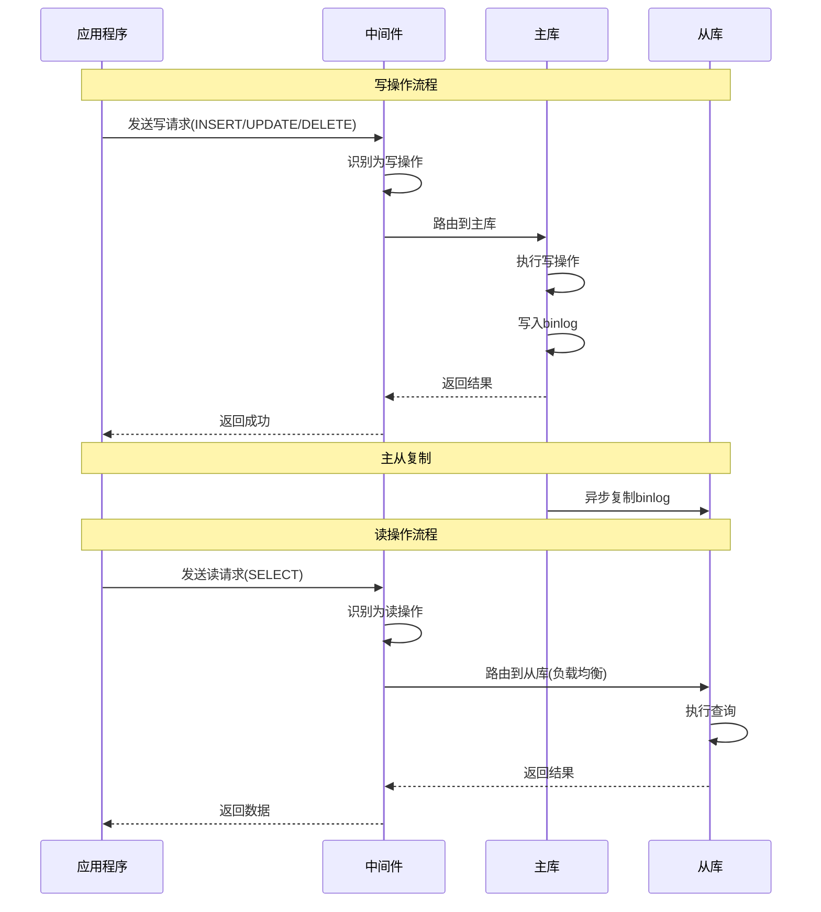

### 12.2 实现方式

#### 12.2.1 应用层实现

**优点**：
- 实现简单，易于理解
- 灵活性高，可自定义路由规则
- 无需额外中间件

**缺点**：
- 应用代码侵入性强
- 维护成本高
- 不易统一管理

**Java实现示例**：

```java
public class RoutingDataSource extends AbstractRoutingDataSource {
    
    @Override
    protected Object determineCurrentLookupKey() {
        return DataSourceContextHolder.getDataSourceType();
    }
}

public class DataSourceContextHolder {
    private static final ThreadLocal<String> contextHolder = new ThreadLocal<>();
    
    public static void setDataSourceType(String dsType) {
        contextHolder.set(dsType);
    }
    
    public static String getDataSourceType() {
        return contextHolder.get();
    }
    
    public static void clearDataSourceType() {
        contextHolder.remove();
    }
}

@Aspect
@Component
public class DataSourceAspect {
    
    @Before("@annotation(readOnly)")
    public void setReadDataSource(JoinPoint point, ReadOnly readOnly) {
        DataSourceContextHolder.setDataSourceType("slave");
    }
    
    @Before("@annotation(writeOnly)")
    public void setWriteDataSource(JoinPoint point, WriteOnly writeOnly) {
        DataSourceContextHolder.setDataSourceType("master");
    }
    
    @After("@annotation(readOnly) || @annotation(writeOnly)")
    public void clearDataSource(JoinPoint point) {
        DataSourceContextHolder.clearDataSourceType();
    }
}

@Target(ElementType.METHOD)
@Retention(RetentionPolicy.RUNTIME)
public @interface ReadOnly {
}

@Target(ElementType.METHOD)
@Retention(RetentionPolicy.RUNTIME)
public @interface WriteOnly {
}

@Service
public class UserService {
    
    @ReadOnly
    public User getUserById(Long id) {
        return userMapper.selectById(id);
    }
    
    @WriteOnly
    public void updateUser(User user) {
        userMapper.update(user);
    }
}
```

**Spring配置**：

```xml
<bean id="masterDataSource" class="com.zaxxer.hikari.HikariDataSource">
    <property name="jdbcUrl" value="jdbc:mysql://master:3306/mydb"/>
    <property name="username" value="root"/>
    <property name="password" value="password"/>
</bean>

<bean id="slaveDataSource" class="com.zaxxer.hikari.HikariDataSource">
    <property name="jdbcUrl" value="jdbc:mysql://slave:3306/mydb"/>
    <property name="username" value="root"/>
    <property name="password" value="password"/>
</bean>

<bean id="routingDataSource" class="com.example.RoutingDataSource">
    <property name="defaultTargetDataSource" ref="masterDataSource"/>
    <property name="targetDataSources">
        <map>
            <entry key="master" value-ref="masterDataSource"/>
            <entry key="slave" value-ref="slaveDataSource"/>
        </map>
    </property>
</bean>
```

#### 12.2.2 中间件实现

**1. MySQL Router**

MySQL官方提供的轻量级中间件，支持读写分离和路由。

**配置示例**：

```ini
# mysqlrouter.conf
[DEFAULT]
logging_folder = /var/log/mysqlrouter
runtime_folder = /var/run/mysqlrouter
config_folder = /etc/mysqlrouter

[routing:read_write]
bind_address = 0.0.0.0
bind_port = 7001
mode = read-write
destinations = master:3306
protocol = classic

[routing:read_only]
bind_address = 0.0.0.0
bind_port = 7002
mode = read-only
destinations = slave1:3306,slave2:3306,slave3:3306
protocol = classic

[metadata_cache:mycluster]
router_id = 1
bootstrap_server_addresses = mysql://master:3306,mysql://slave1:3306
user = mysql_router
password = password
cluster = mycluster
```

**启动MySQL Router**：

```bash
mysqlrouter --config /etc/mysqlrouter/mysqlrouter.conf
```

**应用连接**：

```java
// 写操作连接主库
String masterUrl = "jdbc:mysql://router-host:7001/mydb";

// 读操作连接从库
String slaveUrl = "jdbc:mysql://router-host:7002/mydb";
```

**2. ProxySQL**

功能强大的MySQL代理，支持读写分离、查询缓存、查询重写等。

**配置示例**：

```sql
-- 添加MySQL服务器
INSERT INTO mysql_servers (hostgroup_id, hostname, port, weight) 
VALUES 
(10, 'master', 3306, 1),   -- 写组
(20, 'slave1', 3306, 1),   -- 读组
(20, 'slave2', 3306, 1),
(20, 'slave3', 3306, 1);

-- 配置路由规则
INSERT INTO mysql_query_rules (rule_id, active, match_pattern, destination_hostgroup, apply) 
VALUES 
(1, 1, '^SELECT', 20, 1),  -- SELECT语句路由到读组
(2, 1, '.*', 10, 1);       -- 其他语句路由到写组

-- 配置用户
INSERT INTO mysql_users (username, password, default_hostgroup) 
VALUES ('appuser', 'password', 10);

-- 加载配置
LOAD MYSQL SERVERS TO RUNTIME;
LOAD MYSQL QUERY RULES TO RUNTIME;
LOAD MYSQL USERS TO RUNTIME;
SAVE MYSQL SERVERS TO DISK;
SAVE MYSQL QUERY RULES TO DISK;
SAVE MYSQL USERS TO DISK;
```

**监控查询**：

```sql
-- 查看连接统计
SELECT hostgroup, srv_host, srv_port, status, Queries 
FROM stats_mysql_connection_pool;

-- 查看查询统计
SELECT hostgroup, digest_text, count_star 
FROM stats_mysql_query_digest 
ORDER BY count_star DESC 
LIMIT 10;
```

**3. ShardingSphere**

Apache ShardingSphere是一套开源的分布式数据库解决方案。

**Java配置示例**：

```java
@Configuration
public class ShardingJdbcConfig {
    
    @Bean
    public DataSource dataSource() throws SQLException {
        // 主库配置
        Map<String, Object> masterDataSource = createDataSource("master", "jdbc:mysql://master:3306/mydb");
        
        // 从库配置
        Map<String, Object> slave1DataSource = createDataSource("slave1", "jdbc:mysql://slave1:3306/mydb");
        Map<String, Object> slave2DataSource = createDataSource("slave2", "jdbc:mysql://slave2:3306/mydb");
        
        // 主从配置
        MasterSlaveRuleConfiguration masterSlaveRuleConfig = new MasterSlaveRuleConfiguration(
            "ds_master_slave",
            "master",
            Arrays.asList("slave1", "slave2"),
            new RoundRobinMasterSlaveLoadBalanceAlgorithm()
        );
        
        // 创建数据源
        return MasterSlaveDataSourceFactory.createDataSource(
            createDataSourceMap(masterDataSource, slave1DataSource, slave2DataSource),
            masterSlaveRuleConfig,
            new Properties()
        );
    }
    
    private Map<String, Object> createDataSource(String name, String url) {
        Map<String, Object> dataSource = new HashMap<>();
        dataSource.put("type", "com.zaxxer.hikari.HikariDataSource");
        dataSource.put("driverClassName", "com.mysql.cj.jdbc.Driver");
        dataSource.put("jdbcUrl", url);
        dataSource.put("username", "root");
        dataSource.put("password", "password");
        return dataSource;
    }
}
```

**YAML配置**：

```yaml
spring:
  shardingsphere:
    datasource:
      names: master,slave1,slave2
      master:
        type: com.zaxxer.hikari.HikariDataSource
        driver-class-name: com.mysql.cj.jdbc.Driver
        jdbc-url: jdbc:mysql://master:3306/mydb
        username: root
        password: password
      slave1:
        type: com.zaxxer.hikari.HikariDataSource
        driver-class-name: com.mysql.cj.jdbc.Driver
        jdbc-url: jdbc:mysql://slave1:3306/mydb
        username: root
        password: password
      slave2:
        type: com.zaxxer.hikari.HikariDataSource
        driver-class-name: com.mysql.cj.jdbc.Driver
        jdbc-url: jdbc:mysql://slave2:3306/mydb
        username: root
        password: password
    masterslave:
      name: ds_master_slave
      master-data-source-name: master
      slave-data-source-names: slave1,slave2
      load-balance-algorithm-type: round_robin
    props:
      sql.show: true
```

#### 12.2.3 实现方式对比

| 实现方式 | 优点 | 缺点 | 适用场景 | 维护成本 |
|----------|------|------|----------|----------|
| **应用层** | 简单直接，灵活可控 | 代码侵入，维护困难 | 小型项目，简单场景 | 高 |
| **MySQL Router** | 官方支持，轻量级 | 功能有限 | 中小型项目 | 低 |
| **ProxySQL** | 功能强大，性能好 | 配置复杂 | 大型项目，高并发 | 中 |
| **ShardingSphere** | 功能全面，生态好 | 学习成本高 | 大型项目，分库分表 | 中 |

### 12.3 注意事项

#### 12.3.1 数据一致性问题

**问题**：由于主从复制存在延迟，读从库可能读到过期数据。

**解决方案**：

**1. 强制读主库**

```java
// 方案1：关键业务强制读主库
@WriteOnly
public User getUserByIdForceMaster(Long id) {
    return userMapper.selectById(id);
}

// 方案2：写后读一致性
public User updateUser(User user) {
    userMapper.update(user);
    // 更新后立即读主库
    return userMapper.selectById(user.getId());
}
```

**2. 延迟检测**

```java
public User getUserWithDelayCheck(Long id) {
    // 检查主从延迟
    long delay = checkReplicationDelay();
    
    if (delay > 1000) { // 延迟超过1秒
        // 读主库
        return getUserFromMaster(id);
    } else {
        // 读从库
        return getUserFromSlave(id);
    }
}

private long checkReplicationDelay() {
    // 查询主从延迟
    String sql = "SHOW SLAVE STATUS";
    // 解析Seconds_Behind_Master
    return 0; // 返回延迟秒数
}
```

**3. 半同步复制**

```sql
-- 主库配置
SET GLOBAL rpl_semi_sync_master_enabled = 1;
SET GLOBAL rpl_semi_sync_master_timeout = 1000;

-- 从库配置
SET GLOBAL rpl_semi_sync_slave_enabled = 1;
```

#### 12.3.2 事务处理

**问题**：事务中既有读又有写，如何处理？

**解决方案**：

```java
// 方案1：事务内全部走主库
@Transactional
public void updateUserAndLog(Long userId, String log) {
    User user = userMapper.selectById(userId); // 读主库
    user.setName("new name");
    userMapper.update(user); // 写主库
    logMapper.insert(log);   // 写主库
}

// 方案2：拆分事务
public void updateUserAndLog(Long userId, String log) {
    // 读操作单独处理
    User user = getUserFromSlave(userId);
    
    // 写操作在事务中
    updateUserInTransaction(user, log);
}

@Transactional
private void updateUserInTransaction(User user, String log) {
    userMapper.update(user);
    logMapper.insert(log);
}
```

#### 12.3.3 负载均衡策略

| 策略 | 说明 | 优点 | 缺点 | 适用场景 |
|------|------|------|------|----------|
| **轮询** | 依次访问每个从库 | 简单公平 | 不考虑性能差异 | 从库性能相近 |
| **权重** | 按权重分配请求 | 可根据性能分配 | 需要手动配置权重 | 从库性能差异大 |
| **最少连接** | 选择连接数最少的从库 | 动态均衡 | 需要维护连接状态 | 连接时长差异大 |
| **随机** | 随机选择从库 | 简单 | 可能不均衡 | 从库数量多 |
| **一致性哈希** | 根据查询键哈希 | 缓存友好 | 节点变化影响大 | 有缓存的场景 |

**ProxySQL负载均衡配置**：

```sql
-- 设置权重
UPDATE mysql_servers SET weight = 10 WHERE hostname = 'slave1';
UPDATE mysql_servers SET weight = 5 WHERE hostname = 'slave2';
UPDATE mysql_servers SET weight = 3 WHERE hostname = 'slave3';

LOAD MYSQL SERVERS TO RUNTIME;
SAVE MYSQL SERVERS TO DISK;
```

#### 12.3.4 故障转移

**主库故障转移流程**：

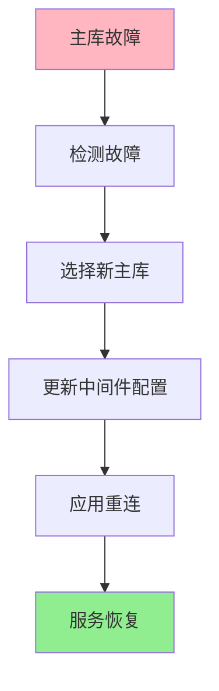

**ProxySQL故障转移配置**：

```sql
-- 配置主库监控
UPDATE mysql_servers SET hostgroup_id = 10 WHERE hostname = 'master';

-- 配置从库监控
UPDATE mysql_servers SET hostgroup_id = 20 WHERE hostname IN ('slave1', 'slave2', 'slave3');

-- 配置故障转移规则
INSERT INTO mysql_replication_hostgroups 
(writer_hostgroup, reader_hostgroup, check_type) 
VALUES (10, 20, 'read_only');

LOAD MYSQL SERVERS TO RUNTIME;
SAVE MYSQL SERVERS TO DISK;
```

#### 12.3.5 监控指标

| 监控指标 | 说明 | 告警阈值 | 处理方式 |
|----------|------|----------|----------|
| **主从延迟** | Seconds_Behind_Master | > 60秒 | 优化从库性能 |
| **连接数** | 当前连接数/最大连接数 | > 80% | 扩容或优化 |
| **QPS** | 每秒查询数 | 接近上限 | 扩容 |
| **慢查询** | 慢查询数量 | 异常增加 | 优化SQL |
| **主库写压力** | 写入TPS | > 阈值 | 分库分表 |
| **从库读压力** | 读取QPS | > 阈值 | 增加从库 |

### 12.4 主流互联网大厂使用样例

#### 12.4.1 阿里巴巴

**架构特点**：
- 使用TDDL（Taobao Distributed Data Layer）中间件
- 支持读写分离、分库分表、动态扩容
- 异地多活架构

**TDDL配置示例**：

```xml
<tddl>
    <app-name>myapp</app-name>
    <group-name>mygroup</group-name>
    
    <datasource>
        <name>master</name>
        <jdbc-url>jdbc:mysql://master:3306/mydb</jdbc-url>
        <user>root</user>
        <password>password</password>
        <type>master</type>
    </datasource>
    
    <datasource>
        <name>slave1</name>
        <jdbc-url>jdbc:mysql://slave1:3306/mydb</jdbc-url>
        <user>root</user>
        <password>password</password>
        <type>slave</type>
        <weight>1</weight>
    </datasource>
    
    <datasource>
        <name>slave2</name>
        <jdbc-url>jdbc:mysql://slave2:3306/mydb</jdbc-url>
        <user>root</user>
        <password>password</password>
        <type>slave</type>
        <weight>1</weight>
    </datasource>
    
    <rule>
        <read-write-split>
            <write>master</write>
            <read>slave1,slave2</read>
            <load-balance>round_robin</load-balance>
        </read-write-split>
    </rule>
</tddl>
```

**使用场景**：
- 淘宝、天猫核心交易系统
- 支付宝支付系统
- 阿里云RDS

#### 12.4.2 腾讯

**架构特点**：
- 自研TDSQL分布式数据库
- 主备强同步，保证数据不丢失
- 自动故障检测和转移

**TDSQL架构**：

```
┌─────────────────────────────────────────────────────────┐
│                    应用层                                │
└─────────────────────────────────────────────────────────┘
                         │
                         ▼
        ┌────────────────────────────────┐
        │      TDSQL Gateway             │
        │   - 自动读写分离                │
        │   - 智能路由                    │
        │   - 故障转移                    │
        └────────────────────────────────┘
                │              │
        ┌───────▼──────┐ ┌────▼───────┐
        │   主库        │ │  备库       │
        │  (强同步)     │ │ (实时同步)  │
        └──────────────┘ └────────────┘
                │              │
        ┌───────▼──────┐ ┌────▼───────┐
        │   从库1       │ │  从库2      │
        │  (读操作)     │ │ (读操作)    │
        └──────────────┘ └────────────┘
```

**使用场景**：
- 微信支付
- 王者荣耀游戏数据
- 腾讯云数据库

#### 12.4.3 字节跳动

**架构特点**：
- 自研数据库代理中间件
- 多机房部署，异地多活
- 智能路由和负载均衡

**架构图**：

```
┌─────────────────────────────────────────────────────────┐
│                    应用层                                │
└─────────────────────────────────────────────────────────┘
                         │
                         ▼
        ┌────────────────────────────────┐
        │      字节跳动数据库代理          │
        │   - 智能路由                    │
        │   - 读写分离                    │
        │   - 故障转移                    │
        │   - 监控告警                    │
        └────────────────────────────────┘
                │              │
        ┌───────▼──────┐ ┌────▼───────┐
        │  机房A主库     │ │ 机房B主库   │
        │  (双主架构)   │ │ (双主架构)  │
        └──────────────┘ └────────────┘
                │              │
        ┌───────▼──────┐ ┌────▼───────┐
        │  机房A从库     │ │ 机房B从库   │
        │  (多从)       │ │ (多从)      │
        └──────────────┘ └────────────┘
```

**使用场景**：
- 抖音短视频
- 今日头条推荐系统
- TikTok全球服务

#### 12.4.4 美团

**架构特点**：
- 使用MHA（Master High Availability）实现高可用
- CAT监控实时告警
- 自动故障转移

**MHA架构**：

```
┌─────────────────────────────────────────────────────────┐
│                    MHA Manager                           │
│   - 监控主库状态                                          │
│   - 自动故障转移                                          │
│   - 配置管理                                              │
└─────────────────────────────────────────────────────────┘
                         │
        ┌────────────────┼────────────────┐
        │                │                │
        ▼                ▼                ▼
┌──────────────┐ ┌──────────────┐ ┌──────────────┐
│   主库        │ │  从库1       │ │  从库2       │
│  (Master)     │ │ (Candidate)  │ │ (Slave)      │
└──────────────┘ └──────────────┘ └──────────────┘
```

**MHA配置示例**：

```ini
# /etc/masterha_default.cnf
[server default]
user = root
password = password
ssh_user = root
repl_user = repl
repl_password = password

[server1]
hostname = master
candidate_master = 1

[server2]
hostname = slave1
candidate_master = 1

[server3]
hostname = slave2
candidate_master = 0
```

**使用场景**：
- 美团外卖订单系统
- 酒店预订系统
- 支付系统

#### 12.4.5 京东

**架构特点**：
- 自研JDBC中间件
- 读写分离+分库分表
- 异地多活

**架构图**：

```
┌─────────────────────────────────────────────────────────┐
│                    应用层                                │
└─────────────────────────────────────────────────────────┘
                         │
                         ▼
        ┌────────────────────────────────┐
        │      京东JDBC中间件             │
        │   - 读写分离                    │
        │   - 分库分表                    │
        │   - 路由策略                    │
        └────────────────────────────────┘
                │              │
        ┌───────▼──────┐ ┌────▼───────┐
        │   主库集群     │ │ 从库集群    │
        │  (多主架构)   │ │ (多从架构)  │
        └──────────────┘ └────────────┘
```

**使用场景**：
- 京东商城订单系统
- 物流配送系统
- 支付系统

### 12.5 读写分离最佳实践

#### 12.5.1 使用场景判断

| 场景 | 是否适合读写分离 | 原因 |
|------|------------------|------|
| **读多写少** | ✅ 适合 | 读压力分散到从库，效果明显 |
| **写多读少** | ❌ 不适合 | 主库压力大，从库空闲 |
| **实时性要求高** | ❌ 不适合 | 主从延迟可能导致数据不一致 |
| **报表统计** | ✅ 适合 | 可以接受延迟，从库压力分散 |
| **核心交易** | ⚠️ 谨慎使用 | 需要处理主从延迟问题 |

#### 12.5.2 实施步骤

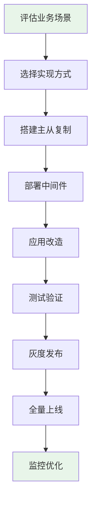

#### 12.5.3 性能优化建议

**1. 从库数量优化**

```
从库数量 = 读QPS / 单库读QPS上限 × 冗余系数

示例：
- 读QPS: 10000
- 单库读QPS上限: 3000
- 冗余系数: 1.5

从库数量 = 10000 / 3000 × 1.5 ≈ 5台
```

**2. 连接池配置**

```java
HikariConfig config = new HikariConfig();
config.setMaximumPoolSize(50);          // 最大连接数
config.setMinimumIdle(10);              // 最小空闲连接
config.setConnectionTimeout(30000);     // 连接超时时间
config.setIdleTimeout(600000);          // 空闲超时时间
config.setMaxLifetime(1800000);         // 连接最大存活时间
config.setConnectionTestQuery("SELECT 1"); // 测试查询
```

**3. 查询优化**

```sql
-- 使用索引覆盖
SELECT id, name FROM users WHERE id = 1;

-- 避免SELECT *
SELECT id, name, email FROM users WHERE id = 1;

-- 分页优化
SELECT * FROM orders WHERE id > 1000 ORDER BY id LIMIT 20;
```

## 13. 分库分表

当数据量达到一定规模时，需要通过分库分表来提高系统性能和可扩展性。

### 13.1 分库分表策略

#### 13.1.1 垂直拆分

- **垂直分库**：按业务领域拆分数据库
- **垂直分表**：按列拆分表，将不常用的列拆分到其他表

#### 13.1.2 水平拆分

- **范围分片**：按时间、ID等范围拆分
- **哈希分片**：按哈希值拆分
- **列表分片**：按枚举值拆分
- **复合分片**：结合多种策略

### 13.2 分库分表实现

- **应用层分片**：应用直接处理分片逻辑
- **中间件分片**：通过分库分表中间件（如ShardingSphere）
- **数据库代理**：通过代理层处理分片

### 13.3 分库分表挑战

- **跨分片查询**：复杂查询变得困难
- **事务管理**：跨分片事务一致性
- **数据迁移**：分片策略变更时的数据迁移
- **ID生成**：全局唯一ID的生成
- **运维复杂度**：增加了系统复杂度

## 14. 高可用方案

高可用是保证系统持续稳定运行的重要手段。

### 14.1 高可用架构

- **主从复制+VIP**：通过虚拟IP实现故障转移
- **MHA（Master High Availability）**：自动故障转移工具
- **Orchestrator**：MySQL集群管理工具
- **ProxySQL + 主从**：通过代理实现读写分离和故障转移
- **MySQL Cluster**：官方集群方案

### 14.2 故障转移

故障转移是高可用架构中的关键环节，包括以下步骤：

1. **检测故障**：通过心跳检测发现主库故障
2. **选举新主**：从从库中选择一个作为新主
3. **提升从库**：将选中的从库提升为新主
4. **更新配置**：更新其他从库和应用的连接配置
5. **恢复服务**：确保新主正常提供服务

### 14.3 高可用最佳实践

- **多副本**：至少保持3个节点
- **地理分布**：跨可用区部署
- **自动故障转移**：减少人工干预
- **定期演练**：测试故障转移流程
- **监控告警**：及时发现问题

## 15. SQL优化

SQL优化是提高数据库性能的重要手段，通过优化SQL语句可以显著提升查询速度。

### 15.1 SQL优化原则

- **只选择需要的列**：避免使用`SELECT *`
- **使用索引**：为查询条件和排序字段创建索引
- **避免全表扫描**：使用WHERE条件过滤数据
- **合理使用JOIN**：避免过多表连接
- **使用LIMIT**：限制结果集大小
- **避免在WHERE子句中使用函数**：会导致索引失效
- **使用EXPLAIN**：分析执行计划

### 15.2 常见SQL优化

#### 15.2.1 索引优化

```sql
-- 优化前：全表扫描
SELECT * FROM users WHERE age > 20;

-- 优化后：使用索引
CREATE INDEX idx_age ON users(age);
SELECT id, name FROM users WHERE age > 20;
```

#### 15.2.2 JOIN优化

```sql
-- 优化前：嵌套循环连接
SELECT * FROM orders o JOIN users u ON o.user_id = u.id WHERE u.name = '张三';

-- 优化后：使用小表驱动大表，添加索引
CREATE INDEX idx_name ON users(name);
CREATE INDEX idx_user_id ON orders(user_id);
SELECT o.order_id, o.amount, u.name FROM orders o JOIN users u ON o.user_id = u.id WHERE u.name = '张三';
```

#### 15.2.3 子查询优化

```sql
-- 优化前：子查询
SELECT * FROM users WHERE id IN (SELECT user_id FROM orders WHERE amount > 100);

-- 优化后：使用JOIN
SELECT DISTINCT u.* FROM users u JOIN orders o ON u.id = o.user_id WHERE o.amount > 100;
```

## 16. 索引优化

索引优化是数据库性能优化的核心，合理的索引设计可以显著提高查询速度。

### 16.1 索引设计技巧

- **选择高区分度的列**：如邮箱、手机号等
- **复合索引顺序**：最左前缀原则，将最常用的列放在前面
- **避免过长的索引**：对于字符串，使用前缀索引
- **覆盖索引**：查询的列都在索引中
- **考虑排序和分组**：为ORDER BY和GROUP BY的列创建索引
- **避免冗余索引**：删除不必要的索引

### 16.2 索引维护

- **定期分析表**：`ANALYZE TABLE`更新统计信息
- **重建索引**：`ALTER TABLE ... FORCE`解决索引碎片
- **监控索引使用**：`SHOW GLOBAL STATUS LIKE 'Handler_read%'`
- **删除未使用的索引**：使用`sys.schema_unused_indexes`

### 16.3 索引性能分析

- **使用EXPLAIN**：查看索引使用情况
- **使用PROFILE**：分析SQL执行开销
- **使用Performance Schema**：监控索引使用统计

## 17. 配置优化

MySQL的配置参数对性能有重要影响，合理的配置可以充分发挥硬件性能。

### 17.1 内存配置

- **innodb_buffer_pool_size**：InnoDB缓冲池大小，建议设置为总内存的50-80%
- **key_buffer_size**：MyISAM索引缓冲区大小
- **query_cache_size**：查询缓存大小（MySQL 8.0已移除）
- **tmp_table_size**：临时表大小
- **max_connections**：最大连接数

### 17.2 磁盘IO配置

- **innodb_flush_method**：InnoDB刷盘方式
- **innodb_io_capacity**：InnoDB IO容量
- **innodb_log_file_size**：重做日志文件大小
- **sync_binlog**：二进制日志同步策略

### 17.3 并发配置

- **innodb_thread_concurrency**：InnoDB线程并发数
- **innodb_read_io_threads**：InnoDB读IO线程数
- **innodb_write_io_threads**：InnoDB写IO线程数
- **max_connections**：最大连接数
- **thread_cache_size**：线程缓存大小

### 17.4 其他配置

- **character_set_server**：默认字符集，建议使用utf8mb4
- **innodb_file_per_table**：每个表使用单独的表空间
- **sql_mode**：SQL模式，建议使用严格模式

## 18. 硬件优化

硬件是数据库性能的基础，合理的硬件配置可以为MySQL提供更好的运行环境。

### 18.1 CPU

- **多核CPU**：MySQL可以利用多核处理并发请求
- **高主频**：对于单线程查询，高主频更重要
- **缓存**：更大的CPU缓存可以提高性能

### 18.2 内存

- **足够的内存**：内存越大，缓存命中率越高
- **高速内存**：使用DDR4或更高规格的内存
- **内存通道**：多通道内存可以提高带宽

### 18.3 存储

- **SSD**：显著提高IO性能，推荐使用
- **RAID**：提高可靠性和性能，如RAID 10
- **分区**：将数据和日志分离到不同的磁盘
- **文件系统**：推荐使用ext4或XFS

### 18.4 网络

- **高速网络**：使用万兆以太网
- **网络拓扑**：减少网络跳数
- **网络缓冲区**：调整TCP缓冲区大小
- **连接数**：合理规划网络连接数

### 18.5 硬件配置建议

| 应用规模 | CPU | 内存 | 存储 | 网络 |
|----------|-----|------|------|------|
| 小型应用 | 2-4核 | 4-8GB | SSD | 千兆 |
| 中型应用 | 4-8核 | 16-32GB | SSD RAID 10 | 万兆 |
| 大型应用 | 8核以上 | 64GB以上 | SSD RAID 10 | 万兆 |

## 19. 监控指标

MySQL监控是确保数据库稳定运行的重要手段，需要关注以下关键指标。

### 19.1 连接相关指标

- **连接数**：
  - `Threads_connected`：当前活跃的客户端连接数
  - `Max_used_connections`：历史最大连接数
  - **含义**：监控连接数可以了解数据库的负载情况，避免连接数超过最大限制
  - **监控阈值**：当 `Threads_connected` 接近 `max_connections` 时需要关注

- **连接错误**：
  - `Connection_errors_accept`：接受连接时的错误数
  - `Connection_errors_internal`：内部连接错误数
  - `Connection_errors_max_connections`：达到最大连接数的错误数
  - `Connection_errors_peer_address`：获取对等方地址时的错误数
  - `Connection_errors_select`：选择连接时的错误数
  - `Connection_errors_tcpwrap`：TCP包装器拒绝的连接数
  - **含义**：连接错误数增加可能表明网络问题或服务器配置问题

- **连接状态**：
  - `Threads_running`：当前正在执行查询的线程数
  - `Threads_idle`：当前空闲的线程数
  - **含义**：`Threads_running` 过高可能表明数据库负载过重，`Threads_idle` 过高可能表明连接池设置不合理

### 19.2 查询相关指标

- **QPS**：
  - **定义**：每秒查询数（Queries Per Second）
  - **计算方式**：`Questions / Uptime` 或 `Queries / Uptime`
  - **含义**：反映数据库的查询负载情况
  - **监控阈值**：根据业务场景不同，一般来说，单实例MySQL QPS在10k以内是正常的

- **TPS**：
  - **定义**：每秒事务数（Transactions Per Second）
  - **计算方式**：`(Com_commit + Com_rollback) / Uptime`
  - **含义**：反映数据库的事务处理能力
  - **监控阈值**：根据业务场景不同，一般来说，单实例MySQL TPS在1k以内是正常的

- **慢查询**：
  - `Slow_queries`：执行时间超过阈值的查询数
  - **含义**：慢查询数增加表明存在性能问题的SQL语句
  - **监控阈值**：慢查询率（慢查询数/总查询数）应低于1%

- **查询缓存**：
  - `Qcache_hits`：查询缓存命中次数
  - `Qcache_inserts`：查询缓存插入次数
  - `Qcache_lowmem_prunes`：查询缓存因内存不足而被淘汰的次数
  - **含义**：（MySQL 8.0已移除）反映查询缓存的使用效率
  - **监控阈值**：查询缓存命中率（Qcache_hits / (Qcache_hits + Qcache_inserts)）应高于50%

### 19.3 缓冲池指标

- **缓冲池大小**：
  - `Innodb_buffer_pool_size`：InnoDB缓冲池大小
  - **含义**：缓冲池是InnoDB存储引擎的核心组件，用于缓存数据页和索引页
  - **配置建议**：建议设置为总内存的50-80%

- **缓冲池使用率**：
  - **计算方式**：`Innodb_buffer_pool_pages_data / Innodb_buffer_pool_pages_total`
  - **含义**：反映缓冲池的使用情况
  - **监控阈值**：使用率过高（如超过90%）可能导致内存压力

- **缓冲池命中率**：
  - **计算方式**：`Innodb_buffer_pool_read_requests / (Innodb_buffer_pool_read_requests + Innodb_buffer_pool_reads)`
  - **含义**：反映缓冲池的效率，命中率越高越好
  - **监控阈值**：缓冲池命中率应高于95%

### 19.4 IO相关指标

- **IO等待**：
  - `Innodb_data_reads`：InnoDB数据读取次数
  - `Innodb_data_writes`：InnoDB数据写入次数
  - `Innodb_data_reads / Innodb_data_read_requests`：物理读比率
  - **含义**：反映数据库的IO负载情况
  - **监控阈值**：物理读比率应低于1%

- **IO吞吐量**：
  - `Innodb_data_read`：InnoDB数据读取量（字节）
  - `Innodb_data_written`：InnoDB数据写入量（字节）
  - **含义**：反映数据库的IO流量
  - **监控阈值**：根据存储设备的性能不同而不同，SSD一般可以处理更高的吞吐量

- **IOPS**：
  - **定义**：每秒IO操作数（Input/Output Operations Per Second）
  - **计算方式**：`(Innodb_data_reads + Innodb_data_writes) / Uptime`
  - **含义**：反映数据库的IO操作频率
  - **监控阈值**：根据存储设备的性能不同而不同，普通HDD约为100-200 IOPS，SSD约为10000+ IOPS

### 19.5 事务相关指标

- **事务提交**：
  - `Com_commit`：事务提交次数
  - **含义**：反映成功完成的事务数量

- **事务回滚**：
  - `Com_rollback`：事务回滚次数
  - **含义**：反映因错误或用户主动回滚的事务数量
  - **监控阈值**：回滚率（Com_rollback / (Com_commit + Com_rollback)）应低于1%

- **锁等待**：
  - `Innodb_row_lock_waits`：InnoDB行锁等待次数
  - `Innodb_row_lock_time`：InnoDB行锁等待总时间
  - `Innodb_row_lock_time_avg`：InnoDB行锁等待平均时间
  - **含义**：反映数据库的锁竞争情况
  - **监控阈值**：锁等待次数应尽量少，平均等待时间应低于10ms

- **死锁**：
  - `Innodb_deadlocks`：InnoDB死锁次数
  - **含义**：反映数据库的死锁情况
  - **监控阈值**：死锁次数应尽量为0，出现死锁需要分析原因

### 19.6 复制相关指标

- **复制延迟**：
  - `Seconds_Behind_Master`：从库落后主库的秒数
  - **含义**：反映主从复制的同步情况
  - **监控阈值**：复制延迟应尽量小，一般应低于30秒

- **复制状态**：
  - `Slave_IO_Running`：从库IO线程状态（Yes/No）
  - `Slave_SQL_Running`：从库SQL线程状态（Yes/No）
  - **含义**：反映主从复制的运行状态
  - **监控阈值**：两个线程状态都应为Yes

- **复制错误**：
  - `Last_Error`：最近的复制错误信息
  - **含义**：反映主从复制的错误情况
  - **监控阈值**：应无复制错误，出现错误需要及时处理

## 20. 监控工具

MySQL提供了多种监控工具，帮助管理员及时发现和解决问题。

### 20.1 内置工具

- **SHOW STATUS**：查看服务器状态
- **SHOW PROCESSLIST**：查看当前进程
- **SHOW ENGINE INNODB STATUS**：查看InnoDB状态
- **mysqladmin**：管理和监控服务器
- **mysqldumpslow**：分析慢查询日志

### 20.2 第三方工具

- **MySQL Enterprise Monitor**：官方商业监控工具
- **Zabbix**：开源监控系统
- **Prometheus + Grafana**：开源监控和可视化
- **Nagios**：开源监控系统
- **DataDog**：云监控服务
- **New Relic**：应用性能监控

### 20.3 日志分析工具

- **pt-query-digest**：Percona Toolkit中的慢查询分析工具
- **MySQL Enterprise Monitor Query Analyzer**：官方查询分析器
- **Anemometer**：慢查询可视化工具

## 21. 备份与恢复

备份与恢复是数据库运维的重要组成部分，确保数据安全和业务连续性。

### 21.1 备份类型

- **物理备份**：直接备份数据文件，如`xtrabackup`
- **逻辑备份**：备份SQL语句，如`mysqldump`
- **全量备份**：备份所有数据
- **增量备份**：只备份变更的数据
- **差异备份**：备份自上次全量备份以来变更的数据

### 21.2 备份工具

- **mysqldump**：官方逻辑备份工具
- **xtrabackup**：Percona开源物理备份工具
- **mysqlpump**：MySQL 5.7+的并行备份工具
- **mydumper**：多线程逻辑备份工具

### 21.3 备份策略

- **全量备份**：每周或每天执行一次
- **增量备份**：每小时执行一次
- **日志备份**：实时备份binlog
- **备份验证**：定期验证备份文件的完整性
- **备份存储**：异地存储备份文件

### 21.4 恢复策略

- **全量恢复**：使用全量备份恢复
- **增量恢复**：全量备份+增量备份+binlog
- **Point-in-Time Recovery (PITR)**：基于binlog的时间点恢复
- **恢复测试**：定期测试恢复流程

### 21.5 备份示例

```bash
# 使用mysqldump备份
mysqldump -u root -p --single-transaction --routines --triggers --all-databases > full_backup.sql

# 使用xtrabackup备份
xtrabackup --backup --target-dir=/backup/full

# 恢复备份
xtrabackup --copy-back --target-dir=/backup/full
```

## 22. 常见问题与排查

MySQL运行过程中可能遇到各种问题，需要及时排查和解决。

### 22.1 连接问题

- **连接失败**：检查网络、用户名密码、权限
- **连接数过多**：调整`max_connections`，检查应用是否有连接泄漏
- **连接超时**：调整`wait_timeout`、`interactive_timeout`

### 22.2 性能问题

- **慢查询**：分析慢查询日志，优化SQL和索引
- **CPU使用率高**：检查是否有全表扫描、复杂查询
- **IO使用率高**：检查是否有大量写入、全表扫描
- **内存使用率高**：检查缓冲池大小，是否有内存泄漏

### 22.3 复制问题

- **复制延迟**：检查网络、从库性能、大事务
- **复制错误**：查看错误信息，修复数据不一致
- **复制中断**：重启复制，修复错误

### 22.4 数据问题

- **数据损坏**：使用`CHECK TABLE`检查，`REPAIR TABLE`修复
- **数据丢失**：从备份恢复
- **数据不一致**：使用`pt-table-checksum`检查，`pt-table-sync`修复

### 22.5 常见错误代码

- **1045**：访问被拒绝，检查用户名密码
- **1062**：主键冲突
- **1114**：表已满，检查存储大小
- **1205**：锁等待超时
- **1213**：死锁

### 22.6 排查工具

- **EXPLAIN**：分析SQL执行计划
- **SHOW PROCESSLIST**：查看当前进程
- **SHOW ENGINE INNODB STATUS**：查看InnoDB状态
- **pt-stalk**：当出现问题时收集诊断数据
- **pt-ioprofile**：分析IO操作

## 23. 总结

MySQL是一款功能强大、性能优异的开源关系型数据库，广泛应用于各种规模的应用场景。通过深入理解MySQL的核心特性、架构和优化技术，可以构建高性能、高可用的数据库系统。

### 23.1 最佳实践总结

- **合理设计**：良好的数据库设计是性能的基础
- **使用索引**：为查询条件创建合适的索引
- **优化SQL**：编写高效的SQL语句
- **配置优化**：根据硬件和应用场景调整配置
- **监控告警**：及时发现和解决问题
- **备份恢复**：定期备份，确保数据安全
- **高可用架构**：实现数据库的高可用
- **持续优化**：根据业务发展持续优化

### 23.2 未来发展趋势

- **云原生**：MySQL在云环境中的应用越来越广泛
- **分布式架构**：如MySQL Cluster、Group Replication
- **智能化**：自动化调优、故障诊断
- **安全性**：增强数据安全和访问控制
- **性能提升**：持续优化存储引擎和查询优化器

通过不断学习和实践MySQL相关技术，可以更好地应对各种数据库挑战，为应用提供稳定、高效的数据服务。

## 24. MySQL高阶面试题解析

### 24.1 索引相关面试题

#### 24.1.1 什么是聚簇索引和非聚簇索引？它们的区别是什么？

**解析**：
- **聚簇索引**：将数据存储和索引放在一起，索引结构的叶子节点存储了行数据。InnoDB的主键索引就是聚簇索引。
- **非聚簇索引**：索引结构和数据分开存储，索引结构的叶子节点存储了行数据的地址。MyISAM的所有索引都是非聚簇索引。

**区别**：
- **存储结构**：聚簇索引叶子节点存储数据，非聚簇索引存储指针
- **查询性能**：聚簇索引通过主键查询更快，非聚簇索引需要回表查询
- **插入性能**：聚簇索引插入可能导致页分裂，非聚簇索引插入相对稳定
- **数据组织**：聚簇索引数据按主键顺序存储，非聚簇索引数据存储无特定顺序

#### 24.1.2 为什么索引使用B+树而不是B树或哈希表？

**解析**：
- **B+树 vs B树**：
  - B+树非叶子节点不存储数据，只存储索引键，相同内存可存储更多索引键
  - B+树叶子节点通过双向链表连接，支持范围查询
  - B+树查询路径长度一致，查询性能稳定
- **B+树 vs 哈希表**：
  - 哈希表只支持等值查询，不支持范围查询和排序
  - 哈希表在数据分布不均匀时可能产生哈希冲突
  - 哈希表不支持部分匹配查询

### 24.2 事务相关面试题

#### 24.2.1 事务的ACID特性是如何实现的？

**解析**：
- **原子性**：通过Undo Log实现，记录数据修改前的状态，失败时回滚
- **一致性**：由应用层保证，数据库通过其他特性辅助实现
- **隔离性**：通过锁机制和MVCC实现，不同隔离级别采用不同策略
- **持久性**：通过Redo Log实现，确保事务提交后数据不丢失

#### 24.2.2 MySQL的默认隔离级别是什么？为什么选择这个级别？

**解析**：
- MySQL的默认隔离级别是**REPEATABLE READ**（可重复读）
- **选择原因**：
  - 解决了脏读和不可重复读问题
  - 相比SERIALIZABLE，并发性能更好
  - 通过MVCC实现，减少锁竞争
  - 符合大多数业务场景的一致性要求

### 24.3 InnoDB相关面试题

#### 24.3.1 InnoDB的Buffer Pool是什么？它包含哪些部分？

**解析**：
- **Buffer Pool**：InnoDB的内存缓存区域，用于缓存数据页和索引页
- **包含部分**：
  - **数据页缓存**：存储表数据和索引数据
  - **索引页缓存**：存储索引结构
  - **插入缓冲**：优化非聚集索引的插入
  - **自适应哈希索引**：加速热点数据访问
  - **锁信息**：存储行锁信息
  - **数据字典缓存**：存储表结构信息

#### 24.3.2 InnoDB的三大日志是什么？它们的作用分别是什么？

**解析**：
- **Redo Log**：
  - 记录数据页的物理修改
  - 确保事务持久性
  - 用于崩溃恢复
- **Undo Log**：
  - 记录数据修改前的状态
  - 用于事务回滚
  - 支持MVCC
- **Bin Log**：
  - 记录所有数据修改操作
  - 用于主从复制
  - 用于数据恢复

### 24.4 性能优化面试题

#### 24.4.1 如何定位和优化MySQL慢查询？

**解析**：
- **定位慢查询**：
  - 开启慢查询日志：`slow_query_log = 1`
  - 设置阈值：`long_query_time = 1`
  - 使用`pt-query-digest`分析慢查询日志
  - 使用`EXPLAIN`分析执行计划
- **优化策略**：
  - 添加合适的索引
  - 优化SQL语句结构
  - 避免全表扫描
  - 使用覆盖索引
  - 合理使用缓存

#### 24.4.2 什么是索引覆盖？如何实现索引覆盖？

**解析**：
- **索引覆盖**：查询的列都包含在索引中，不需要回表查询
- **实现方法**：
  - 为查询的所有列创建复合索引
  - 确保`SELECT`子句中的列都在索引中
  - 避免使用`SELECT *`
  - 为`ORDER BY`和`WHERE`的列创建合适的索引

### 24.5 高可用面试题

#### 24.5.1 主从复制的原理是什么？如何解决复制延迟问题？

**解析**：
- **复制原理**：
  1. 主库将数据修改记录到binlog
  2. 从库IO线程读取主库binlog，写入relay log
  3. 从库SQL线程执行relay log中的操作
- **解决复制延迟**：
  - 使用并行复制：`slave_parallel_workers > 1`
  - 优化网络：使用万兆网络
  - 减少大事务：拆分大操作
  - 调整参数：如`sync_binlog=0`
  - 使用更快的硬件：SSD、多核CPU

#### 24.5.2 MHA和Orchestrator的区别是什么？

**解析**：
- **MHA (Master High Availability)**：
  - 专注于MySQL主从架构的故障转移
  - 自动检测主库故障并提升从库
  - 支持半同步复制
  - 配置相对简单
- **Orchestrator**：
  - 功能更全面的MySQL集群管理工具
  - 支持拓扑图可视化
  - 支持手动和自动故障转移
  - 支持复制拓扑管理
  - 支持更多的集群操作

### 24.6 分库分表面试题

#### 24.6.1 什么情况下需要分库分表？分库分表的策略有哪些？

**解析**：
- **分库分表的时机**：
  - 单表数据量超过1000万
  - 数据库IO压力过大
  - 并发连接数过高
  - 查询性能下降
- **分库分表策略**：
  - **垂直拆分**：按业务领域拆分（分库），按列拆分（分表）
  - **水平拆分**：
    - 范围分片：按时间、ID等范围拆分
    - 哈希分片：按哈希值拆分
    - 列表分片：按枚举值拆分
    - 复合分片：结合多种策略

#### 24.6.2 分库分表后如何处理全局唯一ID？

**解析**：
- **UUID**：全局唯一，但无序，影响索引性能
- **雪花算法(Snowflake)**：生成有序ID，包含时间戳、机器ID、序列号
- **数据库自增ID**：
  - 单独的ID生成服务
  - 设置不同步长：如主库1,4,7... 从库2,5,8...
- **Redis自增**：利用Redis的原子操作生成ID
- **ZooKeeper**：基于顺序节点生成ID

### 24.7 故障排查面试题

#### 24.7.1 MySQL服务器CPU使用率高如何排查？

**解析**：
- **查看进程状态**：`SHOW PROCESSLIST`查看正在执行的SQL
- **分析慢查询**：检查慢查询日志
- **查看系统状态**：`SHOW GLOBAL STATUS`分析各项指标
- **使用性能模式**：`PERFORMANCE_SCHEMA`分析资源使用情况
- **可能原因**：
  - 全表扫描
  - 复杂查询
  - 缺少索引
  - 锁竞争
  - 配置不当

#### 24.7.2 如何排查MySQL死锁问题？

**解析**：
- **查看死锁日志**：`SHOW ENGINE INNODB STATUS`
- **开启死锁监控**：`innodb_print_all_deadlocks = 1`
- **分析死锁原因**：
  - 查看死锁发生时的SQL语句
  - 分析锁的类型和范围
  - 检查事务隔离级别
- **解决方法**：
  - 优化SQL，减少锁持有时间
  - 使用相同的操作顺序
  - 合理设计索引，减少锁范围
  - 考虑使用更低的隔离级别
  - 设置合理的锁超时：`innodb_lock_wait_timeout`

### 24.8 架构设计面试题

#### 24.8.1 如何设计一个高可用的MySQL架构？

**解析**：
- **架构设计**：
  - 主从复制：实现数据冗余
  - 读写分离：提高并发性能
  - 多活架构：跨可用区部署
  - 负载均衡：使用ProxySQL或MySQL Router
- **高可用方案**：
  - MHA：自动故障转移
  - Orchestrator：集群管理
  - MySQL Group Replication：组复制
  - ProxySQL + 主从：通过代理实现故障转移
- **监控与告警**：
  - 监控复制延迟
  - 监控服务器状态
  - 监控慢查询
  - 自动化故障转移

#### 24.8.2 如何设计一个支持高并发的MySQL系统？

**解析**：
- **数据库层面**：
  - 合理设计索引
  - 优化SQL语句
  - 调整配置参数
  - 使用连接池
- **架构层面**：
  - 读写分离
  - 分库分表
  - 缓存（如Redis）
  - 队列（如Kafka）异步处理
- **硬件层面**：
  - 使用SSD存储
  - 足够的内存
  - 多核CPU
  - 高速网络
- **运维层面**：
  - 定期优化表结构
  - 定期分析慢查询
  - 监控系统状态
  - 自动化运维

通过掌握这些高阶面试题的解析，不仅可以应对技术面试，更能深入理解MySQL的内部原理和最佳实践，为实际工作中的数据库设计和优化提供指导。

## 25. 参考链接

### 25.1 官方文档
- [MySQL官方文档](https://dev.mysql.com/doc/)
- [MySQL 8.0参考手册](https://dev.mysql.com/doc/refman/8.0/en/)
- [MySQL架构文档](https://dev.mysql.com/doc/internals/en/)
- [InnoDB存储引擎文档](https://dev.mysql.com/doc/refman/8.0/en/innodb-storage-engine.html)
- [MySQL复制文档](https://dev.mysql.com/doc/refman/8.0/en/replication.html)

### 25.2 技术博客与文章
- [MySQL性能调优实战](https://www.cnblogs.com/f-ck-need-u/p/7596096.html)
- [InnoDB事务与锁机制](https://www.jianshu.com/p/34d21c25e475)
- [MySQL索引原理与优化](https://tech.meituan.com/2014/06/30/mysql-index.html)
- [MySQL主从复制原理与实践](https://cloud.tencent.com/developer/article/1115818)
- [分库分表最佳实践](https://www.imooc.com/article/286193)

### 25.3 视频教程
- [MySQL数据库入门到精通](https://www.bilibili.com/video/BV12b411K7Zu/)
- [MySQL高级性能优化](https://www.bilibili.com/video/BV1aE41167Tu/)
- [InnoDB内部原理详解](https://www.bilibili.com/video/BV1R441187cP/)
- [MySQL高可用架构实战](https://www.bilibili.com/video/BV1pE411h7wP/)

### 25.4 实战案例
- [美团MySQL数据库优化实践](https://tech.meituan.com/2019/03/07/mysql-index-optimization-practice-in-meituan.html)
- [阿里MySQL分库分表方案](https://developer.aliyun.com/article/705741)
- [京东MySQL高可用架构](https://mp.weixin.qq.com/s?__biz=MzI4Njg5MDA5NA==&mid=2247486863&idx=1&sn=e7f9c0e4b7b8f6a7c9a8c8a9c8a8c8a9)
- [携程MySQL监控体系](https://mp.weixin.qq.com/s?__biz=MzI4Njg5MDA5NA==&mid=2247486863&idx=1&sn=e7f9c0e4b7b8f6a7c9a8c8a9c8a8c8a9)

### 25.5 性能优化工具
- [Percona Toolkit](https://www.percona.com/software/database-tools/percona-toolkit)
- [MySQLTuner](https://github.com/major/MySQLTuner-perl)
- [pt-query-digest](https://www.percona.com/doc/percona-toolkit/LATEST/pt-query-digest.html)
- [MySQL Enterprise Monitor](https://www.mysql.com/products/enterprise/monitor.html)

### 25.6 高可用方案
- [MySQL Group Replication](https://dev.mysql.com/doc/refman/8.0/en/group-replication.html)
- [MySQL InnoDB Cluster](https://dev.mysql.com/doc/refman/8.0/en/mysql-innodb-cluster-introduction.html)
- [MHA (Master High Availability)](https://code.google.com/archive/p/mysql-master-ha/)
- [Orchestrator](https://github.com/openark/orchestrator)

### 25.7 云原生相关
- [AWS RDS MySQL](https://aws.amazon.com/rds/mysql/)
- [阿里云RDS MySQL](https://www.aliyun.com/product/rds/mysql)
- [腾讯云MySQL](https://cloud.tencent.com/product/cdb)
- [MySQL on Kubernetes](https://kubernetes.io/docs/tasks/run-application/run-single-instance-stateful-application/)